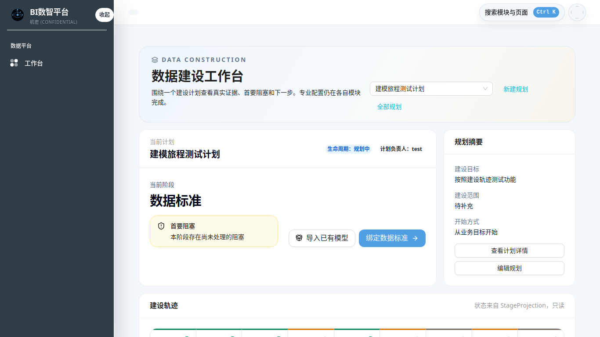
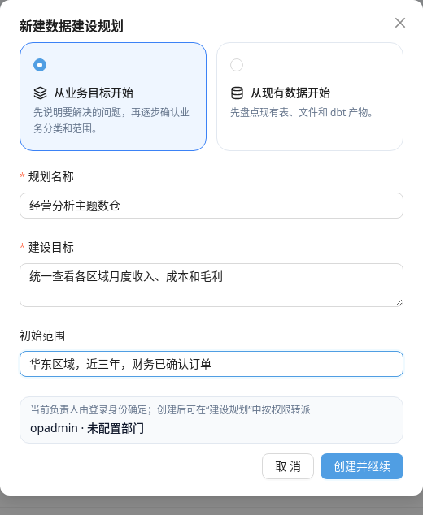
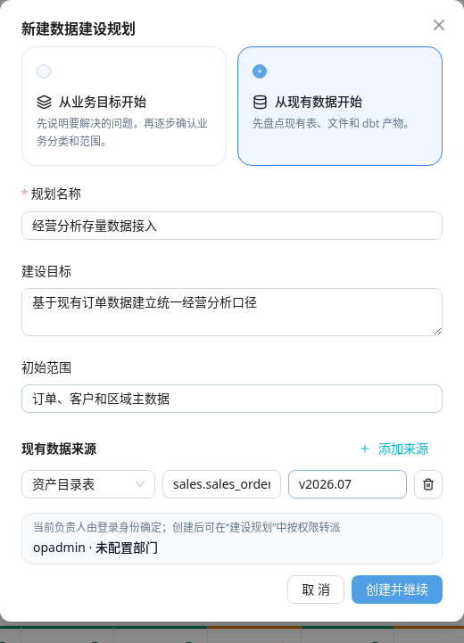
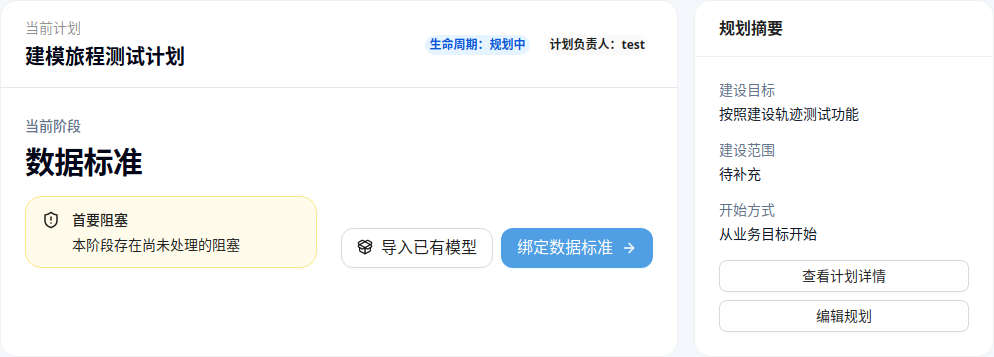
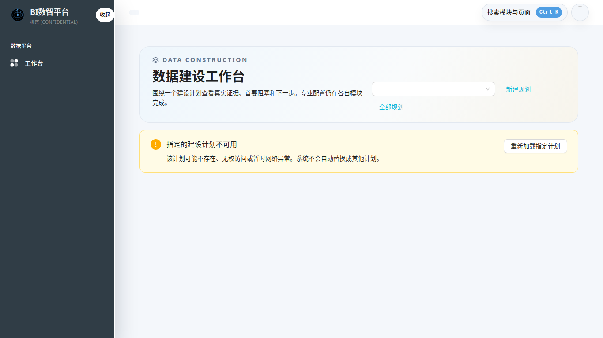

# 第一次完成数据建设任务

## 任务目标

完成本章后，你应当能够：

- 建立一个数据建设计划；
- 理解“从业务目标开始”和“从现有数据开始”的区别；
- 找到当前阶段、首要阻塞和下一步操作；
- 判断阶段是真的完成、存在阻塞，还是证据暂时未知；
- 把操作上下文保留下来，便于继续工作或请求支持。

这章不要求会写 SQL，也不要求一次完成全部九个阶段。

## 开始前准备

请确认：

- 能正常登录 DTS；
- 账号具有建设规划维护权限；只有查看权限时，可以阅读已有计划，但不能新建；
- 已经知道本次任务要解决的业务问题，或者已经知道至少一个现有数据来源；
- 使用“从现有数据开始”时，准备好表、文件、连接或 dbt 节点的稳定标识。

第一次使用、没有 SQL 经验时，建议选择**从业务目标开始**。

## 第 1 步：进入数据建设工作台

从左侧菜单进入：

`数据开发与运维 → 数据建模 → 建模工作台`

工作台用于选择计划、查看真实证据、识别首要阻塞并进入下一步。专业配置会在数据源、标准、模型、指标等页面完成，完成后再返回工作台查看最新投影。

如果系统已经有多个计划，先在页面右上方的计划选择框确认当前计划，避免把操作做在错误计划中。

图中需要先核对三处：页面标题是“数据建设工作台”、计划选择器中的名称属于本次任务、“新建规划”入口可用。已有计划时，页面还会同时展示当前阶段和主动作。

## 第 2 步：创建建设计划

点击“新建规划”。如果看不到按钮或按钮不可用，请先检查账号是否具有规划维护权限。

### 选择“从业务目标开始”

适用于：

- 先有业务问题，还没有整理好数据源；
- 第一次使用 DTS；
- 希望先确认业务范围、分类和数仓分层；
- 不熟悉 SQL 或 dbt。

建议填写：

| 字段 | 填写方式 | 示例 |
|---|---|---|
| 规划名称 | 使用“业务主题 + 建设目的” | 经营分析主题数仓 |
| 建设目标 | 写清要回答的业务问题 | 统一查看各区域月度收入、成本和毛利 |
| 初始范围 | 写清组织、时间和数据边界 | 华东区域，近三年，财务已确认订单 |
| 负责人 | 由当前登录身份确定 | 创建后按权限转派 |

负责人由登录身份确定，不需要手工填写。截图中的内容只是填写示例，实际操作应使用本单位已确认的业务目标和范围。

### 选择“从现有数据开始”

适用于：

- 已经有数据库表、目录资产、Excel 文件或 dbt 节点；
- 希望先验证数据源，再补充业务规划。

至少添加一个来源，并选择正确的来源类型：

| 来源类型 | 什么时候选 |
|---|---|
| 资产目录表 | 表已经登记到 DTS 数据资产目录 |
| 连接中的表 | 已有数据库连接，可以定位到具体表 |
| Excel 文件 | 本次建设从受控 Excel 文件开始 |
| dbt 节点 | 已经有可导入的 dbt 模型产物 |

“来源标识”必须能够稳定定位同一个来源，不要填写临时页面标题或随手备注。

{width=11cm}

示例中的 `sales.sales_order` 表示稳定来源标识，`v2026.07` 表示可选的来源版本。这里填入的来源还需要在后续“来源盘点”中解析并确认纳入。

## 第 3 步：创建并继续

点击“创建并继续”。

系统会创建计划并携带 `planId` 进入当前最需要处理的页面。请保留浏览器地址中的 `planId`，后续来源、模型、指标和运维页面都依赖它保持同一计划上下文。

如果重复提交时提示“这次创建内容与此前提交不一致”，先核对表单：

- 是同一个计划：不要再次创建，返回计划列表查找原计划；
- 确实需要新计划：点击“作为新计划重新提交”。

## 第 4 步：只处理工作台给出的当前任务

返回建模工作台后，先看三处信息：

1. **当前阶段**：系统认为现在最需要处理的阶段；
2. **首要阻塞**：当前阶段尚缺少的真实产物或证据；
3. **蓝色主按钮**：携带当前 `planId` 的正确操作入口。

不要根据九个格子的左右顺序自行判断下一页，也不要同时修复多个橙色格子。

本例当前阶段是“数据标准”，蓝色主按钮是“绑定数据标准”。“导入已有模型”是次要动作，不能替代系统给出的当前主任务。

上图的判读方式：

- 01、02、03、05 已有当前完成证据；
- 04、06、08 有明确阻塞；
- 07、09 的证据暂时未知；
- 应以页面上方“当前阶段”和蓝色主按钮为准，只处理系统选出的首要阻塞。

出现“05 已完成、04 有阻塞”是合理状态：必须先有模型字段，才能给字段绑定数据标准。

在 390 像素窄屏下，当前阶段、阻塞和主动作会改为纵向排列，仍应只点击蓝色主按钮：

## 第 5 步：完成专业操作后回到工作台核验

在主按钮打开的页面完成保存、验证或发布后：

1. 返回“建模工作台”；
2. 确认仍然选择同一个计划；
3. 刷新阶段证据；
4. 检查当前阶段是否变化；
5. 只有格子显示“已完成”时，才继续下一项。

成功提示只代表本次请求成功，不代表整个阶段已经满足全部完成条件。

## 常见问题

| 现象 | 常见原因 | 处理方式 |
|---|---|---|
| 没有“新建规划”按钮 | 缺少规划维护权限 | 联系管理员分配权限，或让有权限的负责人创建 |
| 平台管理员打开模型仍显示只读 | 当前账号不是该建设计划的负责人或维护人员 | 联系计划负责人授权；不要用管理员身份假定可以修改所有计划 |
| 指定的建设计划不可用 | 计划不存在、无权访问或网络异常 | 使用页面“重新加载指定计划”；不要自动改做其他计划 |
| 计划列表未完整加载 | 列表接口暂时失败 | 当前计划可继续操作，点击“重新加载列表”恢复其他计划 |
| 阶段显示“证据未知” | 证据服务不可用或尚未写入当前证据 | 先刷新/重试；仍未知时记录计划、阶段和时间 |
| 阶段显示“证据已过期” | 标准、指标、模型版本或运行结果已变化 | 按主按钮重新核验或重新绑定当前版本 |
| “导入已有模型”不可用 | 计划已发布/归档、处于只读生命周期，或账号无权维护 | 核对计划生命周期和权限 |
| 保存成功但阶段仍有阻塞 | 只完成了部分字段或部分门禁 | 阅读首要阻塞，继续补齐缺少项 |
| 数据实现保存后无法创建高级 SQL 模型 | 建设计划没有对应 SQL 项目空间，或实现方式不是后端允许绑定的 `DBT_MANAGED` | 不要改 URL 或改数据库；记录计划、模型和实现版本，按第 06 章升级给产品/管理员 |
| 资产、指标或运行页有数据，但阶段仍未完成 | 页面显示的是全局或历史记录，不是当前计划证据 | 核对 URL 中的 `planId`、对象 ID、版本和时间；没有当前证据时保持阻塞 |

“指定的建设计划不可用”时，系统不会悄悄改成其他计划。请点击“重新加载指定计划”；仍然不可用时，核对地址中的 `planId` 和账号权限：

## 完成检查

本章完成时，请确认：

- [ ] 已创建或选中唯一的建设计划；
- [ ] 知道该计划采用哪种开始方式；
- [ ] 浏览器地址中保留正确的 `planId`；
- [ ] 能指出当前阶段和首要阻塞；
- [ ] 已通过蓝色主按钮进入下一步；
- [ ] 知道“保存成功”和“阶段完成”不是一回事；
- [ ] 遇到未知/过期证据时，没有自行把阶段标成完成。

下一步请查阅[九阶段任务指南](stage-guide.md)，完成工作台当前指向的阶段。
