# 九阶段任务指南

## 使用方法

先在“数据建设工作台”选中计划，再从当前阶段的蓝色主按钮进入专业页面。下表中的路由用于核对入口，不建议新用户手工拼接地址。

| 阶段 | 任务与入口 | 真正的完成证据 |
|---:|---|---|
| 01 数据连接 | 建立或选择数据源，并确认系统可以解析计划中的来源。 入口：数据源连接 | 已纳入计划的来源可以被当前账号解析，且来源状态不是未知；“从现有数据开始”至少要有一个可验证来源 |
| 02 来源盘点 | 明确哪些表、文件或节点纳入计划，并补齐业务关联。 入口：计划基线“来源盘点” | 来源清单达到 READY，纳入项具有当前来源证据和确认状态 |
| 03 数仓规划 | 确认业务分类、数仓分层、命名与历史策略，并决定来源是否允许后补。 入口：规划基线的“业务分类”“数仓分层”或“来源盘点” | 业务分类已确认、规划策略可进入模型设计；需要真实来源时，来源盘点也已就绪 |
| 04 数据标准 | 把数据元、码表或度量单位绑定到模型字段，并核对引用版本。 入口：模型中心或模型详情“数据标准” | 每个已声明字段都有保存后的完整标准引用，且标准目录中的当前版本没有漂移 |
| 05 事实与维度设计 | 选择正确模型类型，完成逻辑字段、粒度和时间语义。 入口：模型中心与模型详情 | 至少一个属于当前计划的有效正式模型；模型有字段，粒度键和时间字段都能解析到真实字段 |
| 06 构建、质量与发布 | 配置实现输入和物化方式，验证实现，完成构建、质量门禁和发布。 入口：计划“实现与验证”及模型详情 | 当前模型版本具有真实、当前的发布候选、构建、质量和发布证据；仅把模型状态改成“已发布”不够 |
| 07 数据资产 | 核对发布后的物理对象已登记，能够从计划回到资产并检查元数据。 入口：数据资产 | 数据资产模块为当前计划写入当前有效的登记证据；仅访问资产页面不算完成 |
| 08 指标系统 | 为已发布的事实、汇总或应用模型绑定已发布指标版本。 入口：指标工作台 | 每个适用的已发布模型至少绑定一个指标；指标仍为 PUBLISHED，且模型保存的指标版本与当前版本完全一致 |
| 09 数据服务与运维 | 核对服务暴露、运行实例和可观测证据。 入口：运行中心 | 数据服务与运维模块为当前计划写入当前有效的服务/运行证据；仅打开运行中心不算完成 |

## 01 数据连接

### 你要回答的问题

“这次计划依赖的真实数据在哪里，DTS 当前能否访问并识别它？”

### 操作要点

1. 从工作台点击“检查数据连接”。
2. 选择已有连接，或按权限新建连接。
3. 完成连接测试和元数据识别。
4. 返回计划的“来源盘点”，确认具体来源已纳入，而不是只创建了一个空连接。
5. 返回工作台重新核验。

数据源列表较宽，需要分别核对左侧的名称、连接器和类型，以及右侧的状态和最近验证时间。下图中的连接地址与用户名已脱敏：

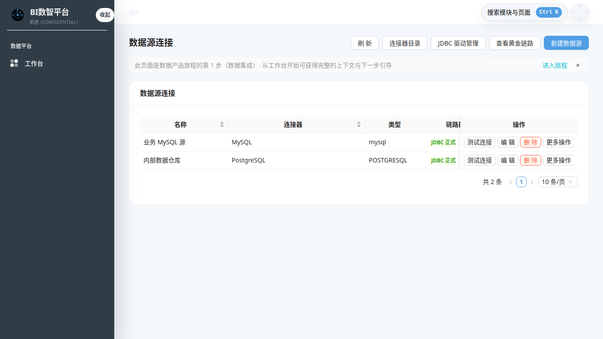

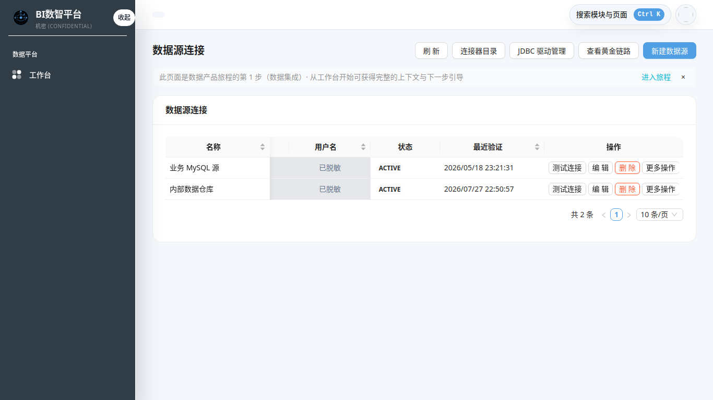

新建数据源时，先选连接器，再核对自动带出的源类型和驱动信息，然后填写连接参数。截图使用的是未提交的示例地址和账号，密码输入框已遮蔽：

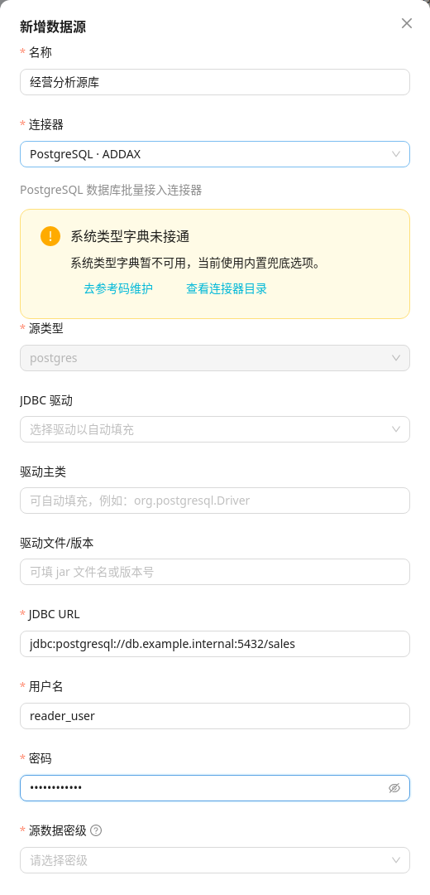

当前环境若显示“系统类型字典未接通”，说明页面正在使用内置兜底选项。可以继续查看连接器字段，但在正式保存前应联系管理员接通系统类型字典或确认允许使用兜底值。

连接测试成功时，系统会给出耗时、数据库版本和驱动版本。不要只看数据源名称或 ACTIVE 标签：

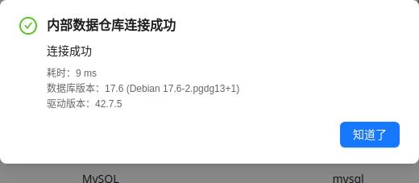

“从业务目标开始”允许先做概念规划，数据连接可能显示未开始；这时优先跟随工作台完成数仓规划。

## 02 来源盘点

### 你要回答的问题

“哪些具体表、文件、API Landing 或 dbt 节点属于本计划，它们与业务范围是什么关系？”

### 操作要点

1. 从工作台点击“继续来源盘点”。
2. 对每个候选来源选择纳入或排除。
3. 对纳入项补齐业务关联和确认状态。
4. 处理无权访问、来源删除、来源服务异常或新鲜度未知的条目。
5. 保存后回工作台核验。

只看到了来源名称、不做纳入确认，不算完成盘点。

来源卡片应至少显示：

- “确认纳入”或有明确排除原因；
- `CURRENT · 当前`，而不是未知或过期；
- 解析版本和最近核验时间；
- 页面汇总状态为“来源已就绪”。

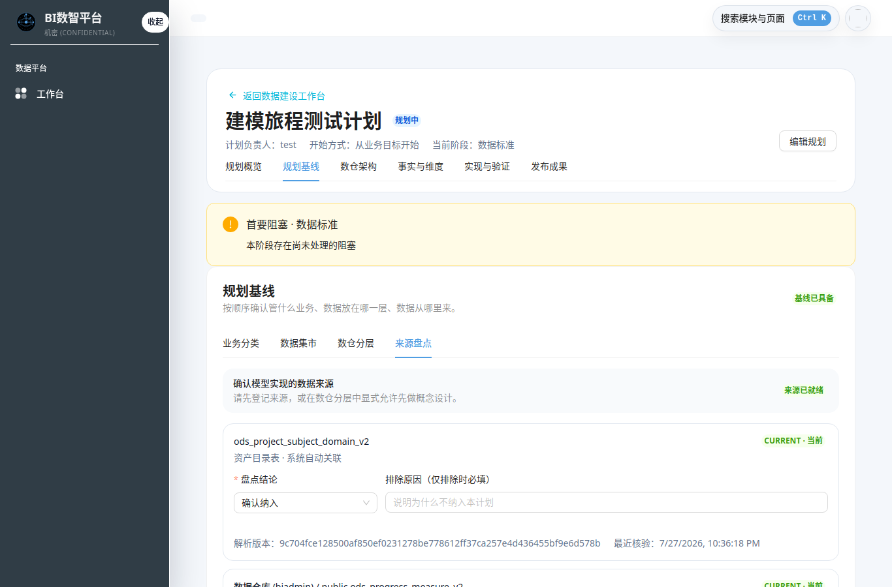

返回工作台后，01“数据连接”和 02“来源盘点”都应由后台证据计算为“已完成”：

## 03 数仓规划

### 你要回答的问题

“这个计划服务哪个业务范围，使用什么数仓分层、命名规则和历史策略？”

工作台会根据阻塞原因直接打开最需要修复的 Tab：

- 缺少业务范围：进入“业务分类”；
- 缺少分层/命名/历史策略：进入“数仓分层”；
- 需要真实来源：进入“来源盘点”。

业务优先模式可以在明确允许概念设计时后补来源；资产优先模式必须先验证真实来源。

在“业务分类”中至少选择一个当前可访问的分类，并确认“已纳入”。页面显示“可以进入模型设计”后，才满足这一部分的条件：

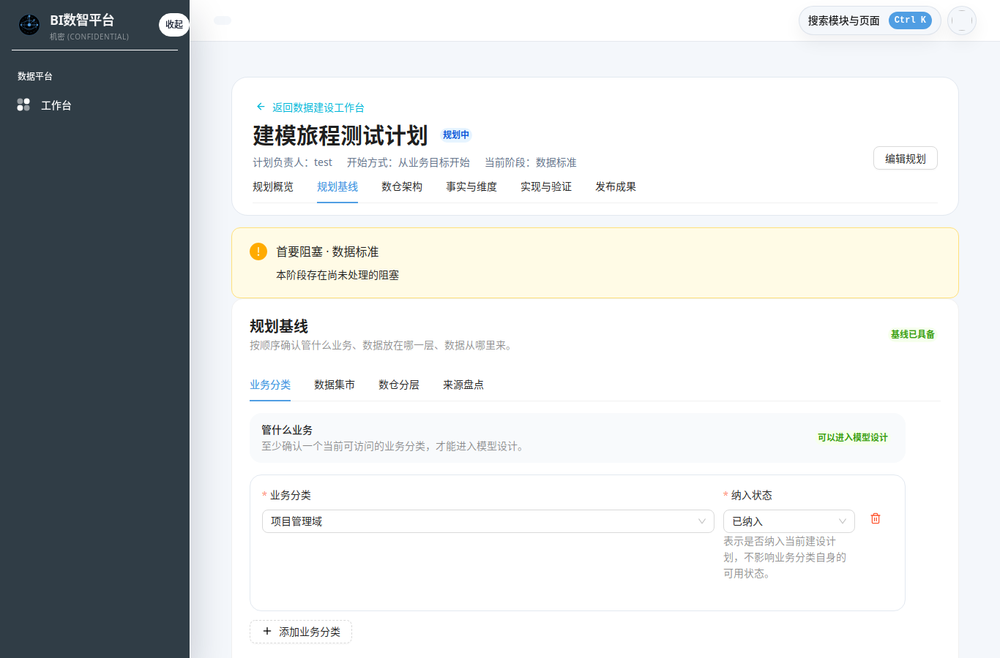

在“数仓分层”中先选择分层方案，并明确来源未齐时是否允许概念设计：

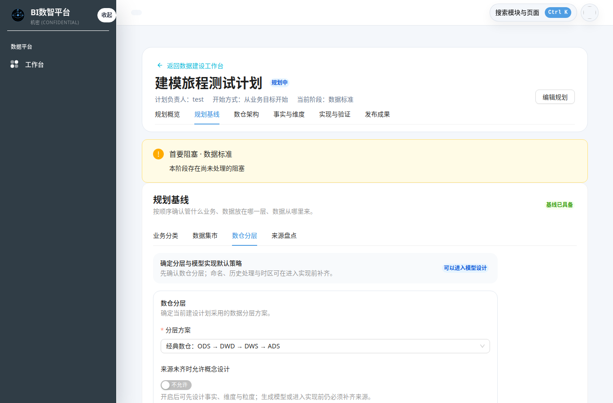

继续向下核对实现命名规范和维度历史默认策略。它们为空时仍可能允许进入逻辑模型设计，但必须在进入实现前补齐：

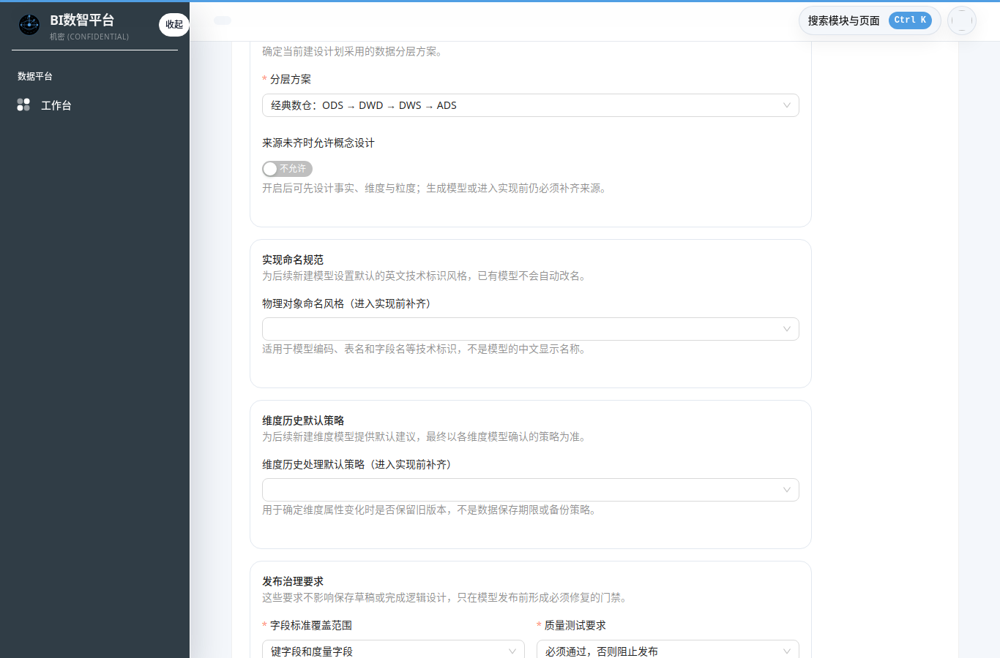

本例“规划基线”显示“基线已具备”，工作台中的 03“数仓规划”也显示“已完成”。这只代表已经达到当前阶段的规划门槛，不代表命名、历史策略、数据标准和发布门禁都已完成。

## 04 数据标准

### 你要回答的问题

“每一个模型字段使用的业务定义、码值或单位是什么，引用的是哪个受控版本？”

### 操作要点

1. 先确保至少有一个有效模型和真实字段。
2. 从工作台进入模型详情的“数据标准”。
3. 如果没有合适标准，点击“前往数据元”，先在标准目录建立受控正文。
4. 为每个规划策略要求的字段绑定数据元、码表或度量单位。
5. 保存字段绑定，并检查表格中显示的稳定 ID、版本和“已关联”状态。
6. 如果标准版本已经变化，重新核对并绑定当前版本。
7. 返回工作台核验字段覆盖数和 04 阶段状态。

字段必须引用受控标准 ID 和版本。自由文本备注不能替代标准绑定。

### 4.1 没有可用标准时先建立数据元

在数据元目录点击“新增数据元”。至少填写：

| 字段 | 填写要求 |
|---|---|
| 数据元名称 | 业务人员能够理解的名称，如“项目编号” |
| 标准字段名 | 稳定英文编码，如 `project_id` |
| 标准类型 | 与业务定义一致的通用类型，如 `VARCHAR`、`DATE` |
| 长度/精度 | 按业务规则填写，不要从一条样例数据猜测 |
| 主题域、来源系统 | 指明标准正文的管理范围和权威来源 |
| 格式规则 | 说明非空、长度、编码或日期格式等约束 |
| 主键、可空、脱敏等级 | 按实际治理要求选择 |

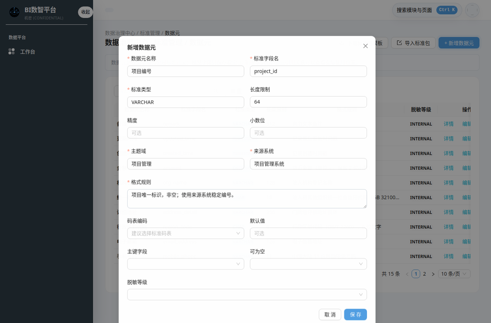

保存后回到数据元列表，确认新数据元已经取得稳定编码、类型和版本。仅填写模型字段名称，不会自动创建受控数据元。

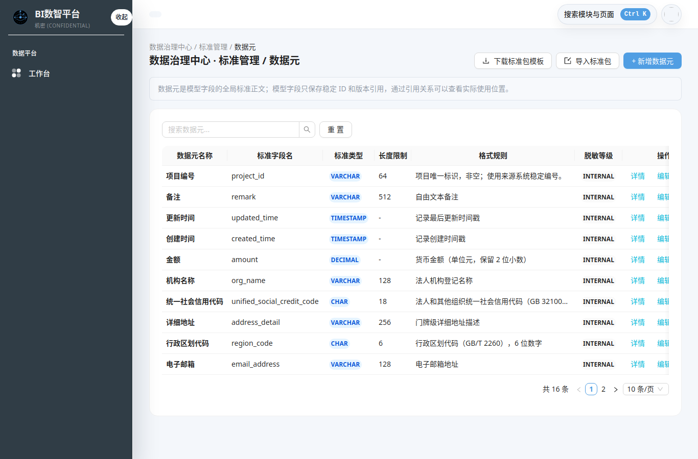

### 4.2 把标准绑定到具体字段

回到模型详情的“字段标准”：

1. 找到需要落标的字段，点击“配置字段标准”；
2. 至少选择一个带有效版本的数据元、公共码表或度量单位；
3. 必要时补充安全等级；
4. 点击“保存绑定”；
5. 对规划策略要求的其他字段重复操作。

下拉选项同时显示标准名称和版本。应选择当前确认版本，不要只按相似名称随意绑定：

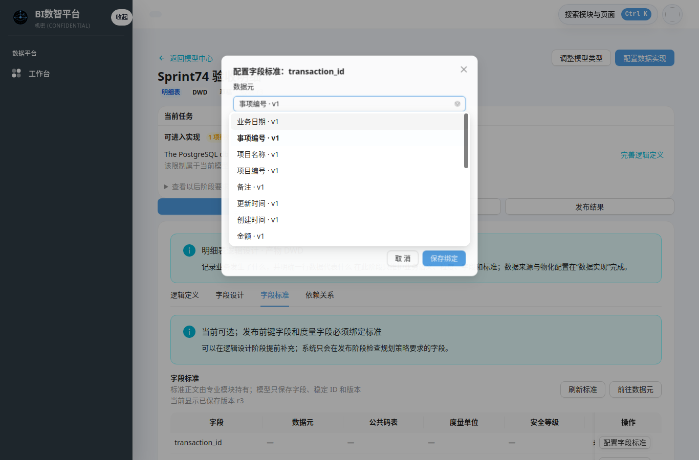

保存后，字段标准表会显示稳定 ID、`v1` 等精确版本以及“已关联”状态：

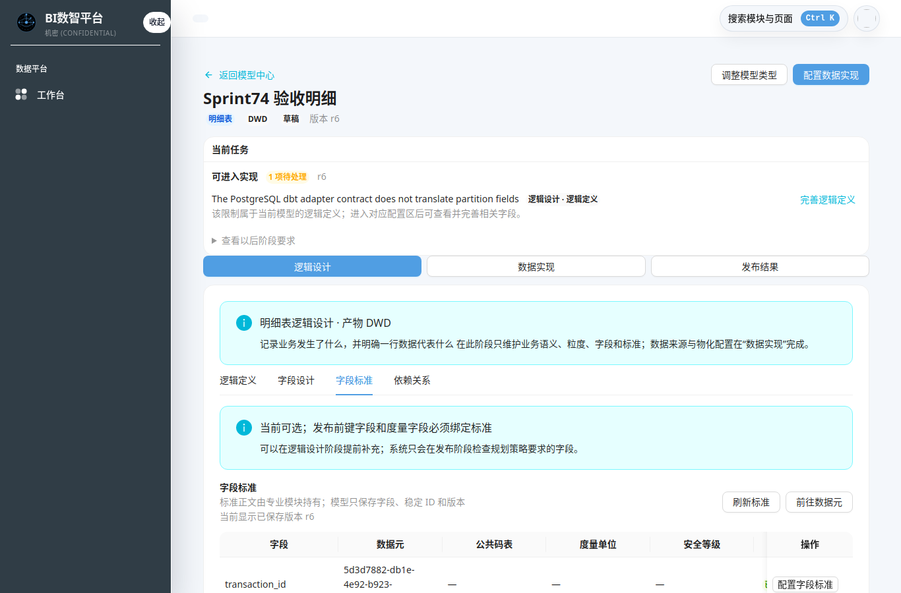

### 4.3 回工作台确认 04 已完成

代表计划完成所需字段绑定后，后台 `StageProjection` 会重新计算建设轨迹。下图中 04“数据标准”和 05“事实与维度设计”均显示“已完成”，当前阶段已经推进到 06“构建、质量与发布”：

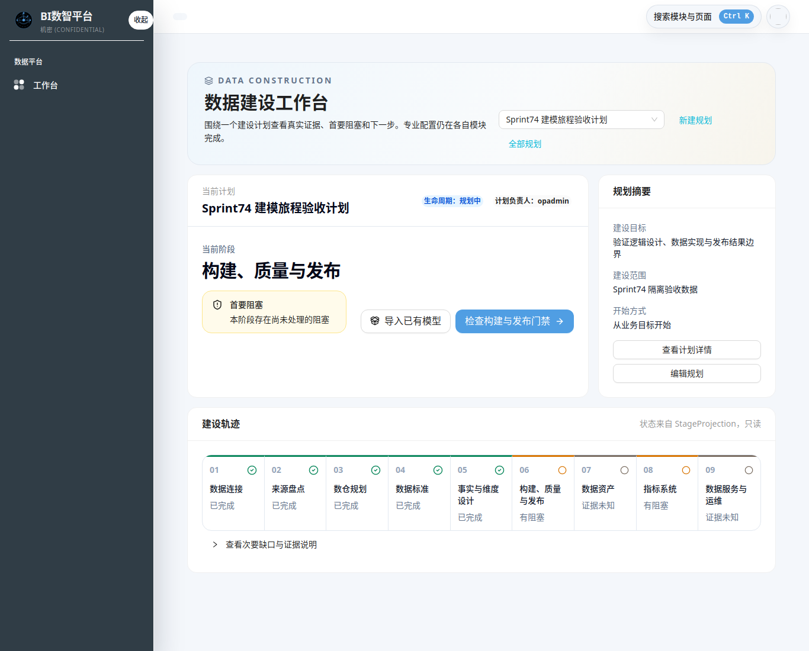

如果保存按钮可见但提交后变成只读，并提示“编辑需要计划维护权限”，说明当前账号虽然能维护全局标准，却不是该模型所属计划的维护人员。应联系计划负责人授权，不能通过修改地址或重复提交绕过。

## 05 事实与维度设计

### 你要回答的问题

“每一行数据代表什么，主粒度是什么，哪些字段描述维度、事实和业务时间？”

### 操作要点

1. 在模型中心点击“新建模型”。
2. 先选择业务目的：稳定对象/维度、业务事件/明细、聚合结果/汇总或消费输出/应用。
3. 填写名称和用途并创建草稿。
4. 在模型详情完成业务定义、字段、粒度和类型专属语义。
5. 保存逻辑设计，由服务端重新计算模型门禁。

只创建一个没有字段和粒度的模型外壳，不算完成。

### 5.1 先选业务目的，不按技术表名猜类型

新建模型抽屉不会默认替用户选择类型。先根据“一行数据代表什么”选择：

| 业务目的 | 适合 | 不适合 |
|---|---|---|
| 稳定对象·维度表 | 项目、客户、组织等相对稳定、需要反复筛选的对象 | 付款、交易、状态变化等一次性事件 |
| 业务事件·明细表 | 一次业务事件，或按固定周期记录的一份快照 | 只需要稳定对象字典，或已经按粒度汇总的数据 |
| 聚合结果·汇总表 | 从明细或其他模型按固定粒度计算的可复用汇总 | 必须保留每一笔原始事件的明细 |
| 消费输出·应用表 | 面向报表、接口或具体业务场景交付最终结果 | 还要被多个下游作为通用明细复用的模型 |

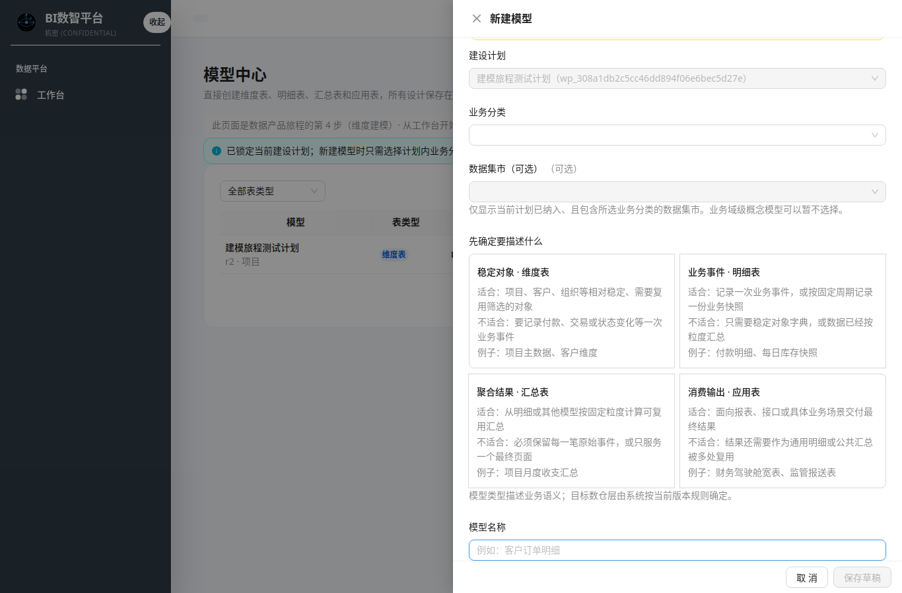

### 5.2 完成逻辑定义

逻辑定义至少要说明：

- 模型所属建设计划和业务分类；
- 模型名称和业务用途；
- 一行数据代表什么；
- 业务键或粒度键；
- 明细表的事实形态、业务时间和 TIME 字段；
- 维度表的 SCD 策略、复用范围和业务维度属性映射；
- 汇总表、应用表依赖的上游模型版本。

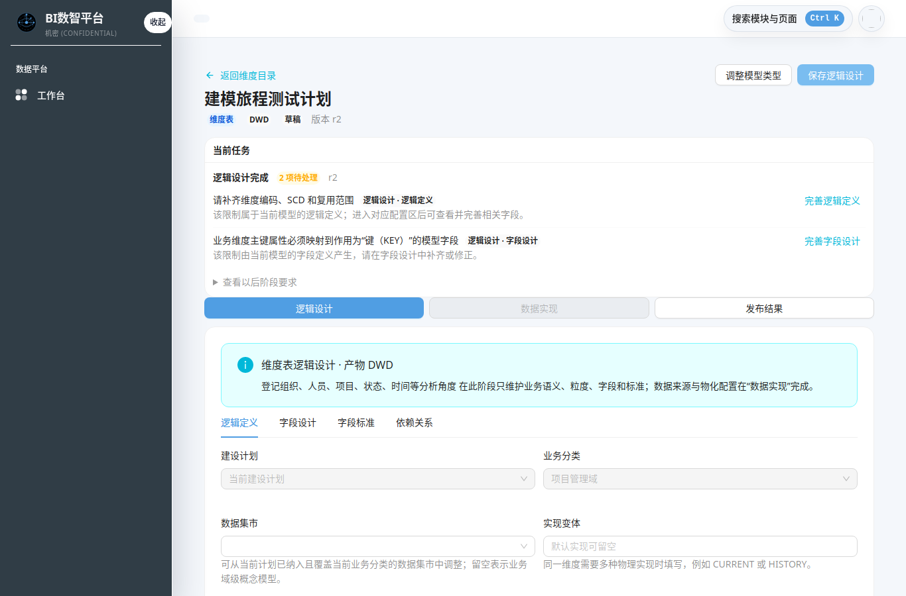

页面顶部的“当前任务”来自服务端门禁。点击每条限制右侧的修复入口，会跳到对应的逻辑定义、字段设计或标准页。

### 5.3 完成字段设计

每个字段至少核对技术编码、业务名称、数据类型和字段作用：

- `KEY`：唯一识别当前粒度；
- `ATTRIBUTE`：描述对象或事件；
- `TIME`：用于事件时间、快照日期或统计周期；
- `MEASURE`：可计算或聚合的业务数值。

维度模型还要把业务维度的主键属性映射到作用为 `KEY` 的模型字段。粒度键和时间字段必须引用当前字段设计中的真实字段。

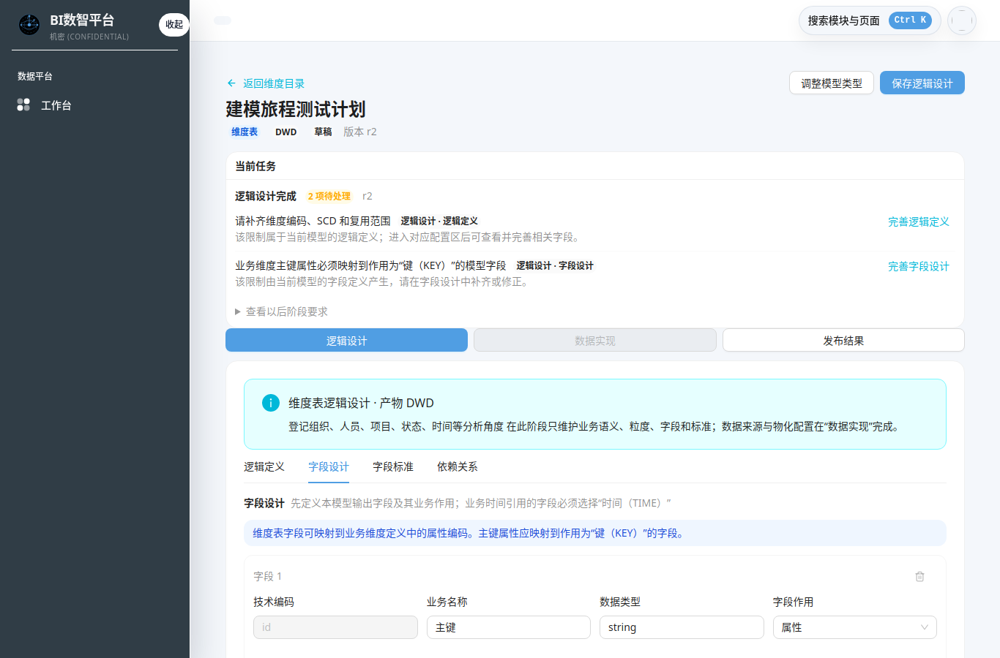

### 5.4 保存后看门禁是否推进

点击“保存逻辑设计”后，不要只看成功提示。重新读取顶部“当前任务”：

- 显示“逻辑设计完成”且有待处理项：继续修复逻辑阶段；
- 显示“可进入实现”：逻辑设计门禁已经满足，主动作会变成“配置数据实现”；
- “可进入实现”下面仍可能显示版本漂移、适配器能力或来源限制，这些属于进入实现前的当前阻塞，不等于逻辑设计未保存。

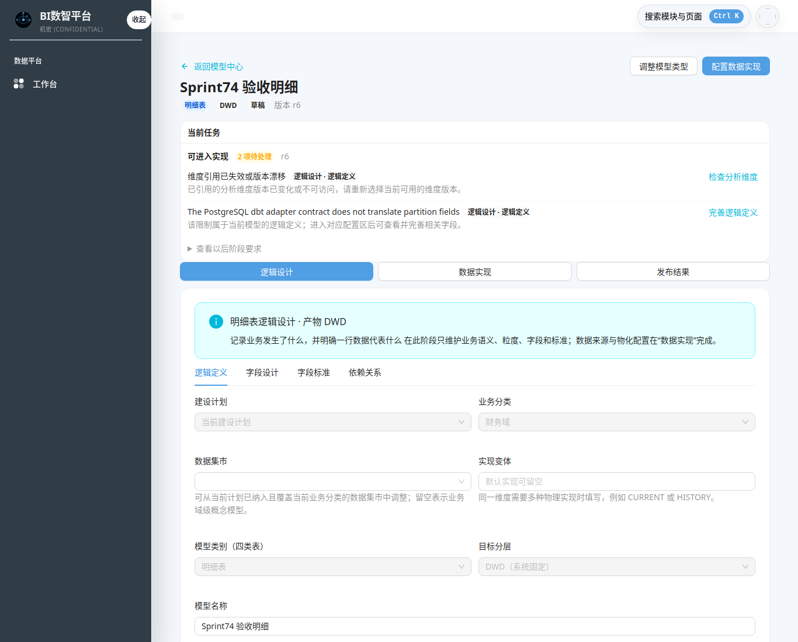

## 06 构建、质量与发布

### 你要回答的问题

“当前模型版本是否真实构建、通过质量门禁、经过审核并发布？”

### 6.1 先完成普通数据实现

从模型详情进入“数据实现”，按页面的三个步骤操作：

1. **选择数据来源**：事实/维度模型选择计划中已确认的表；汇总/应用模型选择已固定版本的上游模型。
2. **对齐模型字段**：点击“按模型字段初始化”，逐行核对来源字段和模型字段；来源名称不同或需要类型转换时手工调整。
3. **确认产出方式**：选择表、视图或增量表，填写符合命名规则的目标物理名称、装载策略和保留期。

首次进入时，顶部会提示“尚未保存当前模型的数据实现”，高级 dbt 入口也处于不可用状态：

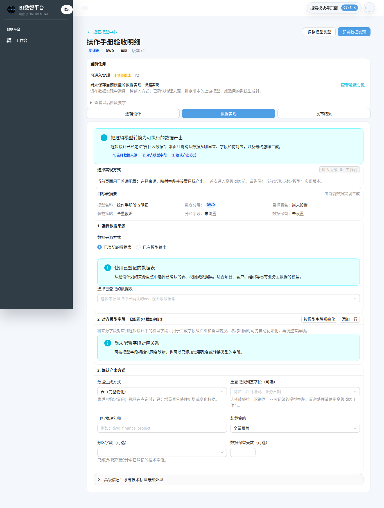

选择真实来源并初始化字段映射后，目标表摘要应与下方配置一致：

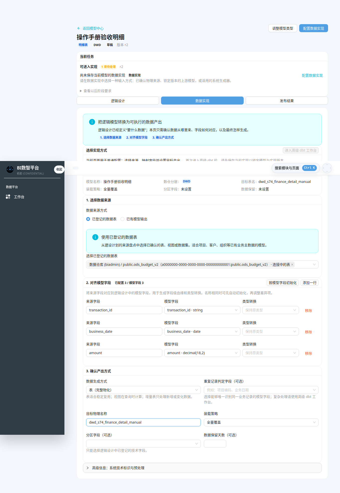

点击顶部“配置数据实现”。保存成功后主动作变为“验证实现”；再点击一次，页面必须出现“当前实现可构建”，同时显示适配器、目标表和物化方式：

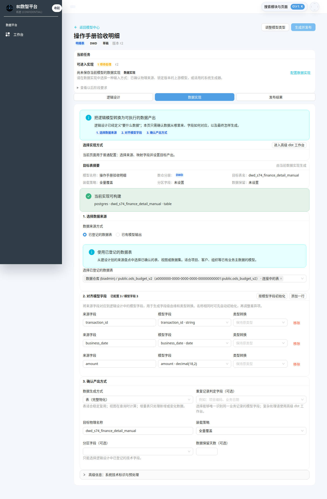

本轮真实验证形成了：

- ModelSpec：`30bd4bb9-dd03-4c6a-8ccd-0988be8edca4`，`r2`；
- implementation：`i1`；
- PostgreSQL 执行计划；
- 目标表：`dwd_s74_finance_detail_manual`；
- 物化方式：`table`。

不要只看表单是否填满。只有保存后取得 implementation 版本，并且服务端校验为“当前实现可构建”，才可以继续。

### 6.2 高级 SQL、构建与发布的正常目标

普通实现通过后，点击“生成并发布”或“进入高级 dbt 工作台”。入口必须同时携带：

- 当前 `planId`；
- 当前 `modelSpecId` 和 ModelSpec revision；
- 当前 implementation revision 和 checksum；
- 实现方式。

高级 SQL 新建抽屉会预填当前模型的技术名称、DWD/DWS/ADS 分层、来源数据源和物化方式。SQL 只写 `SELECT`，源表使用 `{{ source('schema', 'table') }}`，上游模型使用 `{{ ref('model') }}`：

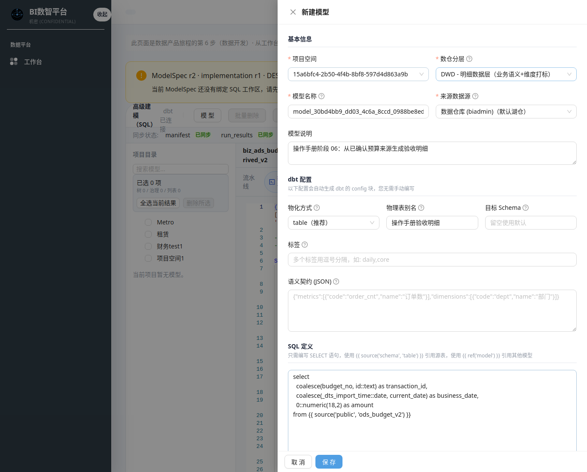

产品闭环后，正常顺序应为：

1. 保存当前 ModelSpec 绑定的 SQL 模型；
2. 编译；
3. 测试；
4. 构建；
5. 提交审核并由有权限的审核人批准；
6. 发布；
7. 在“发布结果”核对物理对象、SQL/schema artifact、测试、登记和血缘。

每个动作都必须回写到**同一 ModelSpec revision 和 implementation revision**。历史成功运行不能替代当前版本证据。

### 6.3 v2.2.3 当前确认的产品阻断

2026-07-27 的真实操作在高级 SQL 创建处停止，已确认以下断链：

| 阻断 | 用户可见现象 | 当前处理 |
|---|---|---|
| 建设计划与 SQL 项目空间使用两套 ID | 抽屉把建设计划 ID 当项目空间提交，保存返回“项目空间不存在” | 记录 `planId`、ModelSpec 和 implementation 版本，交由产品修复映射；不要改 URL 或直接写数据库 |
| 普通实现与高级 SQL 所有权不一致 | 页面允许 `DESIGNER_GENERATED` 进入高级 SQL，写文件服务只接受当前 `DBT_MANAGED` implementation | 由产品统一入口与后端契约；新用户不要自行切换所有权 |
| 历史 implementation 与当前 ModelSpec revision 脱节 | 页面显示未配置，保存又返回“实现版本已变化” | 保留表单输入，记录旧/新 revision；当前“加载最新实现”仍无法把旧实现升级到当前 revision |
| 发布候选没有页面入口 | 后端候选工作区可读，但当前详情页/SQL 工作台没有候选创建、锁定和刷新入口 | 不能要求新用户直接调用接口；发布阶段保持阻塞 |

出现这些情况时，停止当前模型的发布操作。提交问题时至少附上：

- 建设计划名称和 `planId`；
- 模型名称、`modelSpecId`、revision；
- implementation revision、checksum 和实现方式；
- 页面地址、发生时间；
- 服务端错误码或页面提示；
- 截图中不得包含 Cookie、Token、口令或连接串。

本版手册因此只确认阶段 06 的**普通数据实现已保存并通过校验**，不声明构建、质量、审核或发布已经完成。

## 07 数据资产

### 你要回答的问题

“发布产生的真实物理对象是否已经登记为可查、可理解、可追溯的资产？”

### 7.1 从资产地图进入台账

从工作台进入“数据资产”。资产地图用于查看全局统计和待处置分布，不是具体资产的验收页：

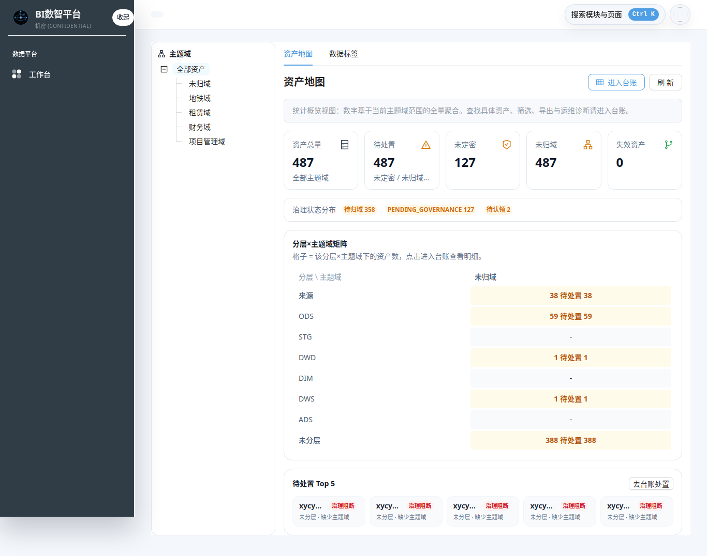

点击“进入台账”，在“搜索资产名称 / 描述”中输入目标物理表名。搜索条件要在页面输入框中填写；当前 URL 的任意 `keyword` 参数不会自动成为台账筛选条件。

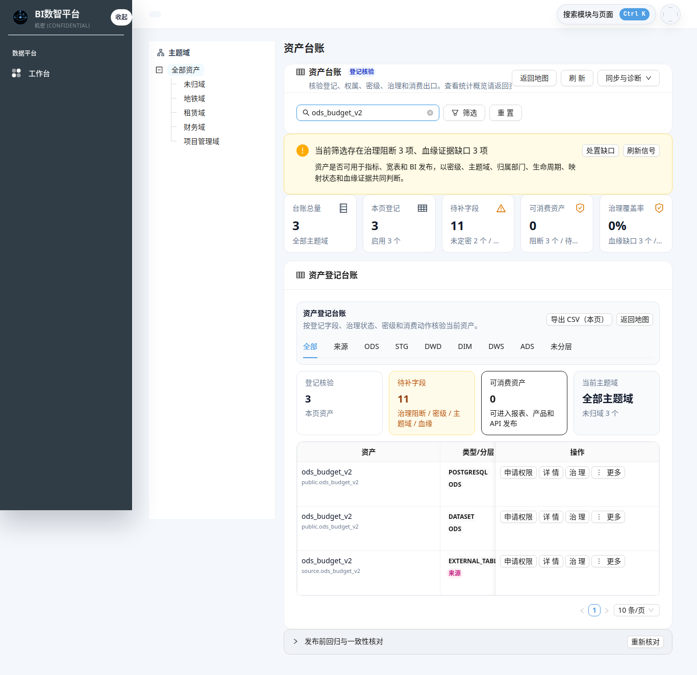

### 7.2 核对资产详情

打开目标资产详情，至少核对：

- 授权资产键和技术表名；
- 数仓分层、类型、负责人和生命周期；
- 有效密级和主题域；
- 字段契约数量；
- 治理状态、数据标签、质量与 SLA；
- 血缘与影响；
- 是否具备消费出口。

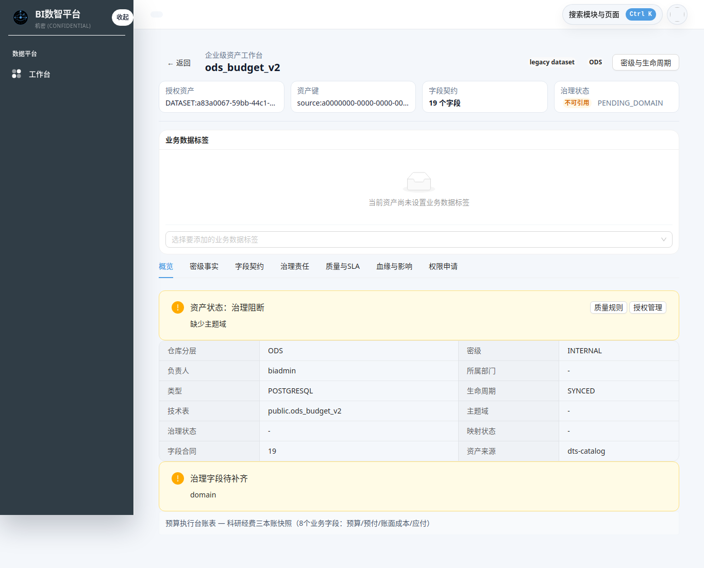

本例 `ods_budget_v2` 已登记为 ODS 资产，资产键和 19 个字段可读，但“缺少主题域”，状态为“治理阻断/不可引用”。这种资产不能因为“搜得到”就进入指标、宽表、API 或报表发布。

有治理权限时，从台账点击“治理”，补齐主题域、责任部门、密级、生命周期和必要标签；完成后重新打开详情核对。没有权限时记录资产 ID 和缺口，交由资产责任人处理。

### 7.3 阶段完成判断

阶段 07 必须同时满足：

1. 当前模型发布产生的物理对象已经登记；
2. 资产不存在治理阻断；
3. 当前计划的资产登记证据已经回写；
4. 证据引用当前模型和 implementation 版本。

当前示例计划未完成阶段 06 发布，`ods_budget_v2` 又处于治理阻断，因此本版不声明 07 已完成。

## 08 指标系统

### 你要回答的问题

“模型交付了哪些受控指标，模型引用的是否仍是当前发布版本？”

### 8.1 先检查发布模型锚点

进入“指标工作台”，先查看顶部统计和“已发布模型锚点”。只有已发布的事实、汇总或应用模型才能成为指标 owner：

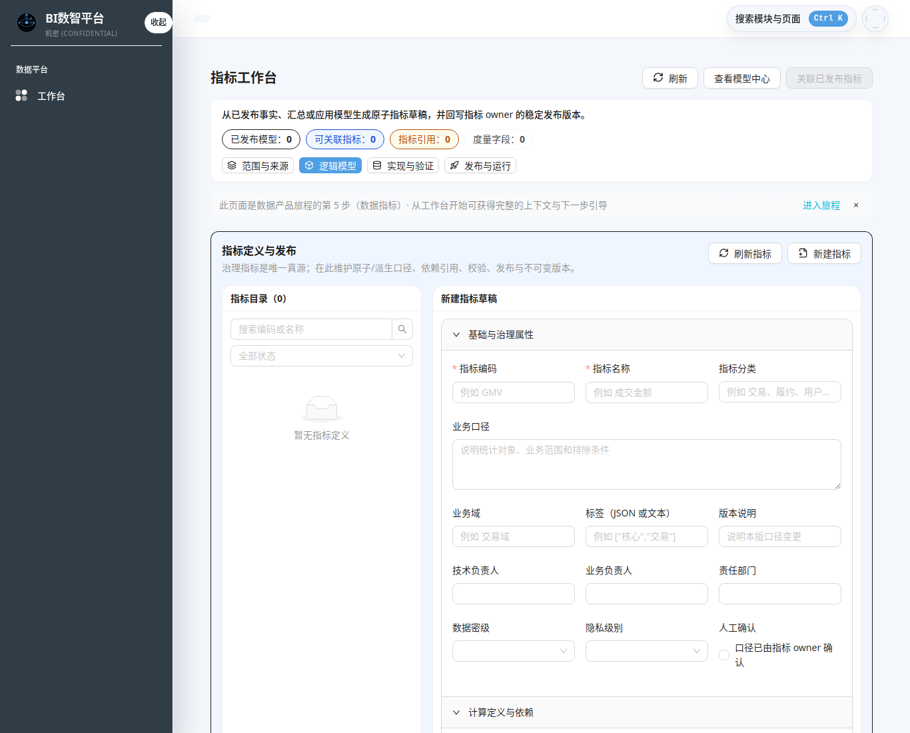

如果“已发布模型”为 0，立即停止指标发布，返回阶段 06。不要把目录资产、草稿模型或历史 SQL 模型当作发布锚点。

### 8.2 定义、校验和发布指标

有已发布模型后：

1. 点击“新建指标”；
2. 填写稳定指标编码、名称、分类、业务口径和责任人；
3. 选择数据资产、聚合方式和度量字段；
4. 需要派生计算时，只引用已经发布的治理指标版本；
5. 填写时间粒度、日期字段、过滤和维度；
6. 先“保存并校验”，处理口径、SQL、依赖和权限错误；
7. 通过“预检并发布”形成不可变发布版本；
8. 回到已发布模型，绑定指标 owner 的精确 ID 和版本。

### 8.3 阶段完成判断

每个适用的已发布模型至少绑定一个仍为 `PUBLISHED` 的指标版本，模型保存的指标 ID/版本与权威指标 owner 完全一致。指标升级后，旧版本引用会被标记为过期，必须重新核对并保存。

当前环境显示 0 个已发布模型、0 个指标和 0 个引用，因此没有可用于“绑定成功”截图的真实证据，本版不声明 08 已完成。

## 09 数据服务与运维

### 你要回答的问题

“数据是否已经以服务或运行实例交付，并且能够定位运行状态、失败原因和当前证据？”

### 9.1 数据 API 服务

从已发布模型或可消费资产进入“数据 API 管理”。新建服务前必须确认：

- 已绑定可消费数据集；
- 密级与调用者权限匹配；
- 路径、HTTP 方法和服务编码稳定；
- QPS 和日调用限制已确认；
- 测试调用通过；
- 服务状态是当前发布状态。

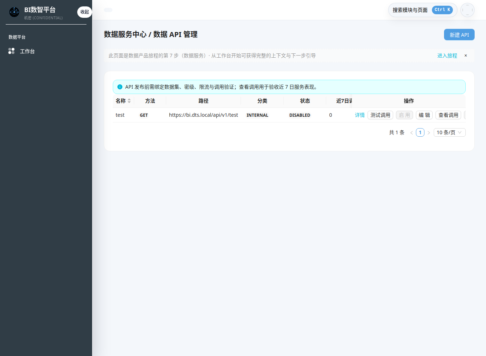

点击“详情”核对方法、路径、密级、状态和近 7 日调用量：

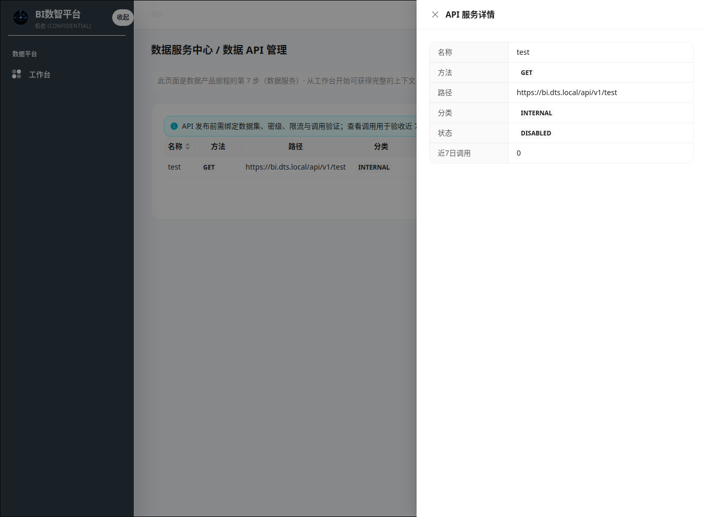

示例服务状态为 `DISABLED`，近 7 日调用为 0，只能说明服务记录存在，不能作为当前计划交付证据。当前页面“启用”和“查看审计”也明确处于未接入/禁用状态。

### 9.2 运行实例

从工作台或发布结果进入“任务实例监控”。至少核对：

- URL 保留当前 `planId`、`modelSpecId` 和实现版本；
- 任务名称、类型、DAG 与当前模型一致；
- 状态、开始/结束时间和耗时完整；
- 失败实例能看到精确错误和日志入口；
- 重试、终止和补数操作作用于正确实例；
- 当前运行证据已经回写到当前计划版本。

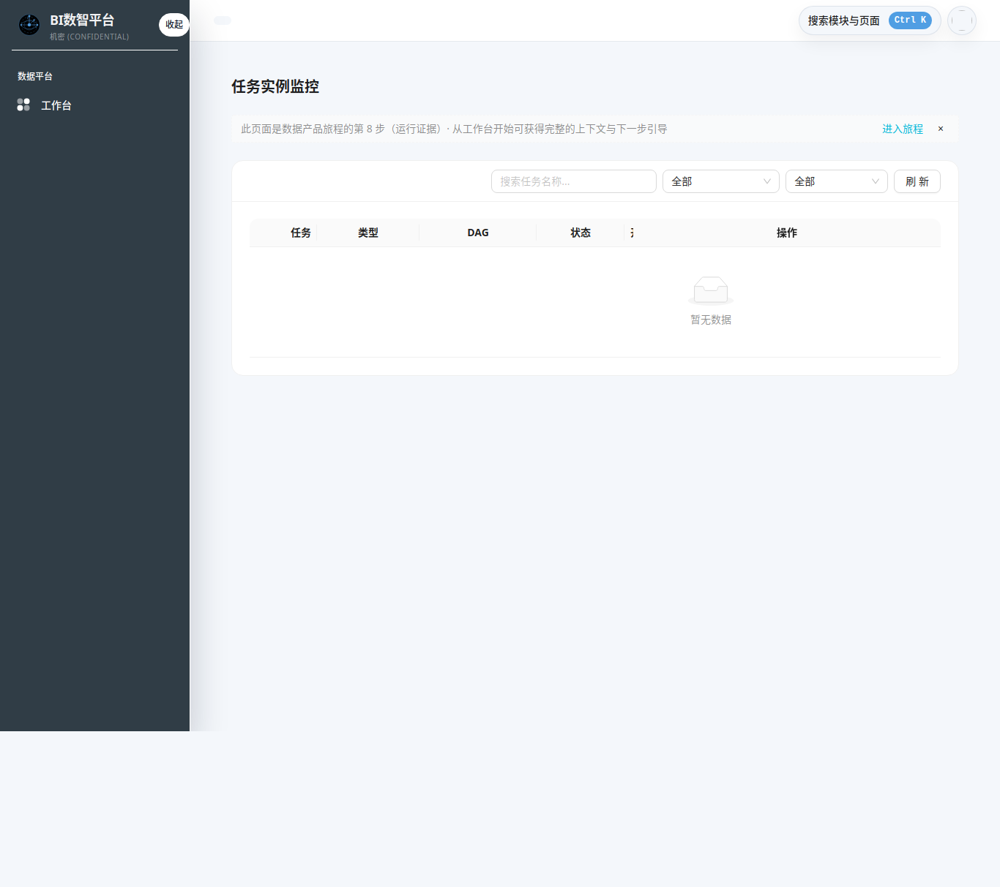

列表中的 `SUCCESS` 只对该行记录负责。截图同时存在历史 `SUCCESS`、`FAILED` 和 `SKIPPED`；它们都早于当前示例模型，不能替代当前计划运行证据。

点击“详情”核对实例字段，必要时再进入日志：

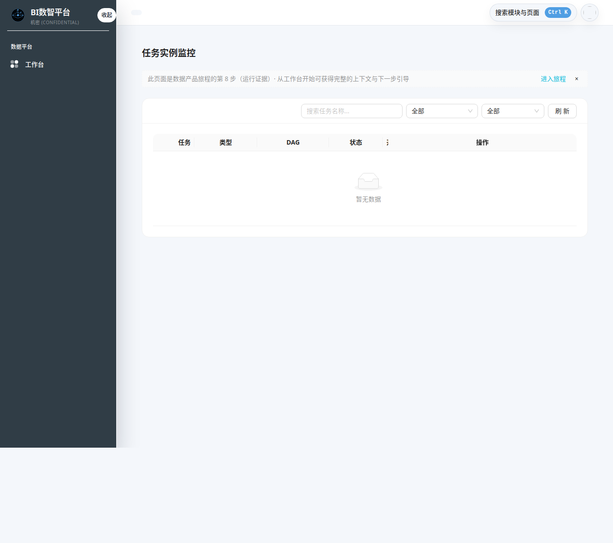

### 9.3 阶段完成判断

阶段 09 必须存在属于当前计划、当前模型/服务版本的最新运行或服务证据，并能够定位故障与重试。页面可打开、存在历史成功记录或有一条已下线 API，均不代表当前计划已经完成服务与运维交付。

## 异常恢复与升级

### 无权限或计划维护权不足

平台管理员不自动拥有每个建设计划的维护权。保存模型、标准绑定或实现时提示只读，应保留页面内容并联系计划负责人授权：

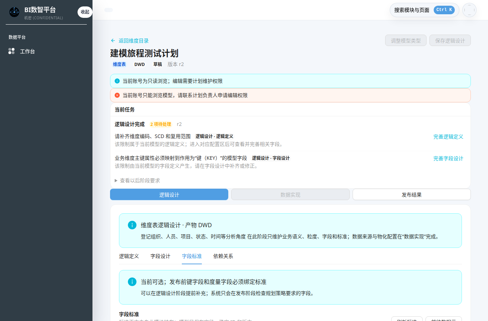

不要通过修改 URL、Cookie、前端状态或数据库绕过权限。

### 证据未知与证据已过期

建设轨迹中的“证据未知”表示权威模块暂时没有返回当前证据；“证据已过期”表示曾经存在，但所引用标准、模型、指标或运行版本已经变化。两者都不是已完成：

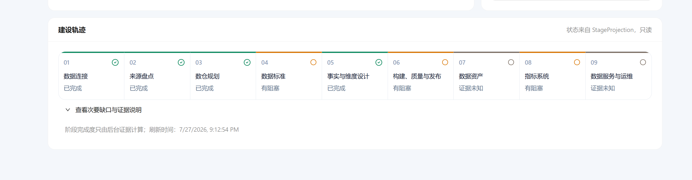

先刷新一次；仍然存在时，按主按钮进入修复页，记录计划、对象、版本和刷新时间。

### implementation revision 冲突

如果页面提示“实现版本已变化，当前配置仍保留”，不要刷新浏览器或重新填表。先截图并记录 ModelSpec revision 和 implementation revision：

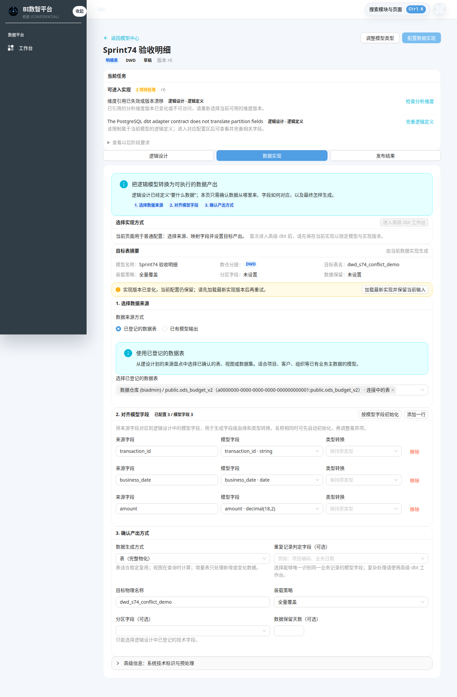

当前 v2.2.3 对“旧 implementation 属于旧 ModelSpec revision”的场景仍不能在页面内完成升级；“加载最新实现并保留当前输入”会继续拒绝旧版本。应停止操作并提交产品缺陷。

### 统一升级信息

向管理员、测试或产品提交问题时，使用同一模板：

| 信息 | 示例/要求 |
|---|---|
| 页面与时间 | 完整页面名称、发生时间、浏览器版本 |
| 计划 | 名称、`planId`、负责人 |
| 对象 | 资产/模型/指标/服务名称和稳定 ID |
| 版本 | ModelSpec、implementation、指标或发布版本 |
| 动作 | 点击了哪个按钮、期望结果 |
| 返回 | 页面提示、HTTP 状态、业务错误码 |
| 安全 | 不附 Cookie、Token、口令、连接串和敏感业务明细 |

## 阶段完成后的统一核验

每完成一个专业页面任务，都执行同一套核验：

1. 返回建模工作台；
2. 选择原计划；
3. 检查证据刷新时间；
4. 确认阶段状态和首要阻塞是否变化；
5. 记录关键产物 ID 和版本；
6. 继续新的唯一主按钮。

如果状态没有变化，优先检查是否只完成了部分字段、保存的是旧版本、计划上下文丢失，或者权威模块的证据尚未写入。
