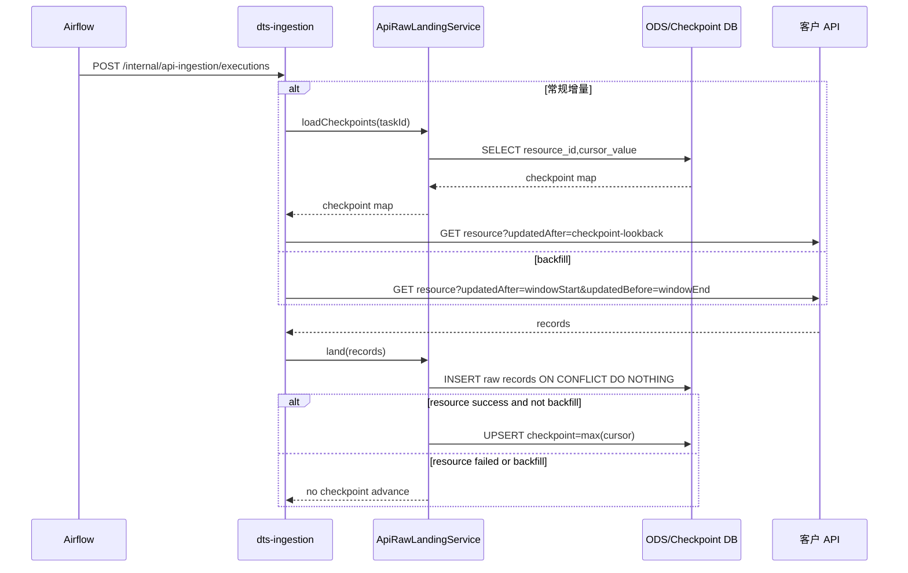

# API 增量与补数语义

**日期**: 2026-06-12
**范围**: Sprint-38 出站拉取式 API 入湖
**状态**: DRAFT

## 语义结论

1. 常规增量执行前按 `task_id + resource_id` 读取 `dts_api_ingestion_checkpoint`。
2. 有 checkpoint 时，请求下界 = `checkpoint - lookbackSeconds`；无 checkpoint 时，请求下界 = `initialValue - lookbackSeconds`。
3. `lookbackSeconds` 只作用于常规增量，用于捕获迟到数据；raw landing 通过 `_dts_record_hash` 幂等键去重。
4. resource 数据与 checkpoint 在同一个 resource 事务中提交；resource 失败时回滚该 resource 数据且不推进 checkpoint。
5. backfill 使用执行记录上的 `backfillWindowStart/backfillWindowEnd`，覆盖 checkpoint/initialValue，且不读取、不推进 checkpoint。

## 请求参数规则

| 场景 | 下界来源 | 下界参数名 | 上界来源 | 上界参数名 |
|------|----------|------------|----------|------------|
| 首轮常规增量 | `initialValue - lookbackSeconds` | `startParameterName` > `parameterName` > `field` | 无 | 无 |
| 后续常规增量 | `checkpoint - lookbackSeconds` | `startParameterName` > `parameterName` > `field` | 无 | 无 |
| backfill | `backfillWindowStart` | `startParameterName` > `parameterName` > `field` | `backfillWindowEnd` | `endParameterName` |

`endParameterName` 未配置时，backfill 只注入下界，适用于对方 API 仅支持“从某时间后拉取”的接口。

## 时序

## 已落地单测

- `ApiIngestionExecutorTest#execute_shouldUsePersistedCheckpointWithLookbackForIncrementalHttpQuery`
- `ApiIngestionExecutorTest#execute_shouldUseBackfillWindowInsteadOfCursorLookbackForHttpQuery`
- `ApiRawLandingServiceTest#loadCheckpoints_shouldReturnCursorValuesByResource`
- `ApiRawLandingServiceTest#land_shouldSkipCheckpointForBackfillExecution`

## 待补 IT

- 增量两轮后插入迟到数据，验证 lookback 捕获且 raw 表不重复。
- 执行 backfill 窗口，验证 raw 表写入但 checkpoint 保持原值。
