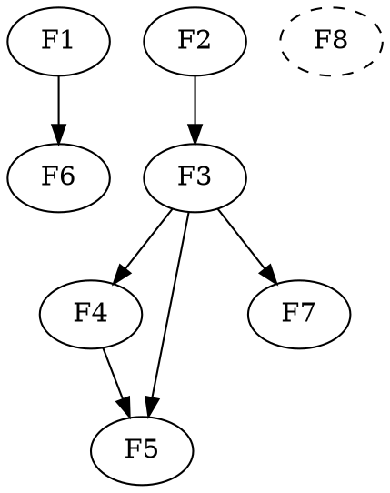

# Sprint-4: 数据质量管控体系重构

**时间**: 2026-04
**状态**: READY
**目标**: 重构质量管控模块为工作流驱动的完整体系——模板规则引擎 + 清洗函数库 + 入湖预检 + 在线修复 + 质量报告评分，覆盖 Excel 入湖全链路质量管控。

## 背景

客户大量使用 Excel 离线上传入湖，数据质量问题严重：
- 日期格式混乱（`2024/1/1`、`2024年1月1日`、Excel 公式 `H2-A2`、中英文混合）
- 必填字段为空，用户不知道哪些是必填
- 枚举值不在允许范围、数字混入单位（`100元`）
- 中文全角/半角混用、不可见字符、合并单元格空行

现有质量管控模块框架健全（规则版本化、模板、清洗函数、执行引擎），但：
1. 前端按实体组织（规则/模板/函数/编辑），不符合用户工作流
2. 与入湖流程完全断开，无预检机制
3. 湖内修复只有单行编辑，缺少批量清洗/SQL 修复能力
4. 无质量概览和评分体系

**设计来源**: 2026-04-03/04 头脑风暴，确定方案一（Excel 上传 → 全量预检 → 在线编辑台）

## 设计概要

### 入湖预检全链路

```
现有流程：  上传 Excel → 推断列类型(前2行) → Addax 作业 → Airflow 执行
重构后：    上传 Excel → 全量解析写入暂存表 → 质量预检 → 在线编辑修复 → 提交入湖
```

预检为可选步骤，不勾选时走现有 Addax 直通链路。

入湖任务创建页步骤变更：
```
现有：① 上传文件 → ② 列映射 → ③ 确认执行
改为：① 上传文件 → ② 列映射 → ③ 质量预检 → ④ 确认执行
                                  ↓
                           通过 → 直接到④
                           失败 → 跳转数据修复 Tab → 修复后回到④
```

### 统一规则定义，双执行器

同一套 GovRule + GovRuleVersion，两种执行模式：

| | 入湖预检 | 湖内巡检 |
|--|---------|---------|
| 触发 | Excel 上传时同步 | 定时调度 / 手动 |
| 数据源 | PG 暂存表 `tmp_ingestion_{taskId}` | 目标表（Hive/PG） |
| 执行器 | PgStatementExecutor | HiveStatementExecutor |
| 反馈 | 行级错误 → 在线编辑台 | 质量报告 + 批量修复 |
| 规则定义 | 共用 | 共用 |

### 前端 Tab 重构（按工作流）

```
现有 Tab：  质量规则 | 规则模板 | 清洗函数 | 数据编辑
重构为：    概览 | 质量规则 | 检查任务 | 质量报告 | 数据修复
```

| Tab | 内容 | 用户场景 |
|-----|------|---------|
| 概览 | 4 指标卡片 + 7 日趋势 + Top5 问题数据集 + 最近失败 | 管理者全貌 |
| 质量规则 | 规则 CRUD，3 步引导创建（选方式→配规则→绑数据集），模板/清洗内嵌 | 数据专员配规则 |
| 检查任务 | 调度管理 + 执行历史 + 详情（失败行预览 + SQL 透出） | 运维/专员 |
| 质量报告 | 评分卡片（综合+分维度）+ 30 天趋势 + 规则明细 sparkline + 导出 | 管理层/审计 |
| 数据修复 | 入湖预检编辑台 + 湖内修复（批量清洗/SQL/人工编辑） | 业务人员修数据 |

### 数据修复三模式

湖内修复以批量清洗为主，人工编辑为辅：

| 模式 | 适用场景 | 交互 |
|------|---------|------|
| 批量清洗（推荐） | 有清洗函数可匹配 | 预览修复前后 → 确认执行 → 残余转人工 |
| SQL 修复 | 复杂逻辑（条件替换、跨列计算） | SQL 编辑器 + 预览效果 → 执行（仅 UPDATE ods_*） |
| 人工编辑 | <50 行无规律脏数据 | 编辑台，仅加载失败行 |

### 评分体系

```
权重：CRITICAL=4, HIGH=3, MEDIUM=2, LOW=1
单规则得分 = 通过率 × 100
维度得分 = Σ(单规则得分 × 权重) / Σ权重
综合得分 = 所有维度得分的加权平均
5 个维度：完整性 / 一致性 / 准确性 / 唯一性 / 及时性
```

## Feature 列表

| ID | Feature | Task 数 | 状态 | 优先级 |
|----|---------|---------|------|--------|
| F1 | 规则模板引擎（后端） | 5 | READY | P0 |
| F2 | 清洗函数库（后端） | 4 | READY | P0 |
| F3 | 质量检测增强（后端） | 4 | READY | P0 |
| F4 | 入湖预检集成（后端） | 5 | READY | P0 |
| F5 | 数据修复模块（后端+前端） | 4 | READY | P1 |
| F6 | 质量管控前端重构 | 5 | READY | P1 |
| F7 | 质量报告与评分体系 | 4 | READY | P1 |
| F8 | 遗留 P0 修复 | 2 | READY | P0 |

## 依赖链

```
F1(模板引擎) ──→ F6(前端重构)
F2(清洗函数) ──→ F3(检测增强) ──→ F4(入湖预检)
F3(检测增强) ──→ F5(数据修复)
F4(入湖预检) ──→ F5(数据修复)
F3(检测增强) ──→ F7(报告评分)
F8(P0修复) 无依赖，可并行
```



## 关键架构决策

1. **模板快照制**：规则创建时快照模板 SQL 到 rendered_sql，模板修改不影响已有规则
2. **清洗时机**：入湖后、检测前，通过 SQL UPDATE 实现，不改 Addax 链路
3. **BLOCK 策略**：打标隔离（_quality_blocked 列），DWD 层 dbt 模型过滤
4. **失败行存储**：只存主键引用 + 失败原因，下钻时实时查询原始数据
5. **暂存表策略**：Excel 预检数据全部以 TEXT 写入 PG 暂存表 `tmp_ingestion_{taskId}`，24h TTL
6. **统一规则定义，双执行器**：同一套 GovRule，入湖预检用 PG SQL，湖内巡检用 Hive/Spark
7. **修复三模式**：批量清洗（主路径）→ SQL 修复（复杂逻辑）→ 人工编辑（残余数据）
8. **前端按工作流重组**：概览 → 质量规则 → 检查任务 → 质量报告 → 数据修复

## 完成标准
- [ ] 10 种规则模板可通过 UI 管理和使用
- [ ] 清洗函数库含 DATE_NORMALIZE、STRIP_UNIT、ENUM_MAP 等
- [ ] 入湖完成后自动触发清洗 + 质量检测
- [ ] Excel 上传后可质量预检，行列级错误反馈
- [ ] 预检编辑台支持在线修复 + 重新检查 + 提交入湖
- [ ] 湖内数据修复支持批量清洗/SQL 修复/人工编辑三种模式
- [ ] 质量概览仪表盘展示健康度、趋势、Top 问题数据集
- [ ] 质量报告支持评分体系（综合 + 分维度）
- [ ] BLOCK 规则失败时 ODS 行被打标隔离
- [ ] 所有数据编辑操作有审计日志
