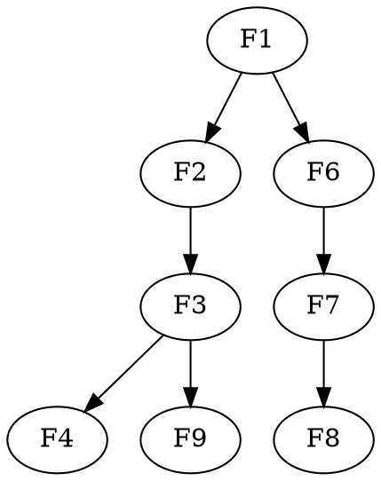

# Sprint-5: 指标驱动建模体系

**时间**: 2026-04
**状态**: READY
**目标**: 建立完整的指标定义→dbt 模型自动生成→执行→可观测性链路，解决"指标不准确、过程不透明"的核心问题。同时修复质量评分公式缺陷。

## 背景

客户指标管理现状：
1. 客户指标全靠 Excel 记录，实施人员用 LLM 分析 Excel 后手工生成 dbt 模型
2. 整个过程不透明——客户不知道指标如何计算，实施人员无法标准化交付
3. 没有统一的指标定义格式，每次实施都从零开始
4. 质量评分公式缺少 `rows_total`，所有失败规则评分 = 0

**设计来源**: 2026-04-05 头脑风暴，确定方案 A（指标驱动建模）+ 为 v2.3.0 LLM 能力预留接口

## 设计概要

### 端到端链路

```
实施人员维护指标模板库
    ↓
客户选择指标模板 → 绑定源表 → 字段映射
    ↓
平台自动生成 dbt SQL + schema.yml
    ↓
编译 → 执行 → 元数据同步到 Catalog
    ↓
指标看板（卡片+趋势+维度下钻+预警）
```

### 指标元数据模型

扩展现有 `gov_indicator_definition`，覆盖完整的指标要素：
- **计算定义**: aggregation_type + 分子/分母表达式 + 静态/动态过滤 + 衍生指标 + 窗口函数(同比/环比/YTD)
- **维度与粒度**: dimension_fields(含 display_name, control_type) + date_column + time_grain + granularity
- **数据绑定**: source_table + join_config(多表关联) + target_layer + target_model_name
- **业务属性**: unit + precision + threshold + direction + data_privacy
- **LLM 预留**: llm_generated + llm_confidence + human_verified

### dbt 生成引擎

5 类 Jinja2 模板：简单聚合 / 比率型 / 衍生指标 / 窗口函数 / 自定义 SQL。
自动生成 `ind_{code}.sql` + `{domain}_indicators_schema.yml`，写入 `models/ads/{domain}/`，复用现有 dbt compile + run 链路。

### 角色分工

| 角色 | 操作 | 页面 |
|------|------|------|
| 实施人员 | 管理指标模板、为客户配置指标、字段映射、发布 | 指标模板管理 + 配置工作台 |
| 客户 | 浏览可用指标、选择订阅、配置筛选、查看看板 | 指标商店 + 指标看板 |

### LLM 扩展预留（v2.3.0）

定义 `IndicatorSuggestionProvider` 接口，3 个扩展点：
1. 分析源表结构推荐指标
2. 审查生成的 SQL
3. 分析上传文件推荐模板

v2.2.x 提供 NoOp 实现。

### 质量评分修复

- `gov_quality_run` 新增 `rows_total` 字段
- `QualityRunService` 执行前 `SELECT count(*)` 写入 rows_total
- `QualityScoreService` 修正评分公式
- `persistMetrics()` 补充 metric_value / threshold_value

## Feature 列表

| ID | Feature | Task 数 | 状态 | 优先级 |
|----|---------|---------|------|--------|
| F1 | 指标元数据扩展 | 3 | READY | P0 |
| F2 | 指标模板库 | 4 | READY | P0 |
| F3 | dbt 生成引擎 | 5 | READY | P0 |
| F4 | 指标配置工作台（前端） | 4 | READY | P0 |
| F5 | 质量评分修复 | 3 | READY | P0 |
| F6 | 指标运行追踪 | 3 | READY | P1 |
| F7 | 指标看板（前端） | 4 | READY | P1 |
| F8 | 指标商店（前端） | 3 | READY | P2 |
| F9 | LLM 接口预留 | 2 | READY | P2 |

**共计 31 个 Task**

## 依赖链

```
F1(元数据扩展) ──→ F2(模板库) ──→ F3(生成引擎) ──→ F4(配置工作台)
F1(元数据扩展) ──→ F6(运行追踪) ──→ F7(指标看板) ──→ F8(指标商店)
F5(评分修复) 无依赖，可并行
F9(LLM预留) 依赖 F3
```



## 并行策略

```
第一批（并行）: F1 + F5
第二批（并行）: F2 + F6（F1完成后）
第三批（并行）: F3 + F7（F2+F6完成后）
第四批（并行）: F4 + F8 + F9（F3+F7完成后）
```
