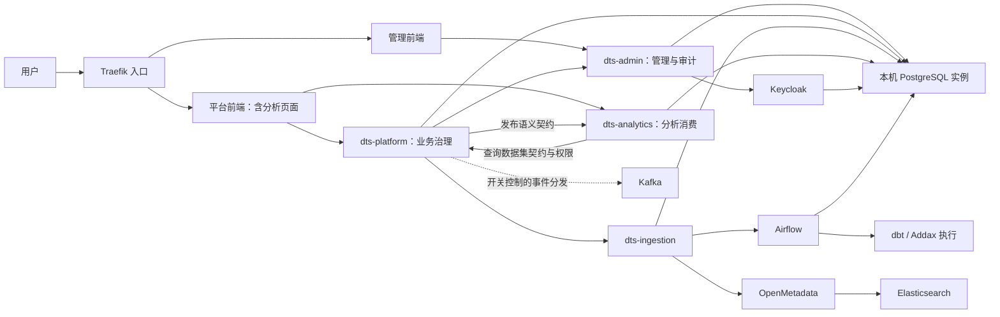

# DTS v2.2.3 第一轮架构审计

- 日期：2026-09-12；运行快照时间：2026-09-12T03:00:37.530663+00:00（北京时间 11:00 左右）。
- 审计方式：主代理只读源码／配置审阅、静态统计、Docker 元数据读取。
- 源码基线：`9d23f1c47d9b7b2c67aa5bd6f5b2d3e580b5f2c1`，分支 `v2.2.3`。
- 开始时工作区干净，本地比本机记录的 `origin/v2.2.3` 领先 1 个提交；未 fetch，未据此推断远端实时状态。
- 授权写入：仅 `worklog/v2.2.3/audit` 的新增报告。
- 定位：首轮整体架构及重点链路抽样，不是全量安全认证、渗透测试或产品验收报告。

## 1. 结论

DTS 当前已经形成管理控制、业务治理、数据接入、分析消费四个主要后端职责，以及模型发布到受治理 BI 数据集的连接机制。分层方向合理，当前证据不支持推倒重建或仅因使用 Docker Compose 就否定架构。

优先问题在于**治理约束没有一致覆盖到所有入口**：三员可统一进入管理 API，但抽样的写接口缺少动作级职责限制；通用变更审批缺少自审和状态转换检查；部分“内部”接口仍在应用层匿名放行。新增更多功能之前，应优先核查这些共享入口。

扩展性方面，已有同步租约、版本控制、事件表等基础，但通用 Kafka 分发的失败恢复与并发领取不完整；当前本机拓扑和容器资源隔离也不足以证明高可用或横向扩展能力。

国际化方面，主界面默认中文已经实现，不能报告为“当前默认英文”。实际缺口是**语言状态分裂、双语资源不对齐、缺失翻译可能暴露原始键／代码，以及客户页面残留开发说明**。

共记录 12 项：6 项明确的源码行为缺口、5 项条件性风险或治理缺口、1 项版本／部署证据缺口。没有把未执行的攻击、故障或业务流程写成已复现事故。

## 2. 证据基线与适用边界

| 对象 | 当前证据 | 解释 |
|---|---|---|
| 开发源码 | `9d23f1c47d9b7b2c67aa5bd6f5b2d3e580b5f2c1` | 本报告源码结论对应此版本 |
| 构建目录 HEAD | `2e42daa8e76bc8e2fe4fdf5990d0b42e0d5d736e` | 仅读取 `/data/dts-stack` 的 HEAD，未拉取、构建或测试 |
| 5 个本轮关注的业务镜像 | 标签记录 `08a46ed5b38f952a1a60dcd236fb39f3033c7f53` | admin、platform、ingestion、analytics、platform-webapp；标签不是逐文件一致性证明 |
| 管理前端镜像 | 标签记录 `814a7c21bc74a4c82e00ed409f408f92010fefa1` | 与以上业务镜像提交不同；可能是分批更新，不能单凭差异判为发布错误 |
| 实际 Compose 元数据 | 项目 `dts-stack`；目录 `/data/dts-stack`；文件 `/data/dts-stack/docker-compose-app.yml` | 说明容器创建时登记的配置来源，不证明该文件之后未被修改 |
| 既有运行目录约定 | 本机 `/opt/dts/release/dts-stack` 当前不存在 | 与会话提供的既有运行目录约定有差异，需确认现行部署边界；本轮不迁移 |
| GitNexus | 报告索引落后 26 个提交；3 个概念查询返回空结果 | 为遵守用户禁止额外文件变更要求，不重建索引；空结果不等于无实现，改用当前源码取证 |
| 历史报告 | `worklog/v2.2.3/architecture-review.md` 实际标注 2026-04-01、v2.2.2 | 只作历史线索，不作为当前缺陷清单 |

本轮没有读取业务数据、导出凭据、调用写接口、修改数据库、启动／重启容器、安装依赖或执行构建。安全发现属于已核对的应用层代码路径；线上暴露范围、真实身份登录和数据库最终状态仍需后续专门验证。

## 3. 当前架构与合理性

### 3.1 服务与职责

| 组件 | 本轮确认的主要职责／关系 | 判断与边界 |
|---|---|---|
| dts-admin + 管理前端 | Keycloak 用户与组织接入、三员管理、菜单、变更审批、审计接收 | 控制面集中有利于一致治理；动作授权与审批约束仍需统一 |
| dts-platform + 平台前端 | 资产与权限、接入控制、建模生命周期、发布、查询数据集、业务工作台 | 主业务控制面明确；内部模块很多，需继续检查数据所有权及依赖方向 |
| dts-ingestion | 任务与执行记录、文件／API 接入、Addax、Airflow、元数据客户端 | 将执行职责独立于业务页面合理；任务编排类仍较集中 |
| dts-analytics | 分析、语义查询、看板／卡片，读取平台发布契约和权限 | 消费发布版本与校验和，避免直接把物理表当成已治理分析资产 |
| dts-common | admin、platform、ingestion、analytics 的公共 Maven 依赖 | 可复用公共契约；共享库变化仍需关注服务发布耦合 |
| Keycloak | 身份基础设施 | 身份认证不等于每个业务动作已授权 |
| Airflow、dbt、Addax | 调度与数据执行工具 | 本轮源码／Compose 可见关联；未执行实际数据任务 |
| OpenMetadata、Elasticsearch | 元数据服务及搜索依赖 | 当前独立运行；资产主账与外部元数据的冲突恢复留待专题 |
| PostgreSQL、Kafka、Traefik | 状态存储、消息基础设施、流量入口 | 本机观测各一个对应实例；不据此推断其他现场拓扑 |
| dts-metrics 等存量目录 | Maven 中仍有 metrics；标准 Compose 未声明，legacy Compose 和构建入口保留 | 目录存在不能证明它是当前在线主服务；本机容器清单未见独立 metrics 服务 |

依据：E01、E02、E09、E10、E15、E16。源码有多个旧前端目录，但当前平台路由直接引用 `src/analytics/pages`；不能继续照搬“所有分析页面仍是独立前端”的旧结论。

### 3.2 架构关系图

图中是本轮取证到的主要关系，省略部分接口和初始化服务；虚线代表开关控制或需进一步确认的链路。

“共用实例”不是“共用业务表”。本轮确认部署依赖，尚未全量对照 schema、外键、跨库访问及数据所有权。

### 3.3 建模到分析的主链

当前源码体现以下路径：

1. 建模与发布控制面持有模型、修订、发布候选及 serving 状态。
2. `CatalogModelServingService` 在投影变化时写平台事件。
3. `CatalogModelSemanticSyncService` 领取带租约的同步候选，发布分析语义，再生成查询数据集，并记录成功／失败及下一次尝试时间。
4. `ModelQueryDatasetProjectionService` 检查物理资产启用与 DWS／ADS 层，复用模型身份，派生密级，生成 READY 的契约快照和 PUBLISHED 版本。
5. 分析端 `PlatformAnalysisDatasetContractClient` 校验数据集 ID、版本、校验和及 PUBLISHED 状态，并设置出站超时。

合理之处是物理实现、发布事实和分析消费契约有所区分。仍需验证远端发布成功而本地投影失败、租约到期、撤销发布、权限撤销和版本重试等场景。**本轮没有证明任一真实模型已经完成这条业务链。**

### 3.4 对历史判断的纠正

| 历史描述 | 当前取证后的判断 |
|---|---|
| 没有消息队列，所有通信同步 | 已有 Kafka、平台事件表和调度分发；是否启用及哪些链路真正消费须逐项核对 |
| 服务认证只看服务名请求头 | 平台入站已有路径白名单和令牌检查；管理端审计接收已有成对凭据检查，但部分其他内部接口仍匿名放行 |
| 没有发布到 BI 的连接机制 | 当前已有语义同步与 QueryDataset 投影；不能把“有代码”写成“已验收” |
| 没有任何可观测性 | 已见健康端点、事件状态指标、相关标识及错误记录；完整告警、链路追踪和恢复演练本轮未查 |
| Compose 本身就是架构缺陷 | 当前具体问题是单实例、资源边界及恢复证据不足；是否需要更复杂编排取决于容量和可用性目标 |

## 4. 发现清单

P1：应优先进入后续核查／整改；P2：产品一致性、维护性或条件性治理问题。优先级不是漏洞评分，也不代表线上已被利用。

| 编号 | 优先级 | 分类 | 发现 | 证据 |
|---|---|---|---|---|
| SEC-01 | P1 | 源码缺口 | 三员统一放行，组织写入缺少动作职责限制 | E03、E04 |
| SEC-02 | P1 | 源码缺口 | 通用变更审批缺少审批职责、自审与状态转换检查 | E03、E05 |
| SEC-03 | P1 | 源码缺口 | 部分内部管理接口没有应用层调用方认证 | E03、E06 |
| SEC-04 | P2 | 策略一致性风险 | 审计查询范围在不同入口不一致，存在硬编码账号 | E07 |
| REL-01 | P1 | 源码缺口，启用时触发 | 通用事件分发失败不自动重入，缺少独占领取 | E08 |
| OPS-01 | P1 | 容量／可用性风险 | 本机基础设施单实例，抽样容器无显式 CPU／内存上限 | E02、附录 A |
| OPS-02 | P1 | 信任边界风险 | Airflow 调度器挂载宿主 Docker socket | E02、附录 A |
| UI-01 | P1 | 源码缺口 | 平台与分析页面各持有语言状态，切换不统一 | E11 |
| UI-02 | P2 | 覆盖／回退风险 | 中英文资源不对齐，未知翻译回退可能暴露技术键／原值 | E11、E12 |
| UI-03 | P2 | 源码缺口 | 普通分析详情页残留开发说明与原始响应展示 | E13 |
| ARC-01 | P2 | 可维护性风险 | 管理 API 同时承载审批、应用变更和审计，类规模大 | E04、E05、E14 |
| BASE-01 | P1 | 证据缺口 | 源码、构建 checkout、运行镜像及部署路径尚未对齐 | 第 2 节、附录 A |

### SEC-01：三员入口限制没有落实为写动作职责限制

- **事实**：`SecurityConfiguration` 对 `/api/admin/**` 使用三员角色的 `hasAnyAuthority`；`POST /api/admin/orgs` 没有方法级角色限制，直接进入 `OrganizationService.create` 保存组织。所查 service 中也没有调用者职责校验。
- **影响**：具有有效会话的审计员角色，在应用层可进入组织创建路径。组织参数校验与会话超时检查不能替代职责分离。此结论不依赖前端是否展示新增按钮。
- **范围**：本轮确认这条路径，不推断所有管理接口都可越权。
- **建议**：从三员职责矩阵定义资源—动作授权；写入口与应用服务复用同一策略，审计员保持其职责范围。
- **后续验证**：在隔离验证环境，以三种单角色分别调用组织新增／修改／删除，确认禁止角色返回 403 且无数据或外部身份系统副作用。本轮未发送这些写请求。

### SEC-02：通用变更审批未建立完整后端状态机和职责约束

- **事实**：`approveChangeRequest` 读取记录后直接改为 APPROVED 并执行变更；入口未检查审批角色、申请人与审批人是否相同、原状态是否允许审批。reject 同样直接设置 REJECTED。
- **调用复核**：`applyChangeRequest` 按资源类型分派；CONFIG 路径进入 `applySystemConfigChange` 并直接保存配置，没有补充上述约束。当前审批页面对非 Keycloak 专用审批调用此通用入口。
- **影响**：自审、跨职责审批、草稿直接审批、重复应用或已完成记录改判均缺少入口保障；实际副作用取决于资源类型。
- **建议**：统一审批策略与状态转换，校验申请人／审批人职责及互斥，采用版本或条件更新防止并发重复决定。审计记录应反映合法转换和拒绝原因。
- **后续验证**：覆盖同人申请审批、错误角色、DRAFT／APPLIED／REJECTED 状态、重复请求和并发决定。只检查正常审批成功不足以关闭此问题。

### SEC-03：内部接口认证覆盖不完整

- **事实**：管理端安全配置匿名放行 `/api/admin/platform/**`、`/api/keycloak/platform/**`；抽查 `/api/admin/platform/orgs`、`/api/keycloak/platform/roles` 未发现额外令牌检查。
- **副作用入口**：`POST /api/admin/platform/orgs/sync` 也匿名放行，并调用 `ensureUnassignedRoot`；在默认组织配置存在且需补齐／更新时，该调用可创建或更新组织并可能同步 Keycloak，不能把它视为纯查询。
- **边界**：证实的是应用层认证缺口。网关、网络及外部访问面没有做端到端测试，不能报告为“已从互联网匿名修改”。
- **已有保护**：`/api/audit-events` 有独立预认证过滤器；它只匹配该审计路径，不能证明其他内部路径也受保护。
- **建议／验证**：统一服务身份、方法／路径授权及默认拒绝；逐个验证无凭据、错误服务名、错误令牌、越权路径和正常调用方。

### SEC-04：审计可见规则分散且存在账号硬编码

- **事实**：管理端审计查询明确处理多三员角色拒绝、系统管理员自查、审计员不可自审；但授权管理员可见对象写死为 `auditadmin`。同模块 `TriadAccountRegistry` 已支持配置审计账号名称。
- **另一入口**：平台 `AssetPermissionAuditResource` 对审计员、系统管理员、ADMIN、OP_ADMIN 放行查询，`operator` 由请求传入，不应用上述可见范围约束。
- **影响**：更名后可能无法监督实际审计员；若资产权限审计被纳入同一三员管理规则，则平台入口存在策略偏差。不同审计域是否允许不同规则，须以正式产品矩阵确认。
- **建议／验证**：集中维护审计主体身份及可见策略；分别验证系统审计和资产授权审计，覆盖账号更名、多角色和不传 operator 的请求。

### REL-01：通用 Kafka 事件分发的恢复与并发领取不足

- **事实**：分发器只取 PENDING；发送异常或 5 秒等待超时后写 FAILED，后续轮次仍只取 PENDING。查询是普通分页，没有状态领取、锁或租约。该分发器没有可见的跨实例互斥。
- **影响**：Kafka 故障后，失败事件不会自动重新进入该调度路径；多实例可能领取同一条事件；发送成功而落库前退出也可能导致重复。
- **限制与反证**：事件重新 publish 可以设回 PENDING，因此不能说“永远无法恢复”。这是通用平台事件分发的问题，不能推及已使用租约与重试的模型语义同步。
- **启用条件**：源码配置 `DTS_PLATFORM_EVENTS_KAFKA_ENABLED` 默认 false；运行容器未显式提供此同名环境变量。本轮未检查全部属性覆盖来源，所以不确认运行时是否启用，更不声称已有事件积压。
- **建议／验证**：明确至少一次投递与消费者幂等；增加失败重试／退避、领取租约、重放入口与积压指标。验证断网后恢复、发送确认后进程中断、双实例竞争。

### OPS-01：当前本机拓扑和资源边界不足以证明扩展能力

- **事实**：本机看到一套 PostgreSQL、Kafka、Traefik；Compose 中 Kafka 内部 topic 复制因子为 1，Airflow 为 LocalExecutor。抽样九个容器的 Memory 和 NanoCpus 都为 0。
- **解释**：0 表示这些 Docker 容器字段未设置显式限制，不代表宿主无任何 cgroup、JVM或应用限制。
- **影响**：大批量执行与在线查询可能争抢同机资源；本机基础服务故障可能影响多个模块。LocalExecutor／本地挂载不能直接证明多主机执行能力。
- **建议／验证**：先确定数据量、并发、延迟、恢复时间和可接受丢失量，再决定资源隔离、数据库恢复／复制、消息拓扑和执行节点方案。本轮没有证据支持“没有备份”或“必须迁移 Kubernetes”。

### OPS-02：执行工具与宿主容器控制面的信任边界较强耦合

- **事实**：Compose 和运行 inspect 均确认 Airflow scheduler 挂载 `/var/run/docker.sock`。
- **影响**：调度进程及其可执行代码与宿主容器控制接口之间缺少普通业务容器边界；一旦对应执行权限或进程被滥用，影响可能超出单次数据任务。
- **限制**：未测试 socket 权限、守护进程授权插件、宿主 rootless 设置或实际可执行指令，不声称已经取得宿主权限。
- **建议／验证**：核对 DAG／脚本写入权限、审批、执行身份、socket 权限和守护进程隔离；按当前部署约束评估专用执行节点或受限执行代理。

### UI-01：语言状态没有统一到平台会话／界面

- **事实**：主前端使用 `i18nextLng` 与 `zh_CN/en_US`；分析模块单独读取 `dts-analytics.locale` 与 `zh-CN/en`。多个页面使用空依赖 useMemo 在挂载时读取一次。
- **交叉核对**：在平台前端 src 的 TS／TSX 范围检索，分析模块 setter／toggle 只有定义，未发现主语言切换向分析存储同步的调用。
- **影响**：主界面切到英文时分析页仍可能中文；若旧分析偏好为英文，主界面中文时仍可能出现英文分析页。刷新与重新挂载也受两套存储影响。
- **已有正确行为**：管理端和平台端未设置语言时显式使用中文；分析模块也默认中文。不是默认值缺失，而是统一状态和切换机制缺失。
- **建议／验证**：统一语言状态、规范化语言代码与响应式订阅；验证无存储、冲突存储、切换、刷新、跨模块导航及异常边界组件。

### UI-02：语言资源和缺失回退尚不足以保证完整双语

静态 JSON 叶子键统计如下，按相同文件对照，未把这些数量直接等同于可见页面错误数量：

| 应用／文件 | 中文键 | 英文键 | 中文缺英文已有键 | 英文缺中文已有键 |
|---|---:|---:|---:|---:|
| platform/common.json | 15 | 15 | 0 | 0 |
| platform/sys.json | 469 | 479 | 11 | 1 |
| admin/common.json | 15 | 15 | 0 | 0 |
| admin/sys.json | 305 | 290 | 1 | 16 |
| 两应用各自 keycloak.json | 114 | 0 | 0 | 114 |
| 两应用各自 profile.json | 6 | 0 | 0 | 6 |

英文 index 仅加载 common 和 sys，中文另有 keycloak 和 profile。部分缺失键可能对应旧菜单，需核对有效页面，不能仅凭差集宣称全部可见。

- **回退机制**：分析 `t` 找不到键直接返回键；管理 `useAdminLocale` 未翻译时返回 fallback 或原始值；双语 helper 只判断翻译是否非空，没有统一检查是否等于原始键。
- **重要反证**：对分析 pages／components 中静态 `t(locale, "literal")` 调用作保守匹配，未找到中文词典缺失调用点；这不覆盖动态键、其他调用形式或其他应用。
- **词汇例外**：菜单种子与中文资源仍有 Data Studio，是否作为术语保留需列入允许清单；不能把 SQL、API、JSON、Python 等所有拉丁字符一律判错。
- **建议／验证**：建立有效键覆盖、中文安全回退和专业术语允许清单；系统状态／错误码必须有用户可理解的中文，保留原始业务数据及技术标识。

### UI-03：分析详情页残留开发说明

- **事实**：平台路由 `bi/dashboards/:id` 直接渲染 DashboardDetailPage，默认 embedded=false；页面显示使用 `dashboards.detailNote` 的折叠区，中文内容为“开发态：部分页面暂以原始 JSON 展示，后续逐步替换为可视化渲染”，并输出原始响应。
- **影响**：面向普通用户的已实现看板仍呈现开发中的说明，降低可信度，也不能帮助用户完成业务操作。
- **边界**：源码路径和渲染条件已确认，未登录运行页面截图；未据此判断响应中存在敏感数据泄露。
- **建议／验证**：将必要诊断内容放到有明确受众和权限的诊断入口，普通详情页使用业务说明；验证空态、错误态、导出和字段名称的中文一致性。

### ARC-01：管理控制面职责过于集中，局部修复容易遗漏相邻入口

- **事实**：AdminApiResource 为 7,670 行，类级事务，包含组织、菜单、角色、变更审批、变更执行和大量审计组装；KeycloakApiResource 为 3,885 行；IngestionTaskService 为 4,673 行。
- **判断**：行数不是独立的功能缺陷。结合 SEC-01／02 中入口与审批策略不一致，以及控制器承担配置落库等工作，可以确认授权、状态与副作用职责分散的维护风险。
- **建议**：后续修复时围绕统一授权策略、审批状态机及应用服务收敛，保留现有端点与契约；不为减少行数进行一次性大拆分。需另行追踪事务中远端调用和失败一致性。

### BASE-01：证据链需要按现行部署边界重新建立

- **事实**：开发 HEAD、构建 HEAD、运行镜像 revision 不同，管理前端又属于较早 revision；容器登记的 Compose 源在构建目录，既有运行目录当前不存在。
- **影响**：当前运行 UI 的表现不能直接用于确认本轮源码已生效，也不能将源码修复状态归为真实业务验收通过。
- **边界**：分批部署本身不必然错误；镜像标签只是声明，仍需版本清单／交付包／校验和作交叉证据。
- **建议**：确认实际发布目录和是否为已接受的例外，建立“源码提交—正式测试—交付包—镜像—容器—登录验收”的对应关系。本轮不修改目录约定、不迁移容器。

## 5. 中文默认和双语审计规则

以下是本次用户要求的可验证表达，不是已完成实现：

| 编号 | 规则 | 后续检查场景 |
|---|---|---|
| LANG-01 | 无用户偏好时默认中文，不被英文浏览器自动切走 | 清空偏好、英文浏览器、未登录和已登录入口 |
| LANG-02 | 无效语言配置规范化为中文，显式英文偏好按产品规则保留 | 空值、未知语言码、旧格式及存储异常 |
| LANG-03 | 平台、管理与分析子模块遵循统一语言选择 | 切换、刷新、跨页、跨应用跳转 |
| LANG-04 | 中文系统文案不直接显示英文回退、原始翻译键或后端状态码 | 缺失键、未知状态、网络与校验错误 |
| LANG-05 | 专业术语采用经确认的允许清单 | SQL、API、产品名称等逐项确认，不笼统豁免所有技术词 |
| LANG-06 | 覆盖组件和完整使用状态 | 日期／分页／上传／空态／加载／禁用／错误／成功／导出 |
| LANG-07 | 保留用户原始数据和技术标识 | 表名、字段名、代码、输入内容不被误翻译 |
| LANG-08 | 面向客户的页面只展示有业务用途的说明 | 排查开发态、Sprint、内部服务名和无意义原始响应 |

默认中文不等于双语验收完成；字典键对齐不等于每个页面都可用。本轮确认默认值和静态缺口，完整页面验收未执行。

## 6. 验证状态与后续分轮范围

| 层次 | 本轮结果 |
|---|---|
| 源码／静态审阅 | 完成所列入口与调用路径的抽样核对、资源差集、配置解析和代码规模统计 |
| 既有自动化测试 | 找到身份认证、审计可见性、语义同步与 QueryDataset 投影测试源码；未执行，不计为通过 |
| 正式构建／交付包 | 未执行，未计算新包校验和 |
| 容器部署 | 只读读取本机容器状态、镜像 ID、revision、资源限额和 Compose 元数据；未部署 |
| 真实页面／业务验收 | 未执行登录、Chrome 95、角色操作或数据主链验收 |
| 安全利用／故障验证 | 未执行，无线上数据写入或故障注入 |

下一轮优先输出完整三员“角色—资源—动作—入口—后端策略—证据”矩阵，继续核查通用审批与 Keycloak 专用审批的差异；中文专题随后从有效菜单逐页追踪。后续需要写入式验证时应在适当验证环境开展，不以当前只读审计授权代替。

## 7. 源码证据索引

链接指向当前仓库文件；行号对应本报告的源码 SHA。

| 编号 | 文件与重点行 |
|---|---|
| E01 | [父 POM](../../../source/pom.xml#L20)：20–27；各服务 pom 中 dts-common 依赖 |
| E02 | [标准 Compose](../../../docker-compose-app.yml#L300)：scheduler 300、LocalExecutor 332、socket 395–396；Kafka 1079–1096；PG 1131；platform 1248 |
| E03 | [管理端 SecurityConfiguration](../../../source/dts-admin/src/main/java/com/yuzhi/dts/admin/config/SecurityConfiguration.java#L55)：55–90、104–112 |
| E04 | [AdminApiResource](../../../source/dts-admin/src/main/java/com/yuzhi/dts/admin/web/rest/AdminApiResource.java#L1310)：78–82、1310–1350；[OrganizationService](../../../source/dts-admin/src/main/java/com/yuzhi/dts/admin/service/OrganizationService.java#L196)：196–235 |
| E05 | [AdminApiResource 审批](../../../source/dts-admin/src/main/java/com/yuzhi/dts/admin/web/rest/AdminApiResource.java#L2138)：2138–2205、2208–2233、3381–3400、6473–6482；[审批页面](../../../source/dts-admin-webapp/src/admin/views/approval-center.tsx#L1091)：1091–1112 |
| E06 | [内部组织接口](../../../source/dts-admin/src/main/java/com/yuzhi/dts/admin/web/rest/AdminApiResource.java#L1270)：1270–1307；[角色查询](../../../source/dts-admin/src/main/java/com/yuzhi/dts/admin/web/rest/KeycloakApiResource.java#L2053)：2053–2072；[组织默认项补齐](../../../source/dts-admin/src/main/java/com/yuzhi/dts/admin/service/OrganizationService.java#L285)：285–324 |
| E07 | [管理端审计可见性](../../../source/dts-admin/src/main/java/com/yuzhi/dts/admin/web/rest/AuditEntryResource.java#L408)：408–472；[三员账号注册表](../../../source/dts-admin/src/main/java/com/yuzhi/dts/admin/security/TriadAccountRegistry.java#L28)：28–48；[平台资产权限审计](../../../source/dts-platform/src/main/java/com/yuzhi/dts/platform/web/rest/AssetPermissionAuditResource.java#L12)：12–38 |
| E08 | [事件分发器](../../../source/dts-platform/src/main/java/com/yuzhi/dts/platform/service/event/PlatformEventKafkaDispatcher.java#L38)：38–63；[事件服务](../../../source/dts-platform/src/main/java/com/yuzhi/dts/platform/service/event/PlatformEventOutboxService.java#L140)：58–80、140–161；[事件仓库](../../../source/dts-platform/src/main/java/com/yuzhi/dts/platform/repository/event/PlatformEventOutboxRepository.java#L13)；[开关配置](../../../source/dts-platform/src/main/resources/config/application.yml#L342)：342–347 |
| E09 | [模型 serving](../../../source/dts-platform/src/main/java/com/yuzhi/dts/platform/service/modeling/serving/CatalogModelServingService.java#L167)：167–195；[语义同步](../../../source/dts-platform/src/main/java/com/yuzhi/dts/platform/service/modeling/serving/CatalogModelSemanticSyncService.java#L115)：115–167 |
| E10 | [QueryDataset 投影](../../../source/dts-platform/src/main/java/com/yuzhi/dts/platform/service/modeling/serving/ModelQueryDatasetProjectionService.java#L64)：64–145、197–221；[分析契约客户端](../../../source/dts-analytics/src/main/java/com/yuzhi/dts/analytics/service/analysis/PlatformAnalysisDatasetContractClient.java#L43)：43–79；[权限客户端](../../../source/dts-analytics/src/main/java/com/yuzhi/dts/analytics/service/PlatformPermissionClient.java#L41)：41–65 |
| E11 | [平台 i18n](../../../source/dts-platform-webapp/src/locales/i18n.ts#L9)：9–36；[管理 i18n](../../../source/dts-admin-webapp/src/locales/i18n.ts#L9)：9–36；[主语言切换](../../../source/dts-platform-webapp/src/locales/use-locale.ts#L33)：33–47；[分析 i18n](../../../source/dts-platform-webapp/src/analytics/i18n.ts#L5)：5–26、716–717；[分析页面读取](../../../source/dts-platform-webapp/src/analytics/pages/DashboardsPage.tsx#L31) |
| E12 | 两前端 src/locales/lang 下的 common／sys／keycloak／profile JSON 与 index.ts；[管理回退](../../../source/dts-admin-webapp/src/admin/lib/locale.ts#L12)：12–20；[双语 helper](../../../source/dts-platform-webapp/src/hooks/useBilingualText.ts#L10)：10–23；[菜单种子](../../../source/dts-admin/src/main/resources/config/data/portal-menu-seed.json#L365)：365–394 |
| E13 | [平台分析路由](../../../source/dts-platform-webapp/src/routes/sections/dashboard/static-routes.tsx#L738)：738–743；[看板详情](../../../source/dts-platform-webapp/src/analytics/pages/DashboardDetailPage.tsx#L331)：27、331–341；[中文开发说明](../../../source/dts-platform-webapp/src/analytics/i18n.ts#L105)：105 |
| E14 | [管理 API](../../../source/dts-admin/src/main/java/com/yuzhi/dts/admin/web/rest/AdminApiResource.java)：7670 行；[身份 API](../../../source/dts-admin/src/main/java/com/yuzhi/dts/admin/web/rest/KeycloakApiResource.java)：3885 行；[接入任务服务](../../../source/dts-ingestion/src/main/java/com/yuzhi/dts/ingestion/service/IngestionTaskService.java)：4673 行 |
| E15 | [审计入站令牌认证](../../../source/dts-admin/src/main/java/com/yuzhi/dts/admin/security/AdminInboundServiceAuthenticator.java#L43)：43–62；[审计预认证与限额](../../../source/dts-admin/src/main/java/com/yuzhi/dts/admin/web/filter/AuditIngestPreAuthenticationFilter.java#L54)：54–85；[平台服务认证](../../../source/dts-platform/src/main/java/com/yuzhi/dts/platform/security/ServiceDependencyAuthenticationFilter.java#L81)：81–114 |
| E16 | [构建入口](../../../builds/dts-build.sh#L87)：87 的 legacy metrics 说明；[legacy Compose](../../../docker-compose.legacy.yml)；[平台路由文件](../../../source/dts-platform-webapp/src/routes/sections/dashboard/static-routes.tsx#L49)：分析组件导入和 bi 路由 |

## 附录 A：运行镜像快照

所有以下容器的 Compose 项目为 dts-stack，登记目录为 /data/dts-stack。此表记录 inspect 的镜像 ID 和声明 revision，没有展开环境变量或凭据。

| 服务 | 声明 revision 前缀 | 状态／健康 | 镜像 ID |
|---|---|---|---|
| dts-platform-webapp | 08a46ed5b | running | `sha256:5403778edc4675eeb8dfa9796384619e0766e3fdbea4eee94f2d2f0b9fc75019` |
| dts-platform | 08a46ed5b | healthy | `sha256:5fc1ad3428a648f6992111d26874ed19255882c2897bfda75eba5328d3212a47` |
| dts-analytics | 08a46ed5b | healthy | `sha256:2889c106fccdcf18fcef272d8bdda5924fe7141c44d4a641d1687d5b11131b4a` |
| dts-ingestion | 08a46ed5b | healthy | `sha256:98fabb20e086a8d569535a4f34da513560bf97aa70b3f4043cfd21580641b364` |
| dts-admin | 08a46ed5b | healthy | `sha256:addcd4347568331ef10494347ad3a7089e0eeee66949205c3f89ce3d3106b870` |
| dts-airflow-scheduler | 未标注 | running | `sha256:02fee3acfe9e9099bb8b261e57a229d1424e2c05e347d12104b3c56d45d7e36c` |
| dts-pg | 未标注 | healthy | `sha256:50903ccdcab597707a1f61c7ae016a06b0b548da53a6f7ad716d56b072bedba0` |
| dts-kafka | 未标注 | healthy | `sha256:69972c3ac7ce245bd7135c7fbe394ccfc7d9226ffa4009412da848748c3c9df6` |
| dts-admin-webapp | 814a7c21b | running | `sha256:1e1606e50def37cb5030ff5f93e0e9156ae2bade67e76c9a3c2db17a5481a218` |

以上九个容器的 HostConfig.Memory 与 HostConfig.NanoCpus 都是 0。scheduler 的 Mounts 包含 /var/run/docker.sock。running 与 healthy 只表示相应容器状态，不表示业务验收。

## 附录 B：执行与复核记录

- Git 只读命令：开发目录 status、rev-parse；构建目录 rev-parse。
- 配置解析：Python 在内存解析标准／legacy／dev Compose 和父／模块 POM，不执行 Compose up 或构建。
- 源码取证：定向 rg、带行号读取、调用路径复核；未依赖过期 GitNexus 关系作结论。
- 国际化统计：递归展平两前端 JSON 叶子键；检查 index 的加载集合；对分析页面与组件的静态翻译调用作保守匹配。
- 运行证据：docker ps、docker inspect；只在输出中保留状态、镜像、revision、资源限制、Compose 标签及 socket 挂载事实。
- 报告复核：检查文件链接、风险编号、统计一致性和 Git 变更范围。
- 本轮只新增本报告及目录 README。未修复任何产品缺陷，未修改技能、AGENTS、既有报告或索引。

