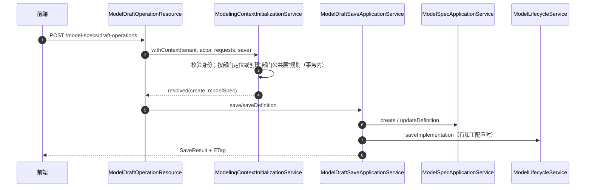
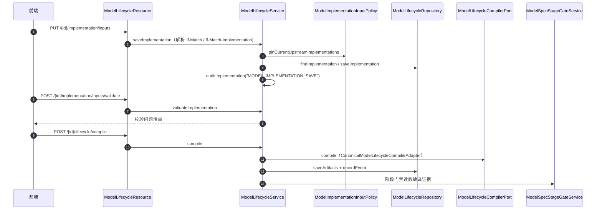
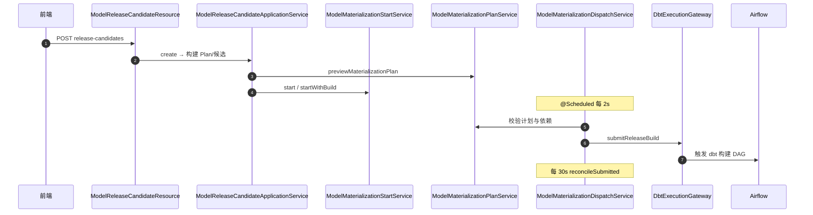

# 01 建模主链（dts-platform）接口级设计

- 源码基线：`72acb2d4d56667ed50bde899889b0e11ca327082`（2026-09-14）
- 全量接口清单：[assets/rest-inventory-dts-platform.md](assets/rest-inventory-dts-platform.md)（脚本生成，需人工核对）
- 路径前缀 `P/` = `source/dts-platform/src/main/java/com/yuzhi/dts/platform/`
- 类别：`[源码]` 代码事实、`[配置]` 配置声明、`[待确认]` 未证实。
- 接口实现与分派关系汇总：[assets/call-graph-and-dispatch.md](assets/call-graph-and-dispatch.md)

主链：数仓规划 → 模型定义（ModelSpec v2）→ 加工配置（ModelImplementation）→ 交付检查（StageGate）→ 发布单（ReleaseCandidate）→ 构建计划（MaterializationPlan）→ 分发（Dispatch）→ serving 投影 → 语义同步 → 查询数据集（QueryDataset）→ 契约读取。

## 1 REST 接口清单（主链）

| 方法 | 路径 | 控制器#方法 | 进入服务 | 定位 |
|---|---|---|---|---|
| GET | `/api/modeling/model-specs/creation-context` | ModelSpecResource#creationContext | `ModelingContextInitializationService.context` | `P/web/rest/ModelSpecResource.java:113` |
| POST | `/api/modeling/model-specs` | ModelSpecResource#create | `contexts.withContext` → `ModelSpecApplicationService.create` | `P/web/rest/ModelSpecResource.java:82` |
| POST | `/api/modeling/model-specs/draft-operations` | ModelDraftOperationResource#save | `withContext` → `ModelDraftSaveApplicationService.save/saveDefinition` | `P/web/rest/ModelDraftOperationResource.java:57` |
| PUT | `/api/modeling/model-specs/{id}/definition` | ModelSpecResource#updateDefinition | `ModelSpecApplicationService.updateDefinition` | `P/web/rest/ModelSpecResource.java:157` |
| PUT | `/api/modeling/model-specs/{id}` | ModelSpecResource#update | `ModelSpecApplicationService.update` | `P/web/rest/ModelSpecResource.java:235` |
| PUT | `/api/modeling/model-specs/{id}/implementation/inputs` | ModelLifecycleResource#saveImplementation | `ModelLifecycleService.saveImplementation` | `P/web/rest/ModelLifecycleResource.java:127` |
| POST | `/api/modeling/model-specs/{id}/implementation/inputs/validate` | ModelLifecycleResource#validateImplementation | `ModelLifecycleService.validateImplementation` | `P/web/rest/ModelLifecycleResource.java:144` |
| POST | `/api/modeling/model-specs/{id}/lifecycle/compile` | ModelLifecycleResource#compile | `ModelLifecycleService.compile` | `P/web/rest/ModelLifecycleResource.java:171` |
| POST | `/api/modeling/model-specs/{id}/lifecycle/tests` | ModelLifecycleResource#test | `ModelLifecycleService.recordTest` | `P/web/rest/ModelLifecycleResource.java:182` |
| GET | `/api/modeling/model-specs/{id}/stage-gates` | ModelSpecResource#stageGates | `ModelSpecStageGateService` | `P/web/rest/ModelSpecResource.java:170` |
| POST | `/api/modeling/model-specs/upstream-fields` | ModelInputInspectionResource#fields | `ModelSourceFieldsService` | `P/web/rest/ModelInputInspectionResource.java:40` |
| POST | `/api/modeling/plans/{planId}/materialization-plans/preview` | ModelMaterializationPlanResource#preview | `ModelReleaseCandidateApplicationService.previewMaterializationPlan` | `P/web/rest/ModelMaterializationPlanResource.java:45` |
| POST | `/api/modeling/plans/{planId}/release-candidates` | ModelReleaseCandidateResource#create | `ModelReleaseCandidateApplicationService.create` → `ModelMaterializationStartService.start/startWithBuild` | `P/web/rest/ModelReleaseCandidateResource.java:166` |
| POST | `/api/modeling/plans/{planId}/release-candidates/{id}/rematerialize` | ModelReleaseCandidateResource#rematerialize | `ModelReleaseCandidateApplicationService.rematerialize` | `P/web/rest/ModelReleaseCandidateResource.java:368` |
| POST | `/api/modeling/plans/{planId}/release-candidates/{id}/publish` | ModelReleaseCandidateResource#publish | `ModelReleaseCandidateApplicationService.publish` → `CandidatePublicationCoordinator.publish` | `P/web/rest/ModelReleaseCandidateResource.java:549` |
| POST | `/api/modeling/plans/{planId}/release-candidates/{id}/publication/retry` | ModelReleaseCandidateResource#retryPublication | `ModelReleaseCandidateApplicationService.retryPublication` | `P/web/rest/ModelReleaseCandidateResource.java:571` |
| GET | `/api/modeling/plans/{planId}/release-candidates/workspace` | ModelReleaseCandidateResource#workspace | `ModelReleaseCandidateApplicationService.workspace` | `P/web/rest/ModelReleaseCandidateResource.java:74` |
| POST | `/api/modeling/plans/{planId}/release-candidates/{id}/governance-quality/runs` | ModelReleaseCandidateResource#rerunGovernanceQuality | `CandidateGovernanceQualityRerunService` | `P/web/rest/ModelReleaseCandidateResource.java:462` |
| GET | `/api/internal/analysis-datasets/{datasetId}/versions/{version}` | AnalysisDatasetContractResource#runtimeContract | `PublishedQueryDatasetService.runtimeContract` | `P/web/rest/internal/AnalysisDatasetContractResource.java:30` |

> 规划/维度/标准/迁移等接口（`/api/modeling/data-marts`、`dimension-definitions`、`model-authoring-migrations` 等）见全量清单。

## 2 接口与实现关系

```mermaid
classDiagram
    class ModelSpecResource
    class ModelDraftOperationResource
    class ModelLifecycleResource
    class ModelReleaseCandidateResource
    class ModelMaterializationPlanResource
    class AnalysisDatasetContractResource
    class ModelSpecApplicationService
    class ModelDraftSaveApplicationService
    class ModelingContextInitializationService
    class ModelLifecycleService
    class ModelSpecStageGateService
    class ModelReleaseCandidateApplicationService
    class ModelMaterializationStartService
    class ModelMaterializationPlanService
    class ModelMaterializationDispatchService
    class ModelLifecyclePublicationService
    class CandidatePublicationCoordinator
    class CandidatePublicationCommitService
    class DbtExecutionGateway {
      <<interface>>
    }
    class CatalogModelServingService
    class CatalogModelSemanticSyncService
    class CatalogModelSemanticSyncWorker
    class AnalyticsSemanticPublishClient
    class ModelQueryDatasetProjectionService
    class PublishedQueryDatasetService

    ModelSpecResource --> ModelSpecApplicationService
    ModelSpecResource --> ModelingContextInitializationService
    ModelDraftOperationResource --> ModelingContextInitializationService
    ModelDraftOperationResource --> ModelDraftSaveApplicationService
    ModelLifecycleResource --> ModelLifecycleService
    ModelReleaseCandidateResource --> ModelReleaseCandidateApplicationService
    ModelMaterializationPlanResource --> ModelReleaseCandidateApplicationService
    AnalysisDatasetContractResource --> PublishedQueryDatasetService

    ModelDraftSaveApplicationService --> ModelSpecApplicationService
    ModelDraftSaveApplicationService --> ModelLifecycleService
    ModelReleaseCandidateApplicationService --> ModelMaterializationStartService
    ModelReleaseCandidateApplicationService --> ModelMaterializationPlanService
    ModelReleaseCandidateApplicationService --> CandidatePublicationCoordinator
    ModelMaterializationStartService --> ModelReleaseCandidateService
    ModelMaterializationDispatchService --> ModelMaterializationPlanService
    ModelMaterializationDispatchService --> DbtExecutionGateway
    CandidatePublicationCoordinator --> CandidatePublicationCommitService
    CandidatePublicationCommitService --> ModelLifecyclePublicationService
    CandidatePublicationCommitService --> CatalogModelServingService
    CatalogModelSemanticSyncWorker --> CatalogModelSemanticSyncService
    CatalogModelSemanticSyncService --> AnalyticsSemanticPublishClient
    CatalogModelSemanticSyncService --> ModelQueryDatasetProjectionService
```



端口/适配器（`interface` → 实现，全部单实现）：

| 接口 | 实现 | 定位 |
|---|---|---|
| `ModelSpecSourceValidationPort` | `ModelSpecSourceValidationAdapter` | `P/service/modeling/ModelSpecSourceValidationAdapter.java:29` |
| `CatalogSourceReferenceReadPort` | `JpaCatalogSourceReferenceReadAdapter` | `P/service/catalog/JpaCatalogSourceReferenceReadAdapter.java:26` |
| `SourceReferenceResolver` | `SourceReferenceResolverAdapter` | `P/service/modeling/warehouse/SourceReferenceResolverAdapter.java:25` |
| `ModelMaterializationPlanRelationPort` | `ModelMaterializationPlanRelationReadAdapter` | `P/repository/modeling/ModelMaterializationPlanRelationReadAdapter.java:17` |
| `DbtExecutionGateway` | `AirflowDbtExecutionGateway` | `P/service/etl/DbtExecutionGateway.java:14`、`P/service/etl/AirflowDbtExecutionGateway.java:14` |
| `PhysicalPreviewAccessPort` / `PolicyPort` / `QueryPort` | `DefaultPhysicalPreviewAccessAdapter` / `DefaultPhysicalPreviewPolicyAdapter` / `PostgresPhysicalPreviewQueryAdapter` | `P/service/modeling/serving/*.java` |
| `ModelGovernancePolicyPort` | `JdbcModelGovernancePolicyAdapter` | `P/service/modeling/JdbcModelGovernancePolicyAdapter.java:8` |

## 3 关键链路方法级时序

### 3.1 首次保存（草稿操作）



| 步骤 | 类#方法 | 定位 |
|---|---|---|
| 1 | ModelDraftOperationResource#save | `P/web/rest/ModelDraftOperationResource.java:57` |
| 2 | ModelingContextInitializationService#withContext（身份校验 `MODELING_ROLE_REQUIRED`） | `P/service/modeling/ModelingContextInitializationService.java:35,36` |
| 2a | 指定 `planId` 时校验部门一致与可写（`MODELING_CONTEXT_DEPARTMENT_MISMATCH`/`MODELING_CONTEXT_NOT_WRITABLE`） | `P/service/modeling/ModelingContextInitializationService.java:47-53,69,70` |
| 2b | 无 `planId` 时按部门创建"部门公共层"规划（幂等键 `modeling-context:dept:{department}:v1`） | `P/service/modeling/ModelingContextInitializationService.java:55-58,68`、`P/service/modeling/warehouse/WarehousePlanApplicationService.java:117` |
| 3 | ModelDraftSaveApplicationService#save / saveDefinition | `P/service/modeling/ModelDraftSaveApplicationService.java:40,86` |
| 4 | ModelSpecApplicationService#create / updateDefinition | `P/service/modeling/ModelSpecApplicationService.java:225,365` |
| 5 | ModelLifecycleService#saveImplementation | `P/service/modeling/ModelLifecycleService.java:211` |
| 6 | 冲突与旧版本：`MODEL_DRAFT_OPERATION_IMPLEMENTATION_FORBIDDEN`、`MODEL_SPEC_IDEMPOTENCY_KEY_RESERVED` | `P/web/rest/ModelDraftOperationResource.java:70,81` |

### 3.2 加工配置保存与编译



| 步骤 | 类#方法 | 定位 |
|---|---|---|
| 1 | ModelLifecycleResource#saveImplementation（双重 ETag 并发保护） | `P/web/rest/ModelLifecycleResource.java:127,171-179` |
| 2 | ModelLifecycleService#validateImplementation | `P/service/modeling/ModelLifecycleService.java:188` |
| 3 | ModelLifecycleService#saveImplementation → `pinCurrentUpstreamImplementations` | `P/service/modeling/ModelLifecycleService.java:211,233` |
| 4 | 仓库写入 `lifecycle.saveImplementation` + 审计 `MODEL_IMPLEMENTATION_SAVE` | `P/service/modeling/ModelLifecycleService.java:246,254` |
| 5 | 编译实现：`compiler.compile`（端口实现 `CanonicalModelLifecycleCompilerAdapter`） | `P/service/modeling/ModelLifecycleService.java:534`、`P/service/modeling/CanonicalModelLifecycleCompilerAdapter.java` |
| 6 | 编译产物与事件：`saveArtifacts` + `recordEvent` + 审计 | `P/service/modeling/ModelLifecycleService.java:535,538,551` |
| 7 | 交付检查读取编译证据 | `P/web/rest/ModelSpecResource.java:170`（StageGate） |

### 3.3 发布单 → 构建计划 → 分发 → 执行网关



| 步骤 | 类#方法 | 定位 |
|---|---|---|
| 1 | ModelReleaseCandidateResource#create | `P/web/rest/ModelReleaseCandidateResource.java:166` |
| 2 | ModelReleaseCandidateApplicationService#create | `P/service/modeling/ModelReleaseCandidateApplicationService.java:253,263` |
| 3 | ModelMaterializationPlanService#preview | `P/service/modeling/ModelMaterializationPlanService.java:59` |
| 4 | ModelMaterializationStartService#start / startWithBuild | `P/service/modeling/ModelMaterializationStartService.java:60,80` |
| 5 | ModelMaterializationDispatchService#dispatchQueued（@Scheduled）→ dispatchNext | `P/service/modeling/ModelMaterializationDispatchService.java:158,197` |
| 6 | 依赖制品与 DAG：`loadPinnedDependencyArtifacts`、`ensureReleaseBuildDag`、`submitReleaseBuild` | `.../ModelMaterializationDispatchService.java:251,287,289` |
| 7 | 网关对账：`reconcileSubmitted` → `gateway.reconcileReleaseBuild` | `.../ModelMaterializationDispatchService.java:168,180,218` |

### 3.4 发布提交 → serving 投影 → 语义同步 → 查询数据集 → 契约读取

```mermaid
sequenceDiagram
    autonumber
    participant FE as 前端
    participant R as ModelReleaseCandidateResource
    participant A as ModelReleaseCandidateApplicationService
    participant CO as CandidatePublicationCoordinator
    participant CM as CandidatePublicationCommitService
    participant LP as ModelLifecyclePublicationService
    participant SV as CatalogModelServingService
    participant W as CatalogModelSemanticSyncWorker
    participant SY as CatalogModelSemanticSyncService
    participant AN as AnalyticsSemanticPublishClient
    participant PR as ModelQueryDatasetProjectionService
    participant AR as AnalysisDatasetContractResource

    FE->>R: POST {id}/publish
    R->>A: publish
    A->>CO: publish
    CO->>CM: commit
    CM->>LP: publish（模型生命周期发布）
    CM->>SV: projectLatestPublication（发布候选投影）
    CM->>SV: promoteSuccessfulServing（物理就绪 serving）
    Note over W: @Scheduled 30s 或应用就绪
    W->>SY: synchronizeOnce
    SY->>AN: publish(payload)（HTTP + 服务凭据）
    SY->>PR: project(candidate, semantic)
    PR-->>SY: READY/ PUBLISHED 版本
    Note later
    AR->>AR: GET /api/internal/analysis-datasets/{id}/versions/{v}
```

| 步骤 | 类#方法 | 定位 |
|---|---|---|
| 1 | ModelReleaseCandidateResource#publish | `P/web/rest/ModelReleaseCandidateResource.java:549` |
| 2 | ModelReleaseCandidateApplicationService#publish | `P/service/modeling/ModelReleaseCandidateApplicationService.java:806` |
| 3 | CandidatePublicationCoordinator#publish → CandidatePublicationCommitService#commit | `P/service/modeling/CandidatePublicationCoordinator.java:28`、`P/service/modeling/CandidatePublicationCommitService.java:215` |
| 4 | 逐模型发布：`ModelLifecyclePublicationService.publish` | `P/service/modeling/ModelLifecyclePublicationService.java:36` |
| 5 | `CatalogModelServingService.projectLatestPublication` / `promoteSuccessfulServing` | `P/service/modeling/serving/CatalogModelServingService.java:91,110`；调用点 `CandidatePublicationCommitService.java:281,310` |
| 6 | 同步调度器 `CatalogModelSemanticSyncWorker.tick`（@Scheduled 30s） | `P/service/modeling/serving/CatalogModelSemanticSyncWorker.java:29` |
| 7 | `CatalogModelSemanticSyncService.synchronizeOnce` → `client.publish` → `datasetProjectionService.project` | `P/service/modeling/serving/CatalogModelSemanticSyncService.java:115,126,131` |
| 8 | 分析端发布客户端（校验开关/地址/令牌后 POST） | `P/service/modeling/serving/AnalyticsSemanticPublishClient.java:48` |
| 9 | 数据集投影：组装契约、发布 PUBLISHED 版本、归档旧版本 | `P/service/modeling/serving/ModelQueryDatasetProjectionService.java:64,93-130` |
| 10 | 契约读取端点：`GET /api/internal/analysis-datasets/{datasetId}/versions/{version}` | `P/web/rest/internal/AnalysisDatasetContractResource.java:30` → `P/service/sql/PublishedQueryDatasetService.java:88` |

### 3.5 发布单动作矩阵（端点 → 应用服务 → 关键下游）

| 动作 | 端点（`/api/modeling/plans/{planId}/release-candidates`） | 应用服务#方法 | 内部关键调用 | 定位 |
|---|---|---|---|---|
| 计划预览 | `POST .../materialization-plans/preview` | `previewMaterializationPlan` | `ModelMaterializationPlanService.preview` | Resource :45；App :236 |
| 预检 | `POST .../preflight` | `preflight` | `ModelReleaseCandidatePreflightService` | Resource :141；App :343 |
| 创建发布单 | `POST /release-candidates` | `create`（两个重载） | `materializationStarts.start` / `startWithBuild` | Resource :166；App :253,263 |
| 锁定 | `POST /{id}/lock` | `lock` | `materializationStarts.start`、`materializationStarts.retry`、`commands.transition` | Resource :223；App :374 |
| 重试 | `POST /{id}/retry` | `retry` | `materializationStarts.retry`、`commands.transition` | Resource :248；App :398 |
| 刷新漂移 | `POST /{id}/refresh` | `refreshDrift` | `commands.transition` | Resource :273；App :437 |
| 取消 | `POST /{id}/cancel` | `cancel` | `commands.transition` | Resource :298；App :459 |
| 替换范围 | `POST /{id}/replacement` | `createReplacement` | `commands.createReplacement(WithExpandedScope)` | Resource :323；App :508 |
| 重新构建 | `POST /{id}/rematerialize` | `rematerialize` | `materializationPlans.requireCurrent`、`repository.lockPlanForCandidate` | Resource :368；App :585 |
| 工程验证 | `POST /{id}/quality` | `runQuality` | `QualityWorkflowOrchestrator.startPinnedModelQuality` | Resource :413；Orchestrator :189,208 |
| 治理质量重跑 | `POST /{id}/governance-quality/runs` | `rerunGovernanceQuality` | `CandidateGovernanceQualityRerunService.rerun` → `GovernanceQualityRerunPort`（`GovernanceQualityRerunAdapter`）→ `startPinnedModelQuality` | Resource :462；Service :51 |
| 提交审核 | `POST /{id}/reviews` | `submitReview` | `commands.transition` | Resource :483；App :740 |
| 发布 | `POST /{id}/publish` | `publish` | `publicationAdmission.requireAllowed` → `publicationCoordinator.publish` | Resource :549；App :806 |
| 发布重试 | `POST /{id}/publication/retry` | `retryPublication` | `commands.transition` | Resource :571；App :915 |

> `commands` = `ModelReleaseCandidateService`；`materializationStarts` = `ModelMaterializationStartService`；`repository` = `ModelReleaseCandidateRepository`。动作矩阵来自方法体内的调用提取（见证据表），更细的分支条件以方法源码为准。

## 4 事务、幂等与错误语义

- 事务边界：`ModelSpecApplicationService` 与 `ModelLifecycleService` 的写方法均为 `@Transactional`（`ModelSpecApplicationService.java:224,352,364,1220,1284`）；`ModelDraftSaveApplicationService` 在一个事务内同时落模型与首个加工配置（类注释 `P/service/modeling/ModelDraftSaveApplicationService.java:21`）。
- 上下文初始化：`withContext` 先校验建模身份，再按部门定位/创建"部门公共层"规划，并把 `planId` 注入保存请求（`P/service/modeling/ModelingContextInitializationService.java:35-66`）；`creation-context` 只读返回 `(planId, departmentCode, writable)`（:71）。规划处于 `PUBLISHED/ARCHIVED` 时模型写入被 `MODEL_SPEC_PLAN_READONLY` 拒绝（`P/service/modeling/ModelSpecApplicationService.java:1948-1953`），规划不存在为 `MODEL_SPEC_PLAN_INVALID`（:1942）。
- 幂等：模型创建带 `idempotencyKey`（服务端保留命名空间 `MODEL_SPEC_IDEMPOTENCY_KEY_RESERVED`）；生命周期命令使用 `IdempotencyRequest` + `ModelLifecycleCommandReceiptRepository` 回执；请求并发用 ETag（`model-spec:{id}:{rev}:{checksum}`、`model-implementation:{id}:{rev}:{checksum}`，`P/web/rest/ModelLifecycleResource.java:50-56`）。
- 错误码（节选）：`MODEL_SPEC_*`（校验/状态/引用）、`MODEL_RELEASE_CANDIDATE_*`、`MODEL_SPEC_GOVERNANCE_QUALITY_*`、`MODEL_SPEC_DELETE_*`。
- 异步/事件：`PlatformEventOutboxService.publishInternal` 由 serving 投影发事件（`P/service/modeling/serving/CatalogModelServingService.java:177`）；语义同步靠工作表租约 + 定时器自愈，**没有跨服务分布式事务**（`CatalogModelSemanticSyncService` 类注释 `:20`）。

## 5 边界与待确认

- 发布提交与 serving/语义同步之间是最终一致：`projectLatestPublication`、`promoteSuccessfulServing` 只写平台投影，分析侧由定时同步推进；远端发布成功而本地投影失败的补偿路径需要单独验证。`[待确认]`
- 构建执行真实产物依赖 Airflow/dbt 运行结果；本文只记录源码路径，不代表本次有实际构建。`[待确认]`
- `ModelMaterializationDispatchService` 的 reconciliation 与重试窗口以 30s 调度与网关对账为准（`...:164`）；超时后的终态策略未逐一核对。`[待确认]`

## 6 证据表

| 结论 | 依据 |
|---|---|
| 首次保存入口与上下文原子初始化 | `P/web/rest/ModelDraftOperationResource.java:57`、`P/service/modeling/ModelingContextInitializationService.java:35` |
| 模型写入口 | `P/web/rest/ModelSpecResource.java:82,157,235`、`P/service/modeling/ModelSpecApplicationService.java:225,365` |
| 生命周期保存/编译 | `P/web/rest/ModelLifecycleResource.java:127,171`、`P/service/modeling/ModelLifecycleService.java:211,497` |
| 发布单与构建计划 | `P/web/rest/ModelReleaseCandidateResource.java:166`、`P/service/modeling/ModelMaterializationPlanService.java:59` |
| 分发与执行网关 | `P/service/modeling/ModelMaterializationDispatchService.java:158,197,289`、`P/service/etl/DbtExecutionGateway.java:14` |
| 发布提交与 serving | `P/service/modeling/CandidatePublicationCommitService.java:281,310`、`P/service/modeling/serving/CatalogModelServingService.java:91,110` |
| 语义同步与数据集投影 | `P/service/modeling/serving/CatalogModelSemanticSyncWorker.java:29`、`.../CatalogModelSemanticSyncService.java:115`、`.../ModelQueryDatasetProjectionService.java:64` |
| 契约读取 | `P/web/rest/internal/AnalysisDatasetContractResource.java:30`、`P/service/sql/PublishedQueryDatasetService.java:88` |
