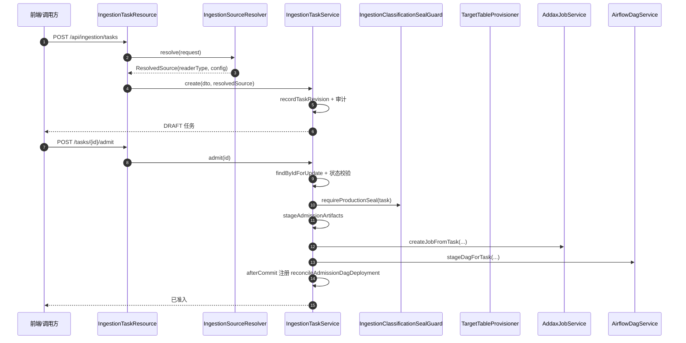
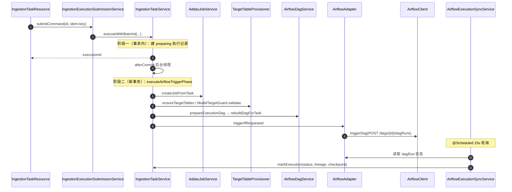

# 02 接入执行链（dts-ingestion）接口级设计

- 源码基线：`72acb2d4d56667ed50bde899889b0e11ca327082`（2026-09-14）
- 全量接口清单：[assets/rest-inventory-dts-ingestion.md](assets/rest-inventory-dts-ingestion.md)（脚本生成，需人工核对）
- 路径前缀 `I/` = `source/dts-ingestion/src/main/java/com/yuzhi/dts/ingestion/`
- 类别：`[源码]` 代码事实、`[配置]` 配置声明、`[待确认]` 未证实。
- 接口实现与分派关系汇总：[assets/call-graph-and-dispatch.md](assets/call-graph-and-dispatch.md)

## 1 范围与入口

任务定义（DB / API / 文件）→ 准入 admit（密级封存、DAG 暂存）→ 异步执行（两阶段）→ Addax 作业生成 → 目标表供给/结构校验 → Airflow DAG 构建与触发 → 运行状态轮询回写 → 血缘/目录同步 → 失败重试。

三个 REST 入口：`IngestionTaskResource`（任务与执行，`/api/ingestion`）、`IngestionPreCheckResource`（文件 staging，`/api/ingestion/tasks`）、`FileUploadResource`（`/api/ingestion/files`）；内部回写入口 `InternalApiIngestionResource`（`/internal/api-ingestion`，由 Airflow DAG 调用，`OP_ADMIN` 策略）。

## 2 REST 接口清单（主链）

| 方法 | 路径 | 控制器#方法 | 直接进入 | 定位 |
|---|---|---|---|---|
| POST | `/api/ingestion/tasks` | IngestionTaskResource#createTask | `IngestionSourceResolver.resolve` → `IngestionTaskService.create` | `I/web/rest/IngestionTaskResource.java:302` |
| POST | `/api/ingestion/tasks/{id}/admit` | admitTask | `IngestionTaskDesignService.requirePlanChecksum` → `IngestionTaskService.admit` | `I/web/rest/IngestionTaskResource.java:2455` |
| PUT | `/api/ingestion/tasks/{id}` | updateTask | `IngestionTaskService.update` | `I/web/rest/IngestionTaskResource.java:2500` |
| GET | `/api/ingestion/tasks/{id}/design` | getTaskDesign | `IngestionTaskDesignService.getDesign` | `I/web/rest/IngestionTaskResource.java:2284` |
| PUT | `/api/ingestion/tasks/{id}/design` | updateTaskDesign | `IngestionTaskDesignService.saveDesign` | `I/web/rest/IngestionTaskResource.java:2301` |
| POST | `/api/ingestion/tasks/{id}/design/validate` | validateTaskDesign | `IngestionTaskDesignService.validateDesign` | `I/web/rest/IngestionTaskResource.java:2354` |
| POST | `/api/ingestion/tasks/{id}/execute` | executeTask | `IngestionExecutionSubmissionService.submit`（有 Idempotency-Key）或 `IngestionTaskService.execute` | `I/web/rest/IngestionTaskResource.java:2875` |
| POST | `/api/ingestion/tasks/{id}/execute/async` | executeTaskAsync | `validateAsyncExecutionRequest` → `submitCommand` / `executeAsync` | `I/web/rest/IngestionTaskResource.java:2915` |
| POST | `/api/ingestion/tasks/{id}/executions/{executionId}/retry` | retryExecution | `IngestionTaskService.retryExecution` | `I/web/rest/IngestionTaskResource.java:3024` |
| GET | `/api/ingestion/tasks/{id}/executions` | getExecutions | `IngestionTaskService.getExecutions` | `I/web/rest/IngestionTaskResource.java:3185` |
| GET | `/api/ingestion/tasks/{id}/executions/{executionId}/logs` | getExecutionLog | `IngestionExecutionQueryService.fetchExecutionLog` | `I/web/rest/IngestionTaskResource.java:3401` |
| POST | `/api/ingestion/tasks/{id}/parse` | IngestionPreCheckResource#parse | `FileUploadService.readPlainBytes` → `ExcelParseService/CsvParseService.parse` → `StagingTableService.create/bulkInsert` | `I/web/rest/IngestionPreCheckResource.java:116` |
| POST | `/api/ingestion/tasks/{id}/pre-check` | preCheck | `PlatformInfraClient.preCheckStagingData` | `I/web/rest/IngestionPreCheckResource.java:183` |
| POST | `/api/ingestion/files/upload` | FileUploadResource#uploadFile | `FileUploadService.handleUpload` | `I/web/rest/FileUploadResource.java:40` |
| POST | `/internal/api-ingestion/executions` | InternalApiIngestionResource#startExecution | `IngestionTaskService.executeInternalApiForRevision` / `executeInternalApi` | `I/web/rest/InternalApiIngestionResource.java:39` |
| POST | `/internal/api-ingestion/scheduled-executions` | registerScheduledExecution | `IngestionTaskService.registerScheduledExecution` | `I/web/rest/InternalApiIngestionResource.java:79` |

> 其余约 50 个查询/治理/回滚/设置接口见全量清单；文件 staging 与执行不是强绑定（预检 PASS 不是执行放行条件，见 §6）。

## 3 接口与实现关系

```mermaid
classDiagram
    class IngestionTaskResource
    class IngestionPreCheckResource
    class FileUploadResource
    class InternalApiIngestionResource
    class IngestionTaskService
    class IngestionTaskDesignService
    class IngestionTaskQueryService
    class IngestionExecutionSubmissionService
    class IngestionExecutionCommandService
    class IngestionExecutionQueryService
    class IngestionSourceResolver
    class ConnectorCapabilityService
    class AddaxJobService
    class AirflowDagService
    class AirflowAdapter
    class AirflowClient
    class TargetTableProvisioner
    class ModelTargetGuard
    class IngestionClassificationSealGuard
    class OpenMetadataAdapter
    class OpenMetadataClient
    class SourceConnector

    IngestionTaskResource --> IngestionTaskService
    IngestionTaskResource --> IngestionTaskDesignService
    IngestionTaskResource --> IngestionTaskQueryService
    IngestionTaskResource --> IngestionExecutionSubmissionService
    IngestionTaskResource --> IngestionExecutionCommandService
    IngestionTaskResource --> IngestionExecutionQueryService
    IngestionTaskResource --> ConnectorCapabilityService
    IngestionPreCheckResource --> FileUploadService
    IngestionPreCheckResource --> StagingTableService
    FileUploadResource --> FileUploadService
    InternalApiIngestionResource --> IngestionTaskService

    IngestionTaskService --> IngestionSourceResolver
    IngestionTaskService --> AddaxJobService
    IngestionTaskService --> AirflowAdapter
    IngestionTaskService --> TargetTableProvisioner
    IngestionTaskService --> IngestionClassificationSealGuard
    IngestionTaskService --> SourceConnectorRegistry

    AddaxJobService --> ModelTargetGuard
    TargetTableProvisioner --> ModelTargetGuard
    AirflowAdapter --> AirflowClient
    AirflowDagService --> AirflowClient

    SourceConnector <|.. ApiHttpSourceConnector
    SourceConnectorRegistry o-- SourceConnector : List~SourceConnector~
    OpenMetadataAdapter --> OpenMetadataClient
```

- reader/writer **不是 Java 接口**，而是 Addax 插件类型字符串 + Map 配置：数据源到 reader 的映射在 `I/service/etl/IngestionSourceResolver.java:17`（`JDBC_TYPE_READERS`），writer 默认 `postgresqlwriter` 在 `I/service/etl/AddaxJobService.java:1411`。
- 唯一真实的 connector 抽象是 `SourceConnector`（`I/service/etl/connector/SourceConnector.java:3`），当前仅一个实现 `ApiHttpSourceConnector`（`I/service/etl/api/ApiHttpSourceConnector.java:15`），由 `SourceConnectorRegistry` 收集（`I/service/etl/connector/SourceConnectorRegistry.java:8`），消费点 `I/service/IngestionTaskService.java:1417`。
- `OpenMetadataAdapter`、`OpenMetadataClient`、`AirflowClient`、`AirflowAdapter`、`TargetTableProvisioner` 均为**类而非接口**（可注入点而非多实现），文档中不应画成 interface→impl。

## 4 关键链路方法级时序

### 4.1 创建与准入（admit）

| 步骤 | 类#方法 | 定位 |
|---|---|---|
| 1 | IngestionTaskResource#createTask（`isDraft=true` 硬编码） | `I/web/rest/IngestionTaskResource.java:302,319` |
| 2 | IngestionSourceResolver#resolve | `I/service/etl/IngestionSourceResolver.java:68` |
| 3 | IngestionTaskService#create | `I/service/IngestionTaskService.java:241` |
| 4 | IngestionTaskService#recordTaskRevision | `I/service/IngestionTaskService.java:4648` |
| 5 | IngestionTaskService#admit | `I/service/IngestionTaskService.java:300` |
| 6 | IngestionClassificationSealGuard#requireProductionSeal | `I/service/IngestionClassificationSealGuard.java:19` |
| 7 | IngestionTaskService#stageAdmissionArtifacts | `I/service/IngestionTaskService.java:3554` |
| 8 | AddaxJobService#createJobFromTask | `I/service/etl/AddaxJobService.java:1392` |
| 9 | AirflowDagService#stageDagForTask | `I/service/etl/AirflowDagService.java:99` |
| 10 | IngestionTaskService#reconcileAdmissionDagDeployment | `I/service/IngestionTaskService.java:3646` |

### 4.2 异步执行（两阶段）

| 步骤 | 类#方法 | 定位 |
|---|---|---|
| 1 | IngestionTaskResource#executeTaskAsync / executeTask | `I/web/rest/IngestionTaskResource.java:2915,2875` |
| 2 | IngestionExecutionSubmissionService#submitCommandInternal（batchId=`idem-task-{taskId}-{sha256}`） | `I/service/IngestionExecutionSubmissionService.java:46,80` |
| 3 | IngestionTaskService#execute（阶段一，@Transactional） | `I/service/IngestionTaskService.java:894` |
| 4 | IngestionTaskService#executeAirflowTriggerPhase（阶段二，afterCommit） | `I/service/IngestionTaskService.java:1004` |
| 5 | IngestionTaskService#doExecuteAirflowTriggerPhase | `I/service/IngestionTaskService.java:1148` |
| 6 | AddaxJobService#createJobFromTask → resolveJobConfig → writeSealedJob | `I/service/etl/AddaxJobService.java:1392,307,169` |
| 7 | TargetTableProvisioner#ensureTargetTables（模型绑定走 ModelTargetGuard#validate） | `I/service/etl/TargetTableProvisioner.java:70,147` |
| 8 | AirflowDagService#rebuildDagForTask（DAG id `ingestion_revision_{rev}_execution_{id}`） | `I/service/IngestionTaskService.java:2109` |
| 9 | AirflowAdapter#triggerIfRequested → AirflowClient#triggerDag | `I/service/etl/AirflowAdapter.java:43`、`I/service/etl/AirflowClient.java:82` |
| 10 | 状态 running + executionId=dagRunId | `I/service/IngestionTaskService.java:1284` |
| 11 | AirflowExecutionSyncService#syncRunningExecutions（@Scheduled 15s）→ markExecution | `I/service/etl/AirflowExecutionSyncService.java:192,282` |
| 12 | 失败分类与自动重试 | `I/service/IngestionTaskService.java:1320`、`I/service/etl/IngestionRetryService.java:56` |

### 4.3 文件接入分支

| 关注点 | 行为 | 定位 |
|---|---|---|
| 上传加密 | `fileId=UUID`，写 `{fileId}_{原名}.enc`，sha256(plain) 作为校验 | `I/service/etl/FileUploadService.java:325,399,501` |
| 准入校验 | seal 的 `fileId/fileSubjectKey/fileChecksum` 必须匹配，`verifyManagedUpload` 解密比对 | `I/service/IngestionTaskService.java:1887`、`I/service/etl/FileUploadService.java:220` |
| reader 类型 | `excelreader` / `txtfilereader`（文件类型推断） | `I/service/etl/AddaxJobService.java:1421` |
| 目标表策略 | 仅单目标表、必须 full_refresh；`create_new`/`recreate_existing` | `I/service/etl/TargetTableProvisioner.java:97,502` |
| 技术列 | `_dts_source_file/_dts_source_sheet/_dts_file_hash/_dts_row_number` | `I/service/etl/DtsOdsTechnicalColumns.java:12` |
| staging 预检 | parse/pre-check 只作用于 staging，非执行必经 | `I/web/rest/IngestionPreCheckResource.java:116,183` |

### 4.4 执行管理动作矩阵（端点 → 服务）

| 动作 | 端点 | 服务#方法 | 定位 |
|---|---|---|---|
| 读取设计 | `GET /api/ingestion/tasks/{id}/design` | `IngestionTaskDesignService.getDesign` | Resource :2284；Design :58 |
| 保存设计 | `PUT /api/ingestion/tasks/{id}/design` | `IngestionTaskDesignService.saveDesign` | Resource :2301；Design :64 |
| 校验设计 | `POST /api/ingestion/tasks/{id}/design/validate` | `IngestionTaskDesignService.validateDesign` | Resource :2354；Design :104 |
| 拓扑投影 | `GET /api/ingestion/tasks/{id}/topology` | `IngestionTaskDesignService.getTopology` | Resource :2370；Design :123 |
| 启用/暂停调度 | `POST .../schedule/enable`、`.../schedule/pause` | `IngestionTaskDesignService.setSchedulePaused` | Resource :2388,2396；Design :143 |
| 重建 DAG | `POST /api/ingestion/tasks/{id}/dag/rebuild` | `IngestionTaskService.rebuildDag` | Resource :3120；Service :3406 |
| 批量重建 API DAG | `POST /api/ingestion/tasks/dags/rebuild-api` | `IngestionTaskService.rebuildApiDags` | Resource :3157；Service :3425 |
| 回填 | `POST /api/ingestion/tasks/{id}/backfill` | `IngestionTaskService.backfill` | Resource :2978；Service :731 |
| 取消执行 | `POST .../executions/{executionId}/cancel` | `IngestionExecutionCommandService.cancel` | Resource :2417；Command :38 |
| 异步重试 | `POST .../executions/{executionId}/retry/async` | `IngestionTaskService.retryExecutionAsync` | Resource :3060；Service :1761 |
| 执行日志 | `GET .../executions/{executionId}/logs` | `IngestionExecutionQueryService.fetchExecutionLog` | Resource :3401；Query :148 |
| 执行追踪 | `GET /tasks/executions/trace` | `IngestionExecutionQueryService.traceExecution` | Resource :3236；Query :51 |
| 运行可观测 | `GET /tasks/executions/observability` | `IngestionTaskQueryService.getExecutionObservability` | Resource :3202；Query :271 |
| 增量状态/审计 | `GET .../incremental-states`、`.../incremental-audits` | `IngestionTaskQueryService` | Resource :3323,3338 |
| 最新执行 | `GET .../executions/latest` | `IngestionTaskService.getLatestExecution` | Resource :3255；Service :3272 |

## 5 事务、幂等与错误码

- 事务：`IngestionTaskService` 类级 `@Transactional`（`I/service/IngestionTaskService.java:94`）；执行拆两阶段，阶段一事务内建 `preparing`，阶段二在 `afterCommit` 新事务（`:997-1025`）；异步方法走 `ingestionTaskExecutor`（`I/config/AsyncExecutionConfig.java:11`）。
- 幂等：`Idempotency-Key` → `idem-task-{taskId}-{sha256}`（`I/service/IngestionExecutionSubmissionService.java:80`）；唯一索引与冲突码 `IDEMPOTENCY_KEY_CONFLICT/INVALID`；重试以 `parent_execution_id` 唯一去重；定时注册先查后插 + 唯一约束回读。
- 错误码（节选）：`MODEL_INGESTION_*`（`I/service/etl/ModelTargetGuard.java:31-76`、`I/service/etl/AddaxJobService.java:318,361`）、`CLASSIFICATION_SEAL_*`（`I/service/IngestionClassificationSealGuard.java:21-51`）、`MANAGED_FILE_*`/`FILE_CHECKSUM_*`（`I/service/IngestionTaskService.java:1894-1909`、`I/service/etl/FileUploadService.java:226-265`）、`TASK_EXECUTION_NOT_CANCELLABLE`（`I/service/IngestionExecutionCommandService.java:51`）、`AIRFLOW_DAG_NOT_READY_TIMEOUT`（`I/service/etl/AirflowAdapter.java:151`）。
- 开关：Airflow 全局/任务级（`I/config/AirflowProperties.java:8`、`I/service/IngestionTaskService.java:3543`）、自动重试（`I/config/IngestionProperties.java:60`）、OpenMetadata `enabled/ingestionEnabled`（`I/config/OpenMetadataProperties.java:8,21`）。

## 6 证据、边界与待确认

- 目录/血缘的实际生效链路是**平台回写**：`PlatformInfraClient.syncIngestionExecutionLineage`（`I/service/infra/PlatformInfraClient.java:303`），OpenMetadataAdapter 仅在 `createTask` 的 draft 分支之后调用（`I/web/rest/IngestionTaskResource.java:664,680`），而该分支因 `isDraft` 硬编码 `true` 当前不可达（`:319,482`）。`[待确认]` 该分支是否为预留/废弃。
- Airflow 关闭时 `else` 分支只把执行置 `manual-* + running`，没有实际提交动作（`:1288-1292`）。`[待确认]` 人工执行流程。
- 分类封存在 seal 为空且无字段分类时直接放行（`I/service/IngestionClassificationSealGuard.java:23-31`）。`[待确认]` 是否符合"生产写入必须封存"。
- 文件预检 PASS 不是执行放行条件；`recreate_existing` 的确认在运行期校验（`I/service/etl/TargetTableProvisioner.java:523`）。`[待确认]` 是否为设计意图。
- 本文只核对源码（HEAD `72acb2d4d`），未执行构建、容器或页面验收；唯一索引的实际生效以部署库为准。

## 7 证据表

| 结论 | 依据 |
|---|---|
| 任务创建/准入/执行/重试端点 | `I/web/rest/IngestionTaskResource.java:302,2455,2875,2915,3024` |
| 两阶段执行 | `I/service/IngestionTaskService.java:894,1004,1148` |
| Addax 作业与密封 | `I/service/etl/AddaxJobService.java:1392,307,169` |
| 目标表供给与模型守卫 | `I/service/etl/TargetTableProvisioner.java:70,147`、`I/service/etl/ModelTargetGuard.java:28` |
| DAG 构建与触发 | `I/service/etl/AirflowDagService.java:99,330`、`I/service/etl/AirflowAdapter.java:43`、`I/service/etl/AirflowClient.java:82` |
| 轮询回写与重试 | `I/service/etl/AirflowExecutionSyncService.java:192,282`、`I/service/etl/IngestionRetryService.java:56` |
| SourceConnector 抽象 | `I/service/etl/connector/SourceConnector.java:3`、`I/service/etl/api/ApiHttpSourceConnector.java:15`、`I/service/etl/connector/SourceConnectorRegistry.java:8` |
| 平台血缘回写 | `I/service/infra/PlatformInfraClient.java:303,396` |
