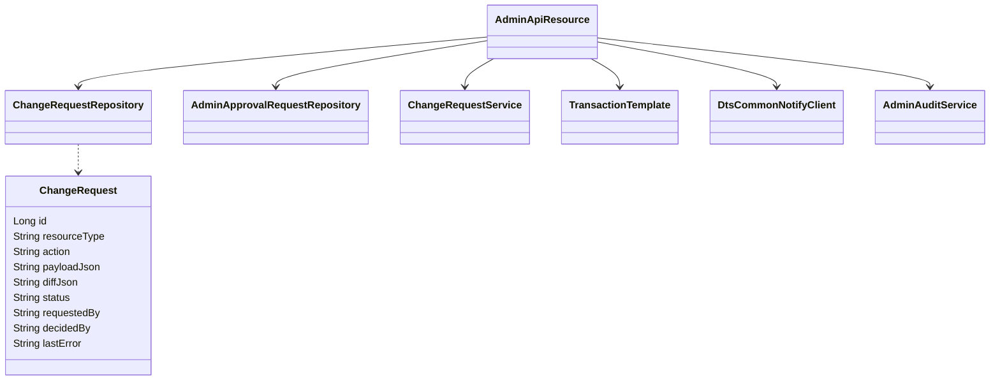
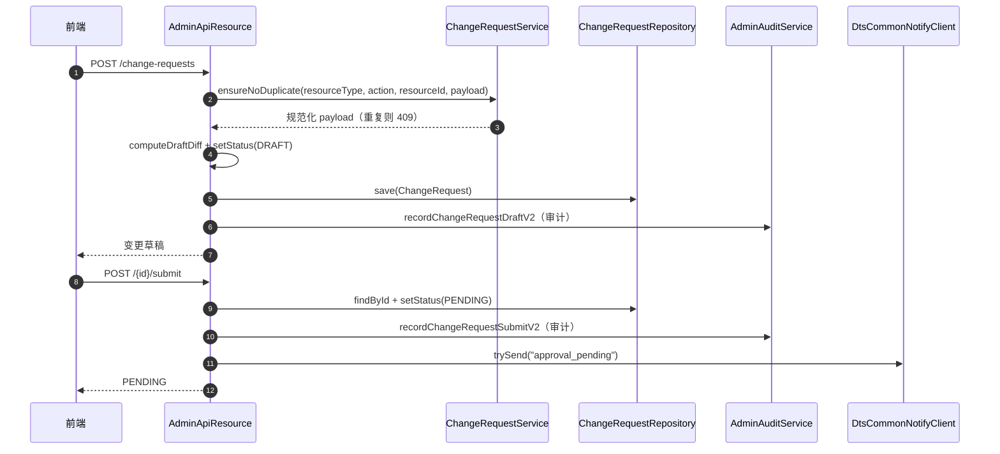
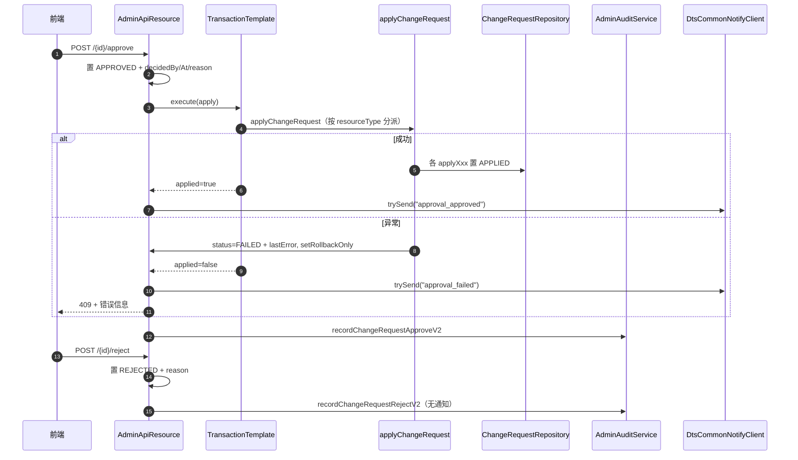

# 03 管理审批链（dts-admin）接口级设计

- 源码基线：`72acb2d4d56667ed50bde899889b0e11ca327082`（2026-09-14）
- 全量接口清单：[assets/rest-inventory-dts-admin.md](assets/rest-inventory-dts-admin.md)（脚本生成，需人工核对）
- 路径前缀 `A/` = `source/dts-admin/src/main/java/com/yuzhi/dts/admin/`
- 类别：`[源码]` 代码事实、`[配置]` 配置声明、`[待确认]` 未证实。
- 接口实现与分派关系汇总：[assets/call-graph-and-dispatch.md](assets/call-graph-and-dispatch.md)

主链：三员角色校验 → 变更单草稿（含差异计算/重复检查）→ 提交 PENDING → 通知审批人 → 同意（事务内执行，成功 APPLIED / 失败 FAILED）或拒绝 REJECTED → 审计 V2 留痕。

## 1 REST 接口清单（主链）

| 方法 | 路径 | 控制器#方法 | 定位 |
|---|---|---|---|
| GET | `/api/admin/change-requests` | AdminApiResource#listChangeRequests | `A/web/rest/AdminApiResource.java:1909` |
| GET | `/api/admin/change-requests/mine` | AdminApiResource#myChangeRequests | `A/web/rest/AdminApiResource.java:1936` |
| GET | `/api/admin/change-requests/{id}` | AdminApiResource#getChangeRequest | `A/web/rest/AdminApiResource.java:1952` |
| POST | `/api/admin/change-requests` | AdminApiResource#createChangeRequest | `A/web/rest/AdminApiResource.java:2000` |
| POST | `/api/admin/change-requests/{id}/submit` | AdminApiResource#submitChangeRequest | `A/web/rest/AdminApiResource.java:2074` |
| POST | `/api/admin/change-requests/{id}/approve` | AdminApiResource#approveChangeRequest | `A/web/rest/AdminApiResource.java:2138` |
| POST | `/api/admin/change-requests/{id}/reject` | AdminApiResource#rejectChangeRequest | `A/web/rest/AdminApiResource.java:2208` |
| POST | `/api/admin/maintenance/purge-requests` | AdminApiResource#purgeChangeRequests | `A/web/rest/AdminApiResource.java:1982` |

无独立 controller/service 分层：以上全部在 `AdminApiResource`（约 6800 行）内实现；依赖从构造注入的仓库、`ChangeRequestService`、`TransactionTemplate`、`DtsCommonNotifyClient`、`AdminAuditService` 等（字段清单 `A/web/rest/AdminApiResource.java:235-255`）。

## 2 安全与权限

- `/api/admin/**` 统一放行三员集合：`SYS_ADMIN`、`AUTH_ADMIN`、`AUDITOR_ADMIN`（含 `ROLE_AUDITOR_ADMIN`、`ROLE_AUDIT_ADMIN`、`ROLE_AUDITADMIN` 兼容别名），配置在 `A/config/SecurityConfiguration.java:81-93`。这是**入口级角色集合**，没有按资源/动作逐项鉴权。
- 全模块没有 `@PreAuthorize` 级别的细分（`grep` 未发现 change-request 专用表达式）；是否允许自审、越权审批完全由入口角色决定。`[源码]`
- 关键配置：`.requestMatchers("/api/admin/platform/**").permitAll()`、`/api/menu/**` 放行用于平台侧初始化（`A/config/SecurityConfiguration.java:65-71`）。

## 3 关键链路方法级时序

### 3.1 创建与提交

| 步骤 | 类#方法 | 定位 |
|---|---|---|
| 1 | AdminApiResource#createChangeRequest | `A/web/rest/AdminApiResource.java:2000` |
| 2 | ChangeRequestService#ensureNoDuplicate | `A/service/ChangeRequestService.java:86` |
| 3 | 内置角色保护与差异计算 | `A/web/rest/AdminApiResource.java:2034,2046` |
| 4 | 草稿审计 recordChangeRequestDraftV2 | `A/web/rest/AdminApiResource.java:5441` |
| 5 | AdminApiResource#submitChangeRequest（置 PENDING） | `A/web/rest/AdminApiResource.java:2074` |
| 6 | 审批通知 `notifyClient.trySend("approval_pending")` | `A/web/rest/AdminApiResource.java:2121` |
| 7 | 变更单实体状态字段 | `A/domain/ChangeRequest.java:34` |

### 3.2 同意并执行 / 拒绝

| 步骤 | 类#方法 | 定位 |
|---|---|---|
| 1 | AdminApiResource#approveChangeRequest（无前态检查，直接置 APPROVED） | `A/web/rest/AdminApiResource.java:2138` |
| 2 | `changeApplyTx.execute`（事务边界） | `A/web/rest/AdminApiResource.java:2148` |
| 3 | AdminApiResource#applyChangeRequest（资源类型 if/else 分派） | `A/web/rest/AdminApiResource.java:3381` |
| 4 | 各资源成功置 APPLIED | `A/web/rest/AdminApiResource.java:6470,6482,6516,6538,6572,6732,6818` |
| 5 | 失败置 FAILED + lastError、`setRollbackOnly` | `A/web/rest/AdminApiResource.java:2152-2162` |
| 6 | 同意审计 recordChangeRequestApproveV2 / 拒绝 recordChangeRequestRejectV2 | `A/web/rest/AdminApiResource.java:2181,2224` |
| 7 | 审批通知 | `A/web/rest/AdminApiResource.java:2193,2200` |
| 8 | 分派实现：PORTAL_MENU/CONFIG/ORG/ROLE/CUSTOM_ROLE/ROLE_ASSIGNMENT | `A/web/rest/AdminApiResource.java:3384-3394` |

### 3.3 列表、详情、清理与审计落库

| 步骤 | 类#方法 | 定位 |
|---|---|---|
| 列表查询 | AdminApiResource#listChangeRequests（审计 `recordChangeRequestListV2`） | `A/web/rest/AdminApiResource.java:1909,5321` |
| 我的申请 | AdminApiResource#myChangeRequests | `A/web/rest/AdminApiResource.java:1936` |
| 详情查询 | AdminApiResource#getChangeRequest（审计 `recordChangeRequestViewV2`） | `A/web/rest/AdminApiResource.java:1952,5344` |
| 历史清理 | AdminApiResource#purgeChangeRequests（审计 `recordChangeRequestPurgeV2`） | `A/web/rest/AdminApiResource.java:1982,5397` |
| 审计落库（草稿/提交/同意/拒绝） | `recordChangeRequestDraftV2/SubmitV2/ApproveV2/RejectV2` → `AuditActionRequest.Builder` | `A/web/rest/AdminApiResource.java:5441,5510,5590,5665` |
| 审计入站 | `/api/audit-events` 由 `AuditIngestPreAuthenticationFilter` 先校验成对凭据 | `A/web/filter/AuditIngestPreAuthenticationFilter.java:37`、`A/config/SecurityConfiguration.java:75-79` |

## 4 接口/实现与分派形态

- **没有策略接口/多实现**：资源类型分派是 `applyChangeRequest` 内的 if/else（`A/web/rest/AdminApiResource.java:3381`），各 `applyXxxChange` 是私有方法；文档不应画成 strategy 模式。
- Spring Data 仓库：`ChangeRequestRepository`、`AdminApprovalRequestRepository`（接口，注入点 `A/web/rest/AdminApiResource.java:238,239`）。
- 审批请求实体：`A/domain/AdminApprovalRequest.java`；变更单实体：`A/domain/ChangeRequest.java:9`。
- 审计：审计事件通过 `AdminAuditService` + `AuditActionRequest.Builder`（V2）记录，按钮码 `ButtonCodes.CHANGE_REQUEST_*`（例子 `A/web/rest/AdminApiResource.java:5452`）。
- 通知：`DtsCommonNotifyClient.trySend`（`A/service/notify/DtsCommonNotifyClient.java:16`），失败被吞掉，不影响主流程（`A/web/rest/AdminApiResource.java:2130,2227`）。

## 5 事务、并发与状态语义

- 事务：创建/提交/拒绝在 controller 方法内直接 `crRepo.save`，无显式 `@Transactional`；只有"同意并执行"通过 `TransactionTemplate`（`changeApplyTx`）包裹应用动作（`A/web/rest/AdminApiResource.java:2148`）。审计与通知在事务之外。
- 并发：`findById` 非加锁读取（`:2140,2212`）；**没有**前态校验（PENDING→ 才能 approve/reject）、**没有**禁止自审检查、**没有**乐观锁/版本字段（实体 `ChangeRequest` 无 `@Version`，`A/domain/ChangeRequest.java`）。重复同意会再次执行 apply 流程。`[源码]`
- 状态集合：`DRAFT/PENDING/APPROVED/REJECTED/APPLIED`（注释 `A/domain/ChangeRequest.java:34`），加执行失败 `FAILED`；`APPLIED` 只在各资源应用成功分支设置。
- 失败回滚：apply 抛异常时置 FAILED 并 `setRollbackOnly`，事务模板回滚数据库变更；外部系统副作用（Keycloak 等）不在同一事务内，无分布式回滚。`[源码]`

## 6 边界与待确认

- 入口角色集合不区分"谁可提交、谁可审批"：任何三员角色账号都能调用 approve/reject。职责分离（提交人不得自审）需产品/安全给出规则后实现。`[待确认]`
- 同意接口无 PENDING 前态检查，重复/非法状态的审批结果需要单独验证。`[待确认]`
- `AUDITOR_ADMIN` 同时被允许调用全部 `/api/admin/**`，是否与其只读审计职责冲突需按三员制度核对。`[待确认]`
- 通知失败静默（`catch (Exception ignored) {}`），审批待办可能丢失，是否需要补偿未定义。`[待确认]`
- 本文只核对源码（HEAD `72acb2d4d`），未执行运行验收。

## 7 证据表

| 结论 | 依据 |
|---|---|
| 变更单端点 | `A/web/rest/AdminApiResource.java:1909,1936,1952,2000,2074,2138,2208,1982` |
| 三员入口限制 | `A/config/SecurityConfiguration.java:81-93` |
| 重复检查 | `A/service/ChangeRequestService.java:86` |
| 同意事务与失败处理 | `A/web/rest/AdminApiResource.java:2148,2152-2162` |
| 资源类型分派（if/else） | `A/web/rest/AdminApiResource.java:3381-3394` |
| APPLIED 状态设置 | `A/web/rest/AdminApiResource.java:6470,6482,6516,6538,6572,6732,6818` |
| 审计 V2 | `A/web/rest/AdminApiResource.java:5441,5452` |
| 通知客户端 | `A/service/notify/DtsCommonNotifyClient.java:16`、`A/web/rest/AdminApiResource.java:2121,2193,2200` |
| 实体与状态 | `A/domain/ChangeRequest.java:9,34` |
