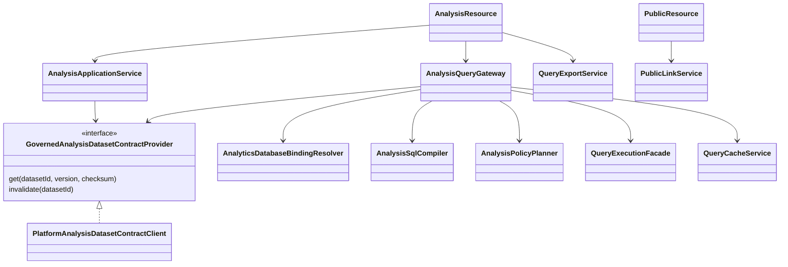
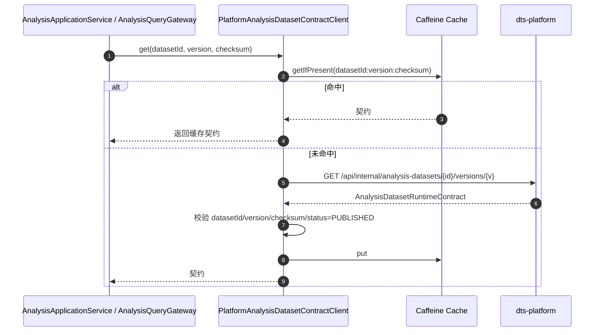
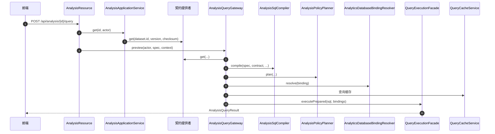
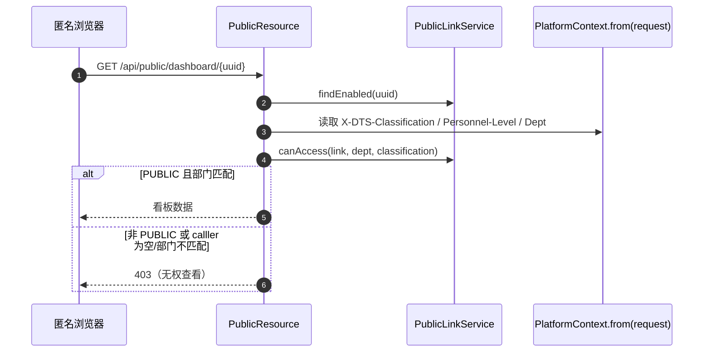

# 04 分析消费链（dts-analytics）接口级设计

- 源码基线：`72acb2d4d56667ed50bde899889b0e11ca327082`（2026-09-14）
- 全量接口清单：[assets/rest-inventory-dts-analytics.md](assets/rest-inventory-dts-analytics.md)（脚本生成，需人工核对）
- 路径前缀 `G/` = `source/dts-analytics/src/main/java/com/yuzhi/dts/analytics/`；平台侧路径前缀 `P/` 同 [01-modeling-mainline.md](01-modeling-mainline.md)
- 类别：`[源码]` 代码事实、`[配置]` 配置声明、`[待确认]` 未证实。

主链：平台发布契约读取（缓存 + 校验）→ 分析定义（Analysis）保存/发布 → 查询执行（编译 SQL → 绑定 → 执行）→ 结果返回/导出 → 公共分享读取（PublicLink 校验）。

## 1 REST 接口清单（主链）

| 方法 | 路径 | 控制器#方法 | 进入服务 | 定位 |
|---|---|---|---|---|
| GET | `/api/analysis` | AnalysisResource#list | `AnalysisApplicationService.list` | `G/web/rest/AnalysisResource.java:71` |
| POST | `/api/analysis` | AnalysisResource#create | `AnalysisApplicationService.create` | `G/web/rest/AnalysisResource.java:83` |
| GET | `/api/analysis/{id}` | AnalysisResource#get | `AnalysisApplicationService.get` | `G/web/rest/AnalysisResource.java:96` |
| PUT | `/api/analysis/{id}` | AnalysisResource#update | `AnalysisApplicationService.update` | `G/web/rest/AnalysisResource.java:102` |
| POST | `/api/analysis/{id}/publish` | AnalysisResource#publish | `AnalysisPublicationService` | `G/web/rest/AnalysisResource.java:145` |
| POST | `/api/analysis/preview` | AnalysisResource#preview | `AnalysisQueryGateway.preview` | `G/web/rest/AnalysisResource.java:178` |
| POST | `/api/analysis/{id}/query` | AnalysisResource#query | `AnalysisApplicationService.get` → `AnalysisQueryGateway.preview` | `G/web/rest/AnalysisResource.java:189` |
| POST | `/api/analysis/{id}/query/csv` | AnalysisResource#exportCsv | `QueryExportService` | `G/web/rest/AnalysisResource.java:197` |
| POST | `/api/analysis/{id}/query/xlsx` | AnalysisResource#exportXlsx | `QueryExportService` | `G/web/rest/AnalysisResource.java:206` |
| POST | `/api/analysis/queries/{queryId}/cancel` | AnalysisResource#cancelQuery | `AnalysisQueryGateway.cancelQuery` | `G/web/rest/AnalysisResource.java:281` |
| GET | `/api/public/dashboard/{uuid}` | PublicResource#dashboard | `PublicLinkService.canAccess` + dashboard 读取 | `G/web/rest/PublicResource.java:159` |
| POST | `/api/public/card/{uuid}/query` | PublicResource#cardQuery | 公共卡片查询 | `G/web/rest/PublicResource.java:130` |
| GET | `/api/public/screen/{uuid}` | PublicResource#screen | 公共大屏读取 | `G/web/rest/PublicResource.java:182` |

## 2 接口与实现关系

- 本链唯一的建模契约接口：`GovernedAnalysisDatasetContractProvider`（`G/service/analysis/GovernedAnalysisDatasetContractProvider.java:5`），唯一实现 `PlatformAnalysisDatasetContractClient`（`G/service/analysis/PlatformAnalysisDatasetContractClient.java:25`），同时被 `AnalysisApplicationService`、`AnalysisQueryGateway`、`AnalysisPublicationService` 注入使用。
- `AnalysisQueryGateway`、`QueryExecutionFacade`、`AnalysisSqlCompiler`、`QueryCacheService`、`PublicLinkService` 均为**类**（无接口/多实现），文档中不作为多态结构描述。
- 其余 analytics 接口以 Spring Data 仓库为主（48 个接口中大多数是 `*Repository`）。

## 3 关键链路方法级时序

### 3.1 平台契约读取（缓存 → HTTP → 校验）

| 步骤 | 类#方法 | 定位 |
|---|---|---|
| 1 | PlatformAnalysisDatasetContractClient#get | `G/service/analysis/PlatformAnalysisDatasetContractClient.java:53` |
| 2 | 缓存读取（Caffeine，最多 2000 条，写入后 5 分钟过期） | `G/service/analysis/PlatformAnalysisDatasetContractClient.java:33-36,58-59` |
| 3 | HTTP GET 路径 `/versions/{version}` | `G/service/analysis/PlatformAnalysisDatasetContractClient.java:113` |
| 4 | 发布状态校验 `PUBLISHED` | `G/service/analysis/PlatformAnalysisDatasetContractClient.java:76` |
| 5 | 缓存写入 / 显式失效 `invalidate(datasetId)` | `G/service/analysis/PlatformAnalysisDatasetContractClient.java:80,97` |
| 6 | 契约使用点：分析创建校验、查询前解析数据库绑定 | `G/service/analysis/AnalysisApplicationService.java:154`、`G/service/analysis/AnalysisQueryGateway.java:75` |

平台侧对应端点：`GET /api/internal/analysis-datasets/{datasetId}/versions/{version}`（`P/web/rest/internal/AnalysisDatasetContractResource.java:30`）。

### 3.2 查询执行（preview/query）

| 步骤 | 类#方法 | 定位 |
|---|---|---|
| 1 | AnalysisResource#query → `analysisService.get` | `G/web/rest/AnalysisResource.java:189-195`、`G/service/analysis/AnalysisApplicationService.java:96` |
| 2 | `contractProvider.get(...)`（分析定义保存时校验数据集引用） | `G/service/analysis/AnalysisApplicationService.java:154` |
| 3 | AnalysisQueryGateway#preview | `G/service/analysis/AnalysisQueryGateway.java:62` |
| 4 | 查询前再次读取契约 | `G/service/analysis/AnalysisQueryGateway.java:75` |
| 5 | AnalysisSqlCompiler#compile（编译结果含 SQL 与 bindings） | `G/service/analysis/AnalysisQueryGateway.java:75-95` |
| 6 | 策略计划 AnalysisPolicyPlanner | `G/service/analysis/AnalysisQueryGateway.java:32` |
| 7 | 数据库绑定 AnalyticsDatabaseBindingResolver | `G/service/analysis/AnalysisQueryGateway.java:30` |
| 8 | 执行 QueryExecutionFacade#executePrepared | `G/service/analysis/AnalysisQueryGateway.java:99,150` |
| 9 | 取消/预算/缓存 | `G/service/analysis/AnalysisQueryGateway.java:230,35` |

### 3.3 公共分享匿名读取（会拒绝的校验点）

| 步骤 | 类#方法 | 定位 |
|---|---|---|
| 1 | PublicResource#dashboard | `G/web/rest/PublicResource.java:159` |
| 2 | `PublicLinkService.canAccess(link, dept, classification)` | `G/service/PublicLinkService.java:114,118` |
| 3 | 部门域校验 `scopeMatches` | `G/service/PublicLinkService.java:147,221` |
| 4 | 密级校验 `classificationAllows`（PUBLIC 直接放行，否则 caller 密级必须 ≥ 资产） | `G/service/PublicLinkService.java:148,231` |
| 5 | 公共卡片查询与公共大屏同理 | `G/web/rest/PublicResource.java:130,182` |

> 匿名请求没有 `X-DTS-*` 请求头时 caller 为空，非 PUBLIC 链接必然 403；该行为已作为产品待决策项记录在 S10DC-87。

## 4 事务、缓存与安全语义

- 缓存：Caffeine `maximumSize(2000)`、`expireAfterWrite(5min)`（`G/service/analysis/PlatformAnalysisDatasetContractClient.java:33-36`）；显式失效 `invalidate(datasetId)`（:97）。
- 契约校验：客户端核对 datasetId、version、checksum 与 `PUBLISHED` 状态（:76）；不匹配拒绝当前引用。
- 查询执行：`AnalysisQueryGateway` 内存维护 `activeQueries`（`ConcurrentHashMap`）支持取消（`:38,230`）；查询预算 `AnalysisQueryBudget`（`:35`）；查询缓存 `QueryCacheService`（`:34`）。
- 安全：分析查询走 actor + 策略计划 `AnalysisPolicyPlanner`；公共分享走部门 + 密级双重校验（`G/service/PublicLinkService.java:147-148`），**先密级/部门校验、后口令与 IP 白名单**的现状见 S10DC-87 分析。
- 导出：CSV/XLSX 走 `QueryExportService`（`G/web/rest/AnalysisResource.java:197,206`），导出前同样经过 queryGateway 路径。`[源码]`

## 5 边界与待确认

- `PlatformAnalysisDatasetContractClient` 的缓存 TTL 为 5 分钟，平台撤销发布后分析侧最长 5 分钟仍可命中旧契约；撤销链路是否有主动 `invalidate` 调用需另行核对。`[待确认]`
- 公共分享的匿名访问策略（允许匿名/要求登录/仅公开级）待产品决策，当前非 PUBLIC 链接必然 403。`[待确认]`
- `AnalysisQueryGateway` 与 `QueryExecutionFacade` 为具体类，无接口替换点；测试如何替换执行器未核对。`[待确认]`
- 本文只核对源码（HEAD `72acb2d4d`），未执行查询性能、缓存有效期与权限撤销的真实环境验证。`[待确认]`

## 6 证据表

| 结论 | 依据 |
|---|---|
| 分析接口与查询入口 | `G/web/rest/AnalysisResource.java:71,83,96,145,178,189,281` |
| 契约接口与实现 | `G/service/analysis/GovernedAnalysisDatasetContractProvider.java:5`、`G/service/analysis/PlatformAnalysisDatasetContractClient.java:25` |
| 缓存与校验 | `G/service/analysis/PlatformAnalysisDatasetContractClient.java:33-36,53,76,80,97` |
| 查询网关 | `G/service/analysis/AnalysisQueryGateway.java:27,62,75,99,150,230` |
| 公共读取 | `G/web/rest/PublicResource.java:130,159,182`、`G/service/PublicLinkService.java:114,147,148,221,231` |
| 平台侧契约端点 | `P/web/rest/internal/AnalysisDatasetContractResource.java:30`、`P/service/sql/PublishedQueryDatasetService.java:88` |
