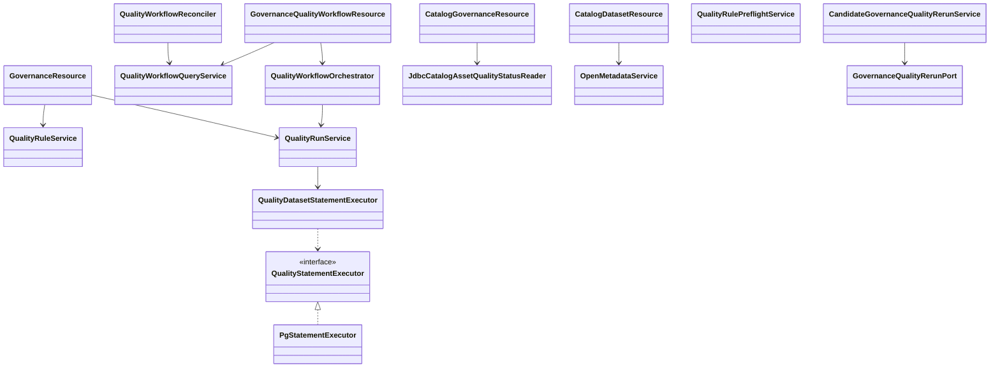
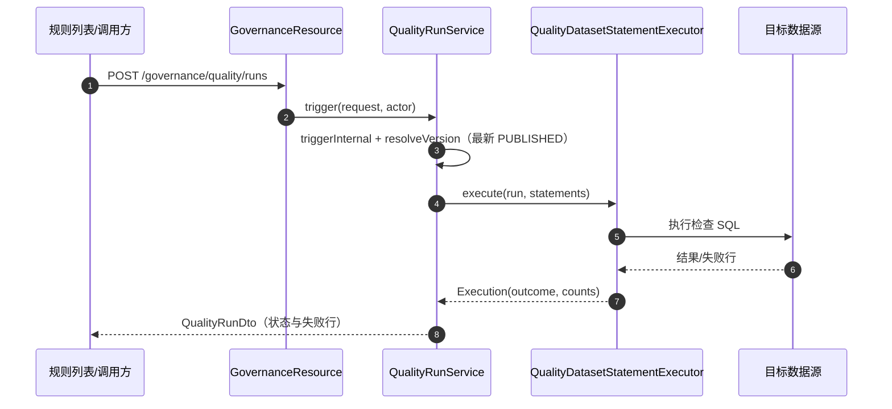
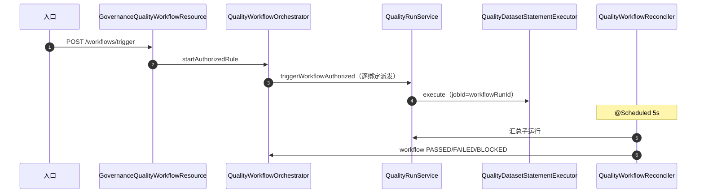

# 05 数据质量与工作流（dts-platform）接口级设计

- 源码基线：`915097e220817313ac313091d9c22fb21763796c`（与 T1 文档一致；本模块源码在该基线后无变更）
- 全量接口清单：[assets/rest-inventory-dts-platform.md](assets/rest-inventory-dts-platform.md)
- 路径前缀 `P/` = `source/dts-platform/src/main/java/com/yuzhi/dts/platform/`
- 类别：`[源码]` 代码事实、`[配置]` 配置声明、`[待确认]` 未证实。

主链：规则与版本 → 触发（规则列表 / 工作流 / 接入 / 模型发布门禁）→ 运行编排 → SQL 执行 → 结果与失败行 → 状态收敛与资产回读。它是 [01-modeling-mainline.md](01-modeling-mainline.md) §3.5 发布门禁的底层能力，也是 S10DC-32/82 的落点。

## 1 REST 接口清单（主链）

| 方法 | 路径 | 控制器#方法 | 进入服务 | 定位 |
|---|---|---|---|---|
| GET | `/api/governance/quality/rules` | GovernanceResource#listQualityRules | `QualityRuleService` | `P/web/rest/GovernanceResource.java:167` |
| POST | `/api/governance/quality/rules` | GovernanceResource#createRule | `QualityRuleService` | `P/web/rest/GovernanceResource.java:195` |
| PUT | `/api/governance/quality/rules/{id}` | GovernanceResource#updateRule | `QualityRuleService` | `P/web/rest/GovernanceResource.java:213` |
| GET | `/api/governance/quality/rules/{id}/versions` | GovernanceResource#listRuleVersions | `QualityRuleService` | `P/web/rest/GovernanceResource.java:265` |
| POST | `/api/governance/quality/rules/{id}/versions/{version}/status` | GovernanceResource#changeRuleVersionStatus | `QualityRuleService.changeRuleVersionStatus` | `P/web/rest/GovernanceResource.java:312,319` |
| POST | `/api/governance/quality/rules/validate-sql` | QualityRulePreflightResource#validate | `QualityRulePreflightService` | `P/web/rest/QualityRulePreflightResource.java:21` |
| POST | `/api/governance/quality/rules/dry-run` | QualityRulePreflightResource#preview | `QualityRulePreflightService.preview` | `P/web/rest/QualityRulePreflightResource.java:26` |
| POST | `/api/governance/quality/runs` | GovernanceResource#triggerQualityRun | `QualityRunService.trigger` | `P/web/rest/GovernanceResource.java:360` |
| GET | `/api/governance/quality/runs` | GovernanceResource#listQualityRuns | `QualityRunQueryService` | `P/web/rest/GovernanceResource.java:530` |
| GET | `/api/governance/quality/runs/{id}` | GovernanceResource#getQualityRun | `QualityRunQueryService` | `P/web/rest/GovernanceResource.java:502` |
| GET | `/api/governance/quality/runs/{runId}/failing-rows` | GovernanceResource#listFailingRows | `gov_quality_failing_row` 查询 | `P/web/rest/GovernanceResource.java:592` |
| GET | `/api/governance/quality/workflows` | GovernanceQualityWorkflowResource#list | `QualityWorkflowQueryService.list` | `P/web/rest/GovernanceQualityWorkflowResource.java:39` |
| POST | `/api/governance/quality/workflows/trigger` | GovernanceQualityWorkflowResource#trigger | `QualityWorkflowOrchestrator.startAuthorizedRule` | `P/web/rest/GovernanceQualityWorkflowResource.java:73` |
| GET | `/api/governance/quality/workflows/{id}` | GovernanceQualityWorkflowResource#get | `QualityWorkflowQueryService.get` | `P/web/rest/GovernanceQualityWorkflowResource.java:50` |
| POST | `/api/governance/quality/workflows/{id}/retry` | GovernanceQualityWorkflowResource#retry | `QualityWorkflowOrchestrator` | `P/web/rest/GovernanceQualityWorkflowResource.java:58` |
| POST | `/api/governance/quality/workflows/{id}/cancel` | GovernanceQualityWorkflowResource#cancel | `QualityWorkflowOrchestrator` | `P/web/rest/GovernanceQualityWorkflowResource.java:88` |
| GET | `/api/catalog/datasets/{id}/governance-health` | CatalogGovernanceResource#getDatasetGovernanceHealth | `buildDatasetGovernanceHealth`（读 `gov_quality_run`） | `P/web/rest/catalog/CatalogGovernanceResource.java:64,102` |
| GET | `/api/catalog/datasets/{id}/quality` | CatalogDatasetResource#getDatasetQuality | `OpenMetadataService.fetchQualityForDataset` | `P/web/rest/catalog/CatalogDatasetResource.java:427,445` |
| POST | `/api/modeling/plans/{planId}/release-candidates/{id}/governance-quality/runs` | ModelReleaseCandidateResource#rerunGovernanceQuality | `CandidateGovernanceQualityRerunService.rerun` → `GovernanceQualityRerunPort` | `P/web/rest/ModelReleaseCandidateResource.java:462` |

> 质量规则目录/模板/任务、清洗与 SQL 修复接口见全量清单；它们不是 T2 主链的必经路径。

## 2 接口与实现关系

| 抽象 | 实现/注入 | 定位 |
|---|---|---|
| `QualityStatementExecutor`（接口） | 当前唯一实现 `PgStatementExecutor` | 接口 `P/service/governance/QualityStatementExecutor.java:10`；实现 `P/service/governance/PgStatementExecutor.java:11` |
| `HiveStatementExecutor` | **未实现该接口**（类存在但仅注释声称湖内巡检） | `P/service/security/HiveStatementExecutor.java:27` —— `[待确认]` 注释与实现漂移 |
| `GovernanceQualityRerunPort` | `GovernanceQualityRerunAdapter`（模型发布门禁重跑） | `P/service/governance/GovernanceQualityRerunAdapter.java` |
| 其余 | `QualityWorkflowOrchestrator`、`QualityRunService`、`QualityDatasetStatementExecutor`、`QualityWorkflowReconciler`、`QualityWorkflowQueryService`、`QualityRulePreflightService`、`QualityRuleService` 均为具体类 | 见 §4 证据表 |

## 3 关键链路方法级时序

### 3.1 规则列表触发（最新已发布版本）

| 步骤 | 类#方法 | 定位 |
|---|---|---|
| 1 | GovernanceResource#triggerQualityRun（`Idempotency-Key`、`X-Quality-Trigger-Ref`、`X-Active-Dept` 头） | `P/web/rest/GovernanceResource.java:360,362-367` |
| 2 | QualityRunService#trigger | `P/service/governance/QualityRunService.java:114` |
| 3 | QualityRunService#triggerInternal（私有重载） | `P/service/governance/QualityRunService.java:295,315,338` |
| 4 | 版本解析：`resolveVersion`（最新 PUBLISHED）/ `resolvePinnedVersion`（钉住版本） | `P/service/governance/QualityRunService.java:364,713,727` |
| 5 | QualityDatasetStatementExecutor#execute | `P/service/governance/QualityDatasetStatementExecutor.java:86` |
| 6 | 提交执行与 afterCommit 派发 | `P/service/governance/QualityRunService.java:578,431-441` |

### 3.2 工作流触发（规则目录 / 接入 / 模型发布门禁）

| 步骤 | 类#方法 | 定位 |
|---|---|---|
| 1 | GovernanceQualityWorkflowResource#trigger | `P/web/rest/GovernanceQualityWorkflowResource.java:73` |
| 2 | QualityWorkflowOrchestrator#startAuthorizedRule | `P/service/governance/QualityWorkflowOrchestrator.java:93` |
| 3 | 其他入口：startAuthorizedTask :70、startScheduledTask :143、startTrustedIngestion :164 | 同文件 |
| 4 | 模型门禁：startPinnedModelQuality :189/:208 → `triggerPinnedWorkflowAuthorized` | `P/service/governance/QualityWorkflowOrchestrator.java:189,208,343` |
| 5 | QualityRunService#triggerWorkflowAuthorized | `P/service/governance/QualityRunService.java:147` |
| 6 | 子运行落库（`jobId=workflowRunId`）、派发失败计数 | `P/service/governance/QualityRunService.java:390`、`.../QualityWorkflowOrchestrator.java:334-373` |
| 7 | 收敛器 reconcileActiveWorkflows（@Scheduled 5s） | `P/service/governance/QualityWorkflowReconciler.java:24,50,52` |

### 3.3 资产回读（为什么共享次数必须区分两套读法）

| 路径 | 行为 | 定位 |
|---|---|---|
| 资产治理健康（治理页签） | `buildDatasetGovernanceHealth` 读 `gov_quality_run`，取 `countByDatasetId` 与最新一条规则运行 | `P/web/rest/catalog/CatalogGovernanceResource.java:102`、`P/repository/catalog/JdbcCatalogAssetQualityStatusReader.java:18,37-53` |
| 数据质量面板 | 走 OpenMetadata 质量结果，不读本地运行表 | `P/web/rest/catalog/CatalogDatasetResource.java:445` |

> 资产页按最新**规则运行**给状态，不读工作流聚合；一次工作流可能 `FAILED` 而最新规则运行成功，状态会不同。该差异是 [S10DC-32](https://jira.yuzhicloud.com/browse/S10DC-32) 的根因之一。

### 3.4 规则版本与保存前预检

| 动作 | 类#方法 | 定位 |
|---|---|---|
| 版本状态变更（草稿/已发布/归档） | `QualityRuleService.changeRuleVersionStatus`（公开 :424 → 内部 :440） | `P/service/governance/QualityRuleService.java:424,440` |
| 预检入口 | `QualityRulePreflightService.validate/preview` | `P/service/governance/QualityRulePreflightService.java:16,21` |
| 保存/发布强制预检 | `QualityRulePreflightService.requireValid` | `P/service/governance/QualityRulePreflightService.java:30` |

## 4 事务、幂等与错误语义

- 工作流创建：`QualityWorkflowOrchestrator` 各 `start*` 方法 `@Transactional`（`P/service/governance/QualityWorkflowOrchestrator.java:69,92,142,163,188`），工作流入库使用 `ON CONFLICT DO NOTHING`（`P/repository/governance/GovQualityWorkflowRunRepository.java:33`）保证幂等。
- 运行派发：非 dry-run 在 `afterCommit` 派发（`P/service/governance/QualityRunService.java:431-441`）；dry-run 同步执行。
- 结果语义（S10DC-82 修复）：执行器保留业务判定，去重失败降级为 `UNDEDUPLICATED`，不再因目标表缺少 `id` 列直接失败；`RESULT_ID_REQUIRED` 类失败在提交 `884c630bb` 修复（详见 01 文档 §3.5 的模型门禁与 S10DC-82 评论）。
- 版本选择差异：规则列表用最新 PUBLISHED（`resolveVersion :713`），模型门禁钉住候选证据版本（`resolvePinnedVersion :727`），两者 SQL 可能不同，这是"资产页失败、规则列表成功"类问题的结构性原因。
- 触发头：`Idempotency-Key`、`X-Quality-Trigger-Ref`、`X-Active-Dept` 分别用于幂等、审计关联与部门范围（`P/web/rest/GovernanceResource.java:362-367`）。

## 5 边界与待确认

- 资产页状态不读 `gov_quality_workflow_run`；工作流级证据、派发失败数对资产页不可见（S10DC-32 根因，见 01 文档 §5）。`[源码]`
- `QualityStatementExecutor` 接口注释声称有两种执行器，实际只有 `PgStatementExecutor` 实现；`HiveStatementExecutor` 未实现该接口。`[待确认]`
- 质量面板走 OpenMetadata，排障时需区分"OM 质量结果"与"本地规则运行结果"两条数据源。`[源码]`
- 本文只核对源码（基线 `915097e22`），未执行质量运行与真实数据验收。

## 6 证据表

| 结论 | 依据 |
|---|---|
| 质量标准/运行/工作流端点 | `P/web/rest/GovernanceResource.java:167,195,213,265,312,360,502,530,592`、`P/web/rest/GovernanceQualityWorkflowResource.java:39,50,58,73,88` |
| 工作流编排入口 | `P/service/governance/QualityWorkflowOrchestrator.java:69,92,93,142,163,188,189,208,334-373` |
| 运行触发与版本解析 | `P/service/governance/QualityRunService.java:114,147,338,364,390,431-441,578,713,727` |
| 执行器抽象与实现 | `P/service/governance/QualityStatementExecutor.java:10`、`P/service/governance/PgStatementExecutor.java:11`、`P/service/security/HiveStatementExecutor.java:27` |
| 状态收敛 | `P/service/governance/QualityWorkflowReconciler.java:24,50,52` |
| 资产回读 | `P/web/rest/catalog/CatalogGovernanceResource.java:64,102`、`P/repository/catalog/JdbcCatalogAssetQualityStatusReader.java:18,37-53`、`P/web/rest/catalog/CatalogDatasetResource.java:427,445` |
| 预检与版本状态 | `P/service/governance/QualityRulePreflightService.java:16,21,30`、`P/service/governance/QualityRuleService.java:424,440` |
| 模型门禁对接 | `P/web/rest/ModelReleaseCandidateResource.java:462`、`P/service/governance/GovernanceQualityRerunAdapter.java` |
