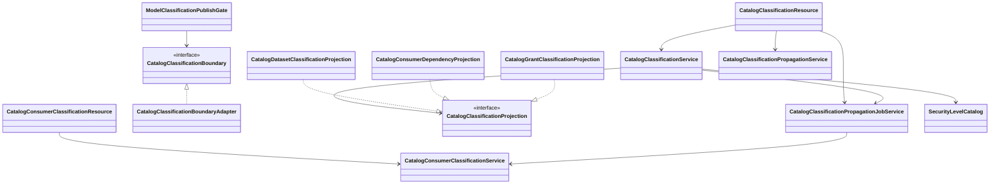
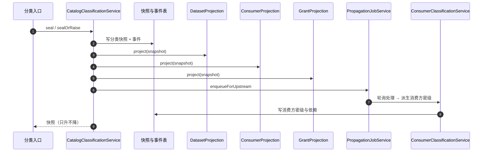

# 06 分类分级与标签（dts-platform）接口级设计

- 源码基线：`915097e220817313ac313091d9c22fb21763796c`（本模块源码在该基线后无变更）
- 全量接口清单：[assets/rest-inventory-dts-platform.md](assets/rest-inventory-dts-platform.md)
- 路径前缀 `P/` = `source/dts-platform/src/main/java/com/yuzhi/dts/platform/`，`C/` = `source/dts-common/src/main/java/com/yuzhi/dts/common/`
- 类别：`[源码]` 代码事实、`[待确认]` 未证实。

主链：统一密级阶梯 → 资产分类封存（快照 + 事件）→ 兼容投影（数据集/消费方/授权）→ 传播重算与影响解释 → 消费方派生与访问绑定 → 标签与脱敏联动。

## 1 REST 接口清单（主链）

| 方法 | 路径 | 控制器#方法 | 进入服务 | 定位 |
|---|---|---|---|---|
| POST | `/api/catalog/classifications/seal` | CatalogClassificationResource#seal | `CatalogClassificationService.seal` | `P/web/rest/catalog/CatalogClassificationResource.java:60` |
| POST | `/api/catalog/classifications/detected-level` | CatalogClassificationResource#addDetectedLevel | `CatalogClassificationService.addDetectedLevel` | `P/web/rest/catalog/CatalogClassificationResource.java:81` |
| POST | `/api/catalog/classifications/manual-floor` | CatalogClassificationResource#raiseManualFloor | `CatalogClassificationService.raiseManualFloor` | `P/web/rest/catalog/CatalogClassificationResource.java:99` |
| POST | `/api/catalog/classifications/inherit` | CatalogClassificationResource#inherit | `CatalogClassificationService.inherit` | `P/web/rest/catalog/CatalogClassificationResource.java:117` |
| GET | `/api/catalog/classifications/explain` | CatalogClassificationResource#explain | `CatalogClassificationService.explain` | `P/web/rest/catalog/CatalogClassificationResource.java:135` |
| GET | `/api/catalog/classifications/impact` | CatalogClassificationResource#impact | `CatalogClassificationPropagationService.explainImpact` | `P/web/rest/catalog/CatalogClassificationResource.java:146` |
| POST | `/api/catalog/classifications/propagation/recompute` | CatalogClassificationResource#recompute | `CatalogClassificationPropagationService.recompute` | `P/web/rest/catalog/CatalogClassificationResource.java:155` |
| POST | `/api/catalog/classifications/propagation/replay` | CatalogClassificationResource#replay | `CatalogClassificationPropagationJobService.replay` | `P/web/rest/catalog/CatalogClassificationResource.java:165` |
| POST | `/api/catalog/classifications/consumers/derive` | CatalogConsumerClassificationResource#derive | `CatalogConsumerClassificationService.derive` | `P/web/rest/catalog/CatalogConsumerClassificationResource.java:38` |
| GET | `/api/catalog/classifications/consumers/explain` | CatalogConsumerClassificationResource#explain | `CatalogConsumerClassificationService.explain` | `P/web/rest/catalog/CatalogConsumerClassificationResource.java:44` |
| GET | `/api/catalog/classifications/consumers/guard` | CatalogConsumerClassificationResource#guardConsumer | `requireCurrentConsumer` | `P/web/rest/catalog/CatalogConsumerClassificationResource.java:53` |
| POST | `/api/catalog/classifications/consumers/access-bindings` | CatalogConsumerClassificationResource#bind | `bindAccess` | `P/web/rest/catalog/CatalogConsumerClassificationResource.java:62` |
| POST | `/api/catalog/classifications/consumers/exports/seal` | CatalogConsumerClassificationResource#sealExport | `sealExport` | `P/web/rest/catalog/CatalogConsumerClassificationResource.java:77` |
| GET/PUT | `/api/catalog/classification-mapping` | CatalogMaskingResource#getMapping/replaceMapping | `CatalogMaskingService` | `P/web/rest/catalog/CatalogMaskingResource.java:107,115` |
| GET | `/api/catalog/classification-masking/linkage` | CatalogMaskingResource#classificationMaskingLinkage | `CatalogMaskingService` | `P/web/rest/catalog/CatalogMaskingResource.java:175` |
| GET/POST | `/api/catalog/masking-rules` | CatalogMaskingResource#listMaskingRules/createMasking | `CatalogMaskingService` | `P/web/rest/catalog/CatalogMaskingResource.java:52,60`（敏感字段识别见 [S10DC-31](https://jira.yuzhicloud.com/browse/S10DC-31)） |
| GET/POST | `/api/catalog/tag-categories`、`/api/catalog/tags` | CatalogTagResource | `CatalogTagService` | `P/web/rest/catalog/CatalogTagResource.java:79,84,162,185` |
| GET/POST/DELETE | `/api/catalog/asset-tags`、`batch`、`capability` | CatalogTagResource | `CatalogAssetTagService` + 写守卫 | `P/web/rest/catalog/CatalogTagResource.java:260,286,333,375,277` |
| GET | `/api/catalog/asset-tags/search` | CatalogAssetTagSearchResource#search | `CatalogAssetTagService.searchAssets` | `P/web/rest/catalog/CatalogAssetTagSearchResource.java:31` |
| POST | `/api/catalog/classification-migrations/dry-run`、`{runId}/apply/freeze/...` | CatalogClassificationMigrationResource | `CatalogClassificationMigrationService` | `P/web/rest/catalog/CatalogClassificationMigrationResource.java:41,60,83` |
| POST | `/api/catalog/tag-migrations/dry-run`、`{batchId}/execute/rollback` | CatalogTagMigrationResource | `CatalogTagMigrationService` | `P/web/rest/catalog/CatalogTagMigrationResource.java:58,78,103` |

## 2 接口与实现关系

- `CatalogClassificationProjection` 是**多实现接口**，在服务中以 `List<CatalogClassificationProjection>` 注入并逐一投影（`P/service/catalog/CatalogClassificationService.java:40,282`）。实现：
  - `CatalogDatasetClassificationProjection`（数据集 legacy 列）
  - `CatalogConsumerDependencyProjection`（消费方依赖，内部调 `CatalogConsumerClassificationService`）
  - `CatalogGrantClassificationProjection`（授权 legacy 列）
  接口约定"单向兼容桥、实现必须幂等、不得回灌规范化快照"（`P/service/catalog/CatalogClassificationProjection.java:6-14`）。
- `CatalogClassificationBoundary` 为模型侧读/封存分类事实的端口，唯一实现 `CatalogClassificationBoundaryAdapter`（`P/service/catalog/CatalogClassificationBoundary.java:7`、`CatalogClassificationBoundaryAdapter.java:10`）。
- 统一密级阶梯在公共模块：`C/security/SecurityLevelCatalog.java`（人员密级 `PersonnelSecurityLevel` :59、数据密级 `DataSecurityLevel` :104、`allowedDataLevelsForPersonnel` :198、`parseMaxDataLevel` :214、`normalizePrefixedDataCode` :244）。

## 3 关键链路方法级时序

### 3.1 分类封存与兼容投影

| 步骤 | 类#方法 | 定位 |
|---|---|---|
| 1 | CatalogClassificationResource#seal | `P/web/rest/catalog/CatalogClassificationResource.java:60` |
| 2 | CatalogClassificationService#seal / sealOrRaise | `P/service/catalog/CatalogClassificationService.java:79,144` |
| 3 | 投影遍历 `for (CatalogClassificationProjection ...)` | `P/service/catalog/CatalogClassificationService.java:282` |
| 4 | 三个投影实现 | `P/service/catalog/CatalogDatasetClassificationProjection.java:9`、`CatalogConsumerDependencyProjection.java:8`、`CatalogGrantClassificationProjection.java:16` |
| 5 | 传播入队 `enqueueForUpstream` / `enqueue` | `P/service/catalog/CatalogClassificationPropagationJobService.java:43,54` |
| 6 | 传播处理 `processPending` → 消费方重算 | `P/service/catalog/CatalogClassificationPropagationJobService.java:78`、`CatalogConsumerClassificationService.java:405` |
| 7 | 消费方派生 `derive` / 变更回调 `onUpstreamChanged` | `P/service/catalog/CatalogConsumerClassificationService.java:63,365` |

### 3.2 等级调整、解释与传播

| 动作 | 类#方法 | 定位 |
|---|---|---|
| 自动识别等级追加 | `addDetectedLevel` | `P/service/catalog/CatalogClassificationService.java:193` |
| 人工下限抬升 | `raiseManualFloor` | `P/service/catalog/CatalogClassificationService.java:198` |
| 上游继承 | `inherit` | `P/service/catalog/CatalogClassificationService.java:203` |
| 解释（为什么是这个等级） | `explain` | `P/service/catalog/CatalogClassificationService.java:61` |
| 下游影响解释 | `CatalogClassificationPropagationService.explainImpact` | `P/service/catalog/CatalogClassificationPropagationService.java:209` |
| 重算单个下游 | `recompute` | `P/service/catalog/CatalogClassificationPropagationService.java:46` |
| 重放失败任务 | `replay` | `P/service/catalog/CatalogClassificationPropagationJobService.java:90` |

### 3.3 消费方与导出

| 动作 | 类#方法 | 定位 |
|---|---|---|
| 派生消费方密级 | `derive` | `P/service/catalog/CatalogConsumerClassificationService.java:63` |
| 导出封存 | `sealExport` | `P/service/catalog/CatalogConsumerClassificationService.java:152` |
| 访问绑定与撤销 | `bindAccess` / `revokeAccessBinding` | `P/service/catalog/CatalogConsumerClassificationService.java:184,241` |
| 当前消费方必须有效 | `requireCurrentConsumer` | `P/service/catalog/CatalogConsumerClassificationService.java:321` |
| 分析侧派生（卡片/指标/看板/大屏） | `AnalyticsConsumerClassificationService.deriveCard/deriveDashboard/deriveScreen` | `G/service/AnalyticsConsumerClassificationService.java:70,96,118` |

### 3.4 标签与脱敏

| 动作 | 类#方法 | 定位 |
|---|---|---|
| 标签分类树/标签维护 | `CatalogTagService.listCategoryTree/createTag/updateTag/deleteTag` | `P/service/catalog/CatalogTagService.java:54,184,209,258` |
| 资产打标/去标/批量 | `CatalogAssetTagService.tagAsset/untagAsset/batchTag` | `P/service/catalog/CatalogAssetTagService.java:252,266,273` |
| 打标写权限守卫 | `CatalogAssetTagWriteGuard.authorizeAll`、`CatalogTagGovernanceGuard.requireMaintainer` | `P/service/catalog/CatalogAssetTagWriteGuard.java:48`、`CatalogTagGovernanceGuard.java:22` |
| 分类-脱敏联动与映射 | `CatalogMaskingResource#classificationMaskingLinkage/getMapping` | `P/web/rest/catalog/CatalogMaskingResource.java:175,107`、`P/service/security/CatalogMaskingService.java:21` |

### 3.5 与建模发布/预览的衔接

| 动作 | 类#方法 | 定位 |
|---|---|---|
| 发布前分类门禁 | `ModelClassificationPublishGate.evaluate/admitAndSeal` | `P/service/modeling/ModelClassificationPublishGate.java:71,173` |
| 稳定分类投影 | `CatalogModelStableClassificationProjector.project` | `P/service/modeling/serving/CatalogModelStableClassificationProjector.java:29` |
| 预览策略读取分类事实 | `DefaultPhysicalPreviewPolicyAdapter`（注入 Boundary） | `P/service/modeling/serving/DefaultPhysicalPreviewPolicyAdapter.java:43` |

## 4 事务、幂等与错误语义

- 只升不降：入口提供 `manual-floor`（抬升）、`inherit`、`detected-level`；未见降低入口，符合"分类只能向上"的合规方向。`[源码]`
- 投影幂等：接口注释要求实现幂等且不得把 legacy 值回灌快照（`P/service/catalog/CatalogClassificationProjection.java:8-13`）。
- 传播可靠性：传播任务入库后由 `processPending` 轮询处理，支持 `replay` 重放（`P/service/catalog/CatalogClassificationPropagationJobService.java:78,90`）。
- 迁移与冻结：分类/标签迁移均提供 dry-run、批量执行、回滚；分类迁移还有 `freezeLegacyWrites`（`P/service/catalog/CatalogClassificationMigrationService.java:48,157,200,311`）。
- 导出口径：分析侧导出需 `sealExport`，公共分享链接的匿名访问受分类/部门双重校验（S10DC-87 已记录产品决策项）。

## 5 边界与待确认

- legacy 兼容列与规范化快照两套读法并存；排障时必须确认读取路径，避免把投影列当作权威事实。`[源码]`
- 标签迁移/回滚与分类迁移的批量选择、写冻结窗口需要真实数据演练。`[待确认]`
- 匿名分享的密级校验策略见 S10DC-87；本模块只提供事实与校验点。`[待确认]`
- 本文只核对源码（基线 `915097e22`），未执行分类传播与迁移的真实数据验证。

## 6 证据表

| 结论 | 依据 |
|---|---|
| 分类入口与端点 | `P/web/rest/catalog/CatalogClassificationResource.java:36,60,81,99,117,135,146,155,165` |
| 封存与投影 | `P/service/catalog/CatalogClassificationService.java:40,79,144,193,198,203,282` |
| 投影接口与三实现 | `P/service/catalog/CatalogClassificationProjection.java:6`、`CatalogDatasetClassificationProjection.java:9`、`CatalogConsumerDependencyProjection.java:8`、`CatalogGrantClassificationProjection.java:16` |
| 边界端口 | `P/service/catalog/CatalogClassificationBoundary.java:7`、`CatalogClassificationBoundaryAdapter.java:10` |
| 传播 | `P/service/catalog/CatalogClassificationPropagationService.java:46,209`、`CatalogClassificationPropagationJobService.java:43,54,78,90` |
| 消费方 | `P/service/catalog/CatalogConsumerClassificationService.java:63,152,184,241,321,365,405` |
| 统一阶梯 | `C/security/SecurityLevelCatalog.java:59,104,198,214,244` |
| 标签与守卫 | `P/service/catalog/CatalogTagService.java:54,184,209,258`、`CatalogAssetTagService.java:252,266,273`、`CatalogAssetTagWriteGuard.java:48` |
| 脱敏联动 | `P/web/rest/catalog/CatalogMaskingResource.java:107,175`、`P/service/security/CatalogMaskingService.java:21` |
| 模型门禁与预览 | `P/service/modeling/ModelClassificationPublishGate.java:71,173`、`P/service/modeling/serving/CatalogModelStableClassificationProjector.java:29`、`DefaultPhysicalPreviewPolicyAdapter.java:43` |
