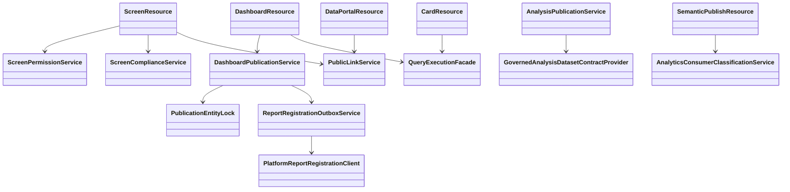
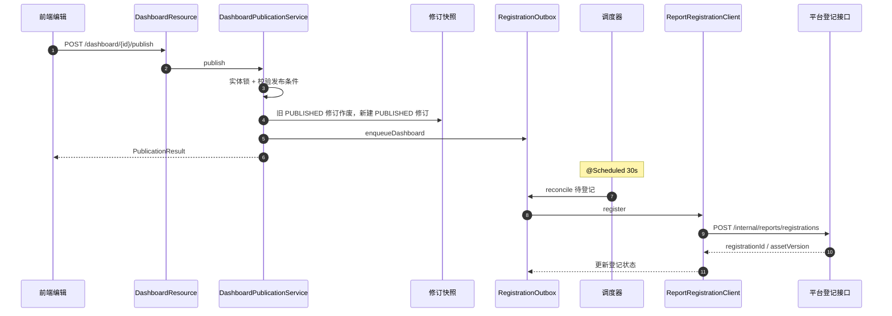
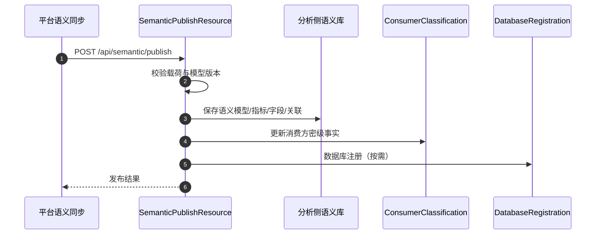

# 07 BI 编排（分析 / 看板 / 大屏）接口级设计

- 源码基线：`915097e220817313ac313091d9c22fb21763796c`（本模块源码在该基线后无变更）
- 全量接口清单：[assets/rest-inventory-dts-analytics.md](assets/rest-inventory-dts-analytics.md)
- 路径前缀 `G/` = `source/dts-analytics/src/main/java/com/yuzhi/dts/analytics/`
- 类别：`[源码]` 代码事实、`[待确认]` 未证实。

主链：分析（Analysis）与卡片（Card）创作 → 看板（Dashboard）编排 → 发布（版本快照 + 平台登记 Outbox）→ 大屏（Screen）版本与分享 → 数据门户/公共分享阅读。语义发布入站接口把平台模型发布对接进分析侧（衔接 [01](01-modeling-mainline.md)/[04](04-analytics-consumption.md)）。

## 1 REST 接口清单（主链）

| 方法 | 路径 | 控制器#方法 | 进入服务 | 定位 |
|---|---|---|---|---|
| GET/POST | `/api/card`、`/api/card/{id}` | CardResource#list/create/update/delete | `AnalyticsCardRepository`、`QueryExecutionFacade` | `G/web/rest/CardResource.java:120,167,228,282` |
| POST | `/api/card/{cardId}/query` | CardResource#query | `QueryExecutionFacade` | `G/web/rest/CardResource.java:298` |
| POST | `/api/analysis/{id}/validate`、`/publish`、`/versions` | AnalysisResource | `AnalysisPublicationService` | `G/web/rest/AnalysisResource.java:133,145,157` |
| GET/POST | `/api/dashboard`、`/api/dashboard/{id}` | DashboardResource#list/create/update/delete | `AnalyticsDashboardRepository` | `G/web/rest/DashboardResource.java:131,154,204,255` |
| POST | `/api/dashboard/save` | DashboardResource#save | 看板与卡片编排保存 | `G/web/rest/DashboardResource.java:271` |
| GET/POST | `/api/dashboard/{id}/cards` | DashboardResource#cards/addCard | `AnalyticsDashboardCardRepository` | `G/web/rest/DashboardResource.java:452,470` |
| POST | `/api/dashboard/{id}/validate` | DashboardResource#validatePublication | `DashboardPublicationService.validate` | `G/web/rest/DashboardResource.java:506` |
| POST | `/api/dashboard/{id}/publish` | DashboardResource#publish | `DashboardPublicationService.publish` | `G/web/rest/DashboardResource.java:516` |
| GET | `/api/dashboard/{id}/versions` | DashboardResource#versions | `DashboardPublicationService.versions` | `G/web/rest/DashboardResource.java:526` |
| POST | `/api/dashboard/{id}/versions/{revisionId}/draft` | DashboardResource#createDraftFromVersion | `DashboardPublicationService.createDraftFromVersion` | `G/web/rest/DashboardResource.java:533` |
| POST | `/api/dashboard/{id}/registration/retry` | DashboardResource#retryRegistration | `DashboardPublicationService.retryRegistration` | `G/web/rest/DashboardResource.java:547` |
| GET/POST | `/api/screen`、`/api/screen/{id}` | ScreenResource#list/create/update | `AnalyticsScreenRepository` 等 | `G/web/rest/ScreenResource.java:132,798,881` |
| POST | `/api/screen/{id}/publish` | ScreenResource#publish | 大屏版本与权限校验 | `G/web/rest/ScreenResource.java:978` |
| POST | `/api/screen/{id}/rollback/{versionId}` | ScreenResource#rollback | 版本回滚 | `G/web/rest/ScreenResource.java:1045` |
| POST/PUT/DELETE | `/api/screen/{id}/public_link`、`/public_link/policy` | ScreenResource | `PublicLinkService` | `G/web/rest/ScreenResource.java:1136,1184,1219` |
| GET/PUT | `/api/screen/{id}/grants` | ScreenResource | `ScreenPermissionService` | `G/web/rest/ScreenResource.java:1247,1272` |
| POST | `/api/screen/ai/generate`、`/validate-spec` | ScreenResource | `ScreenAiGenerationService`、spec 校验 | `G/web/rest/ScreenResource.java:199,233` |
| GET | `/api/data-portal` | DataPortalResource#get | `DataPortalService.snapshot` | `G/web/rest/DataPortalResource.java:43-45` |
| POST | `/api/semantic/publish` | SemanticPublishResource#publish | 平台语义发布入站（校验 + 落库 + 注册） | `G/web/rest/SemanticPublishResource.java:84,87` |
| POST | `/api/analysis/preview`、`/{id}/query` | AnalysisResource | `AnalysisQueryGateway.preview` | `G/web/rest/AnalysisResource.java:178,189`（查询细节见 [04](04-analytics-consumption.md)） |

## 2 接口与实现关系

- 分析/看板的发布服务：`AnalysisPublicationService`（:47）、`DashboardPublicationService`（:48）；大屏走 `ScreenResource` 内的版本/权限服务（无统一 PublicationService）。`[源码]`
- 平台登记链路：`ReportRegistrationOutboxService`（Outbox）→ `PlatformReportRegistrationClient`（HTTP）→ 平台 `/internal/reports/registrations`。`[源码]`
- `QueryExecutionFacade` 同时被 Card/Dashboard/Analysis 复用，查询与合规细节在 [04](04-analytics-consumption.md)。

## 3 关键链路方法级时序

### 3.1 看板发布与平台登记（Outbox）

| 步骤 | 类#方法 | 定位 |
|---|---|---|
| 1 | DashboardResource#publish | `G/web/rest/DashboardResource.java:516` |
| 2 | DashboardPublicationService#publish（实体锁 `entityLock.dashboard`） | `G/service/publication/DashboardPublicationService.java:109,110` |
| 3 | 旧版本作废与新版本创建（`findCurrentPublished` / `findMaxVersionNo` / `setStatus("PUBLISHED")`） | `G/service/publication/DashboardPublicationService.java:121,125,138` |
| 4 | 入队 `enqueueDashboard` | `G/service/publication/ReportRegistrationOutboxService.java:51` |
| 5 | 调度 `@Scheduled reconcile`（默认 30s） | `G/service/publication/ReportRegistrationOutboxService.java:99,101` |
| 6 | 客户端 `register` → `POST .../internal/reports/registrations` | `G/service/publication/PlatformReportRegistrationClient.java:39,64-67` |
| 7 | 重试/归档 | `G/service/publication/DashboardPublicationService.java:255,264`、`ReportRegistrationOutboxService.java:77` |

### 3.2 大屏版本、权限与分享

| 动作 | 控制器/服务 | 定位 |
|---|---|---|
| 创建/更新/发布/回滚 | `ScreenResource` | `G/web/rest/ScreenResource.java:798,881,978,1045` |
| 版本列表/对比 | ScreenResource#versions / versionsCompare | `G/web/rest/ScreenResource.java:286,309` |
| 权限授予 | ScreenResource#grants（`ScreenPermissionService` 注入） | `G/web/rest/ScreenResource.java:82,1247,1272` |
| 公开链接与策略 | ScreenResource#createPublicLink / policy（`PublicLinkService`） | `G/web/rest/ScreenResource.java:1136,1184` |
| 未分类大屏回填 | ScreenResource#admin/unclassified / backfill-grants | `G/web/rest/ScreenResource.java:2694,2751` |
| 门户右侧预览 | `DataPortalResource#get` → `DataPortalService.snapshot` | `G/web/rest/DataPortalResource.java:43-45`（前端内嵌预览实现见 intro 材料） |

### 3.3 平台语义发布入站（衔接模型发布）

| 步骤 | 类#方法 | 定位 |
|---|---|---|
| 1 | 入口 `SemanticPublishResource#publish` | `G/web/rest/SemanticPublishResource.java:84,87` |
| 2 | 依赖：`AnalyticsConsumerClassificationService`、`PlatformAnalyticsDatabaseRegistrationService` | `G/web/rest/SemanticPublishResource.java:59,60` |
| 3 | 平台侧调用方（T1 文档） | `P/service/modeling/serving/AnalyticsSemanticPublishClient.java:48` |

## 4 事务、幂等与错误语义

- 发布锁：`PublicationEntityLock` 保证同一看板/分析的发布串行（`G/service/publication/DashboardPublicationService.java:61,110`）。
- 版本模型：发布生成 `AnalyticsRevision`（`model/quarry` 语义），旧 PUBLISHED 先作废（`.../DashboardPublicationService.java:121,138`）；`versions` 与 `createDraftFromVersion` 支持回看与再编辑（:184,196）。
- 登记可靠性：平台登记走 Outbox + 定时 reconcile + 手动 `registration/retry`（`ReportRegistrationOutboxService.java:51,77,101`、`DashboardResource.java:547`）。
- 权限与合规：大屏授权走 `ScreenPermissionService`，导出/公开链接受 `ScreenComplianceService` 与分类事实约束（`ScreenResource.java:82,88`、`QueryExecutionFacade.java:41-44`）；公共链接匿名访问策略见 [S10DC-87](https://jira.yuzhicloud.com/browse/S10DC-87)。
- 语义入站是平台→分析的服务间调用，无跨服务事务；入站失败由平台侧租约重试（见 [01](01-modeling-mainline.md) §3.4）。

## 5 边界与待确认

- 看板/分析发布不改变底层数据集定义引用；引用有效性由 `GovernedAnalysisDatasetContractProvider` 校验（[04](04-analytics-consumption.md)）。`[源码]`
- 大屏没有与看板同构的 PublicationService/Outbox 登记链路；跨系统登记只覆盖看板与分析。`[待确认]` 是否计划统一。
- 门户右侧预览的跨应用会话与嵌入参数属于前端行为，本模块只提供数据门户快照接口。`[源码]`
- 本文只核对源码（基线 `915097e22`），未执行发布-登记-分享的真实环境验证。

## 6 证据表

| 结论 | 依据 |
|---|---|
| 卡片端点与查询 | `G/web/rest/CardResource.java:120,167,214,228,298` |
| 看板端点与发布 | `G/web/rest/DashboardResource.java:131,154,204,255,271,452,470,506,516,526,533,547` |
| 发布服务内部 | `G/service/publication/DashboardPublicationService.java:48,103,109,121,125,138,184,196,255,264` |
| 登记 Outbox/客户端 | `G/service/publication/ReportRegistrationOutboxService.java:51,77,99,101`、`PlatformReportRegistrationClient.java:39,64-67` |
| 大屏端点 | `G/web/rest/ScreenResource.java:132,286,309,798,881,978,1045,1136,1184,1247,1272,2694,2751` |
| 数据门户 | `G/web/rest/DataPortalResource.java:43-45` |
| 语义发布入站 | `G/web/rest/SemanticPublishResource.java:48,59,60,84,87` |
| 平台侧调用 | `P/service/modeling/serving/AnalyticsSemanticPublishClient.java:48` |
