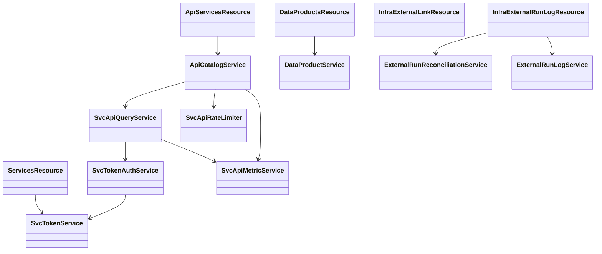
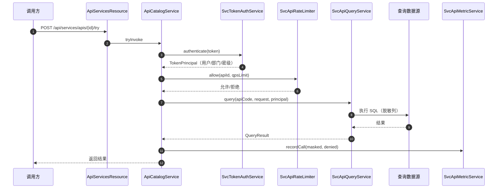

# 08 数据服务与推送（dts-platform）接口级设计

- 源码基线：`915097e220817313ac313091d9c22fb21763796c`（本模块源码在该基线后无变更）
- 全量接口清单：[assets/rest-inventory-dts-platform.md](assets/rest-inventory-dts-platform.md)
- 路径前缀 `P/` = `source/dts-platform/src/main/java/com/yuzhi/dts/platform/`
- 类别：`[源码]` 代码事实、`[待确认]` 未证实。

主链：数据 API 注册与发布（SvcApi）→ 令牌签发/校验（SvcToken）→ 调用鉴权、限流、查询与脱敏、指标 → 数据产品/版本（SvcDataProduct）→ 推送/交换记录与对账（InfraExternal*）。

## 1 REST 接口清单（主链）

| 方法 | 路径 | 控制器#方法 | 进入服务 | 定位 |
|---|---|---|---|---|
| GET/POST | `/api/services/apis` | ApiServicesResource#list/create | `ApiCatalogService.list/create` | `P/web/rest/ApiServicesResource.java:37,89` |
| GET/PUT | `/api/services/apis/{id}` | ApiServicesResource#detail/update | `ApiCatalogService.detail/update` | `P/web/rest/ApiServicesResource.java:54,105` |
| POST | `/api/services/apis/{id}/try` | ApiServicesResource#tryInvoke | `ApiCatalogService.tryInvoke` | `P/web/rest/ApiServicesResource.java:69` |
| GET | `/api/services/apis/{id}/metrics` | ApiServicesResource#metrics | `ApiCatalogService.metrics` | `P/web/rest/ApiServicesResource.java:79` |
| POST | `/api/services/apis/{id}/disable` | ApiServicesResource#disable | `ApiCatalogService.disable` | `P/web/rest/ApiServicesResource.java:121` |
| GET/POST | `/api/services/products` | DataProductsResource#list/create | `DataProductService` | `P/web/rest/DataProductsResource.java:32,50` |
| GET/PUT/DELETE | `/api/services/products/{id}` | DataProductsResource#detail/update/delete | `DataProductService` | `P/web/rest/DataProductsResource.java:43,59,82` |
| POST | `/api/services/products/{id}/versions` | DataProductsResource#addVersion | `DataProductService.addVersion` | `P/web/rest/DataProductsResource.java:68` |
| POST/GET | `/api/tokens`、`/api/tokens/me` | ServicesResource#createToken/myTokens | `SvcTokenService` | `P/web/rest/ServicesResource.java:41,33` |
| DELETE | `/api/tokens/{id}` | ServicesResource#deleteToken | `SvcTokenService.deleteToken` | `P/web/rest/ServicesResource.java:63` |
| POST/DELETE | `/api/tokens/internal-service`、`/{id}` | ServicesResource#createInternalServiceToken/deleteInternalServiceToken | `SvcTokenService.createServiceToken/revokeServiceToken` | `P/web/rest/ServicesResource.java:49,71` |
| GET/POST/PUT/DELETE | `/api/infra/external-links`、`/{entryKey}`、`visit`、`status`、`check` | InfraExternalLinkResource | `InfraExternalLinkRepository`、`RestTemplate` | `P/web/rest/InfraExternalLinkResource.java:67,288,315,268,160,91` |
| GET/POST/PUT/DELETE | `/api/infra/exchange-files`、`/{id}` | InfraExternalExchangeFileResource | `InfraExternalExchangeFileRepository` + 分类工具 | `P/web/rest/InfraExternalExchangeFileResource.java:55,92,82,110,125` |
| GET/POST/PUT/DELETE | `/api/infra/external-artifacts`、`/{id}`、`purge` | InfraExternalArtifactResource | `InfraExternalArtifactRepository` | `P/web/rest/InfraExternalArtifactResource.java:55,95,80,110,125,135` |
| GET/POST/PUT/DELETE | `/api/infra/external-runs`、`/{id}`、`reconcile`、`reconcile/daily` | InfraExternalRunLogResource | `ExternalRunReconciliationService`、`ExternalRunLogService` | `P/web/rest/InfraExternalRunLogResource.java:62,172,96,191,207,108,126` |
| POST | `/api/catalog/lifecycle/governance/execution-tokens/consume` | CatalogLifecycleGovernanceResource#consume | 治理执行令牌消费 | `P/web/rest/catalog/CatalogLifecycleGovernanceResource.java:95` |

## 2 接口与实现关系

- 令牌链路：`SvcTokenAuthService.authenticate/authenticateService`（`P/service/services/SvcTokenAuthService.java:20,41`）→ `SvcTokenService.validatePlainToken`（:102），令牌带用户、部门与人员密级（`TokenPrincipal` :12）。
- 调用链路：`ApiCatalogService.tryInvoke/execute`（:108,171）→ `SvcApiQueryService.query/batchQuery`（:82,137）→ 脱敏列计数与 `recordSuccess/recordDenied`（:160,165）。
- 对外记录与对账：`InfraExternalLinkResource` 只管链接与访问（`visit` :268），运行记录走 `InfraExternalRunLogResource` → `ExternalRunReconciliationService.evaluate/dailyReport`（:38,76）。

## 3 关键链路方法级时序

### 3.1 API 调用（试调用 / 令牌调用）

| 步骤 | 类#方法 | 定位 |
|---|---|---|
| 1 | ApiServicesResource#tryInvoke | `P/web/rest/ApiServicesResource.java:69` |
| 2 | ApiCatalogService#tryInvoke / execute | `P/service/services/ApiCatalogService.java:108,171` |
| 3 | SvcTokenAuthService#authenticate / authenticateService | `P/service/services/SvcTokenAuthService.java:20,41` |
| 4 | SvcTokenService#validatePlainToken（哈希校验） | `P/service/services/SvcTokenService.java:102` |
| 5 | SvcApiRateLimiter#allow（按秒桶） | `P/service/services/SvcApiRateLimiter.java:24` |
| 6 | SvcApiQueryService#query / batchQuery（`QueryResult.maskedColumns`） | `P/service/services/SvcApiQueryService.java:39,82,137` |
| 7 | 成功/拒绝计数 | `P/service/services/SvcApiQueryService.java:160,165`、`SvcApiMetricService.java:22` |
| 8 | 指标查询与禁用 | `P/service/services/ApiCatalogService.java:131,217` |

### 3.2 令牌签发与数据产品版本

| 动作 | 类#方法 | 定位 |
|---|---|---|
| 用户令牌签发（TTL） | `SvcTokenService.createToken` | `P/service/services/SvcTokenService.java:39` |
| 服务令牌签发/撤销 | `createServiceToken` / `revokeServiceToken` | `P/service/services/SvcTokenService.java:58,92` |
| 我的令牌/删除 | `listForUser` / `deleteToken` | `P/service/services/SvcTokenService.java:30,118` |
| 数据产品创建/更新/加版本 | `DataProductService.create/update/addVersion` | `P/service/services/DataProductService.java:150,163,176` |
| 数据产品查询/删除 | `list/detail/delete` | `P/service/services/DataProductService.java:75,94,207` |

### 3.3 推送/交换记录与对账

| 动作 | 类#方法 | 定位 |
|---|---|---|
| 交换文件登记 | InfraExternalExchangeFileResource#create（含分类工具） | `P/web/rest/InfraExternalExchangeFileResource.java:92,41` |
| 外部链接访问 | InfraExternalLinkResource#visit / status / check | `P/web/rest/InfraExternalLinkResource.java:268,160,91` |
| 运行记录创建/更新 | InfraExternalRunLogResource#create/update | `P/web/rest/InfraExternalRunLogResource.java:172,191` |
| 单次/每日对账 | `ExternalRunReconciliationService.evaluate/dailyReport` | `P/service/infra/ExternalRunReconciliationService.java:38,76` |
| 接入/Airflow 运行登记 | `ExternalRunLogService.recordIngestionExecution/syncAirflowRuns/upsertExternalRun` | `P/service/ops/ExternalRunLogService.java:38,136,194` |

## 4 事务、幂等与错误语义

- 令牌：`SvcTokenService.validatePlainToken` 按哈希校验并检查有效期；服务令牌按服务名校验（`SvcTokenAuthService.authenticateService`）。`[源码]`
- 限流：`SvcApiRateLimiter` 使用秒级桶，超限走 `recordDenied` 路径（`P/service/services/SvcApiRateLimiter.java:17-24`、`SvcApiQueryService.java:165`）。
- 脱敏：查询结果返回 `maskedColumns`，指标按 `maskedHits/denied` 聚合（`SvcApiQueryService.java:39,160-165`、`SvcApiMetricService.java:22`）。
- 对账：外部运行支持行数/金额容差评估与每日报表（`ExternalRunReconciliationService.evaluate(run, rowTolerance, amountTolerance)` / `dailyReport`）。
- 分类：交换文件资源注入 `ClassificationUtils`，登记时执行密级处理（`P/web/rest/InfraExternalExchangeFileResource.java:42`）。

## 5 边界与待确认

- **未发现独立的推送执行器/调度类**：本模块只有链接、交换文件、运行记录与对账的管理接口；"谁真正把数据推出去"（外部链接 `visit` 是否为唯一动作、是否存在外部调度）需要与产品确认。`[待确认]`
- `ApiCatalogService.publish(id, version, username)` 存在（:158），但对外 REST 只有 create/update/disable；发布入口是否通过 update 状态或由内部调用触发，需核对前端。`[待确认]`
- 数据服务 API 的运行时鉴权是否在代理层另有实现（仅 gateway/nginx 路由），本文只核对平台内实现。`[待确认]`
- 本文只核对源码（基线 `915097e22`），未执行令牌调用、限流与推送对账的真实环境验证。

## 6 证据表

| 结论 | 依据 |
|---|---|
| API 服务端点 | `P/web/rest/ApiServicesResource.java:37,54,69,79,89,105,121` |
| API 服务实现 | `P/service/services/ApiCatalogService.java:80,102,108,131,158,171,176,196,217` |
| 令牌服务 | `P/service/services/SvcTokenService.java:30,39,58,82,92,102,118`、`SvcTokenAuthService.java:12,20,41` |
| 限流与查询 | `P/service/services/SvcApiRateLimiter.java:17,24`、`SvcApiQueryService.java:39,82,137,160,165` |
| 指标 | `P/service/services/SvcApiMetricService.java:17,22` |
| 数据产品 | `P/service/services/DataProductService.java:75,94,150,163,176,207`、`P/web/rest/DataProductsResource.java:32,43,50,59,68,82` |
| 外部链接/交换/运行 | `P/web/rest/InfraExternalLinkResource.java:67,91,160,268,288,315`、`InfraExternalExchangeFileResource.java:41,55,92,110,125`、`InfraExternalRunLogResource.java:62,96,108,126,172,191,207` |
| 对账与运行登记 | `P/service/infra/ExternalRunReconciliationService.java:38,76`、`P/service/ops/ExternalRunLogService.java:38,73,136,194` |
