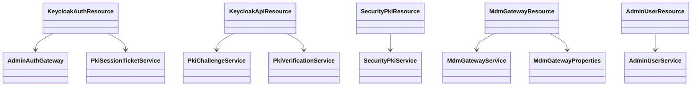
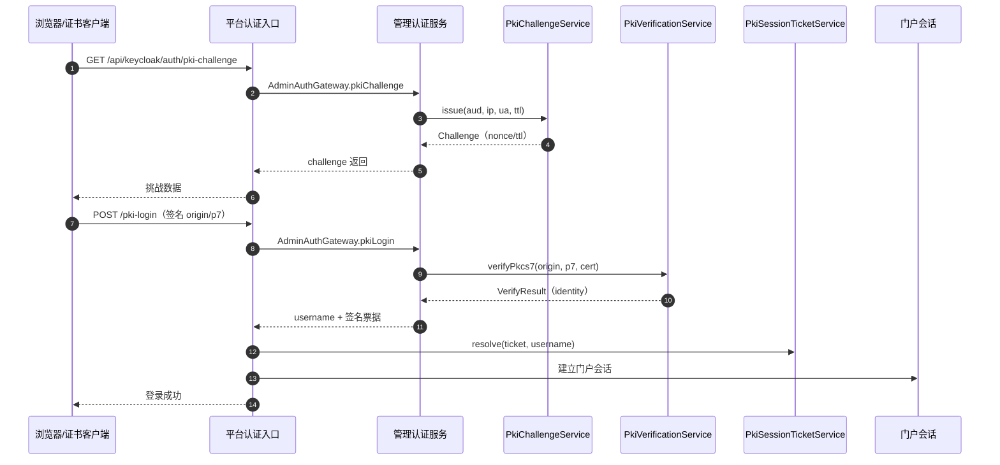
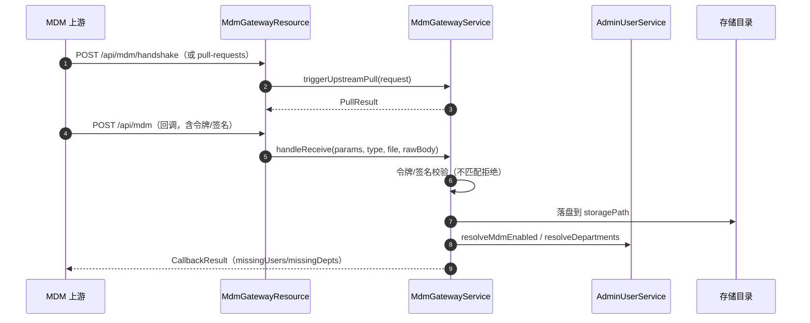

# 09 PKI 与 MDM 集成（dts-admin + dts-platform）接口级设计

- 源码基线：`915097e220817313ac313091d9c22fb21763796c`（本模块源码在该基线后无变更）
- 全量接口清单：[assets/rest-inventory-dts-admin.md](assets/rest-inventory-dts-admin.md)、[assets/rest-inventory-dts-platform.md](assets/rest-inventory-dts-platform.md)
- 路径前缀 `A/` = `source/dts-admin/src/main/java/com/yuzhi/dts/admin/`，`P/` = `source/dts-platform/src/main/java/com/yuzhi/dts/platform/`
- 类别：`[源码]` 代码事实、`[配置]` 配置声明、`[待确认]` 未证实。

主链：PKI 双证书登录（挑战 → 客户端签名 → 验签 → 签名票据 → 门户会话）与 MDM 对接（握手/拉取/回调 → 验签或令牌校验 → 用户/部门开关解析）。

## 1 REST 接口清单（主链）

| 方法 | 路径 | 控制器#方法 | 进入服务 | 定位 |
|---|---|---|---|---|
| GET | `/api/keycloak/auth/pki-challenge`（admin） | KeycloakApiResource#pkiChallenge | `PkiChallengeService.issue` | `A/web/rest/KeycloakApiResource.java:3628` |
| POST | `/api/keycloak/auth/pki-login`（admin） | KeycloakApiResource#pkiLogin | `PkiVerificationService.verifyPkcs7` 等 | `A/web/rest/KeycloakApiResource.java:3280` |
| GET | `/api/keycloak/auth/pki-challenge`（platform 代理） | KeycloakAuthResource#pkiChallenge | `AdminAuthGateway.pkiChallenge` | `P/web/rest/KeycloakAuthResource.java:528` |
| POST | `/api/keycloak/auth/pki-login`（platform 代理） | KeycloakAuthResource#pkiLogin | `AdminAuthGateway.pkiLogin` | `P/web/rest/KeycloakAuthResource.java:533,538` |
| POST | `/api/keycloak/auth/pki-session` | KeycloakAuthResource#createPkiSession | `PkiSessionTicketService.resolve` | `P/web/rest/KeycloakAuthResource.java:567,574` |
| GET/PUT/DELETE | `/api/security/pki/status`、`/bind` | SecurityPkiResource | `SecurityPkiService` | `P/web/rest/SecurityPkiResource.java:30,44,56` |
| POST | `/api/mdm/handshake` | MdmGatewayResource#handshake | `MdmGatewayService.triggerUpstreamPull` | `A/web/rest/MdmGatewayResource.java:68` |
| POST | `/api/mdm/pull-requests` | MdmGatewayResource#createPullRequest | `MdmGatewayService.triggerUpstreamPull` | `A/web/rest/MdmGatewayResource.java:34` |
| POST | `/api/mdm` | MdmGatewayResource#receiveCallback | `MdmGatewayService.handleReceive` | `A/web/rest/MdmGatewayResource.java:45` |
| GET/POST | `/api/admin/users/mdm-enabled` | AdminUserResource#resolveMdmEnabled/resolveMdmEnabledPost | `AdminUserService.resolveMdmEnabled` | `A/web/rest/AdminUserResource.java:101,110` |

## 2 接口与实现关系

- PKI 挑战/验签均为具体类：`PkiChallengeService`（issue/peek/validateAndConsume）、`PkiVerificationService`（verifyPkcs7，支持传入证书或由外部 PKI 服务校验）。`[源码]`
- 平台侧只做代理与门户会话：`AdminAuthGateway.pkiLogin/pkiChallenge` 调 admin，`PkiSessionTicketService` 把上游登录结果换成短时签名票据建立会话。`[源码]`
- MDM 网关是单一类 `MdmGatewayService`（拉取 + 回调），配置集中在 `MdmGatewayProperties`（enabled、storagePath、rootCode、autoProvisionUsers/Roles/EnableLogin）。`[源码]`
- `/api/mdm/**` 在管理服务的 Spring Security 中 `permitAll`（`A/config/SecurityConfiguration.java:79`），回调安全性由网关自身的令牌/签名校验承担。`[源码]`

## 3 关键链路方法级时序

### 3.1 PKI 双证书登录

| 步骤 | 类#方法 | 定位 |
|---|---|---|
| 1 | 平台挑战代理 | `P/web/rest/KeycloakAuthResource.java:528`、`P/service/admin/gateway/auth/AdminAuthGateway.java`（pkiChallenge） |
| 2 | 管理挑战签发 | `A/web/rest/KeycloakApiResource.java:3628`、`A/service/pki/PkiChallengeService.java:33` |
| 3 | 一次性校验与消费 | `PkiChallengeService.validateAndConsume` | `A/service/pki/PkiChallengeService.java:49` |
| 4 | 管理登录入口（PKI 未启用返回 404"PKI 登录未启用"） | `A/web/rest/KeycloakApiResource.java:3280,3285-3287` |
| 5 | PKCS7 验签 | `A/service/pki/PkiVerificationService.java:52,56` |
| 6 | 平台换取门户会话 | `P/web/rest/KeycloakAuthResource.java:533,567`、`P/security/session/PkiSessionTicketService.java:25` |

### 3.2 绑定与状态（平台侧）

| 动作 | 类#方法 | 定位 |
|---|---|---|
| PKI 状态 | `SecurityPkiService.status` | `P/service/security/pki/SecurityPkiService.java:31` |
| 绑定当前用户证书 | `bindCurrent` | `P/service/security/pki/SecurityPkiService.java:68` |
| 解绑 | `unbindCurrent` | `P/service/security/pki/SecurityPkiService.java:112` |
| 读取客户端证书 | `readClientCert` | `P/service/security/pki/SecurityPkiService.java:148` |
| 绑定实体与仓库 | `SecurityPkiBinding` / `SecurityPkiBindingRepository` | `P/domain/security/SecurityPkiBinding.java`、`P/repository/security/SecurityPkiBindingRepository.java` |

### 3.3 MDM 握手、拉取与回调

| 步骤 | 类#方法 | 定位 |
|---|---|---|
| 1 | 握手/拉取入口 | `A/web/rest/MdmGatewayResource.java:34,68` |
| 2 | 上游拉取 | `A/service/mdm/MdmGatewayService.java:81` |
| 3 | 回调接收（params/type/file/rawBody） | `A/web/rest/MdmGatewayResource.java:45`、`A/service/mdm/MdmGatewayService.java:176` |
| 4 | 回调令牌校验（不匹配记录并拒绝） | `A/service/mdm/MdmGatewayService.java:338` |
| 5 | 用户/部门解析 | `A/service/user/AdminUserService.java:620,683` |
| 6 | 自动开通与存储配置 | `A/config/MdmGatewayProperties.java:13-47` |

## 4 事务、幂等与安全语义

- 挑战一次性：`PkiChallengeService.validateAndConsume` 消费后失效，`peek` 只读（`A/service/pki/PkiChallengeService.java:45,49`）。
- 验签：`verifyPkcs7` 支持 PKCS7 签名与可选证书入参；外部校验地址/开关由 `PkiAuthProperties` 提供。`[源码]`
- 会话：门户会话不直接信任请求体用户名，由 `PkiSessionTicketService.resolve(ticket, username)` 校验短时票据（`P/web/rest/KeycloakAuthResource.java:574`）。
- MDM：网关入口 `permitAll`，但回调必须通过令牌/签名校验（`A/service/mdm/MdmGatewayService.java:338`）；结果显式返回缺失用户/部门（`MdmGatewayService.CallbackResult` :611-624），自动开通受 `autoProvision*` 配置控制。
- 用户开关：`AdminUserService.resolveMdmEnabled`（:683）支持批量解析，仅返回计数。

## 5 边界与待确认

- 真实证书链、时间戳、证书吊销（OCSP/CRL）是否由外部 PKI 服务承担，本文未验证。`[待确认]`
- MDM 令牌的具体头名/签名算法取决于现场对接方配置（属性文件），需以现场约定为准。`[待确认]`
- `/api/mdm/**` 在 Spring Security 放行，若网关令牌校验被误关（如 enabled=false）则回调无认证保护，需要部署检查。`[待确认]`
- 本文只核对源码（基线 `915097e22`），未执行真实证书登录与 MDM 联调。

## 6 证据表

| 结论 | 依据 |
|---|---|
| PKI 端点（admin/platform） | `A/web/rest/KeycloakApiResource.java:3280,3628`、`P/web/rest/KeycloakAuthResource.java:528,533,567` |
| 挑战与验签 | `A/service/pki/PkiChallengeService.java:14,33,45,49`、`A/service/pki/PkiVerificationService.java:34,52,56` |
| 平台会话与代理 | `P/service/admin/gateway/auth/AdminAuthGateway.java:20,150`、`P/security/session/PkiSessionTicketService.java:25` |
| PKI 绑定 | `P/web/rest/SecurityPkiResource.java:30,44,56`、`P/service/security/pki/SecurityPkiService.java:19,31,68,112,148` |
| MDM 端点与服务 | `A/web/rest/MdmGatewayResource.java:29,34,45,68`、`A/service/mdm/MdmGatewayService.java:46,81,176,338,611-624` |
| MDM 配置与用户解析 | `A/config/MdmGatewayProperties.java:13-47`、`A/service/user/AdminUserService.java:620,683` |
| 安全放行 | `A/config/SecurityConfiguration.java:79` |
