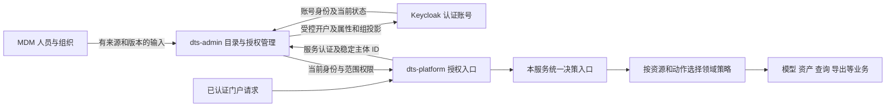

# F11 权限重构架构与实施契约

**状态**：IN_PROGRESS（设计工作基线，未实施、未完成发布准入）

**更新日期**：2026-09-19

**源码核对基线**：af84d7190cebea3a1621a215f13c472d0542cf8c

**需求依据**：用户要求将人员/部门职责划分写入 F11，并继续从架构角度完善重构。本文是设计产出，不授权数据库迁移或发布。

**关联**：[Feature 与任务](../features/F11-权限模型统一与RBAC重构/README.md) · [现状与修订账本](F11-permission-model-survey-20260919.md) · [F9 既有契约](F9-permission-chain-contract.md) · [验收方案](../it/F11-身份与权限重构验收.md)

## 1. 目标、边界与设计决策

用户获得三个可验证结果：人员调岗/撤权后旧会话不能继续使用原权限；管理员能配置明确的业务动作而不是靠菜单猜测权限；升级前后的每一项授权变化可解释、可追溯、可安全恢复。

本 Feature 覆盖 dts-admin、dts-platform 及两端既有人员/角色/菜单页面。其他数据消费服务列入影响清单和兼容验证；不默认修改大屏身份键，不引入新权限产品或新增一套 IAM 服务，不替换 Keycloak，不实施跨部门共享审批，不擅自确定正在重构的密级政策，不据文档直接删除历史表。

| 决策 | 设计选择 | 理由与约束 |
|---|---|---|
| D01 字段各有权威来源 | MDM 管人事/组织；DTS 管业务目录及授权；Keycloak 管登录账号 | 允许副本，禁止同一字段多方自由覆盖；数据源所有权见 §3 |
| D02 分域角色事实源 | 采用方案 B 作为设计基线：Keycloak 三员及保留运维角色，DTS 数据/自定义业务角色 | 各角色类别只认一个来源；EMPLOYEE 权威归 DTS，外部旧名称只作有期限的迁移输入 |
| D03 统一身份、分域判权 | admin 组装当前有效身份；业务服务执行资源策略 | 不把每个对象授权变成跨服务远程调用；不把人员目录做成万能业务判权服务 |
| D04 权限粒度 | 模块:资源:业务动作；按钮码与权限点显式映射 | 不预定 40–60 个，不按每个按钮创建权限；编辑、审核、执行、导出、授权分别表达 |
| D05 新鲜度 | F9 保留每授权边界当前复核，仅请求内复用允许结果 | 不用会话缓存替代当前角色/部门/启停/人员密级；失效通知只作优化 |
| D06 迁移方式 | 扩展兼容 → 核验回填 → 新旧结果对比 → 按完整切片切换 → 延后清理 | 任一切片只有一个最终判定方；禁止旧允许 OR 新允许 |
| D07 三员与密级 | 保持现有已确认职责；新权限配置不能突破职责约束 | 自定义角色不能取得受保留的三员/应急权限；密级策略未定不迁移判定语义 |

D01–D07 是本轮文档采用的设计选择。新增业务授权、现场数据映射及密级政策仍按 §11 待决项约束；设计基线不等于客户已经确认全部权限矩阵。

## 2. 模块职责与信任边界

- admin：来源接入、人员/组织目录、账号绑定、角色/权限字典和变更审批；复用现有 KeycloakAdminClient、审批和审计入口。
- platform：通过现有 AdminDirectoryGateway 获取当前身份；在现有认证扩展点生成请求上下文，统一方法准入、对象判定和 allowedActions。
- 各业务领域：拥有资源、ACL、状态机、事务和查询约束。统一入口负责组合和解释，不把六类表强行合成一张通用表。
- 浏览器传来的角色、部门、密级、actor、权限列表都不是授权依据。可信服务也必须证明被代理用户身份，不能仅凭一个服务密钥冒充任意用户。
- Keycloak 内部数据由其接口维护，不直接写认证库。平台不跨库查询 admin 表。

## 3. 人员、组织和账号的字段归属

### 3.1 权威字段表

| 字段/对象 | 权威维护方 | DTS 保存及消费规则 | Keycloak 规则 |
|---|---|---|---|
| sourceSystem、sourcePersonId/personCode、姓名、主部门 | MDM；未接入 MDM 的本地人员由 admin 受控维护 | 来源必须标记；同一记录不能混用 MDM 与本地任意覆盖；部门精确关联组织编码 | 按认证展示/集成需要投影，回读不覆盖 MDM 字段 |
| 部门编码、名称、父子关系、状态 | MDM → organization_node；本地组织走受控维护 | organization_node 是 DTS 唯一组织目录；改名不换身份 | Group 仅作映射，groupId/path 不是 DTS 部门身份 |
| 人事原始状态、业务在职/离职状态 | 原始值来自 MDM；业务含义由已确认映射决定 | 原始状态与有效生命周期分开，未知状态不猜测 | 不能把任意 MDM status 直接写成 enabled |
| issuer/realm、kc_id、账号存在/启用、认证凭据、会话 | Keycloak | 只保存绑定、必要快照及读取时间；鉴权取当前账号状态；不保存密码 | 唯一账号控制面 |
| dtsAccessState 业务准入状态 | admin 受控操作或已确认离职规则 | ACTIVE/SUSPENDED/RETIRED，独立于账号启停；已停用不被普通同步恢复 | 不由组同步回写覆盖 |
| 三员、ROLE_OP_ADMIN 等保留身份 | Keycloak，继续经过现有受控管理入口 | 按保留角色白名单读取，不接纳本地同名自定义角色 | 不允许普通数据角色同步覆盖 |
| 数据角色、自定义业务角色、动作权限、授权范围 | admin | 当前生效版本及审批记录为准；同一角色不得同时从两方累加 | 旧数据角色只在迁移核验期读取，切换后不再作为授权源 |
| personnelLevel 人员密级 | 新密级契约指定的受控入口，当前待冻结 | 必须携带政策版本与来源；缺失/非法不得回落到更宽旧值 | 仅投影，不从部门级别或人员标签推导 |
| 数据密级、资源 owner、对象 ACL | 对应业务资源服务 | 保持 F9 和资源服务的不变量；人员同步不能修改 | 不同步为认证账号属性 |

当前 KeycloakUserProvisioningService 明确将 MDM 状态作为 mdm_enabled 展示，并保留已有账号启停，新账号默认禁用。目标生命周期政策必须先核实上游状态含义（Q21），不能把本次建议描述为现有离职联动已实现。新密级规则见 Q22，不能由 F11 自行定密。

### 3.2 现有表如何处理

| 表/存储 | 目标定位 | 必须完成的迁移 |
|---|---|---|
| organization_node | 唯一本地业务组织目录 | 保留业务 ID、dept_code、现有资源引用；校验父子循环/孤儿；keycloak_group_id 只作映射 |
| admin_keycloak_user | 演进为唯一在用的 DTS 人员目录及当前账号绑定 | 保留本地 id；增加来源、源版本、准入/同步状态；区分 MDM 权威字段与认证快照；支持未开户人员，kc_id 不再要求每个人员行都有值 |
| person_profile | 历史只读归档 | 核验历史主体再合并必要信息；移除目录、快照回填、姓名和组派生等全部运行依赖；归档期间保留原数据与证据 |
| admin_role_member | 普通角色成员关系的目标权威记录 | 用稳定账号主体替代 username；保留审批、来源、有效状态；用户名仅展示 |
| admin_role_assignment | 含作用范围/动作的历史授权记录 | 不能只抽出 role 丢掉 scope_org_id、dataset_ids、operations；转为带范围的授权绑定或保留适配，T02/T08 固定逐列转换 |
| portal_menu_visibility | 菜单到权限的引用 | 保留历史角色/密级规则作迁移证据；现有 role_code 非空约束及角色必填写入链必须一起调整 |
| Keycloak 用户、Group | 认证账号和组投影 | 通过接口同步与核对，不把内部表并入 DTS schema |

这里选择复用 admin_keycloak_user，而不是重启 person_profile 或建立第三套人员主表。它当前是快照，不能靠改名成为权威目录；T07 必须改变字段写入权和读取契约。逻辑上的“人员”与“账号”仍独立：本期每个人员至多一个当前人类账号绑定，多账号诉求另行设计。导入行/操作流水可承担待开户与绑定历史记录，不新增另一份当前人员目录。

### 3.3 稳定身份与状态

- 人员本地 ID 不随姓名/用户名改变；外部身份以 sourceSystem + 已核实不复用的 sourcePersonId 关联。personCode 是否可复用、大小写规则必须经 Q21 确认，不能默认是永久主体。
- 账号主体为 issuer/realm + kc_id；单 realm 内沿用 F9 directoryUserId。username、组路径、部门名称都不作为授权关联键。
- 改名不改变绑定；同名新 kc_id 不覆盖旧绑定、不自动继承授权。重新绑定必须经独立核验/审批，旧授权保留历史但不转移。
- 同步状态与人员生命周期分别保存：PENDING、APPLYING、SYNCED、RETRYABLE_FAILURE、CONFLICT 只表示对外同步结果，不代表有权登录。
- 业务准入按账号当前存在且启用、有效绑定、DTS 准入状态及已冻结的人事生命周期政策共同判断。系统服务账号使用独立主体类型和调用范围，不伪造成无部门员工；现有三员/应急账号按受控账户类型处理，不能由“缺少 MDM 记录”推断禁用或放行。

## 4. 单向字段同步、幂等与恢复

### 4.1 写入与同步协议

1. MDM 输入先校验来源、记录主键、版本/顺序、部门引用及字段存在性。未传表示不改，显式清空必须有字段允许清空规则；全量缺行不直接等于删除，必须有可信完整批次标记及政策。
2. 每个聚合的有效变更与待同步操作在同一 DTS 事务提交；复用人员导入批次/行记录承载关联，T07 先核对既有持久化重试能力，缺口以最小操作记录补足。不能靠内存任务或日志作为唯一重试依据。
3. 由后台同步调用 Keycloak 接口，记录目标版本、尝试次数、下次重试时间和结果。外部成功、本地回执丢失时，先按已验证稳定绑定/操作关联核对，再重试，不能因同名用户存在而认领账号。
4. 同一人员/部门串行应用或以版本 CAS 防乱序；有源版本则拒绝旧版本覆盖。无上游版本时，重复摘要只负责幂等，不能证明先后；冲突进入核验队列，见 Q21。
5. Keycloak 回读只更新认证权威字段和投影核验结果。MDM→DTS→Keycloak 的部门/姓名不会被旧 Keycloak 值或 person_profile 回灌。
6. 人员同步可按既有逐行事务保留部分成功，但批次必须分别报告目录接收、有效变更、开户/投影成功、待重试/冲突数量；HTTP 200 或文件落盘不表示业务全部成功。

同步器使用受管字段/组允许列表，只调整 DTS 映射的部门属性与部门组成员关系，保留非本功能拥有的组、角色和账号配置。部门组不得隐含授予三员/保留运维角色；若现场已有此类继承，先核验并冻结映射，不能由一次普通调岗触发提权或覆盖人工职责配置。

### 4.2 关键场景

| 场景 | DTS 提交后的行为 | Keycloak/失败恢复 |
|---|---|---|
| 新人员入职 | 目录行可先存在、无账号时不可访问；不自动继承同名授权 | 开户默认禁用，沿既有审批启用；失败留待处理状态 |
| A 部门调到 B 部门 | 权威目录提交 B，后续授权用 B；A 部门原对象归属不转移 | 组与属性投影可重试，旧 A 投影不覆盖 B；已认证账号不因单纯展示投影失败获得额外权限 |
| 撤角色/撤对象授权 | 授权变更提交后的下一授权边界读取新值 | 不等退出登录或令牌过期；事件只是刷新 UI/清理优化 |
| 已确认离职或业务禁用 | 先以 DTS 准入状态阻止后续业务访问，保留历史归属 | 账号禁用/会话撤销按政策异步执行并核验；MDM 活跃标志不能解除人工业务禁用 |
| Keycloak 直接停用/删除账号 | 当前身份查询拒绝，不能拿本地 enabled 快照放行 | 调查漂移原因；不由目录同步自动重新启用/重建 |
| 部门删除/停用 | 查当前及待生效人员、子部门、资源引用；不能证明完整性则拒绝删除 | 优先停用，保留稳定编码与资源归属；Group 删除失败不等于业务部门恢复 |

对 MDM→DTS 的外部传输延迟不声称“即时”；明确是权威变更在 DTS 提交后开始的新授权判定生效。Keycloak 账号状态由当前读取确认。已进入外部执行的任务按 F9 后续边界复核/取消语义处理，不宣称跨系统原子撤回。

## 5. 唯一当前身份解析与认证接入

### 5.1 服务接口与权威上下文

admin 内提供一个 IdentityResolutionService（目标职责名，尚未实现），登录/profile、目录、菜单及后台调用均复用它。跨服务复用 AdminDirectoryGateway/既有服务认证；扩展服务端受控接口，不能新开匿名通用用户解析接口。

内部 v2 协议设计为 POST /api/platform/identity/resolve，请求只含 subjectId、purpose、requestId；issuer/tenant 从已认证调用者的服务配置确定。purpose 仅为 AUTHORIZATION 或 MENU，各服务有明确允许用途。subjectId 必须由调用服务从已验证会话或已封存后台发起人取得，拒绝浏览器请求体/header 指定；服务认证缺失、调用方越界均拒绝。目录搜索与解析任意候选人员是不同权限，不通过此接口开放批量枚举。

| 响应字段 | 类型/语义 | 约束 |
|---|---|---|
| schemaVersion、subjectType | integer、USER/SYSTEM | v2 用户解析只返回 USER；SYSTEM 走独立服务主体路径 |
| subjectId、issuer、directoryId、tenantId | string | subjectId 是 kc_id，不是 username；返回主体必须与请求精确一致 |
| username、displayName | string | 展示字段，不能回退用它重新绑定账号 |
| accountState、dtsAccessState、lifecycleState | enum | 分别表达账号、业务准入、经确认的人事状态；未知不伪造 ACTIVE |
| department | object 或 null | code、name；无部门的三员/服务类型按其政策，不伪造根部门；需要部门的动作缺值拒绝 |
| roles | string[] | 从分域权威源规范化得到；保留角色不能由本地自定义角色注入 |
| grants | object[] | 每项含 grantId、roleCode、permissionCodes、scope、source、revision；权限与范围保持绑定 |
| scope | object | 明确 TENANT/DEPARTMENT/RESOURCE；服务端租户、精确部门编码或规范资源键；null 不表示全所 |
| personnelLevel、classificationPolicyVersion | string 或 null | 来自 Q22 确认的政策；缺失不从角色/部门推出更高密级 |
| directoryRevision、authorizationRevision、evaluatedAt | string/string/UTC 时间 | 为本次读取证据，不暗示 Keycloak 与 DTS 具有同一分布式事务版本 |

保留旧目录响应的过渡适配，禁止旧客户端因此获得新权限。v2 使用明确 schemaVersion；未知必需字段/枚举按不可用处理。解析器分别读取账号当前状态、本地已生效目录、角色及带范围授权；禁止 username 查找失败降级、快照容错放行、把两个角色来源盲目取并集。

### 5.2 接入位置与错误语义

- platform 的 PortalOpaqueTokenIntrospector/认证过滤扩展、ModelingIdentityService 必须接入同一当前上下文；不能只改登录返回值。保留 portal_session 协议及既有 sub=username 对外契约，通过 directory_user_id 连接稳定账号，避免破坏大屏/旧 owner 比较。
- admin 本地认证后同样使用统一解析；待开户人员不能进入业务鉴权。旧会话缺稳定 ID 要求重新登录，不按当前同名用户静默补 ID。
- 每次受保护 HTTP 请求至多一次身份远程解析；worker 执行、重试、幂等重放是新的授权边界。只在边界内复用，角色/部门/启停/密级/范围变更不得靠旧会话等待失效。
- 延续 F9：身份不成立或已停用为 401；身份有效但动作不允许为 403；对象不可见与不存在同为通用 404；权威依赖不可用为 503；不得返回受保护业务内容。菜单故障显示“菜单暂不可用”，不伪装成功空菜单。
- 新鲜度和超时保留 F9 的每边界 2 秒总预算、无自动重试；Keycloak/admin 故障不使用上次允许。后台同步重试与授权读取不重试是两条不同链路。

## 6. 权限点、菜单与职责约束

### 6.1 权限模型及变更

逻辑关系是 用户账号 → 带范围的角色绑定 → 角色权限 → 资源动作。复用现有角色目录和审批；补 permission(code、resourceType、action、status、assignableClass)、role_permission(roleId、permissionCode、policyRevision) 等最小关系，表名与迁移由 T03/T08 固定。字典唯一约束、引用约束、保留项不可普通修改、禁用权限拒绝、未知权限拒绝必须可测。

示例 modeling:model:read、modeling:model:update、modeling:model:submit、modeling:model:review、modeling:model:execute、catalog:dataset:export。一个页面按钮可消费多个动作结果，一个权限可供多个入口使用；审计 ButtonCodes 是行为记录分类，不作为权限授予依据。

- 必须形成“角色 × 动作 × 作用范围 × 资源状态 × 入口”的默认矩阵；替换注解数量不是完成标准。ROLE_ADMIN、ROLE_OP_ADMIN 的兼容/应急能力单列，不能通过前缀或通配符默认拥有全部新权限。
- admin_role_assignment 的 operations、dataset_ids、scope_org_id 逐项核验并转换，禁止将某个数据集的导出授权扩大成整个角色全局导出。多个绑定的权限和范围逐项匹配，不能把所有权限并集与所有范围并集做笛卡尔组合。
- role_permission 的修改继续走审批：提交记录 before/after 和基线版本，审批/应用时复核申请者与审批者当前职责，禁止自审；版本过期拒绝，重复应用幂等，失败不得标 APPLIED。
- 自定义角色不得配置保留的三员管理、审批自举、应急豁免权限。三员角色互斥及授权边界沿既有已确认政策；角色授权人不能通过修改自身角色的权限集扩大自己或审批人的职责。
- F9 当前不允许纯自定义角色建模。第一切片保持该规则；将来允许须显式修改角色/动作矩阵和范围模型，不能因为字典可配置就自动放开。

角色-权限配置按完整版本原子生效。运行实例加载不可变政策快照，当前身份返回授权版本；决策时发现所需版本与本实例版本不兼容则重新取得当前版本或拒绝，不用旧权限配置配新范围拼接结果。仅字典/已版本化静态映射可缓存，当前主体角色、scope、状态及允许决定仍受 §5 新鲜度约束。配置版本生效与可恢复审计/待发通知同事务记录，消息延迟不作为继续使用旧允许的理由。

### 6.2 菜单跨服务调用

现有 platform PortalMenuClient 用服务头和 roles 查询参数请求 admin /api/menu，默认不转发用户 Authorization。因此不能仅删除 permitAll/roles 参数。

目标链路：platform 在已认证入口取得稳定用户 ID → 经现有服务认证调用 admin 内部 POST /api/platform/menus/resolve（v2 设计）→ admin 复用 §5 当前解析并生成菜单。内部请求只携带 subjectId、requestId、schemaVersion，身份来自服务端上下文；客户端 roles/permissions/dataLevel 不参与判定。admin 自身 UI 的 /api/menu 从自己的已认证主体解析。两个入口共用菜单服务但认证方式不同，服务认证不等于某个人员权限。

迁移先部署接受 v2 的 admin，再切 platform 调用，验证真实员工菜单，再关闭对外旧参数接口；旧匿名枚举入口关闭前，兼容流量只能经已验证的内部调用边界，不允许把对外匿名状态当作长期双轨策略。

- 菜单是导航投影，接口还必须检查动作、资源范围、密级和状态。页面可见但某对象不可操作是合法结果；不能承诺“菜单可见即所有按钮接口可调”。
- 菜单和按钮消费当前权限/allowedActions，禁止前端复制角色名单。直接 URL、直接 API 访问仍经过同一授权链。
- 旧 role_code 与新 permission_code 在每个迁移切片明确选择旧模式或新模式，不隐式 OR。新模式调整必填角色的写入校验和非空 schema；空绑定默认不可见，读取不能自动补种子授权。
- 建立菜单最小 read 权限以及父节点聚合规则；维护动作与读取动作的包含关系必须显式映射。没有权限时返回空导航；后端故障返回明确错误，不能触发“默认全部菜单”。
- 沿用 F10 菜单结构和稳定 ID；允许的行为差异必须在迁移清单中逐项说明，不强求保留历史错误授权，也不借重构改信息架构。

## 7. 统一决策入口与领域策略

目标接口 evaluate(subjectContext, action, resourceContext)，另提供 evaluateBatch 及查询范围约束接口；它们是同一政策的不同消费方式，不建立第二套权限矩阵。资源由服务端加载，使用既有 CatalogAssetType/CatalogAssetKey 或 modeling 稳定 ID，附 tenant、ownerDepartment、classification、state、version、owner/ACL；不信任请求体里的资源属性。

### 7.1 组合规则

1. 检查主体有效、租户一致、动作与资源类型有效，再按 resourceType + action 路由适用策略。未登记动作/资源或没有必需策略默认拒绝。
2. 动作能力必须由一个覆盖目标范围的有效绑定授予；再叠加该动作适用的部门、密级、ACL、生命周期和职责分离等强制条件。
3. 领域策略内部已有的多条授权 ALLOW/DENY 合并语义先冻结；适用显式 DENY 优先。强制条件失败不能被其他 provider 的 ALLOW 覆盖。
4. provider 返回 ALLOW、DENY、NOT_APPLICABLE、INDETERMINATE。NOT_APPLICABLE 仅表示当前策略不适用，不是允许；必需策略缺失或 INDETERMINATE 失败关闭，区分拒绝与依赖不可用。
5. 输出 decision、reasonCode、policyId/revision、适用条件、requestId；成功及拒绝的关键证据进入现有审计。外部错误不得暴露不可见资源名称/部门，内部审计保留受控定位信息。

对数据消费，允许结果还必须携带并执行适用的数据约束（例如允许字段和行过滤），不能只返回一个布尔值。当前 PolicyService 已持久化 OBJECT/FIELD/ROW 策略，实际查询/导出消费情况仍需 T01/T05 核验；迁移适配必须保留其字段、有效期和约束，不把带 ROW 限制的 ALLOW 转为全表允许。执行器通过受控表达式解析/参数化机制应用约束，不直接拼接客户端表达式；不能执行必需约束的消费方拒绝该动作，不能丢弃约束继续返回数据。

原有六类机制存在嵌套调用，也处理不同资源和约束。T05 先建立实际调用和策略适用表，再逐领域适配；例如 AccessChecker.canPerform 已调用 AssetActionPolicyEvaluator，适配后不能重复计算或形成互相调用环。

### 7.2 必须保持的业务不变量

- 模型 EDITOR 只授定义编辑，不产生数据读取、导出、审核、再次授权或降低密级能力。大屏越级仅限已有展示出口，不扩散到查询/导出；analytics 身份键保持兼容。
- 部门编码精确相等，1153 与 153、父子部门均不得自动等同；所级管理范围不等于任意数据可读；跨部门引用/共享仍按 F9 拒绝。
- 查询/列表在分页与总数计算前施加服务端范围条件；批量加载 ACL，不能逐对象远程解析身份。无法下推时必须有有界且保持计数不泄露的领域实现，不能取全量后靠浏览器过滤。
- 混合批量写/执行先展开实际作用范围，全部通过后再提交副作用；沿用模型锁/版本确定并发撤权先后。预览、查询、导出、直连接口、异步下载均列入入口清单。
- USER 后台任务封存稳定发起人、动作、tenant、scope/version，执行/重试重新授权。SYSTEM 仅限已验证服务和既有部署绑定，不伪装 owner，不获得编辑/新发布/共享权。
- 密级保持独立政策端口；当前豁免和兼容角色须按 Q22/Q24 冻结，不通过通用“管理员全放行”复制到新入口。新政策未定时不得以“迁移结果一致”固化已知漏洞，也不得自行改变政策。

## 8. 历史身份迁移、兼容发布与回退

### 8.1 迁移前必须有的清单

按 realm、sourceSystem、角色类别、当前账号 ID 导出受控清单：重复/冲突用户名、改名、账号重建、孤儿与未知来源人员、空部门/无效部门、旧人员表差异、角色双表交集、作用范围和动作、菜单权限规则、历史审批和待执行任务。清单脱敏，原始证据受控保存，不将个人信息或 token 写入仓库。

历史 username→subjectId 必须有授予时的账号/审计/导入关联证据。当前同名账号存在不构成证明；无法证明或多解的记录隔离，不自动授权。新账号绑定不使旧 ACL/旧任务复活。授权旧记录、归属和审计文字保留，不覆盖历史 actor。

| 阶段 | 操作与完成条件 | 失败/回退边界 |
|---|---|---|
| E 扩展 | 增加可空字段、来源/版本、约束与协议兼容；旧版本仍可运行 | 不删除旧列/表；DDL 与数据回填分开，记录备份和恢复方法 |
| B 核验回填 | 稳定身份映射、带范围授权、菜单映射逐批校验；统计已映射/隔离/冲突 | 不匹配不猜测；歧义记录影响的账号/动作保持拒绝并有清单 |
| S 对比 | 旧路径为唯一生效方，新路径只记录判定差异；差异含获批政策变更与缺陷分类 | 新路径不产生副作用；未解释差异不进入切换 |
| C 切换 | 按 tenant + 完整资源域/动作切片统一切到新判定，admin/platform/worker 使用一致版本 | 不按随机请求或用户拆开职责链；旧会话按稳定 ID 规则重新登录；回切前确认数据兼容 |
| R 安全恢复 | 恢复兼容代码或关闭受影响写入/导出等动作，保留数据与可安全读取能力 | 不回退已生效撤权、离职、密级限制；旧代码无法识别新语义时不允许直接回切 |
| X 收缩 | 实际目标版本、旧请求/任务/令牌、历史别名使用清零，经演练后移除旧读取 | person_profile 先只读归档；删列/删表独立列出后续授权动作，不能随普通发布执行 |

身份目录从“Keycloak 部门镜像”为准切到“MDM/DTS 字段所有权”为准时设置明确切换版本。旧快照刷新写者须先变为字段受控写入或停用，再启用新目录事实源；不能让未升级旧实例/脚本继续整行覆盖。回填期间的新写由版本化写入口记录并补齐，必要时短时冻结授权管理写入，但不以全库停写或破坏业务数据换一致性。

### 8.2 完整切片与 Task 顺序

| 切片 | 用户结果 | 任务组合 | 出口条件 |
|---|---|---|---|
| A 身份/目录 | 人员和账号分源管理，建模当前身份一致，调岗撤权不靠重新登录 | T01 契约 + T07 + T02 + T08 对应迁移 + T09 对应验收 | 当前目录/会话/后台调用齐全；F9 身份回归通过，才停旧目录写者 |
| B 首个授权闭环 | 以建模定义读取/编辑和既有菜单为首个候选切片，动作/对象/按钮一致 | T03 + T04 + T05 + T08 对应切换 + T09 | 保留发布审核/执行职责，不放纯自定义角色建模；菜单服务调用与直达 API 同验 |
| C 扩面与清理 | 按实际入口矩阵逐模块迁移后，再退出历史角色/旧读取 | T04/T05 后续批次 → T06，T08/T09 随批 | 所有纳入范围入口有归属和证据，不以替换 508 处注解宣布完成 |

T08 的迁移设计、预检工具设计和 T09 的测试设计可早于编码完成；切换/回退执行必须依赖受测制品。T06 是对应切片迁移完成后的收缩工作，不能被排入“先清理再统一身份”。实际本 Sprint 实施容量/服务批次尚待排期，保留 F11 标识追踪跨期剩余范围。

## 9. 质量预算、审计与运行保障

以下为设计门槛，未测试。新增吞吐/时延承诺必须先测现场规模，不把示例当 SLA。

| 约束 | 可执行验证/证据 | owner |
|---|---|---|
| 身份新鲜度/2 秒总预算 | 撤角色、调岗、停用后旧会话直调；注入目录超时；断言 503 且无副作用；计数每边界最多一次远程身份调用 | T02/T09，继承 F9 |
| 批量查询有界 | 对 20/200 行记录 SQL、目录调用数、p50/p95；禁止逐行外部请求；策略批量接口上限 200，列表保留现有分页限制 | T05/T09 |
| 身份服务容量 | T01 记录首切片请求量/并发、目录规模与 Keycloak 调用成本，T09 按实测负载复验 2 秒预算及连接池边界；容量未证实时不直接推广全平台，也不以放宽身份新鲜度解决超载 | T01/T02/T09 |
| 同步持久化恢复 | 进程中断、外部成功回执丢失、乱序/重复、部门先后依赖；恢复后不重复账号/授权，待处理记录不丢 | T07/T09 |
| 授权管理一致性 | 并发审批/更新 CAS、重复应用、过期请求、禁止自审；角色-权限变更和其审计/通知待发记录具有可恢复边界 | T03/T09 |
| 撤权与执行 | 混合批量零副作用、重复幂等请求、worker 重试复核；并发锁/版本顺序有真实持久化证明 | T04/T05/T09 |
| 来源与策略漂移 | 记录 sourceRevision、directoryRevision、authorizationRevision、policyRevision、targetVersion；发现未知写者或投影倒退即阻断该切片切换 | T07/T08 |
| 运维可见性 | 同步积压年龄/次数/冲突数、身份不可用、策略异常、shadow 差异、授权变更审计缺失；告警阈值由 T09 基于现场基线冻结 | T09 |
| 跨服务故障 | admin/Keycloak 不可用时明确错误且失败关闭，恢复后无需手改库；重试仅用于后台同步，有限退避且有人工处置入口 | T02/T07/T09 |

审计复用 dts-admin 动作字典和现有持久化链路，记录稳定主体、操作、原因、政策版本、变更申请、请求/后台任务关联。拒绝审计不能随业务事务回滚丢失；不记录密码、令牌或业务数据行。运维手册至少覆盖同步积压、Keycloak 已成功但本地未确认、身份服务中断、角色撤销不一致、切换失败和恢复演练。不得未经调查宣称已存在可复用的 admin outbox/Kafka 同步能力。

## 10. 需求到验收的追溯

| 需求/风险 | 契约 | Task | 验收组 |
|---|---|---|---|
| 单一字段来源、人员与账号分离 | D01、§3–4 | T01/T07 | IT-68、IT-69 |
| 稳定身份、旧会话撤权、当前属性 | D02/D05、§5 | T02 | IT-70、IT-71 |
| 权限点、菜单、三员与范围绑定 | D04/D07、§6 | T03/T04 | IT-72、IT-73 |
| 组合规则、列表/批量、后台与数据出口 | D03、§7 | T04/T05 | IT-74、IT-75 |
| 存量身份、兼容升级、安全恢复 | D06、§8 | T06/T08 | IT-76、IT-77 |
| 性能、审计、中文页面与故障可处置 | §9 | T09 | IT-78、IT-79 |

全部验收当前未执行。源码/测试、正式构建/交付包、容器部署、真实页面验收分别记录。正式测试构建仅在 /data/dts-stack 取得 Git 提交并核对 SHA 后执行，运行部署走 /opt/dts/release/dts-stack；不在开发目录构建，不向容器打补丁。

## 11. 待决事项与作用范围

| 编号 | 当前设计结论或缺口 | 关闭责任/证据 | 阻断范围 |
|---|---|---|---|
| Q16 | 按方案 B 分域，字段所有权按 §3；不再等待“所有表归哪边”的泛化选择 | T01/T02 固定全部保留角色和历史同名冲突映射 | 未映射角色的切换 |
| Q17 | 权限按业务资源+动作；逐入口矩阵及默认映射待冻结 | T03/T04，业务/安全 owner 确认动作差异 | 对应模块权限迁移 |
| Q18 | 先 A 再 B/C 的工作计划；实际实施范围、owner、人日和时间盒未承诺 | Feature owner 按 T01 数据规模和首切片结果排期 | 编码排期/发布批次；不阻断设计 |
| Q19 | 扩展→回填→对比→切换→收缩；旧版本矩阵、切换窗口/回退点待现场基线 | T08 的版本、备份、脚本与演练结果 | 目标环境切换 |
| Q20 | 保持既有三员职责，不因权限配置开放自授权 | T03 明确保留权限、审批矩阵和同人多角色约束 | 管理端权限配置上线 |
| Q21 | MDM 稳定人员 ID、编码复用/大小写、版本顺序、status 含义、全量删除语义未知 | T01/T07 取得对接方协议及脱敏样例；我方只定义接收/拒绝行为 | 自动生命周期变更、歧义回填；可先做显式稳定 ID 的切片 |
| Q22 | 人员密级权威维护入口、映射版本及角色豁免仍需新密级政策 | 安全业务 owner；T05/T09 绑定新矩阵与验收账号 | 密级语义迁移及依赖该语义的验收；其他切片保留原已确认契约 |
| Q23 | 不走 MDM 的三员、本地账号、应急账号、服务主体清单待核对 | T01/T02 分类账户、负责人及有效范围 | 该类账户迁移，禁止凭缺字段自动处理 |
| Q24 | 既有 scoped assignment、ROLE_ADMIN/OP_ADMIN 特例、Ranger/外部消费端实际作用待核对 | T01/T04/T05 输出入口/策略/消费者清单 | 对应授权域切换；Ranger 未核对前不关闭或旁路 |

以上缺口均有归属，不用“保持迁移前结果一致”掩盖政策未决；也不以所有待决项未关闭为由阻止可独立进行的设计和证据核验。

## 12. 本轮设计走查结论

已在文档中处理原 review 的六项问题：会话缓存改为当前边界复核（§5）；菜单服务调用单列（§6.2）；provider 适用/合并/错误规则明确（§7）；字段权威源及写入职责明确（§3–4）；历史主体证据、隔离和回退明确（§8）；现状错误及未经复验的运行事实回到修订账本。

新增发现已记录：MDM status 不是已确认离职状态；admin_role_assignment 带资源/动作范围；person_profile 不止两处读取；现有组织删除保护已使用新快照/Keycloak；admin_keycloak_user 非空 kc_id 与待开户人员存在模型冲突。物理迁移、权限默认矩阵、上游状态和密级政策仍是对应 Task 的实施前置，不能将本文标为 G1 全部 PASS。
