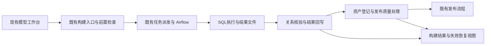

# F13 / F14 联合设计与实施顺序

修订：2026-09-24；初审源码基线：`v2.2.3@a7f54ef1e`；本轮核对基线：`576aba566`。状态：DRAFT（业务与架构决策已补齐，DDL/源码适配及实际验证待M0）。

## 授权、目标与边界

用户已确认：先完善 F13 文档、新建 F14；后续 F13/F14 一起编码。2026-09-24 再次评审后开始编码，进度见下方实施记录；不更改现场数据库或自动部署。联合编码表示共享设计先确定、同一批次集成和验收，不要求启动多个代理，不允许先独立实现两套状态再拼接。

- F14「模型构建与失败恢复」：从点击构建开始，到目标关系核验并完成结果回写；解决构建前检查、执行、回调和安全恢复。
- F13「发布质量处理与失败恢复」：消费已核验的构建结果，办理资产登记、工程验证结果确认、治理质量检查及质量结论保存。
- 继承 F3：物化完成即结束建模；治理检查影响后续发布，不能把已完成的构建重新显示为失败。仅建表完成不等于数据已生成。
- 复用模型、加工实现、候选发布单、执行批次、资产目录和执行身份。无第二套调度引擎、模型台账、SQL 解析器或资产登记系统。
- F1/F5 的字段、分层和来源合法性问题仍归原能力修复；本计划只统一提交到执行的检查结果并加入回归。F8 负责质量规则实际运行，F13消费其结果。F11权限与密级规则不放宽。
- 不包含评审工作流重构、指标/BI功能、跨引擎事务性回滚、自动回滚用户SQL。评审阶段同类卡单单独登记后续，不隐藏为本次已解决。
- 2026-09-24确认：业务数据质量是否阻止发布由既有平台级ADVISORY/BLOCKING策略决定，不再将“所有模型必须业务质量通过”作为统一要求。工程核验、资产身份、权限和密级仍是必要条件；本次不修改任何环境的策略值，不增加模型级策略或临时豁免入口。

## 现状证据与复用点

以下为本次源码核对，不代表当前现场复现或验收通过。初审基线为`a7f54ef1e`；提交前后的分支核对发现新增`20400602b`，已增量核对其运行目标错误处理，不把该修复重复列为待从零实现。该提交自带测试代码不等于本次已执行测试。

| 证据 | 当前能力/限制 | 本次责任 |
|---|---|---|
| `ModelMaterializationDispatchService.reconcileSubmitted/reconcileOne/abandonBuild` | 已有派发核对、超时、回调补偿和受控放弃；缺结果证据时不会直接判成功 | F14补齐分阶段恢复，保留既有机制 |
| `ModelMaterializationRunArtifactService.syncAndProbe/finalizeRun` | 已校验批次、模型/实现版本、manifest/run_results及物理关系；失败可能进入终态 | F14不能只重放HTTP就宣称可续跑；需明确终态恢复协议 |
| `ModelingExecutionAuthorization`、`ModelingSystemExecution` | 已有发起人当前授权与受限机器执行范围 | 两Feature复用，独立HTTP与后台线程分别建立并关闭身份 |
| `ModelPublicationQualityReconciler` | 质量阶段每5秒扫描，阻断主要记录日志 | F13增加持久状态、动作、恢复和批次隔离 |
| `ModelReleaseCandidateApplicationService.refreshDrift` | `/refresh` 当前将旧单置为STALE；前端用它废弃旧发布单 | 保持不变；新的立即检查命令不得复用该含义 |
| `JdbcCatalogAssetSemanticStore.upsertEvidence` | 唯一键含 evidence_ref；不同引用不天然互斥 | 登记失败原始异常待复现，禁止先认定版本号是根因 |
| `20400602b`：`DbtRuntimeTargetException` / `ModelMaterializationRuntimeFailureRecorder` | 已传递DBT_TARGET_*错误、返回422并在失败事务结束后记录派发原因；启动时的失效目标校正已于2026-09-24改为按dts-admin默认数据湖托管镜像匹配、在镜像同步后执行 | F14复用错误处理与校正，不再按库名推断目标 |
| `dbt_task_factory.py` | prepare_runtime→dbt_build→sync_manifest_and_probe→finalize_run；最后还清理进程与凭据租约 | F14同时核对失败结果和清理结果，互不覆盖 |
| `modeling_platform_governance_policy`（2026-09-24 只读核对） | 本机与openEuler的`PLATFORM_DEFAULT`均为`BLOCKING`（种子`20260811_02`）；测试人员当前遇到的全部是强制模式 | ADVISORY场景只能在隔离实例切换验证；现场策略不改 |
| `CandidateGovernanceQualityEvidenceService.evaluateLive`、`ModelPublicationQualityReconciler`、`requirePublishable` | `required = !policy.available() \|\| qualityGate == BLOCKING`；reconciler、读侧PUBLISH过滤和发布命令均只在`required && !passed`时阻断。ADVISORY不阻断**已是现有行为**；冻结快照保存`required`但无策略指纹 | F13保留并回归该行为，只补实际质量状态、策略指纹与可见性，不重新实现“仅提示”判定 |
| `c81a3bac4`（S10DC-111方案A） | 汇总表已配置加工映射、无聚合、无度量、无指标引用时，保存加工配置即提示；构建门禁`MODEL_SPEC_SUMMARY_MEASURE_REQUIRED`文案带同样处理方式 | F14-T02复用为构建前检查项之一，不另建规则 |
| `20400602b`遗留边界 | 运行规格失败记录器**排除**三个来源可用性码（写入会触发finalize的`rejectPersistedAvailabilityStale`直接拒绝收尾）；因此准备阶段的来源围栏拒绝仍显示`UPSTREAM_FAILED`。计划调度路径只返回错误码，`PlanOperationalRunArtifactService`仍写通用码 | F14-T03决定准备阶段围栏拒绝是否进入STALE流程；计划调度首发原因登记为后续，不在本期隐含完成 |
| openEuler 2026-09-23 环境重置 | 数据库重新初始化而`services/`保留：`upload/dbt-config.json`目标ID失效（S10DC-99复现）；Airflow `dags/`残留13个旧入湖DAG、17个任务JSON及11个加密上传件，入湖DAG按自增execution ID命名会与新任务撞名；`.dts-scoped-runs/`残留10个旧候选目录（已按清单备份后清理） | F14-T08把“数据库重置/迁移而运行目录保留”纳入运行手册和验收，不依赖人工清理 |

历史 Jira 样本：S10DC-70/111（构建前信息与字段角色）、110（DIM识别）、98/99（配置、来源及独立回调身份）、113（质量状态回写）、114（错误包装）、112（代码与只读参考）。这些工单的既有修复继续保留；不能根据历史故障认定当前代码仍然失败。

## 共同业务结果与运行标识

| 结果 | 权威来源 | 允许的解释 |
|---|---|---|
| 构建结果 | 既有派发/执行记录及物理关系核验 | 未开始、处理中、待恢复、失败、完成；各阶段结果独立展示 |
| 资产登记 | 既有目录与登记记录 | 登记失败不抹掉物理表已经构建的事实 |
| 工程验证 | 同一次构建的 dbt 测试与关系核验 | 通过后不因治理质量等待而显示仍在运行 |
| 治理质量 | F8运行记录与F13检查结果 | 无规则、运行中、不合格、过期、平台故障分别处理；实际质量结论与是否允许发布分开 |
| 发布 | 既有发布状态与冻结质量结论 | 只有当前合法版本的必要检查通过后才能发布 |

执行身份至少关联 tenantId、planId、candidateId、构建时candidateVersion、pipelineRunGroupId、attempt、模型/实现版本与校验和、运行包校验和、目标环境及来源版本。候选版本正常推进不产生新的物理构建事实；恢复按执行批次及recoveryOperationId识别，状态更新仍检查当前候选版本与合法转换。F13以qualityRoundId区分同一候选版本的多次质量重跑，不能把候选版本直接当物理资产或检查轮次身份。

共同故障表达：`stage`、`code`、`category`、`message`、`correlationId`、`occurredAt`、`retryable`、`allowedActions`。类别沿用可兼容的系统故障/用户处理/等待；具体修复动作必须结合错误明细、规则绑定、当前版本和权限生成，不能只靠一个错误码猜测。

首发失败、后续回写失败、资源清理失败分别保留；不得用后续通用错误覆盖首发原因。用户文案用业务名称；日志可记录脱敏技术详情，凭据、完整SQL及敏感结果不进入页面/日志。

## 共享架构与所有权

- F14持有构建阶段记录与恢复操作；F13持有质量检查状态。共同字段是接口约定，不新建跨领域万能状态机。
- 发布总状态枚举及质量结论冻结规则本期原则上保留；确需增加恢复转换，F14-T01需列出原状态、事件、前提、副作用及并发结果，不能靠直接改数据库终态恢复。
- 构建成功的F13交接为可重读的持久事实：即使通知丢失，F13仍可从现有执行证据发现待处理项；事件只加速，不是唯一推进来源。
- 外部请求不持有长期数据库锁；先短事务领取，再调用，最后按版本/领取令牌提交。所有后台操作必须有超时和单条隔离。
- UI只读取一致结果；没有新状态/读取失败时显示“尚未确认/状态读取失败”，不能假称成功或正在执行。

## 架构决策 A01–A05（2026-09-24）

下列行为作为两Feature共同实现依据；M0核对现有表/方法的适配落点，不再由各任务自行解释这些规则。

### A01 状态写入职责

| 记录/结果 | 唯一负责的写入路径 | 其他模块的边界 |
|---|---|---|
| 普通执行批次及SQL事实 | 既有派发与运行服务；Airflow通过受认证回调提交执行事实 | F13不修改执行结果；页面不依据日志/错误文案推导成功 |
| 核验与恢复结果 | F14扩展既有运行服务及附属恢复操作 | 保留原失败执行历史，不将原Airflow失败任务改成成功 |
| 候选生命周期、命令审计与冻结结果 | 既有ModelReleaseCandidateService命令事务 | F13/F14调用其受控命令，不各自直接更新候选表 |
| 资产登记 | 既有目录登记服务 | F13使用既有资产标识与幂等能力，不再建资产台账 |
| 质量运行结论 | F8质量运行服务 | F13只选择和核对当前轮次的运行结果，不伪造PASSED |
| 检查调度与诊断 | F13检查状态记录 | 记录不是发布或构建的第二份业务事实；写失败可从业务记录修复 |

既有运行结果查询和质量证据读取共同使用一套“当前有效构建结果”解析规则：普通构建按已核验完成记录；恢复构建按原SQL成功证据与已提交恢复结果的组合。不能一处认为原执行FAILED、另一处认为已恢复成功。共享字段集中到既有查询/证据组件，不新建调度平台或通用流程引擎。

### A02 构建完成到质量阶段的持久交接

完成记录标识为`tenant/plan/candidate/runGroup/attempt`，逐模型保存entry/model/implementation版本、目标物理定位、invocationId、包与metadata校验和、工程核验结论和完成时间；恢复时另含operationId。它是既有执行证据的不可变引用集合，优先由现有记录组成，不建立另一份运行台账。

正常顺序：SQL结果持久保存 → 逐项物理核验 → 同一数据库事务提交合法候选转换、命令审计及完成证据引用 → F13读取已提交记录 → 登记资产 → 按质量策略形成发布检查结果。多模型只有必要输出全部满足条件才生成批次完成结果，单项成功仍独立展示。

故障顺序：提交完成事务前中断则不交接，由F14恢复；提交后通知丢失则扫描已提交事实补办；登记成功但检查状态写入失败则按同一完成记录幂等重试登记。F13只推进既有流程已授权进入检查阶段的候选；BUILT且用户尚未启动后续流程不自动视为卡单，也不自动发布。

扫描按当前批次与候选有效范围消费；候选版本正常推进不重复创建资产。若现有完成记录与候选不在同一事务边界，M0必须给出原子提交或可靠补偿的实际落点，禁止只发送内存事件。对应F14-IT-04/05及联合ST-07/08。

### A03 原执行与恢复操作分开推进

原执行失败历史保持不变；恢复操作具有独立operationId及领取令牌，与原group/attempt关联。进入恢复模式、设置活动操作及候选受控转换同事务完成。普通派发、失败/超时扫描、放弃和回调必须读取同一活动模式，恢复模式不再根据原DagRun的FAILED终结当前恢复。

旧回调可补充历史诊断，不能改变活动恢复及当前结果；恢复回调必须携带有效operationId和领取信息，旧协议缺字段不能推测成新恢复回调。恢复完成的事务追加核验结果并推进候选，由A01的同一解析规则供F13与页面读取。详细转换见F14；对应ST-05/06。

### A04 检查轮次与发布策略

F13当前轮次绑定构建完成引用、策略值指纹、预期资产集合、规则/绑定版本与选中的质量runId集合。新质量重跑/绑定变更开启新qualityRoundId；重跑先持久化新轮次与幂等受理请求，再调用F8，消除旧worker在受理间隙提交通过的窗口。重复通知和立即检查只唤醒已有轮次。晚到事件只能触发重新读取，不能直接把其携带的结果设为当前结论。

ADVISORY允许带质量提示完成发布前检查，不自动启动或等待业务质量任务；BLOCKING要求必要检查通过。质量服务不可读与构建证据损坏分开：前者在ADVISORY下可提示，后者两种策略都拒绝。未取得有效策略时拒绝，不默认ADVISORY。

保留既有“通过检查后冻结结果”规则：冻结前策略/绑定/运行选择变化使旧检查结果失效，建立新轮次；冻结后发布消费当时策略与结果快照，后续全局策略变化不静默改写该候选和已发布历史。页面标明适用的检查策略；发布时仍重新核对权限、密级及原有版本/来源要求。将新策略追溯强制应用于已通过候选不在本期新增范围，不能通过修改全局策略暗中实现。每次定时加工的持续质量监控仍归F8，不用一次发布结果替代。

### A05 页面与测试观察点

接口分别提供构建结果、实际质量状态、适用策略、发布检查是否允许及原因。内部兼容状态QUALITY_PASSED不等于业务质量PASSED；对用户显示“发布前检查通过”，同时保留“未检测/不合格/已过期”等真实质量提示。查看页面只读，allowedActions由服务端计算，发布命令重新验证。

必须分别证明：SQL实际执行次数、已提交完成记录、目录登记身份、当前qualityRoundId及runId、发布快照、原失败与恢复审计。单元测试验证规则，真实数据库集成证明事务/竞争，系统测试证明页面和跨服务业务结果；不得互相替代。

## 联合编码顺序与共享文件责任

| 里程碑 | 任务 | 必须形成的结果 |
|---|---|---|
| M0 联合设计核对 | F13-T01 + F14-T01 | 真实登记根因、阶段/终态恢复表、身份边界、API兼容、迁移及测试夹具确定；两个T01互不等待对方完成，各自产出后共同冻结 |
| M1 最早集成切片 | F14-T02/T03 + F13-T02/T03 | 一条真实明细模型构建→登记→质量等待/通过路径；不能等所有页面完成才联调 |
| M2 故障恢复 | F14-T04/T05 + F13-T04/T06后端部分 | 回调重放、终态恢复、唤醒并发与质量重跑服务；T06不依赖尚未完成的T05页面 |
| M3 界面与兼容 | F14-T06 + F13-T05/T06，衔接 F15-T02–T05 | 按 [F15](../features/F15-构建与发布分离及交付状态解耦/README.md) 分开构建、发布及资产/质量/运行入口；分别展示本业务结果和恢复动作，保留必要依赖检查；F13-T06到此完成页面验收 |
| M4 联合交付 | F13-T07/T08 + F14-T07/T08 | 同批提交对应的正式包、双环境验收和回退演练；两Feature分别满足自身完成条件 |

`ModelReleaseCandidateContract/ApplicationService/Resource`、`ModelPublishDialog`、`ModelReleaseWorkflowPanel`由同一集成人维护：先合并接口模型，再落各阶段动作，不能双方独立覆盖。F13负责qualityReconcile部分，F14负责materializationProgress/recovery部分；如采用已有等价字段，M0统一替换设计示例。构建、身份组件主要归F14；质量状态及登记组件主要归F13。具体执行者在开工时填写，不虚构已分配人员。

## 验收、容量与发布

- 用例：[F13](../it/F13-发布质量对账验收.md)、[F14与联合验收](../it/F14-模型构建与失败恢复验收.md)。所有新增/修订用例NOT_RUN。
- 单元用例分别见两Feature的`单元测试用例.md`，真实联合系统场景见[系统测试用例](../it/F13-F14-系统测试用例.md)；系统场景细化既有IT，不作为额外独立业务覆盖重复累计。
- F13原11人日估算作废；联合范围包含跨服务集成、故障注入、Chrome95、离线一致性、回退与缺陷复验。M0完成后按实测复杂度和可用人员重估，不给未核实工期。
- F13-T08负责共同发布记录，F14-T08提供Airflow/dbt资源、阶段记录迁移与恢复回退专项证据；不重复计算同一构建和部署工作。
- 开发目录只修改/静态检查/提交；commit & push后构建目录`/data/dts-stack`核对工作区、`git pull --ff-only`及SHA后构建测试；部署走正式目录。两环境使用同一提交的正式制品，按架构分别记录镜像digest与包校验和。
- 先关闭恢复入口、停止领取新操作；所有在途恢复经服务完成或受控终止，确认没有旧版无法识别的活动状态后才能回退。旧代码不会读取新表不等于旧代码能处理所有新状态；按各新增状态证明兼容性。不手工改数据库任务，不热补丁容器。
- G0=GAP：2026-09-24已只读核对两环境质量策略、候选状态分布与运行目录残留（见上表），登记根因复现与现场夹具仍待M0；G1=GAP（M0待完成）、G2/G3/G4=PENDING。文档完善不代表已编码或已验收。

## 2026-09-24 review 修订记录

核对方式：源码符号与现有测试类逐项核实（均存在且在`pom.xml`白名单内）；两环境只读查询策略、候选状态与运行目录；文档链接与用例引用自动校验（41条IT、12个ST、F13 16/F14 17项单元用例，无失效引用）。

| 修订 | 落点 | 理由 |
|---|---|---|
| 两环境策略均为BLOCKING；ADVISORY放行是现有行为 | 本文件证据表；F13设计§1；新增F13-IT-21 | 避免重写既有放行判定、误把现有能力计为新增 |
| 目标数仓以默认数据湖托管镜像确定（用户确认并已实现，替代指纹方案） | F14设计§2；F14-T02第5–7项；F14-UT-17 | `20400602b`按库名唯一替换无法证明同一物理库，且`@PostConstruct`时镜像尚未同步 |
| 平台只读展示目标数仓，修改在admin「数据湖配置」 | F14设计§2；F14-T06第6项 | 当前无dbt配置页；admin已有默认数据湖配置，平台不新增修改入口 |
| 准备阶段围栏首发原因 | F14设计§5；F14-T03第6项；F14-IT-20 | 记录器有意排除来源码，页面仍只显示通用码 |
| 数据库重置而运行目录保留 | 本文件证据表；F14设计§8；F14-T08第6项；F14-IT-19 | 09-23现场实际发生：目标ID失效、DAG按自增ID撞名、候选运行目录残留 |
| `c81a3bac4`汇总表度量前置 | 本文件证据表；F14-T02第8项 | 已实现，纳入统一检查结果与回归，不另建规则 |

未改动既有A01–A05决策、状态/DDL草案和用例预期；全部仍为NOT_RUN，G1仍GAP待M0。

## 2026-09-24 再审与首批实施

源码基线 `99f669c5f`。总体职责与 A01–A05 无阻碍首批编码的问题；登记失败原始异常、恢复状态落库及并发夹具仍未完成 M0，不能据此宣布整体验收就绪。先实施已确定、不依赖新表的 F14-T02 与 F13 质量边界回归；持久化检查轮次、恢复操作及页面随后按里程碑推进。

- F14：构建提交及准备执行共同调用 `DbtConfigService.loadRuntimeConfig` 校验配置目标与唯一活动默认数据湖托管镜像。失败在创建执行批次前拒绝；已存在但不同的目标只报告不一致，不改配置。只读查询采用新增 `GET /api/modeling/build-target`，只返回目标名称、数据源标识、库/schema、检查结果与管理员处理说明，不返回连接串、账号、凭据，不调用有初始化副作用的 `loadConfig`。
- 错误码区分：未设置目标 `DBT_TARGET_NOT_CONFIGURED`；配置ID不存在 `DBT_TARGET_DATASOURCE_NOT_FOUND`；目标停用 `DBT_TARGET_INACTIVE`；默认镜像缺失/歧义分别 `DBT_DEFAULT_LAKE_UNAVAILABLE` / `DBT_DEFAULT_LAKE_AMBIGUOUS`；现存目标不一致 `DBT_TARGET_DEFAULT_LAKE_MISMATCH`。配置读取与启动校正职责分开。
- F13：现有 `evaluateLive` 将目标定位、构建证据读取和质量服务读取放在同一个异常分支，ADVISORY 下可能把构建证据异常降为提示。拆分为必要的构建/资产核验和可按策略处理的业务质量读取；质量返回必须覆盖预期资产，不能因部分结果为成功就判全部通过。业务质量缺失/失败/过期/服务不可读在 ADVISORY 下仍仅提示。

### 2026-09-24 续批实施

F14-T03准备阶段来源拒绝已选择既有STALE路径：原事务回滚后，核对候选/版本/最新尝试及运行规格尚未消费，在同一写事务保存运行终态、候选转换与严格审计。详见F14设计§5和[实施记录](F13-F14-首批编码与测试记录.md)。不单写来源码后依赖finalize收尾，不改变已开始的SQL任务或恢复历史。

PostgreSQL测试揭示严格审计共用仓储原先总是独立提交；本批补随业务写事务提交的入口，同时保留只读及普通审计独立写入。此修复是A02事务边界的必要基础，不代表完成引用、质量轮次或恢复操作已经实现。F13-T03、F14-T02/T03保持IN_PROGRESS，其余M0/M1缺口继续登记。
- 上述行为先补反例测试，再在 `/data/dts-stack` 执行；测试结果另记。F13/F14 整体仍 IN_PROGRESS，IT/ST 不沿用单元测试结果。
