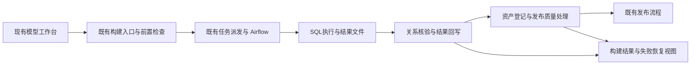

# F13 / F14 联合设计与实施顺序

日期：2026-09-23；源码基线：`v2.2.3@a7f54ef1e`。状态：DRAFT（设计文档已补充，实施核对与测试未执行）。

## 授权、目标与边界

用户已确认：先完善 F13 文档、新建 F14；后续 F13/F14 一起编码。本次仅文档，不编码、测试、部署或更改数据库。联合编码表示共享设计先确定、同一批次集成和验收，不要求启动多个代理，不允许先独立实现两套状态再拼接。

- F14「模型构建与失败恢复」：从点击构建开始，到目标关系核验并完成结果回写；解决构建前检查、执行、回调和安全恢复。
- F13「发布质量处理与失败恢复」：消费已核验的构建结果，办理资产登记、工程验证结果确认、治理质量检查及质量结论保存。
- 继承 F3：物化完成即结束建模；治理检查影响后续发布，不能把已完成的构建重新显示为失败。仅建表完成不等于数据已生成。
- 复用模型、加工实现、候选发布单、执行批次、资产目录和执行身份。无第二套调度引擎、模型台账、SQL 解析器或资产登记系统。
- F1/F5 的字段、分层和来源合法性问题仍归原能力修复；本计划只统一提交到执行的检查结果并加入回归。F8 负责质量规则实际运行，F13消费其结果。F11权限与密级规则不放宽。
- 不包含评审工作流重构、指标/BI功能、跨引擎事务性回滚、自动回滚用户SQL。评审阶段同类卡单单独登记后续，不隐藏为本次已解决。

## 现状证据与复用点

以下为本次源码核对，不代表当前现场复现或验收通过。

| 证据 | 当前能力/限制 | 本次责任 |
|---|---|---|
| `ModelMaterializationDispatchService.reconcileSubmitted/reconcileOne/abandonBuild` | 已有派发核对、超时、回调补偿和受控放弃；缺结果证据时不会直接判成功 | F14补齐分阶段恢复，保留既有机制 |
| `ModelMaterializationRunArtifactService.syncAndProbe/finalizeRun` | 已校验批次、模型/实现版本、manifest/run_results及物理关系；失败可能进入终态 | F14不能只重放HTTP就宣称可续跑；需明确终态恢复协议 |
| `ModelingExecutionAuthorization`、`ModelingSystemExecution` | 已有发起人当前授权与受限机器执行范围 | 两Feature复用，独立HTTP与后台线程分别建立并关闭身份 |
| `ModelPublicationQualityReconciler` | 质量阶段每5秒扫描，阻断主要记录日志 | F13增加持久状态、动作、恢复和批次隔离 |
| `ModelReleaseCandidateApplicationService.refreshDrift` | `/refresh` 当前将旧单置为STALE；前端用它废弃旧发布单 | 保持不变；新的立即检查命令不得复用该含义 |
| `JdbcCatalogAssetSemanticStore.upsertEvidence` | 唯一键含 evidence_ref；不同引用不天然互斥 | 登记失败原始异常待复现，禁止先认定版本号是根因 |
| `dbt_task_factory.py` | prepare_runtime→dbt_build→sync_manifest_and_probe→finalize_run；最后还清理进程与凭据租约 | F14同时核对失败结果和清理结果，互不覆盖 |

历史 Jira 样本：S10DC-70/111（构建前信息与字段角色）、110（DIM识别）、98/99（配置、来源及独立回调身份）、113（质量状态回写）、114（错误包装）、112（代码与只读参考）。这些工单的既有修复继续保留；不能根据历史故障认定当前代码仍然失败。

## 共同业务结果与运行标识

| 结果 | 权威来源 | 允许的解释 |
|---|---|---|
| 构建结果 | 既有派发/执行记录及物理关系核验 | 未开始、处理中、待恢复、失败、完成；各阶段结果独立展示 |
| 资产登记 | 既有目录与登记记录 | 登记失败不抹掉物理表已经构建的事实 |
| 工程验证 | 同一次构建的 dbt 测试与关系核验 | 通过后不因治理质量等待而显示仍在运行 |
| 治理质量 | F8运行记录与F13检查结果 | 无规则、运行中、不合格、过期、平台故障分别处理 |
| 发布 | 既有发布状态与冻结质量结论 | 只有当前合法版本的必要检查通过后才能发布 |

执行身份至少关联 tenantId、planId、candidateId、构建时candidateVersion、pipelineRunGroupId、attempt、模型/实现版本与校验和、运行包校验和、目标环境及来源版本。候选版本正常推进不产生新的物理构建事实；恢复按执行批次识别，状态更新仍检查当前候选版本与合法转换。F13的检查行按当前质量轮次/候选版本管理，不能把候选版本直接当物理资产身份。

共同故障表达：`stage`、`code`、`category`、`message`、`correlationId`、`occurredAt`、`retryable`、`allowedActions`。类别沿用可兼容的系统故障/用户处理/等待；具体修复动作必须结合错误明细、规则绑定、当前版本和权限生成，不能只靠一个错误码猜测。

首发失败、后续回写失败、资源清理失败分别保留；不得用后续通用错误覆盖首发原因。用户文案用业务名称；日志可记录脱敏技术详情，凭据、完整SQL及敏感结果不进入页面/日志。

## 共享架构与所有权

- F14持有构建阶段记录与恢复操作；F13持有质量检查状态。共同字段是接口约定，不新建跨领域万能状态机。
- 发布总状态枚举及质量结论冻结规则本期原则上保留；确需增加恢复转换，F14-T01需列出原状态、事件、前提、副作用及并发结果，不能靠直接改数据库终态恢复。
- 构建成功的F13交接为可重读的持久事实：即使通知丢失，F13仍可从现有执行证据发现待处理项；事件只加速，不是唯一推进来源。
- 外部请求不持有长期数据库锁；先短事务领取，再调用，最后按版本/领取令牌提交。所有后台操作必须有超时和单条隔离。
- UI只读取一致结果；没有新状态/读取失败时显示“尚未确认/状态读取失败”，不能假称成功或正在执行。

## 联合编码顺序与共享文件责任

| 里程碑 | 任务 | 必须形成的结果 |
|---|---|---|
| M0 联合设计核对 | F13-T01 + F14-T01 | 真实登记根因、阶段/终态恢复表、身份边界、API兼容、迁移及测试夹具确定；两个T01互不等待对方完成，各自产出后共同冻结 |
| M1 最早集成切片 | F14-T02/T03 + F13-T02/T03 | 一条真实明细模型构建→登记→质量等待/通过路径；不能等所有页面完成才联调 |
| M2 故障恢复 | F14-T04/T05 + F13-T04/T06 | 回调重放、终态恢复、唤醒并发与质量重跑完整路径 |
| M3 界面与兼容 | F14-T06 + F13-T05 | 同一面板如实展示每阶段结果、原因和可执行操作 |
| M4 联合交付 | F13-T07/T08 + F14-T07/T08 | 同批提交对应的正式包、双环境验收和回退演练；两Feature分别满足自身完成条件 |

`ModelReleaseCandidateContract/ApplicationService/Resource`、`ModelPublishDialog`、`ModelReleaseWorkflowPanel`由同一集成人维护：先合并接口模型，再落各阶段动作，不能双方独立覆盖。F13负责qualityReconcile部分，F14负责materializationProgress/recovery部分；如采用已有等价字段，M0统一替换设计示例。构建、身份组件主要归F14；质量状态及登记组件主要归F13。具体执行者在开工时填写，不虚构已分配人员。

## 验收、容量与发布

- 用例：[F13](../it/F13-发布质量对账验收.md)、[F14与联合验收](../it/F14-模型构建与失败恢复验收.md)。所有新增/修订用例NOT_RUN。
- F13原11人日估算作废；联合范围包含跨服务集成、故障注入、Chrome95、离线一致性、回退与缺陷复验。M0完成后按实测复杂度和可用人员重估，不给未核实工期。
- F13-T08负责共同发布记录，F14-T08提供Airflow/dbt资源、阶段记录迁移与恢复回退专项证据；不重复计算同一构建和部署工作。
- 开发目录只修改/静态检查/提交；commit & push后构建目录`/data/dts-stack`核对工作区、`git pull --ff-only`及SHA后构建测试；部署走正式目录。两环境使用同一提交的正式制品，按架构分别记录镜像digest与包校验和。
- 先关闭恢复入口、停止领取新操作；所有在途恢复经服务完成或受控终止，确认没有旧版无法识别的活动状态后才能回退。旧代码不会读取新表不等于旧代码能处理所有新状态；按各新增状态证明兼容性。不手工改数据库任务，不热补丁容器。
- G0=GAP（历史基线需重新核验）、G1=GAP（M0待完成）、G2/G3/G4=PENDING。文档完善不代表已编码或已验收。
