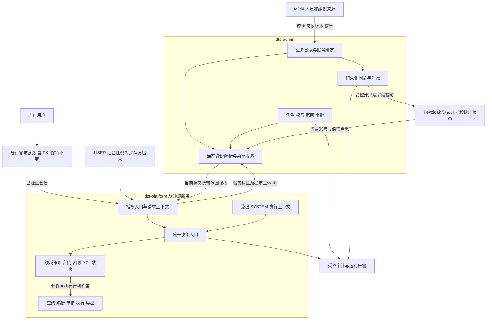

# F11 权限模型统一与 RBAC 重构：架构设计总览

日期：2026-09-20。源码核对：`52bc4ce4c4c2fec0e6dac1d938800d390b0e8db1`，同时评审当前工作区文档。

状态：文档走查通过，可作为整体设计基线；G0/G1 仍有缺口，未开始本次重构编码，IT-68–79 全部未执行。

依据：[详细架构与实施契约](../../assests/F11-permission-architecture.md)、[任务清单](README.md)、[验收方案](../../it/F11-身份与权限重构验收.md)。本总览解释整体协作，字段、接口和验收细节以这些契约为准。

## 1. 重构目标与边界

F11 将人员目录、登录账号、业务权限和对象约束接成一条可验证的授权链：调岗、停用、撤权在下一授权边界生效；权限可以按业务动作配置；升级中的每项授权变化可以解释和恢复。

覆盖 dts-admin、dts-platform 及既有人员、角色、菜单页面，外部消费服务纳入影响与兼容清单。保留 Keycloak、既有领域策略和 F9 职责边界。新密级政策、跨部门共享审批及建模版本草案的全部改造不自动并入本 Feature。

**PKI 保持现状，不纳入改造。** 登录流程、证书校验、证书与账号映射、回调、插件和认证配置、认证结果及会话衔接协议均不更改。F11 只在既有认证成功后处理业务授权；目录迁移不得间接改变 PKI 登录归属。无法从既有可信关联取得稳定主体时，记录兼容缺口，不改 PKI 或按用户名猜测主体。

## 2. 总体架构

admin 负责目录、身份组装和授权管理；业务服务负责本域资源判定、查询约束与事务。浏览器提供的角色、部门、密级和 actor 不作为授权事实。服务凭证只证明调用服务，不能替代被代理用户的身份和权限。

## 3. 数据归属与稳定身份

| 对象 | 权威维护方与处理方式 |
|---|---|
| 人员、部门业务字段 | MDM 为接入记录提供权威字段；本地人员另有明确来源和受控入口，禁止同一字段互相覆盖 |
| organization_node | DTS 唯一组织目录，保留稳定 dept_code；Keycloak Group ID/path 只作映射 |
| admin_keycloak_user | 演进为唯一在用的本地人员目录及当前账号绑定，保留本地 ID，支持尚无 kc_id 的待开户人员 |
| person_profile | 核验迁移并退出所有运行读取后只读归档；不恢复第二套当前人员主表 |
| 登录账号与认证状态 | Keycloak 管 kc_id、启停、凭据和会话；DTS 通过接口维护及核验，不直接写认证库 |
| 三员及保留运维角色 | Keycloak 为权威源；普通自定义角色不能注入保留身份 |
| 数据角色、动作权限及作用范围 | DTS 为权威源；保留每项授予的范围、来源、审批和有效版本 |
| 人员密级、资源密级与 ACL | 人员密级按待冻结政策管理；资源密级、归属和 ACL 由对应领域管理 |

区分三个标识：本地人员目录 ID、来源记录键、账号主体 `issuer/realm + kc_id`。授权绑定使用稳定账号主体；用户名、部门名称和 Group 路径只用于展示或映射。同名新账号不得继承旧授权，人员重新绑定须独立核验。

personCode 按大小写区分来源记录；首次用户名分配受占用状态和导入顺序影响。保存并复用经核验的绑定，不能重新推导用户名恢复身份。编码复用、调岗标记账号与实际登录账号的关系仍由 Q21 核实。

MDM 原始状态、DTS 业务准入状态、Keycloak enabled、同步状态分别保存。同步成功不等于可以登录，MDM 活跃值不能解除人工停用；待开户人员不可访问受保护业务。

## 4. 在线身份与菜单链路

1. 服务端从已验证会话取得稳定主体 ID。旧会话缺 ID 时要求重新登录，不通过同名查找补齐。
2. admin 的统一解析器读取当前账号、目录属性、分域角色和带范围授权。内部身份接口为 `POST /api/platform/identity/resolve`，限定调用服务和用途，租户/issuer 从可信服务配置取得。
3. platform 在本请求内复用当前上下文。每个授权边界最多一次远程身份解析，总预算 2 秒，无读取自动重试，不跨请求缓存允许结果。
4. 菜单使用 `POST /api/platform/menus/resolve` 组合返回当前上下文和菜单树；认证与菜单共用该结果，避免再次解析。菜单故障与“没有可见菜单”分别反馈。

身份失效为 401、动作不足为 403、对象不可见与不存在均为通用 404、权威依赖不可用为 503。菜单只是导航，按钮消费服务端 allowedActions；直接 URL/API 仍须经过完整授权。

## 5. 业务权限与对象决策

授权关系为：**账号 → 带范围的角色授予 → 业务动作 → 目标资源约束**。

权限码按“模块:资源:动作”定义，例如 `modeling:model:update`、`catalog:dataset:export`。动作权限和它的组织/资源范围必须绑定在同一项 grant 上；不能将所有权限与所有范围分别合并后交叉授权。

统一决策入口按资源类型与动作选择领域策略，依次验证主体、租户、动作授予及范围、部门、密级、ACL、资源状态和职责分离。适用的明确拒绝优先；必需策略缺失或无法确定时失败关闭，未适用不等于允许。判定保留原因及政策版本用于审计。

查询、详情、批量、导出和后台执行消费同一政策。行过滤、字段限制必须传递并实际执行；列表先施加范围，再分页和计数，不能先全量取出后隐藏。批量加载 ACL，禁止逐对象远程解析身份。

保留 F9 不变量：部门编码精确比较；EDITOR 不附带数据消费、审核、再授权或降低密级能力；大屏展示例外不扩散到导出和直查；SYSTEM 不冒充 owner。角色权限变更走审批和版本控制，禁止自审、自授权及保留职责注入。

## 6. 同步、后台执行与故障恢复

目录有效变更与待同步操作在同一本地事务提交，后台通过 Keycloak 接口投影受管字段和部门组。只按字段权威来源写入；Keycloak 旧属性、旧 profile 不得覆盖新的人事字段。

重复输入幂等，旧版本不能覆盖新版本；未知顺序或绑定歧义进入核验。全量文件缺行不能直接视为删除。远端成功但本地回执丢失时，按稳定绑定和操作记录对账，不能按同名认领。逐行部分成功必须准确报告成功、待重试和冲突。

USER 任务封存发起人、执行 ID、租户、动作及范围，执行、重试和重放时重新授权。候选构建从业务版本反查改为按执行 ID 读取发起人；手工运行复用已有派发表 initiator_id，保留绑定版本、范围校验和有效部署守卫。SYSTEM 仅运行被验证的既有绑定，不能作为目录故障时的替代身份。

单次身份读取不重试，与后台任务重新调度属于不同层次。目录持续中断时，建模任务等待还是耗尽预算失败由 Q25 冻结。需要当前 USER 身份的操作在依赖故障时失败关闭；服务冗余、容量、告警及恢复目标由 Q26 验证，不能把设计选择当作可用性验收完成。

## 7. 迁移顺序与交付切片

迁移依次执行：**扩展兼容 → 核验回填 → 新旧结果对比 → 完整域切换 → 安全恢复演练 → 延后收缩**。

历史用户名授权必须有授予时的主体证据；不明记录隔离。对比阶段只有旧路径生效，新路径不产生副作用；切换以租户及完整资源/动作域为单位，每个域只有一个最终判定方，禁止“旧允许 OR 新允许”。新字段权威源启用前，先约束或停用旧整行覆盖写者。

回退不能恢复已撤销的权限、已禁用人员或匿名菜单。旧代码无法识别新语义时关闭受影响动作；历史表先归档，删表删列另列后续动作。

| 切片 | 主要任务 | 出口条件 |
|---|---|---|
| A：身份与目录 | T01、T07、T02，配套 T08/T09 | 登录、菜单、建模与后台身份一致；绑定迁移和 F9 身份回归通过 |
| B：首个权限闭环 | T03、T04、T05，配套 T08/T09 | 首选建模定义读取/编辑及既有菜单；动作、对象、按钮、直达 API 一致 |
| C：扩面与清理 | T04/T05 逐域迁移，最后 T06 | 入口和消费者覆盖有证据，旧来源/角色/读取具备退出条件 |

T08 负责迁移、兼容发布和恢复；T09 负责集成、真实性能、业务及运维验收，均随切片推进。依赖不按任务编号顺排，不以替换注解数量衡量完成。

## 8. 验收与未决输入

IT-68–79 覆盖字段权威、同步恢复、稳定主体、下一边界撤权、菜单委托、范围授权、策略组合、后台与消费出口、迁移回退、性能、审计及中文页面。重点采集 20/200 行查询的 SQL/远程调用数和耗时，验证批量拒绝无新副作用、故障后可恢复及 Chrome95 页面行为。PKI 仅做兼容回归：原登录方式与证书/账号映射不变，迁移前后仍认证为同一账号，再单独验证登录后的业务权限。

实施前按切片关闭：角色动作及三员矩阵（Q16/17/20）、来源身份/生命周期（Q21）、新密级政策（Q22）、特殊账号及外部消费者（Q23/24）、后台故障政策与可用性（Q25/26），并明确 owner、容量、时间盒、兼容版本及发布窗口（Q18/19）。这些缺口不影响阅读整体设计，但阻断依赖它们的实现或上线。

本轮校正了“用户名与导入顺序无关”和“手工运行仅靠业务版本反查身份”两项断言，补齐菜单单次解析及可用性边界；历史测试失败报告保留为待复验，不冒充本次结果。验证范围为源码阅读及文档静态检查，未执行业务测试、构建、部署或真实页面验收。

正式构建测试须在 `/data/dts-stack` 获取已提交代码并核对 SHA 后执行；正式部署使用 `/opt/dts/release/dts-stack`。各阶段证据分别记录，文档通过不等于 Feature DONE。
