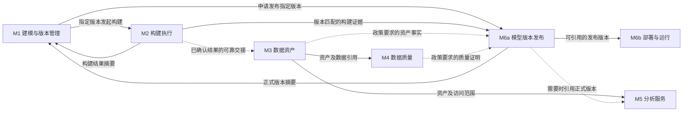

# F15 模块划分与协作设计

**版本**：2026-09-25；**依据**：用户确认本轮架构 review 建议。
**源码基线**：`d0679e09f`；**性质**：目标设计，未代表实现、迁移或运行验收完成。
**责任**：F15-T01 维护模块/接口基线，具体实现按第 8 节唯一归属分工。本文件为 F15 共享架构依据，README、Task、原型和验收均引用它。

## 1. 目标与基本决策

模型工作台服务模型设计和版本管理。用户可以保存、校验设计后结束；需要物理落地时发起构建，构建结果确认后结束本次建模操作。登记、质量、治理、分析准备和运行在所属功能办理，不作为建模页面的必经步骤或总进度。

划分的是现有系统内部职责，不要求新增六个微服务、六套数据库或六个菜单。继续复用模型台账、构建执行、统一资产标识、质量引擎、分析同步和发布/运行能力。文件当前位于 modeling 包，不等于其全部职责都应该归建模。

固定规则：

- 业务对象拥有自己的状态；其他模块只能引用其结果，通过所属模块命令改变它，不能直接代写。
- 操作的前置条件在发起该操作时检查；模型保存和构建不依赖治理质量合格、目录登记或分析就绪。
- 下游失败不能撤销已确认的上游结果；未知和待确认不能伪装成成功。
- 页面和读接口同时减负；删列后继续读取综合交付状态不算完成。
- 不取消现有审批、权限、密级、版本/来源和发布策略约束。政策不放行时只拒绝对应操作。
- 模块间传递已提交、可追溯的结果，不靠用户逐步点击或一个总状态推进全部业务。

## 2. 模块边界、状态与页面归属

| 模块 | 负责的逻辑 | 拥有的对象/状态 | 输入与输出 | 用户入口及不承担的工作 |
|---|---|---|---|---|
| M1 建模与版本管理 | 字段、粒度、关联、来源引用、实现配置、模型校验、版本历史；发起构建或版本发布请求 | 模型定义和实现版本、设计校验结果；区分当前编辑版本与已发布版本 | 输入用户设计；输出可复现的模型/实现快照。读取 M2 构建摘要和 M6a 本地发布摘要 | 模型工作台/详情；不维护登记、质量、分析或运行状态，不编排它们 |
| M2 构建执行 | 按指定版本和目标生成/执行构建，必要工程检查、目标核验、结果持久化与恢复 | 构建尝试、逐对象结果、工程核验证据；未开始/执行中/待确认/完成/失败等 | 消费 M1 快照及合法物理来源；输出绑定版本/目标的构建结果和可靠交接记录 | 构建操作/记录；不负责业务质量、目录治理或正式发布 |
| M3 数据资产 | 物理对象登记、资产身份、元数据、负责人等治理资料；资产开放使用的目录和申请入口 | 统一资产记录、登记尝试、治理事项；登记待办/失败/已登记与开放范围分开 | 消费 M2 已确认物理结果；输出稳定资产引用和治理事实 | 资产目录/详情及其待处理记录；无资产 ID 时按模型/运行定位登记失败，不要求用户先发布 |
| M4 数据质量 | 配置规则、发起检查、记录执行情况与数据结论、处置问题 | 规则版本、质量运行、报告/问题；执行成功与数据合格分别记录 | 消费有权访问的资产/数据及规则；输出适用于特定资产版本/数据范围的报告 | 质量规则/报告；不回写构建结果，不以发布策略改变报告结论 |
| M5 分析服务 | 数据集/语义配置、分析资源同步、分析可用性验证 | 分析资源及其准备/同步状态 | 消费有权访问的资产和需要的正式版本引用；输出可分析资源 | 现有数据服务/分析功能，资产详情可链接；登记成功不等于分析准备成功 |
| M6 发布与运行 | M6a 办理模型版本发布、准入/审批、发布记录；M6b 办理部署、执行关联、启用和运行监控 | M6a 发布申请/快照/正式版本；M6b 部署版本、执行关联、调度配置及每次运行记录，彼此独立 | M6a 消费模型/构建与政策需要的证明；M6b 消费已发布版本和运行配置 | 模型可发起版本发布；发布详情和运行管理各自办理。发布成功不代表部署完成或最近运行成功 |

M3 的“资产开放使用”是目录可见范围、申请/授权及适用治理政策。权限决策仍复用既有授权模块，M3 不另建权限体系；模型发布不会自动扩大资产访问范围。

### 三个必须区分的业务动作

| 动作 | 本次成功的含义 | 不自动代表 |
|---|---|---|
| 模型版本发布（M6a） | 指定模型/实现版本及构建引用通过必要准入，被记录为可供正式使用的版本 | 资产对所有人开放、分析资源就绪、运行已上线 |
| 资产开放使用（M3 与既有授权模块） | 对指定主体/范围满足可发现、申请或访问规则 | 模型已部署、用户拥有超出授权的数据访问权 |
| 运行上线（M6b） | 指定发布版本的部署/执行配置生效，按明确命令启用 | 最近一次任务成功、质量持续合格；每次运行另记结果 |

目录资产身份等仍可按现有发布政策成为 M6a 前置条件；本设计不会因区分动作而取消这些条件。不同主体能否访问，由实际访问时的服务端授权决定。

## 3. 逻辑关系

以下箭头表示结果/命令的归属，不是页面向导。实线为消费结果或明确命令，虚线为独立交接或按政策读取。

M1 的读路径只能消费建模、构建和本地发布摘要；M3/M4/M5/M6b 的状态查询不进入模型列表请求链。M6a 在用户发起发布或查看发布详情时才收集需要的检查结论，不能把这条查询链反向塞回 M1。

| 关系 | 触发与前置条件 | 结果及失败处理 |
|---|---|---|
| M1 → M2 | 用户明确构建，冻结本次版本、来源、目标和模式；检查权限、目标配置、来源真实性 | M2 返回本次运行引用；失败归本次构建，草稿和旧成功记录保留 |
| M2 → M3 | 本次必要核验完成且构建结果已提交；原子保存交接意图 | M3 独立登记；失败进入资产侧待处理与重试，不回滚构建，不依赖用户点击发布 |
| M3 → M4 / M5 | 资产身份可解析且有权访问；执行检查或准备分析各需自己的明确命令/已有独立自动策略 | 分别返回质量报告/分析资源；互不冒充成功，不改构建结果 |
| M1/M2/M3/M4 → M6a | 发起指定版本发布；仅收集适用政策要求的证据，重新检查身份/版本/审批/安全 | 缺项只阻止本次发布，并指向所属处理功能；不隐式构建、补规则或开放资产 |
| M6a → M6b | 已有发布版本；用户在运行功能选择部署/启用，满足运行条件 | 部署与运行独立记录；创建待办/草稿不等于已上线，失败不回滚发布事实 |
| 任一模块的恢复 | 使用原操作标识查询，或按服务端规则创建明确的新尝试 | 只恢复本模块；旧版本/迟到回调仅补历史，不覆盖当前事实 |

## 4. 状态与事务边界

### 4.1 各自状态，不计算“全模型失败”

- 设计已保存、v3 构建失败、v2 已发布且运行正常可以同时成立。
- 当前版本的构建状态必须绑定环境/目标/构建模式；旧目标或旧版本结果不能给当前操作放行。
- 必要构建检查包括 SQL/文件可执行性、要求的目标结构或加工结果核验及构建证据回写。SCHEMA_ONLY 不需要业务数据，不能显示数据加工完成。
- 面向发布的工程证据检查由 M6a 消费已有有效证据；证据失配则指出需重新验证的事项。不设置一个人工必经“工程验证”总步骤，不重复执行已完成 SQL。
- 业务质量规则属于 M4。ADVISORY 允许某些质量问题提示，但报告仍保留未检测/不合格；BLOCKING 可阻止发布。策略不可读取或工程/资产/安全硬条件不满足时不能降级放行。
- 新版本编辑不覆盖已发布版本；运行固定使用选择的发布版本。模型、目标或来源变化只失效受影响资格；普通治理资料修改不触发构建。
- 同版本再次构建失败时需核验旧目标是否仍有效，不能仅因存在历史成功就允许发布。重建对同一物理对象有破坏时，M2 更新该目标的有效性，不篡改历史成功记录。若该目标被旧发布/运行版本共享，必须向所属模块提供失效事实；保留历史成功不等于保证旧运行仍可用。

### 4.2 可靠交接

M2 完成事务保存“已确认构建事实 + 待交接意图”，利用既有持久任务/事件机制交接。若二者无法原子持久化，显示待确认并恢复提交，不能宣布成功后永久丢失登记任务。目录不可用不参与 M2 事务；目录恢复后可以重放同一交接。

M3 按统一资产标识及构建引用幂等消费：重复消息不重复创建资产，接收较旧版本不能覆盖较新资产事实。登记结果和故障均在资产侧可查询；失败记录必须支持无资产 ID 的定位、责任人处理、重试及既有运维通知/巡检。重试预算、到期提醒阈值由 T01 根据现有机制确定，不写无限重试或虚构自动告警已具备。

M6a 原子提交本模块的发布事实、必要版本/物理映射、审计和可靠通知。分析准备、远端同步及 M6b 的部署/启用不进入发布成功事务。现有最小发布索引可以保留；不能把真正的部署写入伪装成普通元数据。

M6b 明确命令后创建/更新执行关联并部署。若保留自动生成运行配置草稿，草稿必须未启用且有独立状态；其失败不改变已发布版本。回退模型发布和切换运行版本分别授权、分别记录；禁止发布回退时删除物理对象或静默更改正在运行的版本。

## 5. 查询与操作契约

以下为必须具备的信息及行为；优先调整现有接口/查询层，T01 冻结实际 DTO、路由、存储映射和兼容方式，不预设新表或全新 API。

| 契约 | 最小信息与责任 | 验证要求 |
|---|---|---|
| K1 建模分页摘要 | M1 返回模型ID/名称/分层、当前设计与实现版本、该版本/目标的最近构建摘要、已发布版本/发布时间、各项读取状态及合法动作 | 页内批量或等价有界查询；不逐模型调用综合 delivery-status；M4/M5 故障时不访问它们也能返回；依赖调用次数为 0 |
| K2 构建操作/结果 | 模型及实现精确版本与校验值、来源快照、环境、目标、模式、运行/尝试标识、幂等键、工程/目标核验结果、时间和恢复动作 | 请求重放不重复 SQL；拒绝身份/版本/目标失配；失败不修改其他模块状态 |
| K3 登记交接/结果 | 交接标识、K2 已提交结果引用、统一目标身份与资产标识、源版本、消费进度、失败原因/时间、合法恢复动作 | 提交后崩溃可恢复；重复/乱序消费正确；未登记也可按模型/运行查询；不查发布单才发现失败 |
| K4 发布检查/命令 | 选择的模型/实现/构建引用与目标、审批/策略版本、证据有效性、检查结论/原因、允许动作、发布请求/结果引用 | 查询不写入；提交时服务端重验；政策/报告事实分离；发布不启用运行或标记分析成功 |
| K5 运行部署/启用 | 已发布版本引用、运行目标/配置、执行关联、期望部署版本、部署结果、每次运行标识 | 有发布版本不等于有可运行部署；启用明确授权；失败不改变 M1/M2/M6a |
| K6 质量/分析结果引用 | M4/M5 分别提供资产身份、适用版本/数据范围、规则或语义配置版本、运行/同步标识及真实结果 | 不能用“已登记”推导质量或分析就绪，也不能用“可发布”推导质量合格 |

共同关联信息复用已有 `modelSpecId`、模型/实现修订和校验值、环境、执行目标、`runGroupId`、统一 `CatalogAssetType/CatalogAssetKey`、发布/操作标识。它们引用同一事实，不要求复制一套模型/资产表；快照保存引用及必须冻结的内容，不靠“最新一条”猜测。

读取失败保留可确认部分并标明未知/未刷新；模型列表的一个摘要缺失不抹掉其他行或已发布版本。写命令仍重新判权，不把缓存允许动作作为服务端准入依据。

## 6. 页面约束与原型

工作台：模型、分层、当前设计版本、最近构建结果、已发布版本、操作。状态区只表达构建和模型版本发布，不再显示目录登记、分析准备、质量、运行，也不通过隐藏列或综合详情面板重新放回。

主操作为编辑、校验、构建；版本发布和版本记录按需进入。具体控件布局由 T04 收敛，每个操作面板一个主动作。模型设计、来源引用和安全校验仍保留；技术日志在构建记录按需展开。

发布默认呈现版本/范围/目标与检查结论，异常时展开缺项和所属处理入口；审批及必要说明只在对应动作出现。模型页不加载跨业务编辑表单。数据资产、质量、分析和运行从各自现有入口发现待处理工作，模型提供带上下文的普通链接即可。

[prototype.html](prototype.html) 已于 2026-09-25 修订，消除了原先四处冒充行为：

- 构建完成只写入交接（登记排队中），不设置登记/分析成功；
- 发布只登记正式版本，运行需在运行管理中「部署并启用」；
- 登记重试只改变登记结果，分析资源仍需在分析服务中准备；
- 工作台同时显示当前设计版本、最近构建结果和已发布版本（第 5 行：r8 构建失败、r7 已发布且运行中）。

**2026-09-25 按现有页面落点重做**（本机门户菜单 `dts_admin.portal_menu` 与现有页面源码核对）：

| 模块 | 现有页面（菜单路径） | 原型中的处理 |
|---|---|---|
| M1/M2 | 数据建模 › 维度建模 › 模型工作台 | 设计版本/最近构建/已发布版本；构建、版本发布弹窗 |
| M3 | 数据治理 › 数据地图与资产 › 数据资产目录（`DataSearchPage`，列含密级/责任归属/消费资格/服务状态/质量状态） | 资产列表沿用现有列；新增「模型产出登记」区块处理登记排队/失败（提议） |
| M3 开放使用 | 数据治理 › 数据地图与资产 › 权限申请 | 资产「申请权限」→ 权限申请/待办审批，与发布无关 |
| M5 | 无独立页面；即数据资产目录「服务状态」列（已同步/同步中/同步失败） | 在资产行内「同步到分析」，不单设分析页面 |
| M4 | 数据治理 › 质量管控 / 质量报告（`QualityWorkspace` 内部导航：质量大盘、规则列表、按表配置、运行策略、运行记录、质量报告） | 保留工作区内部导航；「按表配置」只列已登记资产 |
| M6b | 数据开发与运维 › 运维中心 › 任务实例监控（`OpsInstancesPage`：入湖任务、指标/dbt 运行、Airflow 调度工作流；已有「返回模型修复」「重试」） | 构建运行与定时运行都在此；「调度计划」页签为**待定落点**（现有执行关联在发布面板内，无独立页面） |
| 汇总 | 工作台 › 待办事项（`WorkflowCenterPage`：权限审批、质量工单、结构漂移） | 提议新增「资产登记」待办类型，作为登记失败的可发现渠道（K3），不新建通知机制 |

**现有实现缺口（新增）**：数据资产目录已有 `ModelDataOperationsPanel`（`catalog/assets/ModelDataOperationsPanel.tsx`，经 `buildModelDataManagementUrl` 从建模跳入），它在一个面板里同时提供登记数据资产（手动 `REGISTER_DATA_ASSETS`）、配置质量规则、执行质量检查、嵌入 `ModelPublishDialog`、分析准备和目录交付——把原先建模页的聚合问题搬到了资产页。T04/T05 需把它拆为「模型产出登记」一个区块，质量、发布、分析回到各自页面；保留其 `returnTo` 单次往返机制（原型的「来自…/返回模型」即沿用此机制）。

控制台为 M2/M3/M4 各提供独立结果开关（成功/失败/待确认/延迟），并提供待决策的「登记范围：所有环境 / 仅生产环境」。原型不是架构验收基线，模拟不代替真实接口/持久化验证。

## 7. 当前证据与实现缺口

| 当前事实（d0679e09f） | 架构差距 / 实施责任 |
|---|---|
| ModelWorkbenchCatalogList 逐模型读取 getModelDeliveryStatus；ModelDeliveryStatusQueryService.get 还读 qualityContexts 与 serving | T02 建模摘要查询去除下游依赖，T04 接入；不能只隐藏列 |
| ModelDeliveryStatusQueryService.modelingResult 已按版本/目标和真实证据判定构建结果 | T02 复用其语义，拆出无需加载完整交付工作台的读取方式，不另造完成判定 |
| ModelMaterializationStartService 通过发布候选状态转移启动构建 | T01 核对候选/占用兼容，T02 隔离用户建模命令；候选可作兼容载体，不能仍以总状态决定建模成败 |
| ModelPublicationQualityReconciler.reconcile 在工程对账内同时 ensureRegistered / evaluateLive | F13-T02 负责登记独立化，F13-T03/T06 负责消费质量证明和处置接入，质量执行/报告仍归 F8；F15-T05 负责协作接入和隔离验证 |
| CandidatePublicationCommitService 提交发布版本、目录关联、分析映射和 rebuildManualBinding | T03 列出必要发布元数据与跨模块副作用，分别划归 M6a/M3/M5/M6b |
| CandidatePublicationRepository.rebuildManualBinding 创建 MANUAL_ONLY 执行关联并写入期望部署信息 | 这是运行配置事实，不等同于已上线；T03 明确交接与兼容，不因方法名有 manual 就认定无运行副作用 |
| 原型曾将构建/登记/分析和发布/运行一起设为成功（2026-09-25 已修订） | T04 以修订后原型为交互参考，真实页面另行验证；原型 PASS 不代表实现完成 |

待 T01 关闭的实现问题：K1 本地摘要来源和查询预算；构建候选/占用与旧写入口的兼容；必要工程检查清单；可靠交接的现有存储与重试机制；发布原子提交最小集合及旧运行绑定迁移。产品职责已确定，这些是实现核对，不再要求用户重复批准业务边界。

## 8. 任务责任与实施顺序

| 任务 | 本次交付 / 唯一责任 | 接口与依赖 |
|---|---|---|
| T01 | 补全当前事实、模块到代码/表映射、K1–K6 样例及兼容方案；设计基线维护 | 不执行代码回退；为其他任务提供可实施契约 |
| T02 | M1 摘要查询、M1→M2 命令及独立构建结果读取；建模基础操作 | K1/K2；F14 提供构建核验/恢复，F15 不复制执行器 |
| T03 | M6a 模型版本发布与 M6b 上线的边界、发布读取/命令接入及必要副作用拆分 | K4/K5；F13 提供质量/发布准入；复用既有发布/运行服务 |
| T04 | 建模工作台、构建/发布面板、版本并存展示、原型及旧导航接入 | 消费 T02/T03；只做跨模块链接，不承办资产/质量业务 |
| T05 | K3/K6 协作接入、资产侧待处理可发现性、故障/重试/升级兼容集成 | F13-T02 负责登记；F8 保有质量执行，F13-T03/T06 接入质量证明和处置；F14 提供构建结果；分析接口调整在原分析模块只实施一次 |
| T06 | 测试设计、开发/集成/页面/正式交付与业务验收记录 | 对应结果分别验证，共同交付不重复计量 |

编码前冻结 T01 的对应契约。先交付 T02 的“下游不可用仍能保存/查询/独立构建”真实切片，再接 T03/T05 的发布与结果交接，T04 按已冻结接口逐片接入，T06 先设计再随片执行。该顺序是工程依赖，不是业务强制顺序；不默认并行启动代理。

界面可先用于评审，但 T02 查询隔离、T03 发布/运行边界、T05 可靠交接和恢复未通过时，不能把 F15 宣布为架构解耦完成。取消原“只改界面即可完成第一层上线、后台拆分不阻塞”的交付口径；不回到旧页签作为本轮前置工作。

## 9. 关键验收

完整用例见 [F15 独立流程验收](../../it/F15-独立流程验收.md)，全部 NOT_RUN。最少证明：

1. 质量/分析服务不可用时模型仍能查询、编辑和合法构建；K1/K2 对 M4/M5 调用次数为 0。
2. 构建成功与登记待处理/失败可并存；进程重启、重复/乱序交接不丢任务或重复资产。
3. v3 失败、v2 已发布及运行可同时查到；旧回调不覆盖新状态，新版本不冒用旧证据。
4. 发布不自动上线、不开放权限、不把分析或质量置为成功；原发布政策仍拒绝非法操作。
5. 登记/质量/分析/上线独立恢复均不增加构建 SQL 次数；故障由所属功能发现，不等待用户发布。
