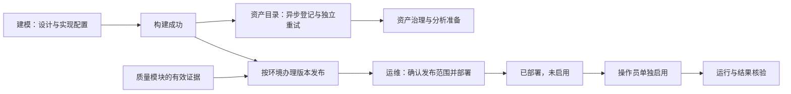

# F15 代码评审整改记录

日期：2026-09-25。范围：代码评审发现的 7 项问题及对应回归验证。

## 模块职责与协作关系

| 模块 | 拥有的事实与命令 | 与其他模块的关系 | 失败边界 |
|---|---|---|---|
| 建模工作台 | 设计、实现配置、构建、关系核验；列表仅显示构建与已发布版本摘要 | 构建专用查询读取本地模型、候选及构建证据；成功后投递登记任务 | 登记、质量、分析准备及运行故障不能把构建结果改为失败 |
| 资产目录 | 模型产出登记待办、登记失败原因、重试登记 | 普通目录入口即可查看没有资产编号的产出；消费已成功构建的批次 | 登记事务独立，重试只登记，不重新运行构建 |
| 版本发布 | 按环境读取发布单、验证发布条件、发布及发布回退 | 质量仍由质量模块产生，发布只检查发布条件；发布事实供运维选择 | 发布与回退不更新运行绑定、不部署或启用任务 |
| 运维中心 | 选择已发布范围、部署、启用、立即运行及部署修复 | 确认规划、环境及全部模型修订后部署；使用锁定的发布记录运行 | 运行失败不更改构建和发布结果；新草稿不会替换已部署修订 |
| 质量与分析准备 | 各自的规则、运行记录及分析可用状态 | 使用资产及发布事实，由原模块独立办理 | 不进入建模列表或构建弹窗的查询依赖 |

## 问题与任务追踪

| 评审问题 | 对应任务 | 已实现的处理 |
|---|---|---|
| 发布环境固定为开发环境 | T03 | 发布弹窗提供环境选择；切换后读取该环境发布单；旧请求的迟到结果不能覆盖新环境 |
| 构建查询间接依赖质量等下游 | T01、T02、T04、T05 | 新增 build-status / build-workspace；列表、构建弹窗和建模向导使用构建投影；移除资产结果及运行状态展示 |
| 发布、回退隐式重写并启用运行绑定 | T01、T03、T05 | 移除发布提交及回退中的绑定写入；运维增加独立部署和启用命令，并校验操作权限、发布范围、候选版本、绑定版本及活动运行 |
| 旧登记任务覆盖新构建结果 | T05 | claim、成功、失败、行锁均限定构建版本及尝试次数；旧 enqueue 不能重置新批次；人工重试更换任务 ID；资产写入与成功标记同事务 |
| 无资产编号的登记失败无法发现 | T04、T06 | 资产目录常规入口增加登记待办、分页和独立重试；逐模型检查可见范围，命令重新检查操作权限 |
| 局部查询失败被误显示为未发布 | T04、T05 | 已授权的模型保留独立读取到的发布事实；读取失败明确显示待确认，不推断成未发布 |
| 调度计划仅可访问前 50 个规划 | T04、T06 | 按规划分页；先定位指定规划，再分页；单个规划失败不会隐藏其他规划 |

运行范围补充：部署读取发布记录中的修订，运行使用绑定的发布记录和校验码，不跟随当前草稿修订。发布回退不隐式替换已部署范围。显式部署会替换该规划、环境和执行目标的全部已发布模型范围，并改为仅手动运行；确认框明确展示影响范围。

迁移：`20260925_02_model_execution_activation.xml` 增加 `activation_required`。已有绑定默认 false，保留原有行为；新的显式部署写入 true，并保持暂停，启用后转为 false。数据库回退只在配套代码回退后执行，不把迁移单测等同于运行环境回退验收。

## 验证记录

开发目录仅编辑与静态检查；提交推送后在 `/data/dts-stack` 执行正式 Maven / pnpm 入口。最终产品代码提交：`c6a6393179e73d26df06c40aad65446f42a974be`；后端最终验证提交为 `cfb62a3cde0fa7e84b23d6823827e2ba8b035981`，之后仅调整前端布局及浏览器测试夹具。

- 后端：先运行 120 个聚焦用例；修正 2 个与基线已有权限规则不符的断言后，重跑相关类及新增测试共 55 项，全部通过。去重共 **127 项通过**，包含 **9 项真实 PostgreSQL 用例**。覆盖旧构建/旧尝试隔离、登记资产事务回滚、迁移回退、部署版本不跟随草稿或发布回退、部署后暂停及人工启用。对应日志：`/tmp/f15-fix-backend-tests-r2.log`、`/tmp/f15-fix-backend-tests-r3.log`。
- 前端：按失败范围重跑后，7 个相关 Vitest 文件去重共 **87 项通过、5 项既有跳过**；另用 Node 原生测试入口运行目录 source-contract，**6 项通过**。第一次误用 Vitest 执行 node:test 文件，已改用正确入口确认通过。日志：`/tmp/f15-fix-frontend-tests.log`、`/tmp/f15-fix-frontend-tests-r2.log`、`/tmp/f15-fix-frontend-tests-r3.log`、`/tmp/f15-fix-source-contract.log`。
- 静态检查：`git diff --check`、迁移 XML 解析通过；提交前 GitNexus 检查未发现额外执行流程。新符号未进入索引的部分按当前源码确认调用范围。
- 前端最终生产构建：`pnpm build` 通过，包含 TypeScript 检查及兼容旧浏览器的产物，日志 `/tmp/f15-fix-frontend-build-narrow.log`。窄屏布局调整后另重跑运维面板 **6 项通过**，日志 `/tmp/f15-fix-ops-tests-final.log`；属于上述 87 项的重复验证。
- 浏览器核验：1 条聚焦 Playwright 旅程通过，使用正式前端产物和模拟接口。覆盖 61 个规划中定位第 61 个、确认规划/环境/模型修订范围、部署后未启用、单独启用；核对两个写请求的候选/绑定版本，控制台异常及 HTTP 失败记录为空。另验证 390px 窄屏没有页面级横向溢出，宽表在组件内横向滚动。日志 `/tmp/f15-fix-browser-r5.log`。
- 截图已人工核对：`/tmp/dts-f15-browser/feature15-isolation.mock-o-9a942-t-and-separately-enables-it/deployment-confirm-desktop.png`、同目录 `deployed-narrow.png`。桌面视口 1366×768，窄屏视口 390×844。修复了部署选择器和分页的窄屏溢出。
- 浏览器版本为 Chrome **154.0.8037.57**；已完成兼容旧浏览器的生产构建，但没有执行真实 Chrome 95 运行验收。

本次未生成全栈正式交付包，未部署容器，也未执行真实账号与真实 Airflow 的业务验收。上述浏览器接口模拟验证不替代部署验收。
