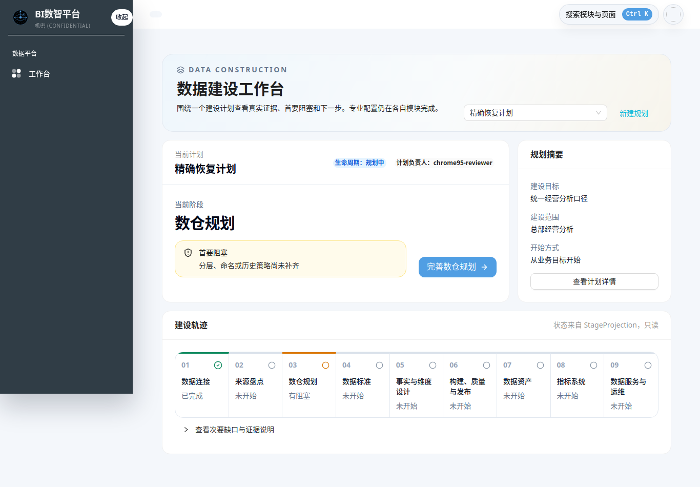
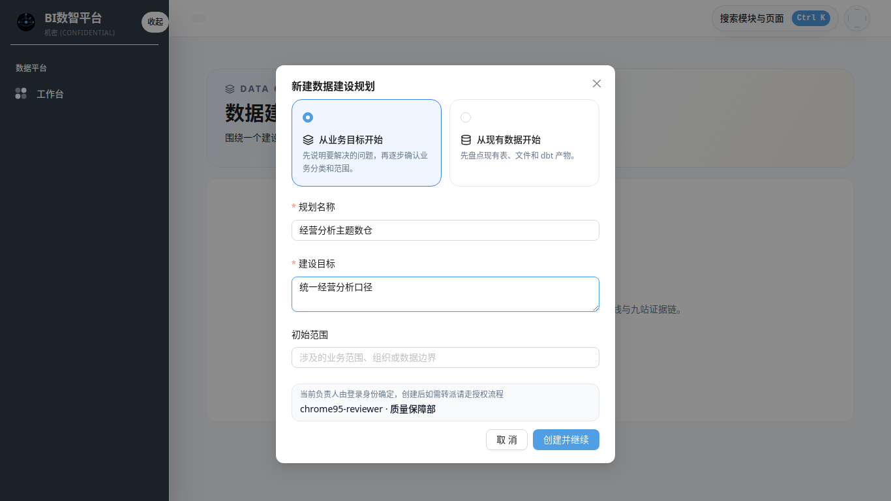
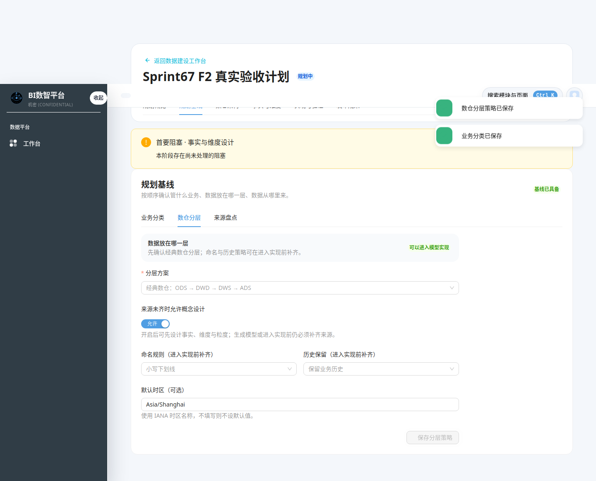
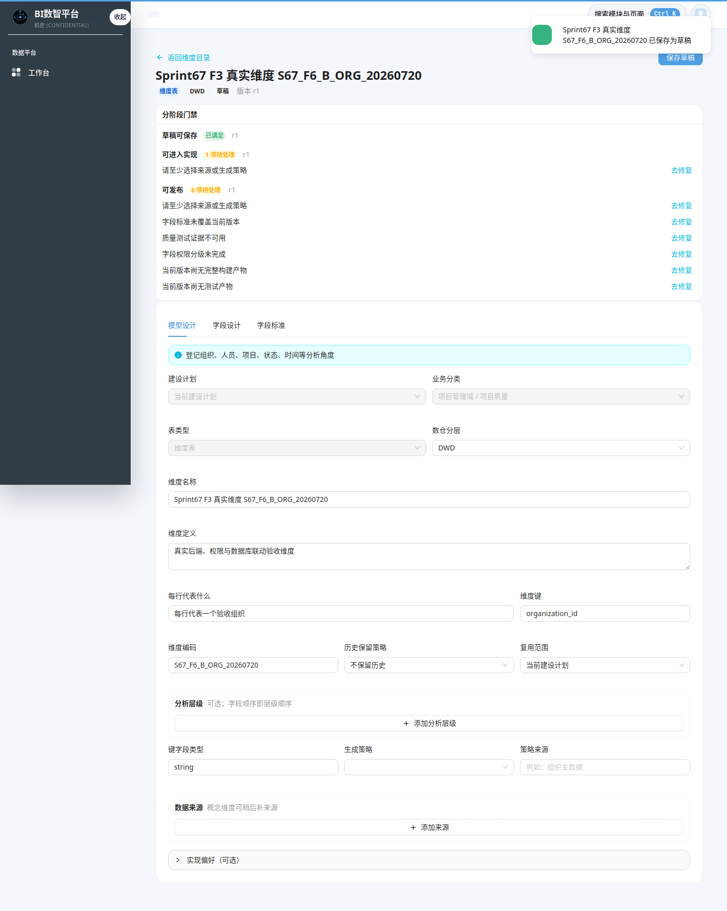
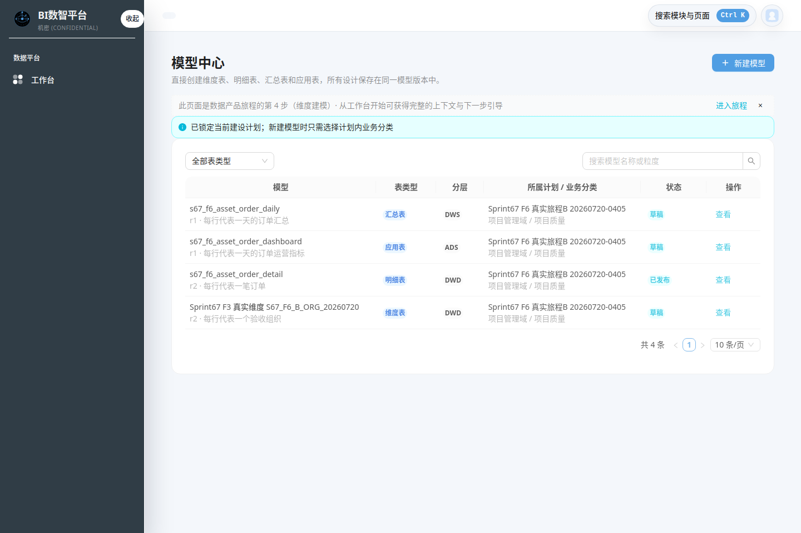
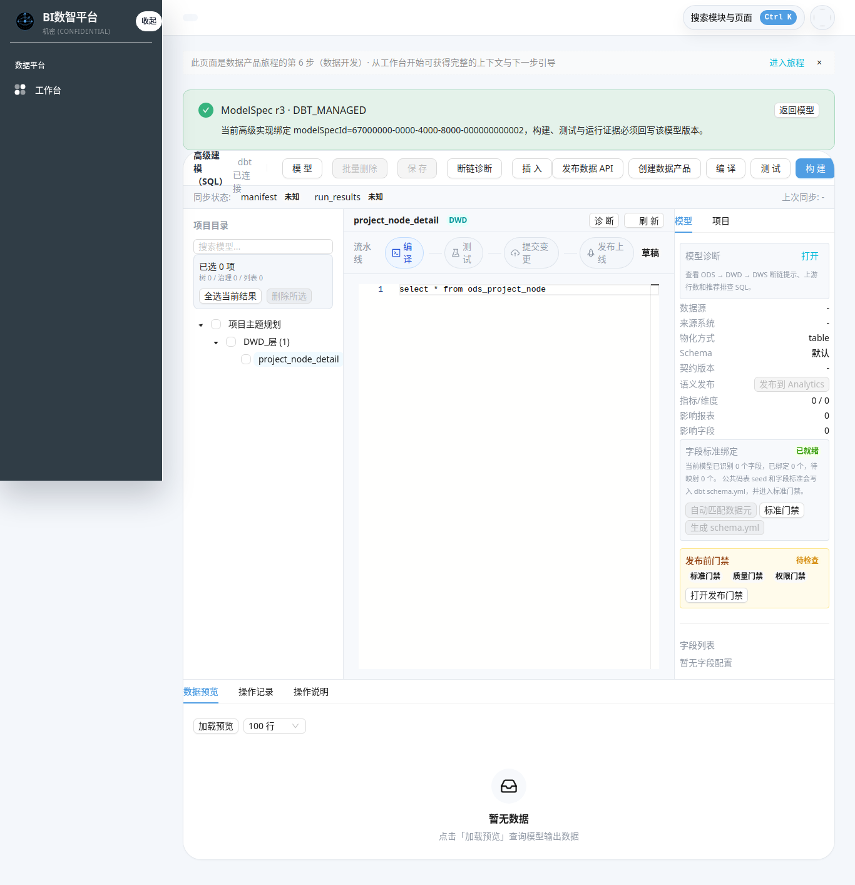
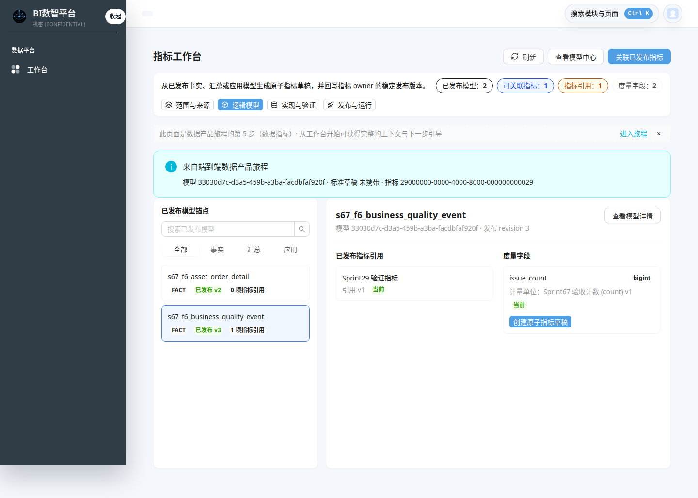

# Sprint-67 建模主线人工 E2E 操作手册

**适用版本**：v2.2.3 / Sprint-67

**验收浏览器**：Chrome/Chromium 95

**适用对象**：第一次使用数据建设工作台的规划负责人、模型设计人员、审核人员

**环境约定**：业务测试数据已清理；标准、码表、单位、词典等模板类数据保留

## 1. 先理解三层界面

建模主线不是逐页点完即完成的向导。界面有三层，各自职责不同：

```text
数据建设工作台
  └─ 选定一个建设计划，显示九站证据、首要阻塞、唯一下一步
      └─ 计划详情六个页签，维护计划上下文并进入专业模块
          └─ 业务分类 / 来源目录 / 维度目录 / 模型中心 / SQL-dbt / 指标工作台
```

| 层级 | 回答的问题 | 会不会直接改变完成状态 |
|---|---|---|
| 工作台九站 | 当前走到哪里、最先处理什么 | 不会；只读取后端 `StageProjection` 证据 |
| 计划详情六页签 | 当前计划的范围、基线、模型和成果入口在哪里 | 只有保存真实规划数据时才会影响证据；切换页签不会 |
| 专业页面 | 业务分类、来源、模型、标准、实现、指标如何维护 | 保存、编译、测试、审核、发布等真实动作会形成证据 |

最重要的判断规则：始终先看“首要阻塞”和右侧蓝色主按钮，不要把顶部页签当作必须从左到右点完的步骤。

## 2. 测试前准备

### 2.1 账号与权限

- 使用具备当前租户规划维护权限的账号登录；只读账号只能浏览，写按钮会隐藏或禁用。
- 计划创建后，创建人默认为计划负责人。其他账号能否看到或维护该计划，以后端租户、角色和对象权限为准。
- 不要在多个账号或多个浏览器页签中同时修改同一计划；如确需验证并发，按“版本冲突恢复”场景执行。

### 2.2 本轮测试命名

所有新数据使用统一前缀，便于验收后精确删除：

```text
E2E67_<日期>_<场景>_<对象>
```

例如：`E2E67_20260721_A_经营分析规划`、`E2E67_20260721_A_订单明细`。不要修改模板类标准，也不要复用生产业务对象作为测试数据。

### 2.3 来源准备

完整 Journey A/B 至少需要一张当前账号可访问的数据表或数据资产，并能在“数据集 → 数据表”选择器中找到。若目录为空，应先完成数据连接、接入或元数据同步，再回到当前计划；不要手工伪造来源版本。

## 3. 首页：建模工作台

入口：菜单“数据建模 → 建模工作台”，路由 `/modeling/workbench`。



### 3.1 “计划”从哪里来

右上角计划下拉不是模板数据，也不是前端写死的数据。页面从 dts-platform 的 WarehousePlan 列表接口 `/modeling/warehouse-plans` 获取当前账号可访问的建设计划。

- 干净环境中应显示“先建立一个数据建设计划”。
- 创建成功后，新计划立即成为当前计划，URL 和后续跳转携带唯一 `planId`。
- 如果指定计划不存在、无权限或网络失败，页面不会自动换成另一条计划；应使用“重新加载指定计划”或返回工作台重选。

### 3.2 首页各按钮的关系

| 控件 | 用途 | 操作后发生什么 |
|---|---|---|
| 计划下拉 | 切换当前计划 | 更新 `planId`，重新读取该计划的九站证据 |
| 新建规划 | 创建另一建设计划 | 打开新建表单，不复制当前计划 |
| 首要阻塞 | 解释服务端判断的最先缺口 | 只读提示，不是按钮 |
| 蓝色主按钮 | 处理当前唯一下一步 | 按服务端 `nextAction` 跳到精确页面并保留 `planId` |
| 查看计划详情 | 查看六页签上下文 | 不代表完成当前阶段 |
| 九站建设轨迹 | 查看真实证据状态 | 只读；访问页面不会把状态变成完成 |

> **人工测试重开提示（2026-07-21）**：当前已发布界面尚无建设规划台账和计划头修改/归档入口，这是 F2-T05 正在修复的 P0 缺口，不是最终操作方式。T05 完成前，创建表单输错名称、目标、范围或责任信息无法在前端修正；不要通过旧“项目空间管理”页面修改，它不是同一个 WarehousePlan。

## 4. 新建计划

在空状态点击“新建规划”，或在已有计划时点击右上角“新建规划”。



### 4.1 两种开始方式

| 开始方式 | 何时选择 | 创建时最低输入 | 创建后的第一关注点 |
|---|---|---|---|
| 从业务目标开始 | 已知道要解决的业务问题 | 规划名称、建设目标；初始范围建议填写 | 业务分类与规划策略 |
| 从现有数据开始 | 已有表、Excel、目录资产或 dbt 节点 | 规划名称和至少一个初始来源 | 来源盘点与业务分类 |

两种方式只影响起点，不会产生两套模型。两条路径最后都进入同一个 WarehousePlan、规划基线、ModelSpec 和九站证据链。

操作：

1. 选择开始方式。
2. 填写带红色星号的字段；名称使用本轮测试前缀。
3. 点击“创建并继续”。
4. 看到“规划已创建”提示，并确认页面标题与刚才输入一致。
5. 记录 `planId`；它是后续全部测试数据的归属键。

失败时不要连续重复点击：表单会保留输入。若出现幂等冲突，确认内容后使用“作为新计划重新提交”；若不需要第二条计划，返回工作台检查第一条是否已经创建成功。

## 5. 建立规划基线

计划详情顶部有六个页签：规划概览、规划基线、数仓架构、事实与维度、实现与验证、发布成果。本节只操作“规划基线”中的三个子页签。



### 5.1 业务分类：确认“管什么业务”

前置条件：计划不是已发布或已归档状态，账号有规划维护权限。

1. 进入“规划基线 → 业务分类”。
2. 点击“添加业务分类”，从下拉中选择一个当前可访问的分类。
3. 将确认状态设为“已确认”。候选状态不能通过基线门禁。
4. 点击“保存业务分类”。
5. 看到“业务分类已保存”，并确认状态变为“已确认”。

若下拉没有合适分类，点击“管理业务分类”进入治理页面创建或维护分类。完成后使用页面返回链回到原计划，确认 URL 中仍是原 `planId`，不要从菜单重新开始。

### 5.2 数仓分层：确认“数据放在哪一层”

1. 进入“规划基线 → 数仓分层”。
2. 分层方案选择“经典数仓：ODS → DWD → DWS → ADS”。
3. 根据测试目的决定是否开启“来源未齐时允许概念设计”：
   - 关闭：必须先登记来源，适合严格 E2E。
   - 开启：可先设计维度、事实和粒度，但进入实现前仍必须补齐来源；它不是“来源已完成”。
4. 填写命名规则、历史保留策略；需要时间默认值时填写合法 IANA 时区，例如 `Asia/Shanghai`。
5. 点击“保存分层策略”。按钮未激活通常表示表单没有变化、计划不可编辑或存在版本冲突。

### 5.3 来源盘点：确认“数据从哪里来”

1. 进入“规划基线 → 来源盘点”。
2. 在“登记目录资产”中按顺序选择“数据集 → 数据表”。
3. 点击“登记目录资产”。新登记项初始为“待确认”。
4. 在来源卡片中核对：显示名称、来源类型、`绑定标识`、解析版本和最近核验时间。
5. 将盘点结论改为“确认纳入”，再点击“保存来源盘点”。
6. 只有来源为 `CURRENT` 且确认纳入，才可作为后续真实实现证据。

若选择“排除”，必须填写排除原因。若状态为 `STALE`、`UNKNOWN`、不可访问或已删除，应先在资产/元数据模块修复，不要把它当成可用来源。

> 当前界面的“来源登记 ID”仍需要在后续模型表单中引用本页的“绑定标识”。这是首次使用最容易出错的地方，已列入界面迭代清单。

## 6. 创建四类模型

从计划详情进入“事实与维度”，优先使用“维度目录”和“模型中心”按钮。这样页面会自动携带 `planId`；直接从菜单进入目录只能浏览，创建时还需重新选择上下文。

### 6.1 先登记维度

进入“维度目录”，点击“登记维度”。

最低填写：

- 建设计划：应已锁定为当前计划。
- 业务分类：只能选当前计划内已确认分类。
- 数仓分层：一般选择 DWD。
- 维度名称、每行代表什么、维度键。
- 维度编码：1-64 位大写字母、数字或下划线，并以大写字母开头。
- 历史保留策略、复用范围。
- 若选择 TYPE2，必须补齐生效时间、失效时间和当前记录标志字段。

点击“保存草稿”后进入模型详情。维度可以先做概念设计，但进入实现前必须补来源或生成策略。



### 6.2 再创建明细表（FACT）

进入“模型中心”，点击“新建模型”，表类型选择“明细表”。最低填写：

- 模型名称、用途说明。
- “一行代表什么”和粒度键；不要只写技术表名。
- 事实形态：事务记录、周期快照或生命周期快照。
- 业务时间与时间字段。
- 至少一个数据来源：来源标识、来源分层、作用、来源登记 ID、已确认版本。
- 可选关联刚创建的分析维度；“相关业务活动”是可选项，不是保存前置条件。

来源登记 ID 必须使用规划基线来源卡片中的“绑定标识”，已确认版本必须与该来源当前解析版本一致。明细表没有来源不能保存为有效草稿。

### 6.3 创建汇总表和应用表

| 表类型 | 默认建议层 | 必填差异 | 不能做的事 |
|---|---|---|---|
| 汇总表（SUMMARY） | DWS | 输出粒度、粒度键、至少一个上游模型 | 不能脱离上游凭空发布 |
| 应用表（APPLICATION） | ADS | 输出粒度、粒度键、至少一个上游模型、消费场景 | 不能把“报表名字”当作粒度 |

上游选择会锁定所选模型的当前 revision。上游发生新版本后，应按依赖状态处理 `CURRENT / STALE / UNKNOWN`，不能静默沿用漂移版本。

完成后，模型中心应能在同一计划下看到维度、明细、汇总、应用四类表：



## 7. 模型详情与分阶段门禁

每个模型详情顶部有三个真实门禁：

| 门禁 | 含义 | 常见阻塞 |
|---|---|---|
| 草稿可保存 | 基础定义可以形成 revision | 名称、粒度、类型必填项不完整 |
| 可进入实现 | 设计上下文足以生成或接管实现 | FACT 缺来源/时间；DIMENSION 缺来源或生成策略；SUMMARY/APPLICATION 缺上游 |
| 可发布 | 当前 revision 有完整质量和治理证据 | 字段标准、质量测试、权限分级、实现产物或测试产物缺失 |

操作原则：

1. 先看门禁中的待处理项。
2. 点击对应“去修复”，不要靠猜测切换页面。
3. 修改后点击“保存草稿”，确认 revision 增加。
4. 再检查门禁；旧 revision 的证据不能替代当前 revision。

“模型设计”维护粒度、来源和类型专属属性；“字段设计”维护字段；“字段标准”绑定数据元、码表和度量单位的稳定 ID/版本。只浏览页签不会让门禁通过。

## 8. SQL/dbt 实现、测试与发布

只有“可进入实现”门禁满足时，模型详情才显示“进入 SQL/dbt 实现”。点击该按钮进入高级实现页，并先核对顶部绿色上下文条中的 ModelSpec ID、revision 和实现方式。



推荐操作顺序：

1. 核对当前项目目录和目标模型，不要在错误计划中创建同名模型。
2. 编辑或生成 SQL/dbt 文件并保存。
3. 执行编译，确认当前 revision 产生成功产物。
4. 执行测试，确认质量结果不是 `SKIPPED` 或未知。
5. 执行构建，核对运行结果和产物摘要。
6. 打开发布门禁，按提示补齐标准、质量、权限和评审证据。
7. 提交审核并发布；发布后 ModelSpec 状态应为“已发布”，且资产、BI、血缘注册结果可追踪。

若页面显示 `RUNTIME_DISABLED`，只说明请求和失败证据被正确记录，不能写成“外部 Airflow/dbt 已运行成功”。修复后必须回到同一个 `modelSpecId + revision` 重新验证。

## 9. 从已发布模型创建或关联指标

入口：计划详情“发布成果 → 查看指标系统”，或 `/modeling/metric-workbench?planId=<当前计划>`。

前置条件：至少一个 FACT、SUMMARY 或 APPLICATION 模型已发布，并有可度量字段。

1. 在左侧“已发布模型锚点”选择目标模型。
2. 核对模型 ID 和发布 revision。
3. 在度量字段处点击“创建原子指标草稿”，进入指标 owner 完善口径并发布。
4. 返回指标工作台，点击“关联已发布指标”。
5. 只能选择带稳定版本的已发布指标；保存后模型会生成新的已发布 revision，旧 revision 保持不变。



## 10. 返回工作台验收九站证据

回到 `/modeling/workbench?planId=<当前计划>`，逐项核对：

1. 当前计划仍是本轮创建的计划，没有被静默替换。
2. 当前阶段、首要阻塞和蓝色主按钮语义一致。
3. 已完成状态来自真实服务端证据，并且新鲜度为 `CURRENT`。
4. `STALE`、`UNKNOWN`、接口失败不能显示为已完成。
5. “查看次要缺口与证据说明”中的刷新时间符合本轮操作。
6. 发布成果能追溯到资产、指标和运行记录；运行失败时有返回原模型的修复链。

## 11. 常见失败与恢复

| 现象 | 原因判断 | 正确恢复 |
|---|---|---|
| 计划下拉为空 | 干净环境或无可访问计划 | 有权限则新建；无权限则申请规划维护权限 |
| 当前计划突然不是预期计划 | `planId` 丢失或手工从菜单重入 | 返回工作台重新选择；后续从计划详情按钮进入专业页 |
| 保存按钮灰色 | 无修改、只读、计划已发布/归档或冲突未处理 | 看按钮提示；不要反复点击 |
| 分类下拉为空 | 没有可访问业务分类 | 进入“管理业务分类”创建/申请权限，再按返回链回来 |
| 来源目录为空 | 尚未接入或同步数据 | 先完成连接、接入、元数据同步，再刷新来源盘点 |
| FACT 提示缺来源 | 未引用已确认来源或版本不一致 | 复制来源卡片绑定标识和解析版本，重新保存 |
| 服务器 revision 更高 | 其他人已更新同一对象 | 选择“保留当前输入并基于最新版本重试”或放弃后加载最新版 |
| 可保存但不可进入实现 | 设计门禁未齐 | 使用门禁中的“去修复”，不要直接打开 SQL/dbt 路由 |
| 可以实现但不可发布 | 当前 revision 缺标准、质量、权限或产物 | 逐项补齐发布门禁，再重新检查 |
| 运行显示 `RUNTIME_DISABLED` | 外部运行能力未启用 | 记录为受控失败，不声明运行成功 |

## 12. 人工测试记录模板

每一步只记录本轮真实产生的 ID 和证据，不引用历史 fixture：

| 步骤 | 操作 | 预期 | 实际结果 | 记录 ID / 截图 | PASS/FAIL |
|---:|---|---|---|---|---|
| 1 | 创建计划 | 返回唯一 planId |  |  |  |
| 2 | 保存业务分类 | 分类状态已确认 |  |  |  |
| 3 | 保存分层策略 | 分层证据为当前版本 |  |  |  |
| 4 | 登记并确认来源 | 来源 `CURRENT` |  |  |  |
| 5 | 创建维度 | DIMENSION 草稿和 revision |  |  |  |
| 6 | 创建 FACT | 粒度、时间、来源通过设计门禁 |  |  |  |
| 7 | 创建 SUMMARY/APPLICATION | 上游版本已锁定 |  |  |  |
| 8 | 绑定字段标准 | 三类标准版本可追踪 |  |  |  |
| 9 | 编译/测试/构建 | 当前 revision 有成功证据 |  |  |  |
| 10 | 审核/发布 | ModelSpec 已发布 |  |  |  |
| 11 | 指标关联 | 稳定指标版本回写新 revision |  |  |  |
| 12 | 返回工作台 | 九站投影和唯一下一步正确 |  |  |  |

## 13. 界面迭代清单

操作手册用于保证当前版本可测试，但不应把首次使用障碍固化为正常操作。按人工测试结果优先迭代：

### P0：首次操作容易直接失败

- 来源盘点的“绑定标识/解析版本”应在模型表单中可选择并自动回填，避免人工复制 UUID。
- 工作台应为首要阻塞补充“为什么需要、完成条件、处理后回到哪里”，而不只显示动作名称。
- 六个计划页签与九站证据之间应显示明确映射，避免用户误认为六页签就是六个完成阶段。
- 从空来源、空分类进入时，应在当前页面给出创建/同步入口和安全返回说明。

### P1：减少上下文丢失和误判

- 所有专业页面固定展示当前计划、业务分类、模型 revision 和安全返回入口。
- 禁用按钮统一显示可操作的原因，不只显示灰色状态。
- `STALE / UNKNOWN / RUNTIME_DISABLED` 统一用业务语言解释影响和恢复动作。
- 人工验收通过后，再补齐窄屏、只读角色、跨租户和并发冲突的专门章节。

## 14. 截图真实性边界

本手册引用的界面图来自 Sprint-67 Chrome 95 验收证据，其中新建表单、路由恢复等部分早期证据使用精确 API mock；F2 分类/分层、F3 维度门禁及 Journey A/B/C 图来自真实登录、部署 API 和 PostgreSQL 联动。截图中的隔离测试记录已清理，只用于说明界面位置，不应作为本轮 E2E 的数据前置条件。
