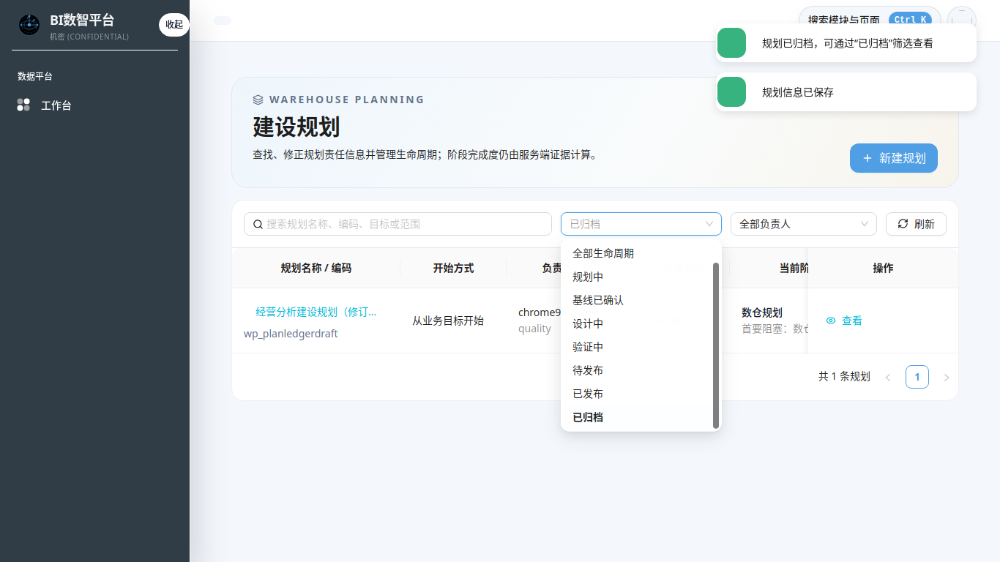

# Sprint-67 建模主线人工 E2E 操作手册

**适用版本**：v2.2.3 / Sprint-67

**验收浏览器**：Chrome/Chromium 95

**适用对象**：第一次使用数据建设工作台的规划负责人、模型设计人员、审核人员

**环境约定**：业务测试数据已清理；标准、码表、单位、词典等模板类数据保留

## 1. 先理解三层界面

建模主线不是逐页点完即完成的向导。界面有三层，各自职责不同：

```text
数据建设工作台
  └─ 选定一个建设计划，显示九站证据、首要阻塞、唯一下一步
      └─ 计划详情六个页签，维护计划上下文并进入专业模块
          └─ 业务分类 / 来源目录 / 维度目录 / 模型中心 / SQL-dbt / 指标工作台
```

| 层级 | 回答的问题 | 会不会直接改变完成状态 |
|---|---|---|
| 工作台九站 | 当前走到哪里、最先处理什么 | 不会；只读取后端 `StageProjection` 证据 |
| 计划详情六页签 | 当前计划的范围、基线、模型和成果入口在哪里 | 只有保存真实规划数据时才会影响证据；切换页签不会 |
| 专业页面 | 业务分类、来源、模型、标准、实现、指标如何维护 | 保存、编译、测试、审核、发布等真实动作会形成证据 |

最重要的判断规则：始终先看“首要阻塞”和右侧蓝色主按钮，不要把顶部页签当作必须从左到右点完的步骤。

## 2. 测试前准备

### 2.1 账号与权限

- 使用具备当前租户规划维护权限的账号登录；只读账号只能浏览，写按钮会隐藏或禁用。
- 计划创建后，创建人默认为计划负责人。其他账号能否看到或维护该计划，以后端租户、角色和对象权限为准。
- 不要在多个账号或多个浏览器页签中同时修改同一计划；如确需验证并发，按“版本冲突恢复”场景执行。

### 2.2 本轮测试命名

所有新数据使用统一前缀，便于验收后精确删除：

```text
E2E67_<日期>_<场景>_<对象>
```

例如：`E2E67_20260721_A_经营分析规划`、`E2E67_20260721_A_订单明细`。不要修改模板类标准，也不要复用生产业务对象作为测试数据。

### 2.3 来源准备

完整 Journey A/B 的实现与发布阶段至少需要一张当前账号可访问的数据表/数据资产，或一个可锁定 revision 的上游 ModelSpec。只验证 FACT 逻辑草稿时，可以暂不准备上游输入。

若选择直接物理来源，只建立数据连接还不够：连接是访问通道，具体表必须完成元数据同步、可解析，并在当前建设计划“来源盘点”中确认纳入。FACT 草稿不要求先选物理来源，也不要求先完成 ETL/ELT；进入实现前才必须具备有效物理来源或锁定 revision 的上游 ModelSpec，编译、测试、运行和发布仍是后续独立门禁。

## 3. 首页：建模工作台

入口：菜单“数据建模 → 建模工作台”，路由 `/modeling/workbench`。


### 3.1 “计划”从哪里来

右上角计划下拉不是模板数据，也不是前端写死的数据。页面从 dts-platform 的 WarehousePlan 列表接口 `/modeling/warehouse-plans` 获取当前账号可访问的建设计划。

- 干净环境中应显示“先建立一个数据建设计划”。
- 创建成功后，新计划立即成为当前计划，URL 和后续跳转携带唯一 `planId`。
- 如果指定计划不存在、无权限或网络失败，页面不会自动换成另一条计划；应使用“重新加载指定计划”或返回工作台重选。

### 3.2 首页各按钮的关系

| 控件 | 用途 | 操作后发生什么 |
|---|---|---|
| 计划下拉 | 切换当前计划 | 更新 `planId`，重新读取该计划的九站证据 |
| 新建规划 | 创建另一建设计划 | 打开新建表单，不复制当前计划 |
| 首要阻塞 | 解释服务端判断的最先缺口 | 只读提示，不是按钮 |
| 蓝色主按钮 | 处理当前唯一下一步 | 按服务端 `nextAction` 跳到精确页面并保留 `planId` |
| 查看计划详情 | 查看六页签上下文 | 不代表完成当前阶段 |
| 九站建设轨迹 | 查看真实证据状态 | 只读；访问页面不会把状态变成完成 |

### 3.3 建设规划台账：查找、修改和归档计划

入口有两个，最终都会进入 canonical 路由 `/modeling/plans`：

- 菜单“数据建模 → 数仓规划 → 建设规划”；
- 工作台当前计划卡片中的“全部规划”。



台账默认显示除“已归档”以外的计划。可以按名称、编码、目标或范围搜索，也可以按生命周期和负责人筛选。每行操作的关系如下：

| 操作 | 结果 | 上下文限制 |
|---|---|---|
| 查看 | 进入该计划详情 | 不修改计划，也不会改变完成证据 |
| 编辑 | 修改名称、建设目标、建设范围和负责人 | 已发布、已归档或无维护权限时不提供写操作 |
| 归档 | 二次确认后从默认列表隐藏 | 不删除数据；可在“已归档”筛选中继续查看 |
| 新建规划 | 回到工作台打开创建表单 | 页面唯一主动作，不复制当前行 |

编辑计划时，计划编码、开始方式、生命周期和租户都是只读事实，不能通过表单修改。负责人必须从人员目录选择，负责部门由目录带入：部门级维护角色只能维护和转派本部门计划，跨部门转派只允许机构级维护角色，最终结果以后端授权为准。

版本冲突时表单不会丢失。选择“保留当前输入并基于版本 N 重试”会显式使用服务端最新版本再次保存；选择“放弃并加载最新版”会丢弃本次输入。网络超时后不要直接重复提交，应点击“核对服务端状态后重试”，页面会先读取当前计划判断首次请求是否已经成功。

归档时如果其他人已更新计划，页面会读取最新版并要求再次确认，不会静默覆盖。出现 403 后当前操作切换为只读；出现 404 时返回台账并重新加载，不会自动选择另一条计划。


## 4. 新建计划

在空状态点击“新建规划”，或在已有计划时点击右上角“新建规划”。


### 4.1 两种开始方式

| 开始方式 | 何时选择 | 创建时最低输入 | 创建后的第一关注点 |
|---|---|---|---|
| 从业务目标开始 | 已知道要解决的业务问题 | 规划名称、建设目标；初始范围建议填写 | 业务分类与规划策略 |
| 从现有数据开始 | 已有表、Excel、目录资产或 dbt 节点 | 规划名称和至少一个初始来源 | 来源盘点与业务分类 |

两种方式只影响起点，不会产生两套模型。两条路径最后都进入同一个 WarehousePlan、规划基线、ModelSpec 和九站证据链。

操作：

1. 选择开始方式。
2. 填写带红色星号的字段；名称使用本轮测试前缀。
3. 点击“创建并继续”。
4. 看到“规划已创建”提示，并确认页面标题与刚才输入一致。
5. 记录 `planId`；它是后续全部测试数据的归属键。

失败时不要连续重复点击：表单会保留输入。若出现幂等冲突，确认内容后使用“作为新计划重新提交”；若不需要第二条计划，返回工作台检查第一条是否已经创建成功。

## 5. 建立规划基线

计划详情顶部有六个页签：规划概览、规划基线、数仓架构、事实与维度、实现与验证、发布成果。本节只操作“规划基线”中的三个子页签。


### 5.1 业务分类：确认“管什么业务”

前置条件：计划不是已发布或已归档状态，账号有规划维护权限。

1. 进入“规划基线 → 业务分类”。
2. 点击“添加业务分类”，从下拉中选择一个当前可访问的分类。
3. 将确认状态设为“已确认”。候选状态不能通过基线门禁。
4. 点击“保存业务分类”。
5. 看到“业务分类已保存”，并确认状态变为“已确认”。

若下拉没有合适分类，点击“管理业务分类”进入治理页面创建或维护分类。完成后使用页面返回链回到原计划，确认 URL 中仍是原 `planId`，不要从菜单重新开始。

### 5.2 数仓分层：确认“数据放在哪一层”

1. 进入“规划基线 → 数仓分层”。
2. 分层方案选择“经典数仓：ODS → DWD → DWS → ADS”。
   - 其中 ODS 在实施时必须进一步确认为 `ODS_RAW`（原样接入）或 `ODS_STANDARDIZED`（接入后标准化）；`STG` 是临时技术层。
   - 这三层由数据接入、元数据目录和 SQL/dbt/调度持有，不从四类模型表单创建。
3. 根据测试目的决定是否开启“来源未齐时允许概念设计”。该策略只影响工作台投影和下一步：`ASSET_FIRST` 仍优先引导连接/来源盘点；`BUSINESS_FIRST` 开启后可先进入模型设计。它不改变 ModelSpec 的分阶段契约：FACT 一旦从合法入口打开，具备粒度即可保存草稿，进入实现前仍必须补有效物理来源或锁定 revision 的上游模型；它不是“来源已完成”。
4. 填写命名规则、历史保留策略；需要时间默认值时填写合法 IANA 时区，例如 `Asia/Shanghai`。
5. 点击“保存分层策略”。按钮未激活通常表示表单没有变化、计划不可编辑或存在版本冲突。

### 5.3 来源盘点：确认“数据从哪里来”

1. 进入“规划基线 → 来源盘点”。
2. 在“从已验证连接加入具体表”中依次选择“已验证连接 → Schema → 具体表”。
3. 点击“加入当前规划并确认”。这是明确的治理决策；系统同时自动关联连接、Schema、表、来源标识和当前版本。
4. 若显示“该连接尚未同步出可用表”，点击“管理或同步元数据”完成正式目录同步；Schema 探测结果本身不等于已同步目录。
5. 在来源卡片中核对：显示名称、来源类型、具体表/节点、解析版本和最近核验时间。绑定标识是系统关联字段，无需复制。
6. 只有来源为 `CURRENT` 且确认纳入，才可作为后续真实实现证据。没有连接的特殊目录资产仍可从“其他资产目录入口”登记；这一步先生成“待确认”候选，弹窗会保留，必须再选择“确认纳入”或“排除”并保存。

若选择“排除”，必须填写排除原因。若状态为 `STALE`、`UNKNOWN`、不可访问或已删除，应先在资产/元数据模块修复，不要把它当成可用来源。

“连接测试成功”只证明通道可用，并使连接具备进入候选列表的资格；它不会自动同步表，也不会把该连接下的全部表加入当前计划。连接很多或表很多时，在 Schema/具体表下拉中输入关键词，页面会查询服务端正式目录。若多人同时维护同一来源盘点并出现版本冲突，点击“加载最新版、合并并重试”；系统按绑定标识保留本地确认/排除决定及他人新增项，若再次冲突则停止自动重试并保留草稿。

> 建模表单会按业务名称查询本页的已确认来源，选中后自动关联绑定 ID、来源标识、类型和当前版本。不要手工复制或修改这些系统字段。

## 6. 创建四类模型

从计划详情进入“事实与维度”，优先使用“维度目录”和“模型中心”按钮。这样页面会自动携带 `planId`；直接从菜单进入目录只能浏览，创建时还需重新选择上下文。

### 6.0 先确认模型类型与依赖

| 创建类型 | 系统确定的目标层 | 实现前允许的上游 | 不允许 |
|---|---|---|---|
| 维度表（DIMENSION） | DWD | ODS_RAW/ODS_STANDARDIZED/STG，或当前计划已确认的存量或外部管理 DWD 物理来源；也可使用受控生成策略 | DWS/ADS 反向输入 |
| 明细表（FACT） | DWD | ODS_RAW/ODS_STANDARDIZED/STG，或当前计划已确认的存量或外部管理 DWD 物理来源；也可锁定 FACT@DWD revision，维度另走 dimensionRefs | DIMENSION dependsOn、DWS/ADS 反向依赖 |
| 汇总表（SUMMARY） | DWS | 锁定 revision 的 DIMENSION/FACT@DWD 或 SUMMARY@DWS | 直接物理表、APPLICATION@ADS；DWS 同层必须 CURRENT 且无环 |
| 应用表（APPLICATION） | ADS | 锁定 revision 的任意合法 DWD/DWS/ADS 四类模型 | 直接物理表；ADS 同层必须 CURRENT 且无环 |

目标层由模型类型自动确定并只读展示，不需要用户选择。若目的是建设 ODS：

- 已经存在的表：先完成元数据同步，明确标记 `ODS_RAW` 或 `ODS_STANDARDIZED`，再加入当前计划来源盘点；
- 尚未存在的表：前往数据接入创建映射/同步任务，运行并同步元数据后再纳入来源盘点；
- 临时转换：由 SQL/dbt/调度产生 STG 技术节点，不创建四类 ModelSpec。

当选择 DWD 物理来源时，它必须是当前计划来源盘点中已确认的存量或外部管理资产。若上游已有 canonical 模型，应选锁定 revision 的上游模型，不要改选其底层物理表来绕过版本门禁。

四类模型表单内的统一“前往数据接入并安全返回”入口仍待 F3-T07 实现；当前可从专业菜单完成接入操作，但不得宣称模型上下文自动返回已具备。

历史 ODS/STG ModelSpec 的专属只读分类、审计/血缘展示和迁移建议是 F3-T07 后续目标，当前尚未完成对应 UI；不能把本段目标说明当成已有验收结果。

### 6.1 先登记维度

进入“维度目录”，点击“登记维度”。

最低填写：

- 建设计划：应已锁定为当前计划。
- 业务分类：只能选当前计划内已确认分类。
- 目标数仓分层：系统按 DIMENSION 自动确定为 DWD 并只读展示。
- 维度名称、每行代表什么、维度键。
- 维度系统编码：表单打开时自动生成并只读，无需输入；修改维度名称不会改变已生成编码。
- 层级系统编码：添加层级时按所属维度自动生成并只读，用户只填层级名称、字段和顺序。
- 历史保留策略、复用范围。
- 若选择 TYPE2，必须补齐生效时间、失效时间和当前记录标志字段。

点击“保存草稿”后进入模型详情。维度可以先做概念设计，但进入实现前必须补来源或生成策略。


### 6.2 再创建明细表（FACT）

进入“模型中心”，点击“新建模型”，表类型选择“明细表”。保存草稿的最低填写是：

- 模型名称、用途说明。
- 目标数仓分层：系统按 FACT 自动确定为 DWD 并只读展示；它描述当前模型未来产物，不是上游表所在层。
- “一行代表什么”和粒度键；不要只写技术表名。
- 可选关联刚创建的分析维度；“相关业务活动”是可选项，不是保存前置条件。

事实形态、业务时间和时间字段可以在草稿后继续完善，但进入实现前必须补齐并与粒度一致。

FACT 草稿可以暂不选择上游输入。保存后门禁会明确提示：进入实现前必须从下面两种方式中至少完成一种。

| 上游输入方式 | 选择什么 | 何时适用 |
|---|---|---|
| 已确认物理来源 | 当前计划来源盘点中的已有表/节点 | 从现有资产直接建模，或需要追踪原始物理输入 |
| 上游模型 | 已有 FACT@DWD 的锁定 revision | 基于另一个明细模型继续转换，不重复选择其底层物理表；DIMENSION 通过 dimensionRefs 关联 |

选中“规划物理来源”后，界面会只读显示来源类型、具体表/节点和已解析版本，并在提交时自动携带绑定 ID、标识、类型和版本。用户只需确认“上游来源分层”和作用，不输入系统值。上游来源分层描述输入在哪里，目标数仓分层描述本模型将生成到哪里，两者不能互相替代。

如果只选择上游 ModelSpec，系统锁定其 revision 并自动带入编译引用，不要求再选该模型对应的具体物理表。两种方式可以同时使用，但所有已填写引用都必须当前有效；其中任一过期、无权或形成循环依赖时，进入实现门禁都会失败。

如果计划使用直接物理来源但“规划物理来源”为空，点击当前表单中的“在当前表单登记来源”，依次选择“已验证连接 → Schema → 具体表”，再点击“加入当前规划并确认”。保存成功后弹窗会关闭，当前表单自动刷新来源下拉，无需离开页面或重新打开模型。连接测试成功不会自动把全部表加入计划；仅当弹窗内没有可选表时才需先执行元数据同步，不需要先运行 ETL/ELT。若本次只保存逻辑草稿，可以先跳过该操作。

来源已就绪后仍可点击标题右侧“管理规划来源”补充关联表。来源保存及父表单刷新期间 X、遮罩和 Esc 会暂时禁用，避免后端已写入但模型表单未刷新的半完成状态；若显示“模型表单刷新失败”，保持弹窗并点击“重试刷新”，旧的延迟响应不会覆盖新结果。计划已发布、已归档，或计划状态/策略读取失败时，内嵌来源管理保持只读；不要通过刷新、旧深链或手工构造请求绕过生命周期门禁。

如果编辑旧模型时来源显示“当前不可用”，说明它已过期、被删除或解析失败。该项只用于诊断，不能重新选中；先修复来源盘点，或明确改选其他已确认来源。同一来源重新确认为新版本时，界面会同时显示已保存版本和当前版本，必须点击“采用当前版本”并保存新的模型 revision，系统不会静默升级。

切换建设计划会立即清空原来源，这是防止跨计划引用的正常行为。保存时后端还会实时重查当前计划的绑定和版本；若在页面打开后来源发生漂移，旧值会被门禁阻止，应检查差异并明确“采用当前版本”，不要重复提交旧值。

### 6.3 创建汇总表和应用表

| 表类型 | 默认建议层 | 必填差异 | 不能做的事 |
|---|---|---|---|
| 汇总表（SUMMARY） | DWS（系统只读） | 输出粒度、粒度键、至少一个锁定 revision 的 DIMENSION/FACT@DWD 或 SUMMARY@DWS | 不能直接选物理表或 APPLICATION@ADS；DWS 同层必须 CURRENT、无环 |
| 应用表（APPLICATION） | ADS（系统只读） | 输出粒度、粒度键、至少一个锁定 revision 的任意合法 DWD/DWS/ADS 四类模型、消费场景 | 不能直接选物理表；ADS 同层必须 CURRENT、无环，不能把“报表名字”当粒度 |

上游选择会锁定所选模型的当前 revision。上游发生新版本后，应按依赖状态处理 `CURRENT / STALE / UNKNOWN`，不能静默沿用漂移版本。

完成后，模型中心应能在同一计划下看到维度、明细、汇总、应用四类表：


## 7. 模型详情与分阶段门禁

每个模型详情顶部有三个真实门禁：

| 门禁 | 含义 | 常见阻塞 |
|---|---|---|
| 草稿可保存 | 基础定义可以形成 revision | 名称、目标层、粒度、类型必填项不完整；FACT 不因两类输入均为空而阻塞 |
| 可进入实现 | 设计上下文足以生成或接管实现 | FACT 同时缺物理来源和上游模型，或缺时间；DIMENSION 缺来源或生成策略；SUMMARY/APPLICATION 缺上游 |
| 可发布 | 当前 revision 有完整质量和治理证据 | 字段标准、质量测试、权限分级、实现产物或测试产物缺失 |

操作原则：

1. 先看门禁中的待处理项。
2. 点击对应“去修复”，不要靠猜测切换页面。
3. 修改后点击“保存草稿”，确认 revision 增加。
4. 再检查门禁；旧 revision 的证据不能替代当前 revision。

“模型设计”维护粒度、来源和类型专属属性；“字段设计”维护字段；“字段标准”绑定数据元、码表和度量单位的稳定 ID/版本。只浏览页签不会让门禁通过。

### 7.1 数据元、业务分类和计划是什么关系

- “业务分类”和“数据元”都是全局专业目录。目录里已有多条记录，只表示这些记录可被计划或模型引用，不表示当前已经存在建设规划。
- 建设规划的“业务分类”页签决定哪些分类纳入本计划、是否已确认；数仓分层也只在该计划基线维护。
- 模型详情“字段标准”页签才是正式字段落标入口。点击“前往数据元”可以维护/导入标准正文，但最终必须返回同一模型，在字段行选择数据元并保存稳定 ID/版本。
- 数据元页不再显示“缺少数仓规划”的整页阻断，也不再生成“字段落标草稿”。从菜单直接进入时只维护全局标准；从模型或计划进入时，顶部显示安全返回入口。

推荐的完整操作：

1. 在模型详情打开“字段标准”，确认顶部 modelSpecId、revision 和当前 planId。
2. 如缺少合适数据元，点击“前往数据元”；需要批量导入时再进入“导入标准包”。
3. 导入或维护完成后点击“返回数据元”，再点击“返回模型字段”。地址必须仍是原 modelSpecId，且 `tab=standards`。
4. 刷新字段标准列表，选择数据元/码表/度量单位并保存；不要从数据元列表是否存在来推断当前计划已经完成分类基线。

若从业务分类页点击“继续逻辑模型”却没有 planId，页面会引导到“建设规划”台账。这是正确门禁：先选择或创建正式计划，不要通过刷新或另开页面制造浏览器会话规划。

## 8. SQL/dbt 实现、测试与发布

只有“可进入实现”门禁满足时，模型详情才显示“进入 SQL/dbt 实现”。点击该按钮进入高级实现页，并先核对顶部绿色上下文条中的 ModelSpec ID、revision 和实现方式。


推荐操作顺序：

1. 核对当前项目目录和目标模型，不要在错误计划中创建同名模型。
2. 编辑或生成 SQL/dbt 文件并保存。
3. 执行编译，确认当前 revision 产生成功产物。
4. 执行测试，确认质量结果不是 `SKIPPED` 或未知。
5. 执行构建，核对运行结果和产物摘要。
6. 打开发布门禁，按提示补齐标准、质量、权限和评审证据。
7. 提交审核并发布；发布后 ModelSpec 状态应为“已发布”，且资产、BI、血缘注册结果可追踪。

若页面显示 `RUNTIME_DISABLED`，只说明请求和失败证据被正确记录，不能写成“外部 Airflow/dbt 已运行成功”。修复后必须回到同一个 `modelSpecId + revision` 重新验证。

## 9. 从已发布模型创建或关联指标

入口：计划详情“发布成果 → 查看指标系统”，或 `/modeling/metric-workbench?planId=<当前计划>`。

前置条件：至少一个 FACT、SUMMARY 或 APPLICATION 模型已发布，并有可度量字段。

1. 在左侧“已发布模型锚点”选择目标模型。
2. 核对模型 ID 和发布 revision。
3. 在度量字段处点击“创建原子指标草稿”，进入指标 owner 完善口径并发布。
4. 返回指标工作台，点击“关联已发布指标”。
5. 只能选择带稳定版本的已发布指标；保存后模型会生成新的已发布 revision，旧 revision 保持不变。


## 10. 返回工作台验收九站证据

回到 `/modeling/workbench?planId=<当前计划>`，逐项核对：

1. 当前计划仍是本轮创建的计划，没有被静默替换。
2. 当前阶段、首要阻塞和蓝色主按钮语义一致。
3. 已完成状态来自真实服务端证据，并且新鲜度为 `CURRENT`。
4. `STALE`、`UNKNOWN`、接口失败不能显示为已完成。
5. “查看次要缺口与证据说明”中的刷新时间符合本轮操作。
6. 发布成果能追溯到资产、指标和运行记录；运行失败时有返回原模型的修复链。

## 11. 常见失败与恢复

| 现象 | 原因判断 | 正确恢复 |
|---|---|---|
| 计划下拉为空 | 干净环境或无可访问计划 | 有权限则新建；无权限则申请规划维护权限 |
| 新建后找不到修改入口 | 仍停留在工作台选择器 | 点击当前计划的“编辑规划”，或进入“全部规划”台账操作 |
| 规划保存提示版本冲突 | 其他人或另一页签已更新同一计划 | 保留输入并基于最新版重试，或放弃后加载最新版 |
| 归档后默认列表找不到计划 | 正常的活跃列表过滤 | 将生命周期切换为“已归档”查看；归档不会删除数据 |
| 规划操作变为只读 | 无对象权限、已发布或已归档 | 核对当前账号部门/角色；不要通过旧项目空间页面绕过 |
| 当前计划突然不是预期计划 | `planId` 丢失或手工从菜单重入 | 返回工作台重新选择；后续从计划详情按钮进入专业页 |
| 保存按钮灰色 | 无修改、只读、计划已发布/归档或冲突未处理 | 看按钮提示；不要反复点击 |
| 分类下拉为空 | 没有可访问业务分类 | 进入“管理业务分类”创建/申请权限，再按返回链回来 |
| 数据元提示缺少数仓规划 | 旧 bundle 仍在运行或缓存未刷新 | 新版本中全局数据元无规划门禁；确认部署并硬刷新，再从模型“字段标准”进入验证返回链 |
| 业务分类已有记录但仍没有当前计划 | 全局目录记录不等于计划已选择分类 | 前往建设规划台账创建/选择计划，在 baseline/categories 纳入并确认分类 |
| 来源目录为空 | 只建立了连接，或具体表未同步/未在当前计划确认 | 在模型表单点击“在当前表单登记来源”，选择连接 → Schema → 具体表并确认；列表仍为空时再同步元数据，无需先完成 ETL/ELT |
| FACT 草稿提示缺来源但保存成功 | 尚未选择上游输入，属于正常分阶段提示 | 保存后可继续设计；进入实现前选择有效物理来源或锁定 revision 的上游模型 |
| FACT 物理来源不可选 | 未选择当前计划的已确认来源 | 在“规划物理来源”中按业务名称重选；不要手工输入绑定 ID 或版本 |
| FACT 上游模型被拒绝 | revision 漂移、无权或形成循环依赖 | 确认变更后点击“采用所选上游当前版本”并保存，或调整依赖图；普通保存不会自动升级 revision |
| 已保存来源显示当前不可用 | 来源已过期、删除、解析失败或版本漂移 | 回来源盘点修复后刷新，或改选其他已确认来源 |
| 切换计划后来源被清空 | 正常的跨计划隔离 | 在新计划的来源中重新选择，不恢复旧计划绑定 |
| 服务器 revision 更高 | 其他人已更新同一对象 | 选择“保留当前输入并基于最新版本重试”或放弃后加载最新版 |
| 可保存但不可进入实现 | 设计门禁未齐 | 使用门禁中的“去修复”，不要直接打开 SQL/dbt 路由 |
| 可以实现但不可发布 | 当前 revision 缺标准、质量、权限或产物 | 逐项补齐发布门禁，再重新检查 |
| 运行显示 `RUNTIME_DISABLED` | 外部运行能力未启用 | 记录为受控失败，不声明运行成功 |

## 12. 人工测试记录模板

每一步只记录本轮真实产生的 ID 和证据，不引用历史 fixture：

| 步骤 | 操作 | 预期 | 实际结果 | 记录 ID / 截图 | PASS/FAIL |
|---:|---|---|---|---|---|
| 1 | 创建计划 | 返回唯一 planId |  |  |  |
| 1A | 从台账编辑计划头 | 名称/目标/范围/负责人按权限保存，version 增加 |  |  |  |
| 1B | 归档测试计划 | 默认列表隐藏，“已归档”筛选可见 |  |  |  |
| 2 | 保存业务分类 | 分类状态已确认 |  |  |  |
| 3 | 保存分层策略 | 分层证据为当前版本 |  |  |  |
| 4 | 同步、登记并确认来源 | 具体表可解析，来源 `CURRENT` |  |  |  |
| 5 | 创建维度 | DIMENSION 草稿和 revision，维度/层级系统码自动生成只读 |  |  |  |
| 6 | 创建 FACT 草稿 | 不选输入也能保存；目标层与上游层语义分开 |  |  |  |
| 6A | 补 FACT 上游输入 | 物理来源或锁定 revision 上游模型至少一种有效；两类并存时全部校验 |  |  |  |
| 6B | 校验类型与目标层 | DIMENSION/FACT=DWD、SUMMARY=DWS、APPLICATION=ADS，且均只读 |  |  |  |
| 6C | 校验 ODS 入口 | ODS 从接入/同步/来源盘点建设，不创建四类 ModelSpec |  |  |  |
| 7 | 创建 SUMMARY/APPLICATION | 上游版本已锁定 |  |  |  |
| 8 | 绑定字段标准 | 三类标准版本可追踪 |  |  |  |
| 8A | 模型→数据元→标准包→模型 | 返回同一 modelSpecId/revision/planId，不产生 session 草稿 |  |  |  |
| 9 | 编译/测试/构建 | 当前 revision 有成功证据 |  |  |  |
| 10 | 审核/发布 | ModelSpec 已发布 |  |  |  |
| 11 | 指标关联 | 稳定指标版本回写新 revision |  |  |  |
| 12 | 返回工作台 | 九站投影和唯一下一步正确 |  |  |  |

## 13. 界面迭代清单

操作手册用于保证当前版本可测试，但不应把首次使用障碍固化为正常操作。按人工测试结果优先迭代：

### P0：首次操作容易直接失败

- [x] F6-T06 已将模型来源改为按业务名称选择，绑定标识/来源标识/类型/解析版本自动关联；真实 Chrome 95/API/DB 尚待验收。
- [x] F6-T06 已在模型新建/编辑表单内闭合来源登记：权威校验计划状态，保存后自动刷新来源，并保留常驻管理入口。
- [ ] F3-T06 正在把 FACT 物理来源从 DRAFT_SAVE 后移到 IMPLEMENTATION_READY，并增加锁定 revision 的上游 ModelSpec 作为替代输入；真实 Chrome 95/API/DB 验收完成前不标记完成。
- [ ] F3-T07 正在收敛模型类型/目标层/上游依赖：四类模型不再选择 ODS/STG 目标层，ODS 建设回到数据接入；自动化与真实 Chrome 95/API/DB 验收前不标记完成。
- 工作台应为首要阻塞补充“为什么需要、完成条件、处理后回到哪里”，而不只显示动作名称。
- 六个计划页签与九站证据之间应显示明确映射，避免用户误认为六页签就是六个完成阶段。
- 从空来源、空分类进入时，应在当前页面给出创建/同步入口和安全返回说明。

### P1：减少上下文丢失和误判

- 从计划或模型进入专业页面时固定展示当前 planId、业务分类、模型 revision 和安全返回入口；从菜单直接进入全局目录时明确显示“全局维护”，不伪造计划上下文。
- 禁用按钮统一显示可操作的原因，不只显示灰色状态。
- `STALE / UNKNOWN / RUNTIME_DISABLED` 统一用业务语言解释影响和恢复动作。
- 人工验收通过后，再补齐窄屏、只读角色、跨租户和并发冲突的专门章节。

## 14. 截图真实性边界

本手册引用的界面图来自 Sprint-67 Chrome 95 验收证据，其中新建表单、路由恢复等部分早期证据使用精确 API mock；F2 分类/分层、F3 维度门禁及 Journey A/B/C 图来自真实登录、部署 API 和 PostgreSQL 联动。截图中的隔离测试记录已清理，只用于说明界面位置，不应作为本轮 E2E 的数据前置条件。
